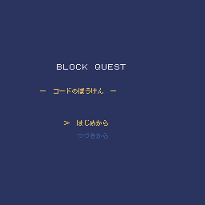

# Block Quest — コードのぼうけん

子どもが「コードを書き換えてゲームを育てる」ことを核に置いた、Pyxel製のRPG。



## ブラウザで遊ぶ

**▶ [いますぐ遊ぶ（GitHub Pages）](https://tatsuro-ueda.github.io/code-quest-pyxel/)**

ブラウザだけで動きます。インストール不要。スマホでも遊べます。

## 操作方法

| 操作 | キーボード | ゲームパッド |
|---|---|---|
| 移動 | 矢印キー | 十字キー |
| 決定 | Z / Space / Enter | B ボタン |
| キャンセル / メニュー | X / Escape | A ボタン |

戦闘・町メニュー・個人メニュー（B/X）・セーブ・ショップ など、ふつうのRPGの操作感です。

## ゲームの特徴

- **コードのぼうけん** — 主人公は「プログラマー」。敵を倒すことを「りかいする」と呼ぶ
- **5つの魔法システム** — レベルに応じて新しい呪文を覚える
- **武器・防具・道具のショップ** — 町でお金を使って装備を整える
- **やどや & セーブ** — 町に戻って休む／記録を書き留める
- **マルチフェーズのボス戦** — 複数段階の戦いに挑む
- **すべて仮名・カタカナのUI** — 漢字が読めない子どもでも一人で遊べる

## ローカルで遊ぶ

```bash
# 1. 仮想環境を用意
python -m venv .venv
source .venv/bin/activate
pip install pyxel

# 2. ゲームを起動
python main.py
```

## Pyxel Code Maker で遊ぶ・改造する

[Pyxel Code Maker](https://kitao.github.io/pyxel/wasm/code-maker.html) にアップロードする場合は、[`production/code-maker.zip`](production/code-maker.zip) を使ってください。コード全体が1つの `main.py` にインライン化されています。

```
production/code-maker.zip
└── block-quest/
    ├── main.py            (5,902 行・全モジュールをインライン化)
    └── my_resource.pyxres
```

## 配布物

- [`index.html`](index.html) — 本番と開発版を比べる root selector
- [`production/pyxel.html`](production/pyxel.html) — 本番ブラウザ版
- [`production/pyxel.pyxapp`](production/pyxel.pyxapp) — 本番デスクトップ版
- [`production/code-maker.zip`](production/code-maker.zip) — 本番 Code Maker アップロード用
- [`development/pyxel.html`](development/pyxel.html) — 開発版ブラウザ版
- [`development/pyxel.pyxapp`](development/pyxel.pyxapp) — 開発版デスクトップ版
- [`development/code-maker.zip`](development/code-maker.zip) — 開発版 Code Maker アップロード用

## ドキュメント

設計と開発の経緯は次にまとめています：

- [`docs/customer-problem.md`](docs/customer-problem.md) — この製品で何を解決したいか
- [`docs/customer-journeys.md`](docs/customer-journeys.md) — 子どもと親にどんな体験を作るか
- [`docs/cj-gherkin-platform.md`](docs/cj-gherkin-platform.md) — 体験をどう約束し、どう確かめるか
- [`steering/`](steering/) — 機能ごとの task note と完了記録

## ライセンス

未定（個人プロジェクト）。
