# カスタマージャーニー集

- 作成日: 2026-04-10
- 根拠: [`customer-jobs.md`](./customer-jobs.md)

> 読み方: 各CJは `Before / After` の流れに加えて、`感情` で体験中の気持ちの変化、`タッチポイント` でその時に触る画面・道具・導線を明示する。対応する `CJG` では、その体験を `Feature` で約束し、`Rule` で壊してはいけない条件を置き、`Scenario` で確かめ方を固定する。

---

## ソリューションの構成

Buy 4 つと Make 3 つ、合わせて 7 要素が揃って初めて好循環が回る。

### Buy（採用した外部依存）

| ID | 要素 | 役割 | なければどうなるか |
|---|---|---|---|
| **Buy1** | Pyxel | レトロゲームの表現力を得る | 作品として「ふーん」で終わる |
| **Buy2** | Pyxel Code Maker | Tilemap / Sprite / Sound を子どもの手で編集 | 子どもが「見ているだけ」になる |
| **Buy3** | AIコーディング | 子どもの声を数分で反映 | 修正が翌日になりループが閉じない |
| **Buy4** | スマホ配信 | 友達がURLで即プレイ | 共有が親子に閉じる |
| **Buy4** | MVPフレームワーク（探し中） | 壊れにくくする | AIで修正しても他の場所が壊れる |

### Make（プロダクトが自前で備えるもの）

| ID | 要素 | 役割 | なければどうなるか |
|---|---|---|---|
| **Make1** | 承認キュー（保留中） | 子どもが遊び比べて決める（承認ループ） | 親が勝手に反映→子どもがお客さん化 |
| **Make2** | Code Maker反映パイプライン | 編集した変更を短時間で反映する | 子どもが変えた内容がなかなか遊べず、開発ループが途切れる |
| **Make3** | ガードレール | Buy3 の壊れた出力を子どもに届けない | クラッシュで好循環が途絶 |

## カスタマージャーニー一覧

上から実装していく（入り口→出口）

`構成` は、そのジャーニーのために自前で作るべき Make を示す。外部依存（Buy）のみで支えられるジャーニーは `—`。

| # | 分類 | 感情 | タイトル | ジョブ | 構成 |
|---|---|---|---|---|---|
| CJ35 | ガードレール | ❌集中が切れる→❤️安心して待てる | AIで修正したらエラーが出て動かない | Job以前 | ガードレール |
| CJ36 | ガードレール | ❌壊れる→❤️安心して増やせる | データを変えたらバランスが崩壊した | Job以前 | ガードレール |
| CJ37 | ガードレール | ❌信用できない→❤️影響範囲が明確 | 責務が曖昧で直すほど別の所が壊れる | Job以前 | ガードレール |
| CJ38 | ガードレール | ❌進めない→❤️追加しても安心 | 新しいイベントを追加したら既存が壊れた | Job以前 | ガードレール |
| CJ39 | ガードレール | ❌全体が不安→❤️守られる | システムを変えたらゲーム全体が壊れた | Job以前 | ガードレール |
| CJ40 | ガードレール | ❌データが消える→❤️守れる | ゲームモードを追加したら収拾がつかなくなった | Job以前 | ガードレール |
| CJ41 | ガードレール | ❌届かない→❤️配れる版だけ残る | 技術基盤を変えたら配信できなくなった | Job以前 | ガードレール |
| CJ44 | ガードレール | ❌複雑で動かせない→❤️素早く変えられる | シンプルさは変更速度の前提条件 | Job2: 好循環, Job以前 | ガードレール |
| CJ23 | 開発 | ❌代筆→❤️所有感 | スプライトを自分で描く | JCR, JSC | パイプライン |
| CJ24 | 開発 | ❌諦め→❤️手ごたえ | 効果音を自分で作る | Job2: 好循環, Job3: アウトプット品質 | パイプライン |
| CJ01 | 開発 | ❌不満→❤️喜び | はじめてのタイル配置 | Job2: 好循環 | パイプライン |
| CJ02 | 開発 | ❌もどかしさ→❤️得意顔 | 道を作る | Job2: 好循環 | パイプライン |
| CJ03 | 開発 | ❌退屈→❤️発見 | 森を作る | Job2: 好循環 | パイプライン |
| CJ04 | 開発 | ❌崩れる→❤️手ごたえ | 水辺を作る | Job2: 好循環 | パイプライン |
| CJ05 | 開発 | ❌疎外感→❤️所有感 | 装飾で世界を彩る | Job2: 好循環 | パイプライン |
| CJ06 | 開発 | ❌諦め→❤️一体感 | 迷路を作る | Job2: 好循環 | パイプライン |
| CJ07 | 開発 | ❌バラバラ→❤️自律 | ランドマークを配置する | Job2: 好循環 | パイプライン |
| CJ08 | デバッグ | ❌見捨てられ感→❤️即応 | 敵が強すぎる | Job1: コミュニケーション, Job2: 好循環 | — |
| CJ09 | デバッグ | ❌離脱→❤️選べる | セリフを変えたい | Job1: コミュニケーション, Job2: 好循環 | — |
| CJ10 | デバッグ | ❌遠い→❤️期待 | 新しい敵を追加したい | Job2: 好循環 | — |
| CJ12 | デバッグ | ❌読めない→❤️発見の喜び | 歩いたら壁にハマった | Job1: コミュニケーション, Job2: 好循環 | — |
| CJ13 | デバッグ | ❌後回し→❤️会話 | 新しい呪文がほしい | Job1: コミュニケーション, Job2: 好循環 | — |
| CJ14 | デバッグ | ❌停滞→❤️前進 | マップが広すぎて迷う | Job2: 好循環 | — |
| CJ15 | 演出 | ❌放置→❤️世界が立ち上がる | フィールドBGMをゾーンごとに付ける | Job3: アウトプット品質 | — |
| CJ16 | 演出 | ❌ゲームっぽくない→❤️緊張感 | 戦闘BGMを付ける | Job3: アウトプット品質 | — |
| CJ17 | 演出 | ❌達成感が薄い→❤️気持ちいい | 効果音をイベントに紐づける | Job3: アウトプット品質 | — |
| CJ18 | 演出 | ❌つまらない→❤️当たった感じ | ダメージ演出を付ける | Job3: アウトプット品質 | — |
| CJ19 | 演出 | ❌安っぽい→❤️作品感 | 場面転換の演出 | Job3: アウトプット品質 | — |
| CJ20 | 演出 | ❌つまらない→❤️いっしょに作りたい | 演出を実際に当てて違いを体験する | Job1: コミュニケーション, Job3: アウトプット品質 | — |
| CJ27 | 発展 | ❌後回し→❤️共同設計 | ストーリーの分岐を作る | Job1: コミュニケーション, Job2: 好循環 | ガードレール |
| CJ28 | 発展 | ❌構想が消える→❤️動き出す | 新しいエリアをまるごと追加する | Job2: 好循環, Job3: アウトプット品質 | ガードレール |
| CJ29 | 発展 | ❌離れる→❤️役割分担 | 全体のバランスを調整する | Job2: 好循環 | ガードレール |
| CJ30 | 発展 | ❌通り過ぎる→❤️到達点 | エンディングを自分たちで書く | Job1, Job2, Job3 すべて | ガードレール |
| CJ42 | 発展 | ❌途中で止まる→❤️やり切った | 子どもが冒険を最後までやり切れる | Job2: 好循環 | ガードレール |
| CJ31 | 承認 | ❌親任せ→❤️自分で決める | 子どもが変更を承認する | Job1: コミュニケーション, Job2: 好循環 | キュー |
| CJ32 | 承認 | ❌反対しづらい→❤️却下できる | 子どもが変更を却下する | Job1: コミュニケーション | キュー |
| CJ33 | 承認 | ❌お客さん化→❤️主導権 | 子どもが変更を選んで適用する | Job1: コミュニケーション, Job2: 好循環 | キュー |
| CJ34 | 承認 | ❌また親任せ→❤️自分で戻せる | 承認したあとに「やっぱり」となる | Job1: コミュニケーション, Job2: 好循環 | キュー |
| CJ25 | 承認 | ❌退屈→❤️仲間感 | 親子で役割を交代する | Job1: コミュニケーション | キュー |
| CJ26 | 承認 | ❌持ち出せない→❤️自分のゲーム感 | 「自分たちのゲーム」と言えるようになる | Job2: 好循環, Job3: アウトプット品質 | キュー |
| CJ21 | 共有 | ❌諦め→❤️誇らしい | 友達に見せる | Job2: 好循環, Job3: アウトプット品質 | — |
| CJ43 | 共有 | ❌勘頼り→❤️事実で見直せる | 実公開で遊ばれた記録が見える | Job1: コミュニケーション, Job2: 好循環 | — |
| CJ22 | 共有 | ❌熱が冷める→❤️得意顔 | 友達のフィードバックを反映する | Job1: コミュニケーション, Job2: 好循環, Job3: アウトプット品質 | — |

---

## 開発ループ（子どもが）

### CJ01: はじめてのタイル配置

**感情**：❌不満（アイデアを見せられない）→❤️喜び（親が驚いてくれる）

子どもがTilemapエディタで初めてタイルを1個置き、Runして変化を確認する。

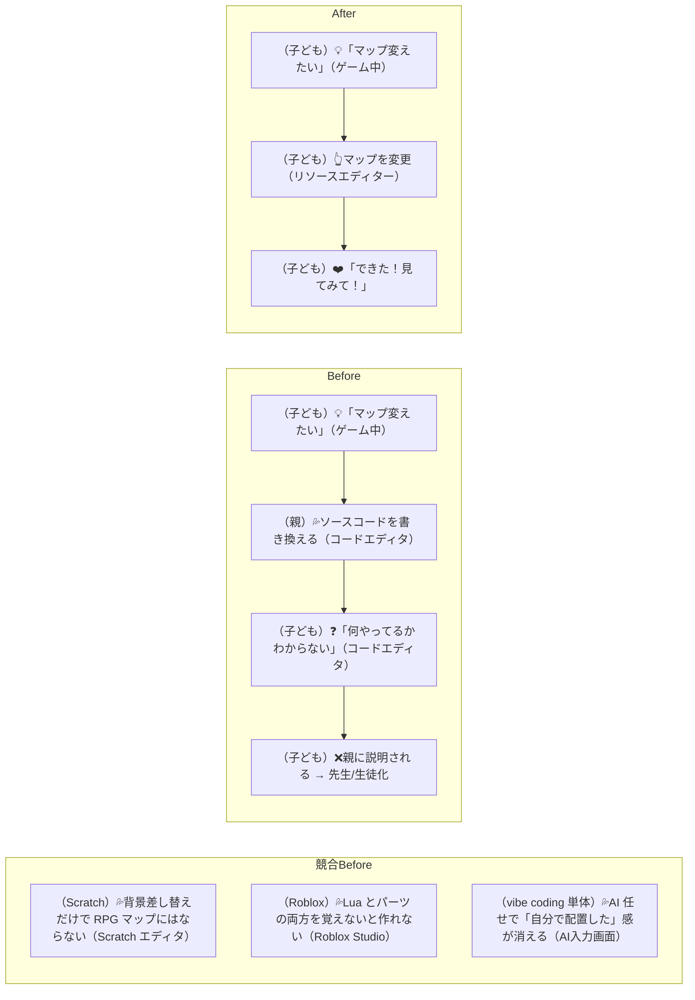

> 該当カテゴリ：②子（クリエイター・表現） → `customer-jobs.md` 参照

### CJ02: 道を作る

子どもが草タイルを並べて、町と町をつなぐ道を作る。

**感情**：❌もどかしさ（頭の中の道を伝えられない）→❤️得意顔（並べるそばから道になる）

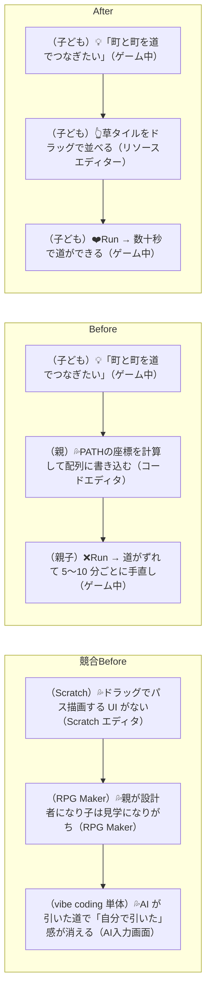

> 該当カテゴリ：②子（クリエイター・表現） → `customer-jobs.md` 参照

### CJ03: 森を作る

子どもが木タイルを密集させて、「ロジックのもり」を自分で拡張する。

**感情**：❌退屈（数字の羅列は森に見えない）→❤️発見（通り道を残す設計に気づく）

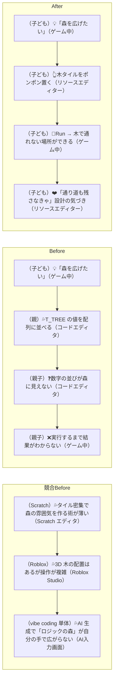

> 該当カテゴリ：②子（クリエイター・表現） → `customer-jobs.md` 参照

### CJ04: 水辺を作る

子どもが水タイルと岸タイルを組み合わせて湖や川を作る。

**感情**：❌崩れる（角タイルが合わず親が直す）→❤️手ごたえ（地形で通行を設計できる）

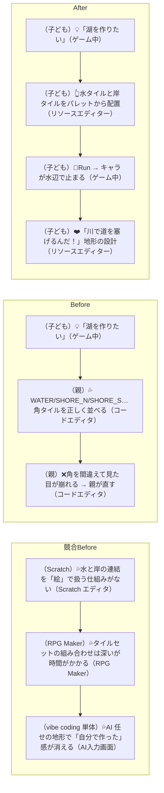

> 該当カテゴリ：②子（クリエイター・表現） → `customer-jobs.md` 参照

### CJ05: 装飾で世界を彩る

子どもが花・岩・キノコなどの装飾タイルを配置して、ゾーンに個性を持たせる。

**感情**：❌疎外感（親の生成コードを見ているだけ）→❤️所有感（ゾーンごとに雰囲気を作れる）

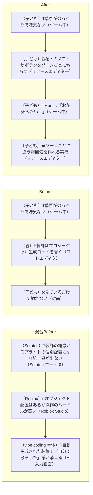

> 該当カテゴリ：②子（クリエイター・表現） → `customer-jobs.md` 参照

### CJ06: 迷路を作る

子どもが壁と道を組み合わせて、洞窟の中に迷路を設計する。

**感情**：❌諦め（頭の迷路を座標に変換できない）→❤️一体感（テストプレイと設計がつながる）

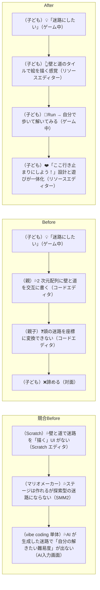

> 該当カテゴリ：②子（クリエイター・表現） → `customer-jobs.md` 参照

### CJ07: ランドマークを配置する

子どもがマルチタイルの世界樹や通信塔を好きな場所に配置する。

**感情**：❌バラバラ（2x2 の 4 タイルを間違える）→❤️自律（好きな場所にどんどん置ける）

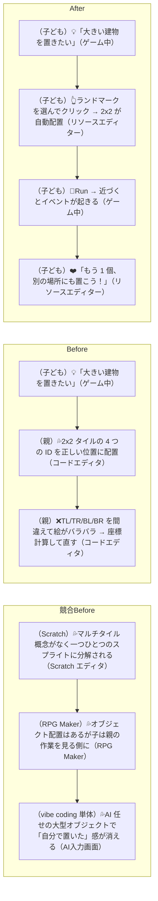

> 該当カテゴリ：②子（クリエイター・表現） → `customer-jobs.md` 参照

### CJ23: スプライトを自分で描く

子どもがスプライトエディタで主人公の見た目を変える。

**感情**：❌代筆（16 進数が読めず親に任せる）→❤️所有感（自分のキャラだと言える）

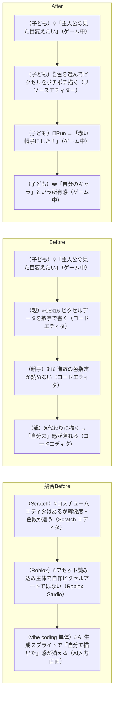

> 該当カテゴリ：②子（クリエイター・表現） → `customer-jobs.md` 参照

### CJ24: 効果音を自分で作る

子どもがSoundエディタで攻撃音や回復音を作る。

**感情**：❌諦め（波形の数値がわからない）→❤️手ごたえ（欲しい音に近づけられる）

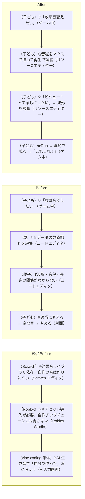

> 該当カテゴリ：②子（クリエイター・表現） → `customer-jobs.md` 参照

---

## デバッグループ（親がAIで対応）

### CJ08: 敵が強すぎる

子どもがテストプレイで「この敵強すぎ！」→ 親がAIにHP調整を頼む。

**感情**：❌見捨てられ感（直してる間に離脱）→❤️即応（3 分で戻ってきて一緒に調整）

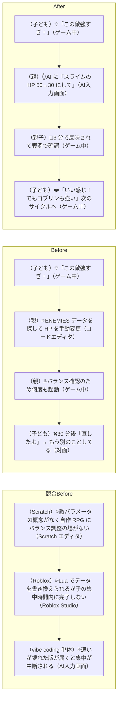

> 該当カテゴリ：①子（プレイヤー・没入）, ⑤親（関係・コミュニケーション） → `customer-jobs.md` 参照

### CJ09: セリフを変えたい

子どもが「この人のセリフつまんない」→ 親がAIに面白いセリフを考えてもらう。

**感情**：❌離脱（SyntaxError 修正で 30 分）→❤️選べる（3 案から自分で決める）

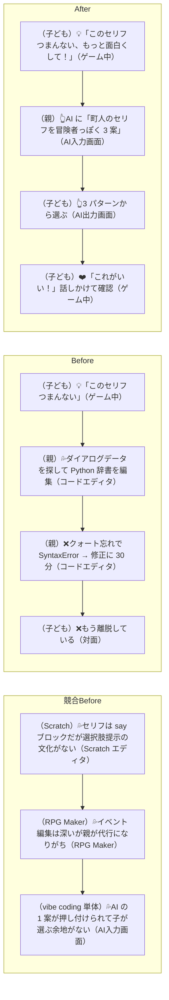

> 該当カテゴリ：②子（クリエイター・表現）, ③子（批評家・自己判断）, ⑤親（関係・コミュニケーション） → `customer-jobs.md` 参照

### CJ10: 新しい敵を追加したい

子どもが「ドラゴン出したい！」→ 親がAIに敵データの追加を頼む。

**感情**：❌遠い（1 日仕事に見える）→❤️期待（数分で会いに行ける）

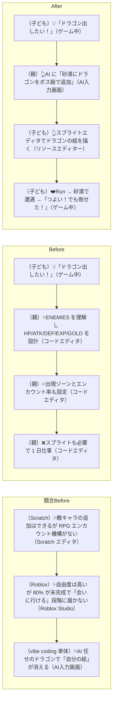

> 該当カテゴリ：②子（クリエイター・表現）, ⑤親（関係・コミュニケーション） → `customer-jobs.md` 参照

### CJ12: 歩いたら壁にハマった

子どもがテストプレイ中にバグを発見 → 親がAIで修正。

**感情**：❌読めない（当たり判定の 1 時間調査）→❤️発見の喜び（バグが報告する楽しみに変わる）

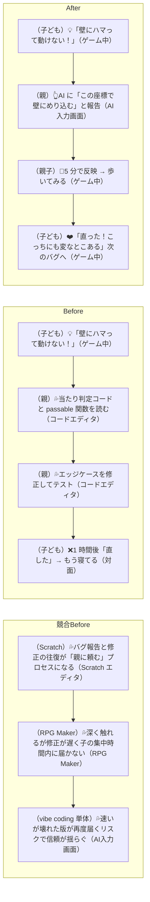

> 該当カテゴリ：①子（プレイヤー・没入）, ⑤親（関係・コミュニケーション） → `customer-jobs.md` 参照

### CJ13: 新しい呪文がほしい

子どもが「かっこいい技出したい」→ 親がAIに呪文追加を頼む。

**感情**：❌後回し（半日仕事で要望が忘れられる）→❤️会話（バランスを話したくなる）

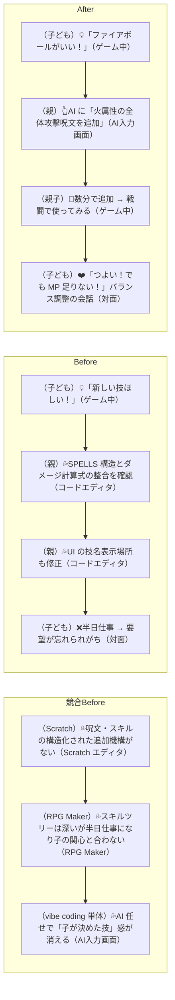

> 該当カテゴリ：②子（クリエイター・表現）, ⑤親（関係・コミュニケーション） → `customer-jobs.md` 参照

### CJ14: マップが広すぎて迷う

子どもがテストプレイで迷子になる → 親がAIにガイド機能を追加してもらう。

**感情**：❌停滞（UI 実装が複雑で後回し）→❤️前進（冒険が進み見た目も調整したくなる）

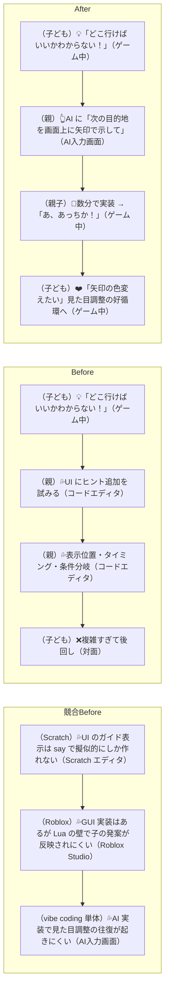

> 該当カテゴリ：①子（プレイヤー・没入）, ⑤親（関係・コミュニケーション） → `customer-jobs.md` 参照

---

## 演出ループ（ゲームには必要）

演出（BGM・SFX・VFX）がないと、マップや敵を追加しても「動くだけ」で止まる。「ちゃんとしたゲーム」に見えるかどうかは、最低限の演出があるかどうかで決まる。見た目や音の原案は親子が Pyxel Code Maker で触る。image bank 系は既存の resource 往復を守りつつ、`Sound / Music` は Code Maker から戻した内容を code 側の audio asset として取り込み、AI は場面切り替えや build を支える。ここを混ぜると、誰が何を直したか分からなくなる。

### CJ15: フィールドBGMをゾーンごとに付ける

親が「草原は明るく、森は神秘的に」と方針を決め、親子が Musicエディタで曲を整える。

**感情**：❌放置（フリー素材が使えず無音のまま）→❤️世界が立ち上がる（ゾーンで曲が変わる）

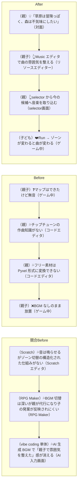

> 該当カテゴリ：②子（クリエイター・表現）, ⑤親（関係・コミュニケーション） → `customer-jobs.md` 参照

### CJ16: 戦闘BGMを付ける

戦闘に入ったときにBGMが切り替わるだけで、緊張感がまったく変わる。

**感情**：❌ゲームっぽくない（同じ曲のまま）→❤️緊張感（ボス曲も欲しくなる）

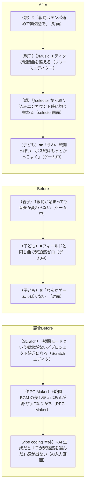

> 該当カテゴリ：②子（クリエイター・表現）, ①子（プレイヤー・没入） → `customer-jobs.md` 参照

### CJ17: 効果音をイベントに紐づける

攻撃、回復、レベルアップ、扉を開けるなど、操作に音がつくと「手ごたえ」が生まれる。

**感情**：❌達成感が薄い（無音で手ごたえがない）→❤️気持ちいい（音の好みが見えてくる）

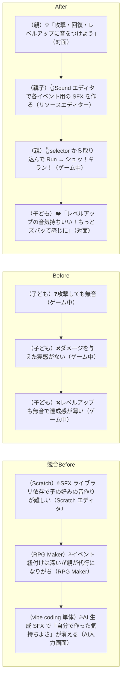

> 該当カテゴリ：②子（クリエイター・表現）, ⑤親（関係・コミュニケーション） → `customer-jobs.md` 参照

### CJ18: ダメージ演出を付ける

画面フラッシュや点滅など、最低限のVFXでゲームの「手ざわり」が激変する。

**感情**：❌つまらない（数字の引き算に見える）→❤️当たった感じ（演出の議論が始まる）

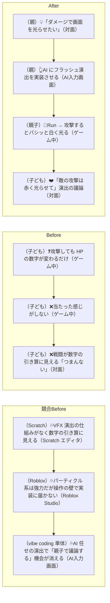

> 該当カテゴリ：①子（プレイヤー・没入）, ⑤親（関係・コミュニケーション） → `customer-jobs.md` 参照

### CJ19: 場面転換の演出

町に入る、戦闘が始まる、セーブする。場面が変わるときのフェードが「それっぽさ」を一気に上げる。

**感情**：❌安っぽい（唐突な即時切替）→❤️作品感（「習作」から「作品」に近づく）

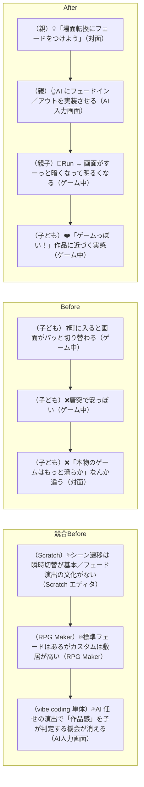

> 該当カテゴリ：①子（プレイヤー・没入）, ⑤親（関係・コミュニケーション） → `customer-jobs.md` 参照

### CJ20: 演出の有無でゲームの印象が変わることを体験する

敵の攻撃で画面が赤く光る、戦闘BGMが切り替わる、効果音がイベントに合うといった演出を実際にゲームに当てて、子どもが「ある／ない」の差を体感する。

**感情**：❌つまらない（数字とテキストだけ）→❤️いっしょに作りたい（こうしたい！が止まらない）

```mermaid
flowchart LR
    subgraph Competitor["競合Before"]
        C1[（Scratch）💦演出を当てる仕組みが弱く子が「効いた」と感じにくい（Scratch エディタ）]
        C1 --> C2[（RPG Maker）💦演出は親が選ぶ構図になり子の発言権が薄い（RPG Maker）]
        C2 --> C3[（vibe coding 単体）💦AI 効率化で子が体感する機会が省略される（AI入力画面）]
    end
    subgraph Before["Before"]
        B1[（親）💦演出の価値を言葉で説明しようとする（対面）]
        B1 --> B2[（子ども）❓「別にいいじゃん」（対面）]
        B2 --> B3[（親）❌一方的に追加する → 先生化（対面）]
    end
    subgraph After["After"]
        A1[（子ども）👆実際に遊ぶ → 攻撃で画面が赤く光る・戦闘BGMが鳴る（ゲーム中）]
        A1 --> A2[（子ども）❤️「敵の攻撃のとき音が鳴ってほしい」「町は静かにしたい」（対面）]
        A2 --> A3[（親）👆AI に「ここに〇〇の演出を足して」と頼む（AI入力画面）]
        A3 --> A4[（親子）❤️演出を当て合いながら何を足すか一緒に考える（対面）]
    end
```

> 該当カテゴリ：⑤親（関係・コミュニケーション）, ③子（批評家・自己判断） → `customer-jobs.md` 参照
>
> 2026-05-07 改訂（CJ44 確定版）：演出を一括 ON/OFF する UI は撤去（CJ44 シンプルさ優先）。
> 「比べて違いを体験する」は ON/OFF UI でなく、演出を **足す前と足したあと** の差で実現する。
> 設定画面（BGM/SFX/VFX 個別 ON/OFF）も撤去。BGM/SFX/VFX は常に ON。

---

## 共有ループ（ループを広げる）

スマホで遊べることが、このループの起点になる。友達はURLを開くだけ――インストールも会員登録も不要。この手軽さが「ちょっとやってみて」を可能にし、フィードバックの出し手を親子の外にまで広げる。フィードバックが増えると好循環が速く回り、プロダクトの進化が加速する。

### CJ21: 友達に見せる

子どもが作ったゲームを友達にURLで送る。スマホで即プレイできることが「見せる」のハードルを劇的に下げる。友達がその場で遊べるから、「これ作ったの！？」「ここすごい！」という反応がすぐ返ってくる。

**感情**：❌諦め（環境依存で配れない）→❤️誇らしい（URL で即プレイ）

```mermaid
flowchart LR
    subgraph Competitor["競合Before"]
        C1[（Scratch）💦公開できるが PC ブラウザ前提でスマホでの友達体験が弱い（Scratch サイト）]
        C1 --> C2[（Roblox）💦広く届くが DL・課金・社会圧で「ちょっと見てよ」が成立しない（Roblox アプリ）]
        C2 --> C3[（自前配信）💦zip / .exe は信頼とアクセスの壁で友達に届かない（メッセンジャー）]
    end
    subgraph Before["Before"]
        B1[（子ども）💡「友達に見せたい！」（対面）]
        B1 --> B2[（親）💦ビルドして zip を渡す（コードエディタ）]
        B2 --> B3[（友達）❓「どうやって開くの？.exe 怖い」（メッセンジャー）]
        B3 --> B4[（子ども）❌友達の環境で動かず諦める（対面）]
    end
    subgraph After["After"]
        A1[（子ども）💡「友達に見せたい！」（対面）]
        A1 --> A2[（子ども）👆URL を LINE で送る（LINE）]
        A2 --> A3[（友達）👆スマホで開く → 即プレイ（スマホブラウザ）]
        A3 --> A4[（子ども）❤️「え、これ作ったの！？すごい！」もっと作りたい（対面）]
    end
```

> 該当カテゴリ：④子（社会・共有・反応）, ⑨友達（気軽な体験） → `customer-jobs.md` 参照

### CJ43: 実公開で遊ばれた記録が見える

親が「このVMで実際に公開しているURL」で遊ばれた記録を見て、共有が届いているかを事実で確認できる。内部テスト用の記録ではなく、友達が本当に開いた導線の記録が見えることで、「遊ばれている」「届いていない」「公開経路が壊れている」を勘ではなくログで判断できる。

**感情**：❌勘頼り（記録がなく声かけがずれる）→❤️事実で見直せる（日別・ページ別で確認）

```mermaid
flowchart LR
    subgraph Competitor["競合Before"]
        C1[（Scratch）💦View 数は見えるが誰がどう遊んだかは追えない（Scratch サイト）]
        C1 --> C2[（Roblox）💦データはあるが Roblox 指標体系に縛られ家庭の判断には使えない（Roblox Studio）]
        C2 --> C3[（教育系SaaS）💦詳細に見えるが関係が「監視」に変質する（教育系SaaS管理画面）]
    end
    subgraph Before["Before"]
        B1[（親）💡URL を送る（LINE）]
        B1 --> B2[（友達）👆遊んでいる（スマホブラウザ）]
        B2 --> B3[（親）❓手元では記録が増えない（VM管理画面）]
        B3 --> B4[（親）❌「遊ばれてないのかな？」勘で考える（対面）]
    end
    subgraph After["After"]
        A1[（親）💡URL を送る（LINE）]
        A1 --> A2[（友達）👆実公開 URL を開いて遊ぶ（スマホブラウザ）]
        A2 --> A3[（親）👀日別・ページ別でアクセスログを確認（実公開アクセスログ）]
        A3 --> A4[（親）❤️遊ばれていれば嬉しい／なければ公開経路を見直せる（対面）]
    end
```

> 該当カテゴリ：⑦親（理解・手応え）, ④子（社会・共有・反応） → `customer-jobs.md` 参照

### CJ22: 友達のフィードバックを反映する

友達がスマホで遊んで「ここ難しすぎ」→ 子どもが「直して！」と判断 → 親がAIで直す → URLを再送信 → 友達がすぐ確認。スマホで即プレイできるから、フィードバック→修正→再確認のサイクルがその場で何周も回る。ただし、友達のフィードバックをどう扱うか（直すか・無視するか・後回しにするか）を決めるのは子ども。親が勝手にトリアージしない。

**感情**：❌熱が冷める（数日後の修正）→❤️得意顔（その場で反映されて反応が返る）

```mermaid
flowchart LR
    subgraph Competitor["競合Before"]
        C1[（Scratch）💦コメント機能はあるが反映までの往復が遅く熱が冷める（Scratch サイト）]
        C1 --> C2[（Roblox）💦反映に Lua 修正と再パブリッシュが必要で家族の即応に向かない（Roblox Studio）]
        C2 --> C3[（vibe coding 単体）💦親が直接 AI に投げて子の judge が省略される（AI入力画面）]
    end
    subgraph Before["Before"]
        B1[（友達）💡「ここ難しい」（スマホブラウザ）]
        B1 --> B2[（親）💦メモしておいて後で直す（メモ）]
        B2 --> B3[（親）💦数日後に修正（コードエディタ）]
        B3 --> B4[（子ども）❌友達はもう遊んでいない（対面）]
    end
    subgraph After["After"]
        A1[（友達）💡「ここ難しい」（スマホブラウザ）]
        A1 --> A2[（子ども）👆「パパ直して！」と判断（対面）]
        A2 --> A3[（親）👆AI に頼む → 数分で修正 → URL 再送（AI入力画面）]
        A3 --> A4[（子ども）❤️友達「お、いい感じ！」得意顔（スマホブラウザ）]
    end
```

> 該当カテゴリ：④子（社会・共有・反応）, ③子（批評家・自己判断）, ⑤親（関係・コミュニケーション） → `customer-jobs.md` 参照

---

## 発展ループ（好循環を重ねる）

### CJ27: ストーリーの分岐を作る

子どもが「選択肢で話が変わるようにしたい」→ 親がAIにダイアログ分岐を頼む。

**感情**：❌後回し（フラグ管理が複雑すぎる）→❤️共同設計（もしもを試し物語を一緒に作る）

```mermaid
flowchart LR
    subgraph Competitor["競合Before"]
        C1[（Scratch）💦分岐は条件ブロックで作れるが物語の共同設計まで至らない（Scratch エディタ）]
        C1 --> C2[（RPG Maker）💦イベント分岐は深いが親が代行になり子の「もしも」が消える（RPG Maker）]
        C2 --> C3[（vibe coding 単体）💦AI 任せの分岐で「子が選んだ展開」感が消える（AI入力画面）]
    end
    subgraph Before["Before"]
        B1[（子ども）💡「はい／いいえで話が変わるようにしたい」（ゲーム中）]
        B1 --> B2[（親）💦条件分岐ロジックとフラグ管理を書く（コードエディタ）]
        B2 --> B3[（親）💦状態遷移が複雑で設計に時間がかかる（コードエディタ）]
        B3 --> B4[（子ども）❌後回しにされて要望が消える（対面）]
    end
    subgraph After["After"]
        A1[（子ども）💡「王様に No って言ったらどうなる？」（ゲーム中）]
        A1 --> A2[（親）👆AI に「王様の依頼を断る分岐を追加」（AI入力画面）]
        A2 --> A3[（親子）👀Run →「断ったら怒られた！おもしろい！」（ゲーム中）]
        A3 --> A4[（子ども）❤️「3 回断ったらどうなる？」物語の共同設計（対面）]
    end
```

> 該当カテゴリ：②子（クリエイター・表現）, ⑤親（関係・コミュニケーション） → `customer-jobs.md` 参照

### CJ28: 新しいエリアをまるごと追加する

マップ・敵・BGM・イベントを組み合わせて、子どもが構想した世界を実現する。

**感情**：❌構想が消える（1 日仕事で手が回らない）→❤️動き出す（数十分で世界が立ち上がる）

```mermaid
flowchart LR
    subgraph Competitor["競合Before"]
        C1[（Scratch）💦エリア概念を後付けで作るには大改造が必要（Scratch エディタ）]
        C1 --> C2[（RPG Maker）💦深く作れるがエリア追加に半日〜1 日／子の関心と合わない（RPG Maker）]
        C2 --> C3[（vibe coding 単体）💦AI 任せのエリア生成で「子が並べたタイル」感が消える（AI入力画面）]
    end
    subgraph Before["Before"]
        B1[（子ども）💡「雪のエリアがほしい！」（ゲーム中）]
        B1 --> B2[（親）💦タイル追加・敵配置・ゾーン判定・BGM を全部手で（コードエディタ）]
        B2 --> B3[（親）❌やることが多すぎて 1 日では終わらない（コードエディタ）]
        B3 --> B4[（子ども）❌構想は実現されないまま消える（対面）]
    end
    subgraph After["After"]
        A1[（子ども）💡「雪のエリアがほしい！」（ゲーム中）]
        A1 --> A2[（子ども）👆Tilemap で白いタイルを並べる（リソースエディター）]
        A2 --> A3[（親）👆AI に「雪ゾーンの敵とエンカウント率」（AI入力画面）]
        A3 --> A4[（親子）👆Music エディタで雪エリアの BGM を決める（リソースエディター）]
        A4 --> A5[（子ども）❤️数十分で「雪エリア」が動く → テストプレイ（ゲーム中）]
    end
```

> 該当カテゴリ：②子（クリエイター・表現）, ⑤親（関係・コミュニケーション） → `customer-jobs.md` 参照

### CJ29: 全体のバランスを調整する

何度も敵や呪文を追加した結果、バランスが崩れてきた → 親がAIに全体調整を頼む。

**感情**：❌離れる（手動調整の地味なループ）→❤️役割分担（数値は AI、面白さの判断は子ども）

```mermaid
flowchart LR
    subgraph Competitor["競合Before"]
        C1[（Scratch）💦パラメータの一括調整機構がなく手動で個別に直す（Scratch エディタ）]
        C1 --> C2[（RPG Maker）💦深い調整は可能だが地味な手動ループが長く子が離脱する（RPG Maker）]
        C2 --> C3[（vibe coding 単体）💦AI が一括調整するが「面白いか」の判断軸を子に残せない（AI入力画面）]
    end
    subgraph Before["Before"]
        B1[（親子）❓新しい敵や技を足すたびバランスが崩れる（ゲーム中）]
        B1 --> B2[（親）💦全敵の HP/ATK/EXP 一覧を見ながら手動調整（コードエディタ）]
        B2 --> B3[（親）💦調整→テスト→また調整のループが地味で長い（コードエディタ）]
        B3 --> B4[（子ども）❌退屈して離脱（対面）]
    end
    subgraph After["After"]
        A1[（親）💡「全体的に後半が簡単すぎるね」（対面）]
        A1 --> A2[（親）👆AI に「ゾーン 3 以降の敵を 1.5 倍、経験値カーブも」（AI入力画面）]
        A2 --> A3[（子ども）👆通しプレイで確認「うん、ちょうどいい！」（ゲーム中）]
        A3 --> A4[（親子）❤️数値は AI、面白いかの判断は子ども（対面）]
    end
```

> 該当カテゴリ：②子（クリエイター・表現）, ⑥親（成長支援・主体性） → `customer-jobs.md` 参照

### CJ30: エンディングを自分たちで書く

ゲームの最後を自分たちの言葉で飾る。好循環の集大成として「自分たちのゲーム」というアイデンティティを獲得する瞬間。何度もサイクルを回した結果、オリジナル部分が積み上がり、エンディングがその到達点になる。

**感情**：❌通り過ぎる（誰の話かわからない）→❤️到達点（自分たちのゲームになる）

```mermaid
flowchart LR
    subgraph Competitor["競合Before"]
        C1[（Scratch）💦エンディング書き換えはできるが「作品の集大成」感が出にくい（Scratch エディタ）]
        C1 --> C2[（マリオメーカー）💦ステージ単位で完結し RPG 的なエンディングは作れない（SMM2）]
        C2 --> C3[（vibe coding 単体）💦AI 生成エンディングで「ぼくたちが書いた」感が消える（AI入力画面）]
    end
    subgraph Before["Before"]
        B1[（子ども）❓既製のゲームを遊ぶ／エンディングは元のまま（ゲーム中）]
        B1 --> B2[（子ども）❌「クリアしたけど、これ誰の話？」（対面）]
        B2 --> B3[（子ども）❌作る側の実感がない → 飽きたら次のゲームへ（対面）]
    end
    subgraph After["After"]
        A1[（親子）💡何度も改造してオリジナル部分が半分以上（リソースエディター）]
        A1 --> A2[（子ども）💡「エンディング変えたい！」（ゲーム中）]
        A2 --> A3[（親子）👆セリフを考える → AI が実装 → クレジットに子どもの名前（AI入力画面）]
        A3 --> A4[（子ども）👀Run → エンディング到達（ゲーム中）]
        A4 --> A5[（子ども）❤️「このゲーム、ぼくたちが作ったんだ」（対面）]
    end
```

> 該当カテゴリ：②子（クリエイター・表現）, ⑤親（関係・コミュニケーション）, ⑥親（成長支援・主体性）, ⑦親（理解・手応え） → `customer-jobs.md` 参照

### CJ42: 子どもが冒険を最後までやり切れる

子どもが自分たちで育てたゲームを、探索して、戦って、強くなって、ボスを倒し、エンディングまでやり切れる。RPGとしての基本の流れが最後までつながっていることで、「自分たちのゲームを遊び切れた」という手応えが生まれる。

**感情**：❌途中で止まる（どこかで進行が壊れる）→❤️やり切った（最後まで遊び通せた）

```mermaid
flowchart LR
    subgraph Competitor["競合Before"]
        C1[（Scratch）💦完成度が低くプレイヤー体験が途切れる／最後まで遊べないことが多い（Scratch エディタ）]
        C1 --> C2[（Roblox）💦80% 未完成で「自作を最後まで遊ぶ」段階に届かない（Roblox プラットフォーム）]
        C2 --> C3[（vibe coding 単体）💦改造のたびにどこかが壊れて進行が途切れる（ゲーム中）]
    end
    subgraph Before["Before"]
        B1[（子ども）👆フィールドを歩けるし戦える（ゲーム中）]
        B1 --> B2[（子ども）❌逃走失敗で敵ターンが来ない／先へ進めない／ボス後が終わらない（ゲーム中）]
        B2 --> B3[（子ども）❌「RPG なのに最後まで遊べない」（対面）]
    end
    subgraph After["After"]
        A1[（子ども）👆フィールドを進み敵と戦う（ゲーム中）]
        A1 --> A2[（子ども）👆経験値を得て強くなる（ゲーム中）]
        A2 --> A3[（子ども）👆ボスを倒す（ゲーム中）]
        A3 --> A4[（子ども）👀エンディングに到達する（ゲーム中）]
        A4 --> A5[（子ども）❤️「さいごまでできた！」（対面）]
    end
```

> 該当カテゴリ：①子（プレイヤー・没入）, ⑥親（成長支援・主体性） → `customer-jobs.md` 参照

---

## 承認ループ（主体性をシステムで守る）

好循環が速く回るほど、親が「しゃしゃり出す」リスクも上がる。AIで何でも数分で直せるから、子どもに聞かずに先回りしてしまう。ここでは、新しい変更をまず `開発版` として見せ、子どもが遊んだあとに親が明示的に採否を確定することで、この問題をシステムで防ぐ。ハンドルを子どもが握り続けるためのブレーキは、「まず遊んで、いやなら止められる」ことにある。

### CJ31: 子どもが変更を承認する

親がAIに頼んだ修正を、子どもが「開発版」と「本番」の両方で遊び比べて、自分の体感で「こっち！」と決める。親がAIに変更を頼んだら、その変更の受け皿は常に `開発版` であり、`本番` は直前までに通った内容を配る。`開発版` は「まだ採否を決めていない候補版」であり、自動では `本番` に上がらない。子どもが遊んで「こっち！」と決めたあと、親が明示的な昇格コマンドを実行したときだけ `本番` に反映される。却下すると `本番` はそのまま残り、`開発版` は取り下げられる。選択ページの説明は、その時点で存在する `開発版` に実際に入っている変更から自動で出て、「ここを変えたから、遊んでみて！」と子どもに伝わる形でなければならない。

**感情**：❌親の説明に乗るしかない（文字だけではわからない）→❤️自分で決められる（体感差でわかる）

```mermaid
flowchart LR
    subgraph Competitor["競合Before"]
        C1[（Scratch）💦そもそも親の介入がないので承認体験自体がない（Scratch エディタ）]
        C1 --> C2[（Roblox）💦評価は「いいね」中心で他人軸／自分の体感判断は弱い（Roblox プラットフォーム）]
        C2 --> C3[（vibe coding 単体）💦親の修正がそのまま反映され子の体感判断が省略される（コードエディタ）]
    end
    subgraph Before["Before"]
        B1[（子ども）❓承認画面に「スライムのHP: 50→30」（承認画面）]
        B1 --> B2[（子ども）❓「30 ってどのくらい？よくわかんない」（対面）]
        B2 --> B3[（親）💦「弱くなるってことだよ」（対面）]
        B3 --> B4[（子ども）❌「じゃあ…いいよ」親の説明で決めた（対面）]
    end
    subgraph After["After"]
        A1[（子ども）👆承認画面を開く（選択ページ）]
        A1 --> A2[（子ども）👀「開発版」で遊ぶ → HP=30 は 2 かいで たおせる（ゲーム中）]
        A2 --> A3[（子ども）👀「本番」で遊ぶ → HP=50 は 4 かい かかる（ゲーム中）]
        A3 --> A4[（子ども）❤️「開発版のほう！」体感差で承認（選択ページ）]
    end
```

> 該当カテゴリ：③子（批評家・自己判断）, ⑥親（成長支援・主体性） → `customer-jobs.md` 参照

### CJ32: 子どもが変更を却下する

子どもが両方遊んだ結果「まえのがいい」と自信を持って却下する。親の理屈に言い返せなくても、遊んだ体感が根拠になる。ここでは親が明示的な却下コマンドを実行し、`本番` をそのまま保ち、`開発版` を取り下げる。

**感情**：❌反対しづらい（親の理屈に負ける）→❤️却下できる（遊んだ事実が根拠になる）

```mermaid
flowchart LR
    subgraph Competitor["競合Before"]
        C1[（Scratch）💦親の修正という概念がなく却下体験そのものがない（Scratch エディタ）]
        C1 --> C2[（RPG Maker）💦親が直接編集→却下する仕組みがなく親が支配しがち（RPG Maker）]
        C2 --> C3[（vibe coding 単体）💦親の理屈が AI 経由で反映され子は受け手になる（AI入力画面）]
    end
    subgraph Before["Before"]
        B1[（親）💡「バランス的に HP 下げたほうがいい」（対面）]
        B1 --> B2[（親）👆修正して反映（コードエディタ）]
        B2 --> B3[（子ども）❓「なんか違う気がする…」（対面）]
        B3 --> B4[（子ども）❌自分の感覚を言葉にできず親の理屈に負ける（対面）]
    end
    subgraph After["After"]
        A1[（子ども）👀「開発版」で遊ぶ → HP=30 は「かんたんすぎて つまんない！」（ゲーム中）]
        A1 --> A2[（子ども）👀「本番」で遊ぶ → HP=50 は「ギリギリで たおすのが たのしい！」（ゲーム中）]
        A2 --> A3[（子ども）❤️「まえの が いい」→ 却下 → 本番が残る（選択ページ）]
    end
```

> 該当カテゴリ：③子（批評家・自己判断）, ⑥親（成長支援・主体性） → `customer-jobs.md` 参照

### CJ33: 子どもが変更を選んで適用する

親がAIに複数の修正を頼んだとき、子どもがどれを採用するか・どの順で入れるかを選ぶ。優先順位を決めるのは子ども。選択ページの変更一覧は、親があとから別に手で説明を書くものではなく、その時点の `開発版` に入っている変更から自動生成され、実際に遊べる変更と一対一に対応している必要がある。ここでいう一覧は「いま存在する `開発版`」だけを説明するもので、前の候補が残っていても自動で `本番` に混ぜてはいけない。新しい候補を試したいときは、親が `本番` を土台に新しい `開発版` を作り直す。

**感情**：❌お客さん化（一括反映で何が変わったかわからない）→❤️主導権（順番と採否を自分で決める）

```mermaid
flowchart LR
    subgraph Competitor["競合Before"]
        C1[（Scratch）💦親が複数案を整理して子に選ばせる仕組みがない（Scratch エディタ）]
        C1 --> C2[（Roblox）💦パブリッシュは一括反映で子の優先順位判断が省略される（Roblox Studio）]
        C2 --> C3[（vibe coding 単体）💦親が一括で AI に頼み子は何が変わったかわからない（AI入力画面）]
    end
    subgraph Before["Before"]
        B1[（友達）💡3 つフィードバック（スマホブラウザ）]
        B1 --> B2[（親）💦全部まとめて AI に頼む → 一括反映（AI入力画面）]
        B2 --> B3[（子ども）❓何が変わったかわからない（ゲーム中）]
        B3 --> B4[（子ども）❌意見を聞かれずお客さん化（対面）]
    end
    subgraph After["After"]
        A1[（友達）💡3 つフィードバック（スマホブラウザ）]
        A1 --> A2[（親）👆AI に 3 つの修正案を作らせる → 承認キューに 3 件並ぶ（承認キュー）]
        A2 --> A3[（子ども）👆「まずこれ！次はこれ！これはいらない」（選択ページ）]
        A3 --> A4[（子ども）👀自動生成の一覧どおりに 1 つずつ遊び比べ（ゲーム中）]
        A4 --> A5[（子ども）❤️気に入ったものだけ承認（選択ページ）]
    end
```

> 該当カテゴリ：③子（批評家・自己判断）, ⑥親（成長支援・主体性）, ④子（社会・共有・反応） → `customer-jobs.md` 参照

### CJ34: 承認したあとに「やっぱり」となる

一度承認した変更で遊んでみたら「やっぱり前のほうがよかった」。巻き戻しも同じ承認キューで回る。

**感情**：❌また親任せ（戻し方がわからない）→❤️自分で戻せる（「もどして」も同じキューで回る）

```mermaid
flowchart LR
    subgraph Competitor["競合Before"]
        C1[（Scratch）💦元に戻すは undo はあるが「採否を再判断する」体験がない（Scratch エディタ）]
        C1 --> C2[（Roblox）💦バージョン管理はあるが子の自己判断ベースで戻す UX ではない（Roblox Studio）]
        C2 --> C3[（vibe coding 単体）💦戻し依頼も親が代行になり「自分で戻す」が育たない（AI入力画面）]
    end
    subgraph Before["Before"]
        B1[（子ども）👆承認して反映してしばらく遊ぶ（ゲーム中）]
        B1 --> B2[（子ども）❓「やっぱり前のほうがよかったかも…」（対面）]
        B2 --> B3[（子ども）❓戻し方がわからない（選択ページ）]
        B3 --> B4[（親）❌親に頼む → また親が決める構造に（対面）]
    end
    subgraph After["After"]
        A1[（子ども）👆承認して反映してしばらく遊ぶ（ゲーム中）]
        A1 --> A2[（子ども）💡「やっぱり前のがよかった！」（対面）]
        A2 --> A3[（親）👆「もどして」依頼 → 承認キューに「HP: 30→50」が追加（承認キュー）]
        A3 --> A4[（子ども）❤️自分で承認して元に戻る（選択ページ）]
    end
```

> 該当カテゴリ：③子（批評家・自己判断）, ⑥親（成長支援・主体性） → `customer-jobs.md` 参照

### CJ25: 親子で役割を交代する

親がマップを描き、子どもがテストプレイヤーになる。ただし「何を作るか」「何を直すか」の判断は常に子ども側にある。役割が交代しても、ハンドルは子どもが握っている。

**感情**：❌退屈（役割が固定で待つだけ）→❤️仲間感（立場が入れ替わっても対等）

```mermaid
flowchart LR
    subgraph Competitor["競合Before"]
        C1[（Scratch）💦親子の役割交代という構造がなく見守りに徹する（Scratch エディタ）]
        C1 --> C2[（RPG Maker）💦親がコードを書き続けるパターンに固定されがち（RPG Maker）]
        C2 --> C3[（vibe coding 単体）💦AI が代行する側に立ち親子の役割交代が消える（AI入力画面）]
    end
    subgraph Before["Before"]
        B1[（親）💦親がコードを書く（コードエディタ）]
        B1 --> B2[（子ども）❓横で見ているだけ（対面）]
        B2 --> B3[（子ども）❌「まだ？」「もうちょっと」退屈（対面）]
    end
    subgraph After["After"]
        A1[（親）💡「今度はパパが描くから、テストしてね」（対面）]
        A1 --> A2[（親）👆Tilemap で新エリアを作る（リソースエディター）]
        A2 --> A3[（子ども）👆プレイ →「ここ壁で詰む！」（ゲーム中）]
        A3 --> A4[（親）👆「あ、ほんとだ。直すね」（対面）]
        A4 --> A5[（親子）❤️立場が入れ替わっても対等 → 仲間の関係（対面）]
    end
```

> 該当カテゴリ：⑤親（関係・コミュニケーション）, ⑥親（成長支援・主体性） → `customer-jobs.md` 参照

### CJ26: 「自分たちのゲーム」と言えるようになる

親子が `開発版` を Pyxel Code Maker に持ち出して、見た目や音も含めて「自分たちのゲーム」を触れる。選択ページからそのまま `開発版` 用 zip を落とし、公式 Pyxel Code Maker を開けることで、ブラウザ版で遊ぶだけで終わらず、「ここも自分たちで変えられる」という実感までつながる。さらに、Code Maker で保存した `code-maker.zip` を selector に戻すと、今の code は勝手に巻き戻さず、親子が作った見た目や音が development 候補へ反映される。特に `Sound / Music` は code 側の audio asset として取り込まれ、実ゲームの BGM / SFX として鳴る。音や見た目の原案を作るのは親子であり、AI は `.pyxres` を手で直すのではなく import / build / verify を担当する。教材版の `main.py` では `STUDENT AREA` が明示され、そこだけ触ればよいと分かる。もしコア領域を壊したら起動前に案内して止まるため、単一ファイル環境でも事故で全部を壊しにくい。

gherkin は [`product-requirements-platform.md`](./product-requirements-platform.md) の `CJG26` を参照。`CJ26` は「どんな流れで自分たちのゲーム感が生まれるか」を語り、`CJG26` は `Feature / Rule / Scenario` でその約束と確かめ方を固定する。

**感情**：❌持ち出せない（ブラウザ版で止まる）→❤️自分のゲーム感（見た目も音も親子の手で変えた）

```mermaid
flowchart LR
    subgraph Competitor["競合Before"]
        C1[（Scratch）💦見た目はスクラッチ感が抜けず「自分たちの色」が出ない（Scratch エディタ）]
        C1 --> C2[（マリオメーカー）💦見た目はマリオに固定／オリジナル感が出ない（SMM2）]
        C2 --> C3[（vibe coding 単体）💦親と AI が作った印象になり「ぼくたちが作った」感が薄い（コードエディタ）]
    end
    subgraph Before["Before"]
        B1[（親子）💡「これを Code Maker でさわりたい」（選択ページ）]
        B1 --> B2[（親子）❓index.html には play しかない（index.html）]
        B2 --> B3[（親）💦別コマンドや手作業で zip を用意する（ターミナル）]
        B3 --> B4[（親子）❓どの版を持ち出したかも曖昧になる（対面）]
        B4 --> B5[（親子）❌「自分で変えられる」まで届かず終わる（対面）]
    end
    subgraph After["After"]
        A1[（親子）💡「これを Code Maker でさわりたい」（選択ページ）]
        A1 --> A2[（親子）👆開発版カードから code-maker zip を落とす（index.html）]
        A2 --> A3[（親子）👆公式 Pyxel Code Maker を開いてスプライトや音をさわる（Pyxel Code Maker）]
        A3 --> A4[（子ども）❤️「ここもぼくたちでかえた！」続きを作りたくなる（対面）]
    end
```

> 該当カテゴリ：②子（クリエイター・表現）, ⑤親（関係・コミュニケーション）, ⑥親（成長支援・主体性） → `customer-jobs.md` 参照

---

## ガードレール（AIが壊すのを避ける）

好循環の速度が上がるほど、AIの修正が**壊れた状態で子どもの画面に届く**リスクが顔を出す。以下7つは実際にこのプロジェクトで起きた／再現性のあるトラブルで、放置すると「直ったよ → うごかない／なおってない」という**逆フィードバック**で好循環を破壊する。これらを前提に承認キュー・ビルドパイプライン・テストを設計する。

**Before** = 防がないと起きる体験 / **After** = 仕組みで防いだ状態

### CJ35: AIで修正したらエラーが出て動かない

子どもが新機能を頼み、AIが `main.py`（6,823行のモノリス）に加筆 → 別箇所で参照されている定数・関数シグネチャ・呪文リスト等との整合が崩れ、起動時に `NameError` / `AttributeError` / `IndexError` でクラッシュ。子どもは黒い画面とエラーテキストを見ることになる。

- **具体ケース**：呪文追加（`feat: implement 5-spell system with level-based learning` 前後のように、呪文と習得レベルの対応表が複数箇所に散っている）のとき、AIが `SPELLS` 辞書に6番目を足したが `LEARN_AT` テーブルへの追記を忘れる → レベル到達時に `KeyError` でクラッシュ。`main.py` が大きすぎて AI が全参照箇所を追えない。

**感情**：❌集中が切れる（壊れた版が子どもの画面に届く）→❤️安心して待てる（動く版だけ届く）

```mermaid
flowchart LR
    subgraph Competitor["競合Before"]
        C1[（Scratch）💦修正後の検証は人手のみ／壊れた版が公開される可能性あり（Scratch エディタ）]
        C1 --> C2[（Roblox）💦Lua 修正後のテストフレームが弱く子の画面に届くまで気づけない（Roblox Studio）]
        C2 --> C3[（vibe coding 単体）💦速いが壊れた版が直接子の画面に届きやすい（コードエディタ）]
    end
    subgraph Before["Before"]
        B1[（子ども）💡「新しい技ほしい！」（対面）]
        B1 --> B2[（親）👆AI に依頼（AI入力画面）]
        B2 --> B3[（AI）💦main.py に呪文を追記 → 参照先を一箇所見落とす（コードエディタ）]
        B3 --> B4[（子ども）❌レベルアップ時に KeyError → 黒い画面＋エラーログ（ゲーム中）]
        B4 --> B5[（親）💦ログを読み AI に再依頼 → 5 分の約束が 30 分に（AI入力画面）]
        B5 --> B6[（子ども）❌「うごかない！なんで！？」集中が切れる（対面）]
    end
    subgraph After["After"]
        A1[（子ども）💡「新しい技ほしい！」（対面）]
        A1 --> A2[（親）👆AI に依頼 → AI が main.py を修正（AI入力画面）]
        A2 --> A3[（ビルド）👀import／主要シナリオをヘッドレス実行で自動検証（ビルドログ）]
        A3 --> A4[（ビルド）❌NG なら開発版を出さず親にエラー要約（承認キュー）]
        A3 --> A5[（ビルド）👆OK なら選択ページに「開発版」が並ぶ（選択ページ）]
        A5 --> A6[（子ども）❤️常に動くゲームだけが届く（ゲーム中）]
    end
```

> 該当カテゴリ：①子（プレイヤー・没入）, ⑦親（理解・手応え） → `customer-jobs.md` 参照

### CJ36: データを変えたらバランスが崩壊した

AIがアイテム・敵・呪文・レベルテーブル等の**パラメータ**を変更した結果、戦闘バランスが崩壊する。HPを10倍にした敵が倒せない、回復アイテムが強すぎてゲームにならない等。データ定義が `main.py` の複数箇所に散在しているため、AIが全箇所を一貫して更新できない。

- **対象**: 敵ステータス、アイテム効果量、呪文威力・消費MP、経験値カーブ、ドロップ率、成長テーブル
- **根本原因**: データが SSoT 化されておらず `main.py` 内の複数辞書に直書きされている

**感情**：❌壊れる（散在した辞書が整合しない）→❤️安心して増やせる（SSoT から自動生成）

```mermaid
flowchart LR
    subgraph Competitor["競合Before"]
        C1[（Scratch）💦データ定義が変数とプロジェクト間で散在し SSoT 化の文化がない（Scratch エディタ）]
        C1 --> C2[（RPG Maker）💦データベース UI で管理できるが多テーブル更新の整合は人手依存（RPG Maker）]
        C2 --> C3[（vibe coding 単体）💦AI が複数辞書を一貫して更新できずバランスが崩れる（コードエディタ）]
    end
    subgraph Before["Before"]
        B1[（子ども）💡「もっと強い敵ほしい！」（対面）]
        B1 --> B2[（親）👆AI に依頼（AI入力画面）]
        B2 --> B3[（AI）💦ENEMIES 辞書にボスを追加 → LEARN_AT の更新を忘れる（コードエディタ）]
        B3 --> B4[（子ども）❌戦闘開始 → KeyError or バランス崩壊（ゲーム中）]
    end
    subgraph After["After"]
        A1[（子ども）💡「もっと強い敵ほしい！」（対面）]
        A1 --> A2[（親）👆AI に依頼（AI入力画面）]
        A2 --> A3[（AI）👆assets/enemies.yaml を編集（YAMLファイル）]
        A3 --> A4[（ビルド）👀自動生成＋整合チェック（ビルドログ）]
        A4 --> A5[（子ども）❤️一貫したデータで動作（ゲーム中）]
    end
```

> 該当カテゴリ：①子（プレイヤー・没入）, ⑥親（成長支援・主体性） → `customer-jobs.md` 参照

---

### CJ37: 責務が曖昧で直すほど別の所が壊れる

親がAIに修正を依頼する → AIが修正箇所と修正方法を検討する → コードが密結合しており影響範囲を把握しきれないまま修正する → 修正そのものは動くが、参照している別箇所でバグが出る → 親は「直ったはず」の版を信用できず、子どもに出す前の検証コストが膨らみ、好循環が鈍る。AIコーディング前提のこのプロダクトでは、**疎結合な責務分担表をAIが読める形で維持すること自体が顧客体験**になる。

- **対象**: runtime の monolith（`src/runtime/main_runtime.py` のような数千行規模）、責務境界が曖昧なモジュール、同一ロジックのコピー（dev/prod 二重管理など）、inlined と shared の二重管理
- **根本原因**: モジュール責務が疎結合な責務分担表として表現されていない。AI は参照箇所の全量を追えないので、直すたびに別箇所との整合が崩れる

**感情**：❌信用できない（他所が壊れて検証コストが膨らむ）→❤️安心して受け入れられる（影響範囲が明確）

```mermaid
flowchart LR
    subgraph Competitor["競合Before"]
        C1[（Scratch）💦スプライト間の責務境界はあるが大規模化で壊れやすい（Scratch エディタ）]
        C1 --> C2[（Roblox）💦スクリプト分割は可能だが密結合になりがちで AI 修正が他所を壊す（Roblox Studio）]
        C2 --> C3[（vibe coding 単体）💦責務分担表が無いと AI は影響範囲を把握しきれず副作用を生む（コードエディタ）]
    end
    subgraph Before["Before"]
        B1[（親）💡「ここを直して」（AI入力画面）]
        B1 --> B2[（AI）💦密結合の中で修正方法を決める（コードエディタ）]
        B2 --> B3[（AI）👆修正する（コードエディタ）]
        B3 --> B4[（親子）❌別箇所でバグが出る → 好循環が鈍る（ゲーム中）]
    end
    subgraph After["After"]
        A1[（親）💡「ここを直して」（AI入力画面）]
        A1 --> A2[（AI）👀疎結合の責務分担表を読む（責務分担表）]
        A2 --> A3[（AI）👆影響範囲を明確にして修正（コードエディタ）]
        A3 --> A4[（親子）❤️バグが出ない（ゲーム中）]
    end
```

> 該当カテゴリ：①子（プレイヤー・没入）, ⑥親（成長支援・主体性） → `customer-jobs.md` 参照

---

### CJ38: 新しいイベントを追加したら既存が壊れた

AIが会話イベント・宝箱・フラグ分岐・クエストなどの**イベント・ロジック**を追加した結果、既存のイベントやフラグと衝突して進行不能になる。

- **対象**: マップイベント、会話分岐、フラグ条件、宝箱配置、シナリオ分岐
- **根本原因**: イベントフラグが暗黙的に管理されており、AIが既存フラグとの衝突を検出できない

**感情**：❌進めない（会話が無限ループ）→❤️追加しても安心（承認前ゲートで走破検証）

```mermaid
flowchart LR
    subgraph Competitor["競合Before"]
        C1[（Scratch）💦イベント駆動だがフラグ衝突を構造的に検出する仕組みがない（Scratch エディタ）]
        C1 --> C2[（RPG Maker）💦スイッチ／変数管理は深いが暗黙化しやすく衝突を見逃す（RPG Maker）]
        C2 --> C3[（vibe coding 単体）💦AI が既存フラグとの衝突を全量追跡できず進行不能を生む（コードエディタ）]
    end
    subgraph Before["Before"]
        B1[（子ども）💡「洞窟にボスを追加して！」（対面）]
        B1 --> B2[（親）👆AI に依頼（AI入力画面）]
        B2 --> B3[（AI）💦イベントを追加 → 既存フラグと衝突（コードエディタ）]
        B3 --> B4[（子ども）❌洞窟に入ると会話が無限ループ（ゲーム中）]
    end
    subgraph After["After"]
        A1[（子ども）💡「洞窟にボスを追加して！」（対面）]
        A1 --> A2[（親）👆AI に依頼 → イベントを追加（AI入力画面）]
        A2 --> A3[（ビルド）👀ヘッドレステストで主要シナリオ走破を検証（ビルドログ）]
        A3 --> A4[（子ども）❤️進行不能は子どもに届かない（ゲーム中）]
    end
```

> 該当カテゴリ：①子（プレイヤー・没入）, ⑦親（理解・手応え） → `customer-jobs.md` 参照

---

### CJ39: システムを変えたらゲーム全体が壊れた

AIが戦闘システム・移動ルール・アイテムシステムなどの**ゲームの骨格**を変更した結果、広範囲に影響が波及してゲーム全体が不安定になる。

- **対象**: 戦闘ターン制御、行動順ロジック、属性相性、装備システム、成長システム、UI/操作
- **根本原因**: `main.py` が6,800行超のモノリスであり、システム変更の影響範囲をAIが把握しきれない

**感情**：❌全体が不安（連鎖的に壊れる）→❤️守られる（複数シナリオで止められる）

```mermaid
flowchart LR
    subgraph Competitor["競合Before"]
        C1[（Scratch）💦システム変更時に主要シナリオ走破を機械検証する仕組みがない（Scratch エディタ）]
        C1 --> C2[（Roblox）💦テストフレームは存在するが整備されないことが多い（Roblox Studio）]
        C2 --> C3[（vibe coding 単体）💦システム変更の連鎖破壊を検出できず子の画面が不安定化（コードエディタ）]
    end
    subgraph Before["Before"]
        B1[（子ども）💡「逃げるボタンほしい！」（対面）]
        B1 --> B2[（親）👆AI に依頼（AI入力画面）]
        B2 --> B3[（AI）💦戦闘ロジックを変更 → 6,800 行の別箇所と矛盾（コードエディタ）]
        B3 --> B4[（子ども）❌逃げると画面フリーズ／セーブデータも壊れる（ゲーム中）]
    end
    subgraph After["After"]
        A1[（子ども）💡「逃げるボタンほしい！」（対面）]
        A1 --> A2[（親）👆AI に依頼 → 戦闘ロジックを変更（AI入力画面）]
        A2 --> A3[（ビルド）👀移動・戦闘・セーブの 4 シナリオをヘッドレス検証（ビルドログ）]
        A3 --> A4[（子ども）❤️壊れた版は承認キューに出ない（承認キュー）]
    end
```

> 該当カテゴリ：①子（プレイヤー・没入）, ⑦親（理解・手応え） → `customer-jobs.md` 参照

---

### CJ40: ゲームモードを追加したら収拾がつかなくなった

AIがニューゲーム+、タイムアタック、ローグライク化などの**ゲーム全体の遊び方**を変える大規模変更を行った結果、既存のセーブデータ・進行状態と互換性がなくなる。

- **対象**: ゲームモード追加、進行構造変更、周回要素、ステージ制化
- **根本原因**: ゲーム状態の管理がセーブ/ロードと密結合しており、構造変更がデータ破壊を招く

**感情**：❌データが消える（最悪の喪失）→❤️守れる（互換テストで先に止まる）

```mermaid
flowchart LR
    subgraph Competitor["競合Before"]
        C1[（Scratch）💦プロジェクト形式の互換は守られるがゲーム内データの互換は仕組みがない（Scratch エディタ）]
        C1 --> C2[（Roblox）💦DataStore 移行ツールはあるが構造変更時の互換テストは人手依存（Roblox Studio）]
        C2 --> C3[（vibe coding 単体）💦既存セーブデータでのロードテストが省略され「ぼくのデータなくなった」が起きる（コードエディタ）]
    end
    subgraph Before["Before"]
        B1[（親）💡「2 周目モード作ろう」（AI入力画面）]
        B1 --> B2[（AI）💦進行構造を変更（コードエディタ）]
        B2 --> B3[（子ども）❌既存セーブデータでロードするとクラッシュ（ゲーム中）]
        B3 --> B4[（子ども）❌「ぼくのデータなくなった！！」（対面）]
    end
    subgraph After["After"]
        A1[（親）💡「2 周目モード作ろう」（AI入力画面）]
        A1 --> A2[（AI）👆進行構造を変更（コードエディタ）]
        A2 --> A3[（ビルド）👀既存セーブデータでロードテスト（ビルドログ）]
        A3 --> A4[（親）❤️互換性が壊れたらビルド失敗＋通知（通知）]
    end
```

> 該当カテゴリ：①子（プレイヤー・没入）, ⑦親（理解・手応え） → `customer-jobs.md` 参照

---

### CJ41: 技術基盤を変えたら配信できなくなった

AIがセーブ方式・ファイル構造・パフォーマンス最適化などの**技術基盤**を変更した結果、Web配信・Code Maker連携・承認キューなど運用の仕組みが壊れる。

- **対象**: セーブ/ロード方式、データ構造変更、Web/ネイティブ差異、pyxres分割、外部ファイル化
- **根本原因**: 配信パイプライン（Webビルド → 承認キュー → 選択ページ）との結合が暗黙的

**感情**：❌届かない（ローカルで動いても配れない）→❤️配れる版だけ残る（Web 側まで検証される）

```mermaid
flowchart LR
    subgraph Competitor["競合Before"]
        C1[（Scratch）💦Web 配信は前提だがネイティブ／Web 差異の検証は文化として薄い（Scratch サイト）]
        C1 --> C2[（Roblox）💦Roblox プラットフォーム内で完結し他配信経路との差異検証が不要（Roblox Studio）]
        C2 --> C3[（vibe coding 単体）💦ローカル実行は通っても Web 配信での挙動が検証されず友達に届かない（コードエディタ）]
    end
    subgraph Before["Before"]
        B1[（親）💡「セーブを JSON 形式に変えよう」（AI入力画面）]
        B1 --> B2[（AI）💦セーブ方式を変更（コードエディタ）]
        B2 --> B3[（親子）❓ローカルでは動くが Web 版でセーブ不可（スマホブラウザ）]
        B3 --> B4[（友達）❌承認キューの版が全部セーブできない（スマホブラウザ）]
    end
    subgraph After["After"]
        A1[（親）💡「セーブを JSON 形式に変えよう」（AI入力画面）]
        A1 --> A2[（AI）👆セーブ方式を変更（コードエディタ）]
        A2 --> A3[（ビルド）👀Web 版ヘッドレステストも実行（ビルドログ）]
        A3 --> A4[（親）❤️Web で動かないならビルド失敗＋通知（通知）]
    end
```

> 該当カテゴリ：①子（プレイヤー・没入）, ⑨友達（気軽な体験）, ⑦親（理解・手応え） → `customer-jobs.md` 参照

---

### CJ44: シンプルさは変更速度の前提条件

「便利だけど複雑」な仕組みは、子どもの「こうしたい」が来たときに動かすのが遅くなる。BGM/SFX/VFX を中央で集権管理する／設定画面で個別 ON/OFF できる、といった「親切な仕組み」は、増えると AI も親も触りにくくなる。**機能の数より、変える速さの方が好循環には効く。**

- **対象**: あらゆる「中央集権の管理クラス」「個別 ON/OFF UI」「フェード等のリッチな演出制御」
- **根本原因**: 1 つひとつは小さくても、合算すると変更コストが指数的に上がる
- **判断軸**: 「これは子どもの『こうしたい』が来たとき、変えやすくなるか／重くなるか」

**感情**：❌複雑で動かせない（変えるのが怖い／時間がかかる）→❤️素早く変えられる（その場で試せる）

```mermaid
flowchart LR
    subgraph Competitor["競合Before"]
        C1[（Scratch）💦中央集権ブロックは少ないが拡張時の責務分離は親が学ぶ必要（Scratch エディタ）]
        C1 --> C2[（RPG Maker）💦標準機能が豊富すぎて変えにくい場所が増える（RPG Maker）]
        C2 --> C3[（vibe coding 単体）💦AI が「親切な抽象化」を量産しがちで複雑度が雪だるま式（AI入力画面）]
    end
    subgraph Before["Before"]
        B1[（子ども）💡「町は静かにしてほしい」（対面）]
        B1 --> B2[（親）💦AudioManager・choose_bgm_scene・設定フラグの 3 箇所を直す必要（コードエディタ）]
        B2 --> B3[（AI）💦どこを直せば全部に効くのか説明しにくい（AI入力画面）]
        B3 --> B4[（親子）❌「今度ね」になって熱が冷める（対面）]
    end
    subgraph After["After"]
        A1[（子ども）💡「町は静かにしてほしい」（対面）]
        A1 --> A2[（親）👆town/view.py の 1 行を変える（コードエディタ）]
        A2 --> A3[（AI）👆「scene の view.py の playm を直すだけ」と即答（AI入力画面）]
        A3 --> A4[（親子）❤️その場で確認 → 次のアイデアに進む（ゲーム中）]
    end
```

> 該当カテゴリ：⑤親（関係・コミュニケーション）, ②子（クリエイター・表現） → `customer-jobs.md` 参照
>
> **適用例**：BGM 中央集権の AudioManager・CHOOSE_BGM_SCENE・演出 ON/OFF UI（CJ20 の旧解釈）
> はすべて撤去（2026-05-07）。各 scene の view.py が `pyxel.playm` を直接呼ぶ方式に統一。
