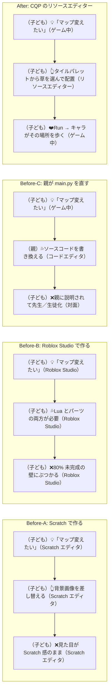
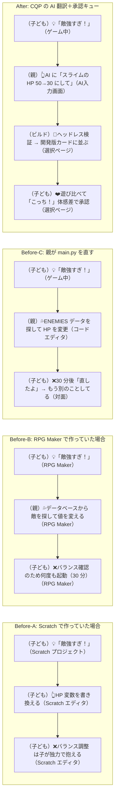
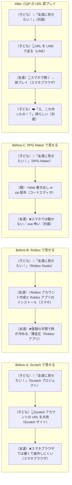
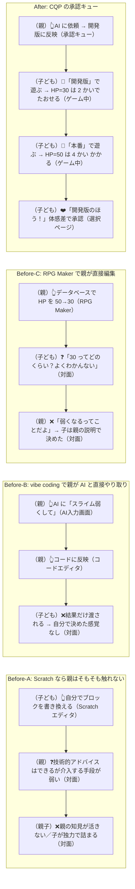
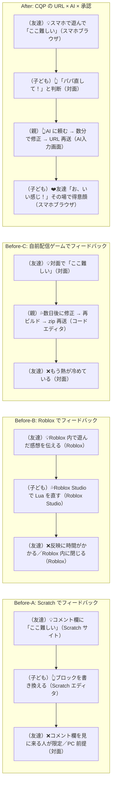
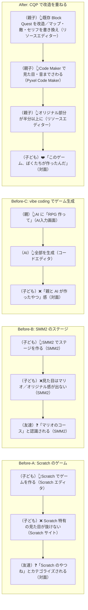
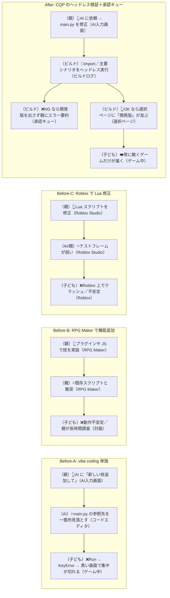
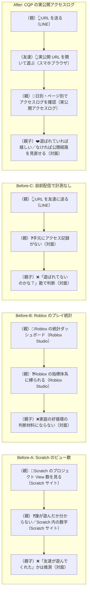

# 実験案 v1：カスタマージャーニー ── 競合プロダクト軸で書き直す

> 実験ラベル：**v1 / 競合プロダクト軸**
> 作成日：2026-04-25
> 視点：Before に**具体的な競合プロダクトでの体験**を複数並べ、After で CQP 独自領域を立ち上げる。`subgraph Before` を 2〜3 個並列に置き、「どの代替でも届かない価値」が After に残ることを示す。
> 根拠：[`experimental-customer-jobs-v1.md`](./experimental-customer-jobs-v1.md)

---

## 凡例（v1 固有）

- `Before-A` `Before-B` `Before-C` ：複数の代替（既存）行動を並べる
- `After`：CQP の体験
- ノード形式：`[（主体）絵文字 文（タッチポイント）]`
- 主体は `（子ども）` `（親）` `（友達）` `（AI）` `（ビルド）` 等
- 価値は Before 群と After の落差から立ち上がる（解釈軸）

---

## 代表ジャーニー 8 本（厳選）

全 42 本ではなく、**競合との対比が最も鋭くなる 8 本**を厳選して書く。残りは v1 の方針が固まり次第、同方式で展開する。

---

### CJ01-v1: はじめてのタイル配置

子どもが「マップを変えたい」と言ったとき、各代替プロダクトでは何が起きるか。

**感情**：❌どの代替でも何かが欠ける →❤️親が AI 翻訳役に回り、子どもがハンドルを握ったまま数十秒で世界が変わる

> **このジャーニーが示す価値**：他の代替はいずれも「子どもの所有感」「即時反映」「親子の対等」のどれかを欠く。CQP はその 3 つを同時に成立させる。

---

### CJ08-v1: 敵が強すぎる

子どもがテストプレイで「この敵強すぎ！」と言った瞬間、各代替で何が起きるか。

**感情**：❌どの代替でも子の集中が切れる →❤️3 分で戻ってきて一緒に調整できる

> **このジャーニーが示す価値**：「速い」だけなら vibe coding でできる。CQP の独自領域は「速さ × ガードレール × 子の承認権」が同時に成立すること。

---

### CJ21-v1: 友達に見せる

スマホで即プレイ、というハードルの低さは各代替で大きく違う。

**感情**：❌どの代替でも友達が「すぐ遊んでくれる」体験は弱い →❤️URL を LINE で送る → スマホで即プレイ → 反応がその場で返る

> **このジャーニーが示す価値**：友達フィードバックを家族の好循環に持ち帰る導線が、配信レイヤーで担保されている。

---

### CJ31-v1: 子どもが変更を承認する

「親が勝手に直さない仕組み」は、競合プロダクトのどこにも無い。

**感情**：❌どの代替でも子は「親が決めたもの」を渡される →❤️開発版と本番を遊び比べて、自分の体感で「こっち！」と決める

> **このジャーニーが示す価値**：「子の意思決定が消えない」を**システムで担保**しているのは CQP だけ。

---

### CJ22-v1: 友達のフィードバックを反映する

フィードバック → 修正 → 再確認のループがどれだけ速く何周も回るか。

**感情**：❌どの代替でも数日のラグで熱が冷める →❤️その場で反映 → 友達がすぐ確認 →「お、いい感じ！」

> **このジャーニーが示す価値**：フィードバックループの**外周**（友達）まで含めた好循環は、URL 即プレイ × AI 翻訳 × 子の判断権の 3 つが同時に揃う必要がある。

---

### CJ26-v1:「自分たちのゲーム」と言えるようになる

「自分たちで作った」という所有感は、最終的に何を要件とするか。

**感情**：❌どの代替でもプロダクトの「色」が残る →❤️見た目・音・物語まで親子の手が入った「ぼくたちのゲーム」

> **このジャーニーが示す価値**：「自分たちのゲーム」感は、**プロダクトの色を消せるレイヤー（見た目・音・物語）に親子が触れること**で生まれる。

---

### CJ35-v1: AI で修正したらエラーが出て動かない

ガードレールの存在は、競合プロダクトと CQP を最も鋭く分ける。

**感情**：❌どの代替でも AI 修正の壊れた版が子の画面に届きうる →❤️ヘッドレス検証で壊れた版は届かない

> **このジャーニーが示す価値**：「速さ」だけ提供するプロダクトは多い。「速さ × 壊れない」を両立するのは CQP のヘッドレス検証＋承認キュー機構。

---

### CJ43-v1: 実公開で遊ばれた記録が見える

各プラットフォームでの「届いたかどうか」の見える化。

**感情**：❌どの代替でも記録が薄い／プラットフォームに従属 →❤️自分の VM の実公開ログで事実判断

> **このジャーニーが示す価値**：プラットフォームに依存しない「自分の VM のログ」で、声かけや修正判断を**事実ベース**にできる。

---

## このバージョンを採用するときに変わること

- 全 42 ジャーニーが Before に **2〜3 個の競合シナリオを並列**で持つ
- 一覧表に「最も対比が鋭い競合」列が増える
- マーケティング素材は「Scratch ではこうなる、CQP ではこうなる」の比較動画／表
- 親への訴求軸が「親が暴走しない・子の所有感が消えない・ガードレールがある」の 3 点に集約

---

## 残り 34 本の方針

CJ01-v1 / CJ08-v1 / CJ21-v1 / CJ31-v1 / CJ22-v1 / CJ26-v1 / CJ35-v1 / CJ43-v1 で**全クラスター（開発／デバッグ／共有／承認／ガードレール）の代表**は押さえた。残り 34 本も**この 8 本のテンプレに沿って**展開可能。テンプレ：

1. Before-A：Scratch / Roblox / SMM2 / RPG Maker / GDevelop のいずれか
2. Before-B：別カテゴリの代替（vibe coding 単独 / 自前配信 / Bitsy 等）
3. Before-C：「親が main.py を直す」既存パターン（現家庭の代替）
4. After：CQP の体験
5. 末尾に 1 行「このジャーニーが示す価値」

---

## 参照
- [`experimental-customer-jobs-v1.md`](./experimental-customer-jobs-v1.md)
