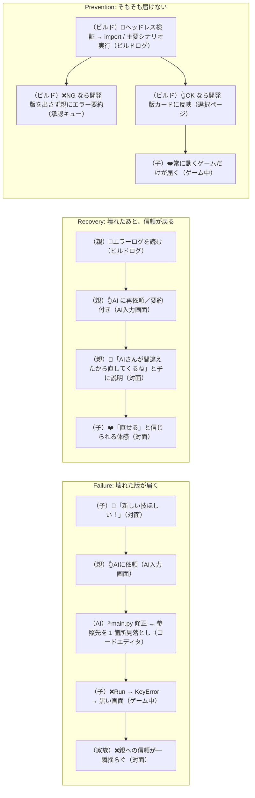
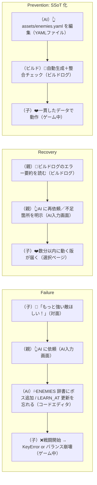

# 実験案 v3：カスタマージャーニー ── 失敗時のジョブ軸

> 実験ラベル：**v3 / 失敗ジョブ軸**
> 作成日：2026-04-25
> 視点：失敗の瞬間こそ価値の本体。Before に「事故」、After に「事故からの回復／事故の予防」を書く。**ガードレール系（CJ35-CJ41）を中核**として、新規ジャーニー候補（CJ44 関心の蒸発、CJ45 関係の摩耗）を追加する。
> 根拠：[`experimental-customer-jobs-v3.md`](./experimental-customer-jobs-v3.md)

---

## 凡例（v3 固有）

- **subgraph の構造**：
  - `Failure`：失敗が起きる経路
  - `Recovery`：失敗からの回復経路
  - `Prevention`：失敗を未然に防ぐ経路
- ノード形式：従来通り `[（人格／主体）絵文字 文（タッチポイント）]`
- 注：このバージョンでは Before/After を**捨てて**、Failure / Recovery / Prevention の 3 列構造で描く

---

## 6 つの障害モードを軸にした代表ジャーニー

---

### F1-J: AI 修正の破壊（既存 CJ35 の再書き）

**失敗の正体**：AI が main.py を修正したが、参照先の 1 箇所を見落として KeyError でクラッシュ。子の画面に黒い画面とエラーログが届き、集中が切れる。



> **失敗ジョブ的読み方**：「Prevention だけでは不十分」。Recovery 経路を持つことが、子の信頼を保つ。

---

### F2-J: 親の善意の暴走（CJ31 の裏側）

**失敗の正体**：親が「これは明らかにバランスが悪い」と判断し、子に確認せず本番に反映してしまう。子は「自分のゲームじゃない」感を抱く。

```mermaid
flowchart LR
    subgraph Failure["Failure: 親が確認せず反映"]
        F1[（親(翻訳者)）💡「明らかに敵が強すぎる」（対面）]
        F1 --> F2[（親(翻訳者)）👆AI に依頼 → 直接コミット（コードエディタ）]
        F2 --> F3[（子(批評家)）❓「なんか違うけど何が変わったのかわからない」（ゲーム中）]
        F3 --> F4[（家族）❌「自分のゲーム」感が薄れる（対面）]
    end
    subgraph Recovery["Recovery: 暴走に親が気づく"]
        R1[（親(セーフティネット)）👀ダッシュボードで「子の承認待ち時間」が 0（不正経路の指標）（観察者DB）]
        R1 --> R2[（親）💬「ごめん、確認しないで反映しちゃった」（対面）]
        R2 --> R3[（親）👆「もどして」依頼を承認キューに登録（承認キュー）]
        R3 --> R4[（子(批評家)）👀遊び比べて再判断（ゲーム中）]
    end
    subgraph Prevention["Prevention: そもそも経路を塞ぐ"]
        P1[（システム）👆親の修正は必ず開発版に行く（承認キュー）]
        P1 --> P2[（システム）👆本番昇格は子の承認後にのみ起きる（承認キュー）]
        P2 --> P3[（子(批評家)）❤️決定権が常に自分にある（選択ページ）]
    end
```

> **失敗ジョブ的読み方**：「親の自制」に依存しないシステムが、家族関係の保険。

---

### F3-J: 後悔の固定化（CJ34 の格上げ）

**失敗の正体**：承認した変更でしばらく遊んだあと「やっぱり前のほうがよかった」となる。戻し方がわからないと、結局親に頼ることになり「自分で決める」サイクルが崩壊。

```mermaid
flowchart LR
    subgraph Failure["Failure: 承認後に固定化"]
        F1[（子(批評家)）👆HP=30 を承認（選択ページ）]
        F1 --> F2[（子(プレイヤー)）👆しばらく遊ぶ（ゲーム中）]
        F2 --> F3[（子(批評家)）❓「やっぱり前のがよかったかも」（対面）]
        F3 --> F4[（子）❌戻し方がわからず親に頼る（対面）]
        F4 --> F5[（家族）❌また親が決める構造に戻る（対面）]
    end
    subgraph Recovery["Recovery: 同じ承認キューで戻せる"]
        R1[（子(批評家)）💡「もどして！」（対面）]
        R1 --> R2[（親(翻訳者)）👆「もどして」依頼を登録 HP: 30→50（承認キュー）]
        R2 --> R3[（子(批評家)）👀承認キューに「進める依頼」「戻す依頼」が同列で並ぶ（承認キュー）]
        R3 --> R4[（子(批評家)）❤️自分で承認して戻る（選択ページ）]
    end
    subgraph Prevention["Prevention: 戻すのを「特別」にしない"]
        P1[（システム）👆「もどして」依頼が承認キューに混ざる（承認キュー）]
        P1 --> P2[（履歴UI）👀ぶれた跡が「進化」として記録（履歴UI）]
        P2 --> P3[（子）❤️「戻す」は恥ずかしいことではない（対面）]
    end
```

> **失敗ジョブ的読み方**：戻すという行為自体を「失敗」と扱わない設計が、子の判断権を守る。

---

### F4-J: 配信ロスト（CJ41 + CJ43 の融合）

**失敗の正体**：友達に URL を送ったのに遊ばれない。親には届いてないのか、ゲームが壊れてるのか、興味を持たれてないのか分からない。子は黙って落ち込む。

```mermaid
flowchart LR
    subgraph Failure["Failure: 届かない／壊れる"]
        F1[（子(社会人)）👆URL を友達に送る（LINE）]
        F1 --> F2[（友達）❓開いてみるが Web 版でセーブできない（スマホブラウザ）]
        F2 --> F3[（友達）❌離脱（スマホブラウザ）]
        F3 --> F4[（子(社会人)）❌反応がない → 黙って落ち込む（対面）]
    end
    subgraph Recovery["Recovery: 親(観察者) が事実で見直す"]
        R1[（親(観察者)）👀実公開アクセスログで状況確認（観察者DB）]
        R1 --> R2[（親(観察者)）👆「公開経路が壊れている」と判断（対面）]
        R2 --> R3[（親(翻訳者)）👆AI に「Web 版のセーブ問題を直して」（AI入力画面）]
        R3 --> R4[（子(社会人)）❤️「もう一回送ってみよう」と立て直す（対面）]
    end
    subgraph Prevention["Prevention: Web/セーブ互換テスト"]
        P1[（ビルド）👀Web ヘッドレステストでセーブ／ロード検証（ビルドログ）]
        P1 --> P2[（ビルド）❌Web で動かないならビルド失敗＋親に通知（通知）]
        P2 --> P3[（友達）❤️スマホ URL で確実にプレイできる（スマホブラウザ）]
    end
```

> **失敗ジョブ的読み方**：「届かなかった」を**子に直接見せない**のが鍵。親(観察者) が事実で受け止めて立て直す。

---

### F5-J: 関心の蒸発（**新規 CJ44**）

**失敗の正体**：子が 3 週間プロダクトを開かない。親は「飽きたのかな」「強制したくないな」と迷う。プロダクトが「やめた／続けた」を曖昧にしたままだと、家族のもやもやが残る。

```mermaid
flowchart LR
    subgraph Failure["Failure: 子の関心が蒸発・親が迷う"]
        F1[（子）👀最後にプレイしたのは 3 週間前（ゲーム中）]
        F1 --> F2[（親(観察者)）❓「飽きたのかな…」迷う（対面）]
        F2 --> F3[（親(観察者)）💦無理に「やろうよ」と言いそうになる（対面）]
        F3 --> F4[（家族）❌ぎこちなさだけが残る（対面）]
    end
    subgraph Recovery["Recovery: やめる権利を尊重しつつ復帰の入り口を残す"]
        R1[（親(観察者)）👀ダッシュボードで「最終プレイ 3 週間前」を確認（観察者DB）]
        R1 --> R2[（親(観察者)）👆無理に誘わない判断（対面）]
        R2 --> R3[（システム）👆本番版・セーブデータをそのまま archive（保管）]
        R3 --> R4[（子）👆数ヶ月後、ふと「今日マップ広げたい」（ゲーム中）]
        R4 --> R5[（子）❤️前回の続きから再開（ゲーム中）]
    end
    subgraph Prevention["Prevention: 関心の遷移を吸収する"]
        P1[（一覧表）👀分類（開発／デバッグ／演出／共有／発展）が選択肢（一覧表）]
        P1 --> P2[（子）👆「今日は演出が触りたい」など別の入り口（リソースエディター）]
        P2 --> P3[（子）❤️同じプロダクト内で関心の遷移を吸収（リソースエディター）]
    end
```

> **失敗ジョブ的読み方**：「やめる権利」を尊重するプロダクトは、長期的に**戻ってきやすい**プロダクトでもある。

---

### F6-J: 関係の摩耗（**新規 CJ45**）

**失敗の正体**：親子で「これ採用したい／したくない」がぶつかり、夜が険悪になる。プロダクトが「親の理屈」と「子の体感」のどちらかに肩入れすると、家族関係に傷が残る。

```mermaid
flowchart LR
    subgraph Failure["Failure: ぎくしゃくが残る"]
        F1[（子(批評家)）👆「これは却下！」（選択ページ）]
        F1 --> F2[（親）💢「でもバランス的には…」（対面）]
        F2 --> F3[（家族）❌険悪 → その夜プロダクトを開けない（対面）]
        F3 --> F4[（家族）❌翌日もぎこちなさが残る（対面）]
    end
    subgraph Recovery["Recovery: 関係の修復を妨げない"]
        R1[（親(セーフティネット)）👀「親が押し付けた」と気づく（対面）]
        R1 --> R2[（親）💬「そうだね、君が決めたほうがいい」（対面）]
        R2 --> R3[（システム）👆却下が成立 → 本番はそのまま（承認キュー）]
        R3 --> R4[（家族）❤️プロダクトを再開しても、過去の衝突を引きずらない（履歴UI）]
    end
    subgraph Prevention["Prevention: 仕組みで衝突点を減らす"]
        P1[（システム）👆「却下」が常に成立する保証（承認キュー）]
        P1 --> P2[（システム）👆親の理屈で押し切れない構造（承認キュー）]
        P2 --> P3[（家族）❤️衝突しても「子の体感が勝つ」が標準（対面）]
    end
```

> **失敗ジョブ的読み方**：プロダクトが**判断を子の側に倒す**ことで、親が引き下がりやすくなる。これが家族関係の保険。

---

### F1-J 拡張: AI が呪文追加で他所を壊す（既存 CJ36 の再書き）



---

## このバージョンを採用するときに変わること

- ジャーニーの構造が **Before / After ではなく Failure / Recovery / Prevention** の 3 列に変わる
- 新規ジャーニー追加：**CJ44（関心の蒸発）**、**CJ45（関係の摩耗）**
- ガードレール（CJ35-CJ41）がプロダクトの中核ジャーニーとして再配置される
- 親(観察者) ダッシュボードに「最終プレイ日時」「子の承認待ち時間」「修正サイクル時間」が乗る
- 履歴 UI が「やり直し」ではなく「進化の跡」として実装される
- マーケティング素材は「壊れた時に家族関係が壊れない」「やめても戻ってこられる」を打ち出す
- ROI 評価軸が「楽しさ」ではなく「**何ヶ月続いたか**」「**家族関係が良くなったか**」へ

---

## 残り 36 本（既存ジャーニー）の方針

既存の 42 本のうち、Failure モードに対応させる候補：
- F1（破壊）→ CJ35-CJ41（既存）
- F2（暴走）→ CJ31, CJ33（既存、Prevention 側のみ書かれている）
- F3（固定化）→ CJ34（既存、Recovery のみ書かれている）
- F4（配信ロスト）→ CJ41, CJ43（既存）
- F5（蒸発）→ **CJ44 新規**
- F6（摩耗）→ **CJ45 新規**

それ以外の「うまくいくジャーニー」（CJ01-CJ30 等）は、各々に「**この体験が崩れたとき何が起きるか**」の Recovery 副節を追加する形で v3 化できる。

---

## 参照
- [`experimental-customer-jobs-v3.md`](./experimental-customer-jobs-v3.md)
