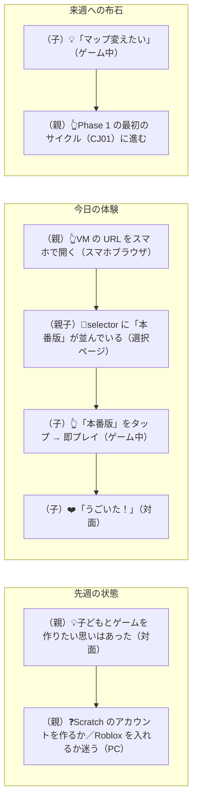
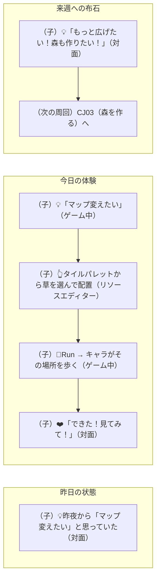
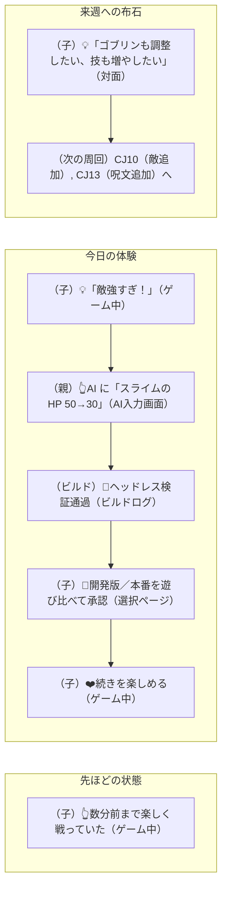
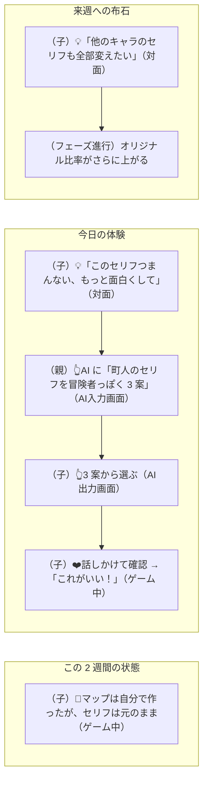
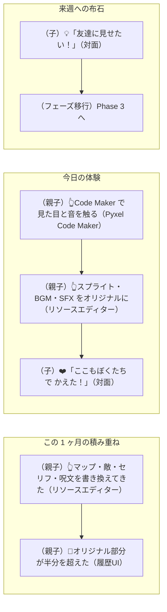
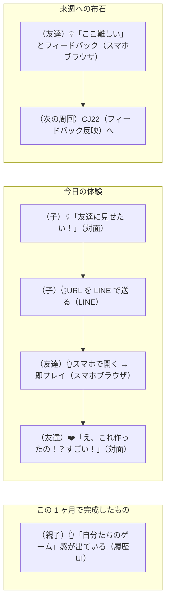
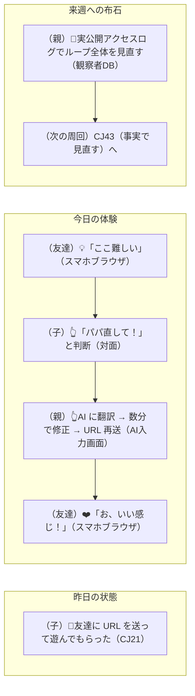
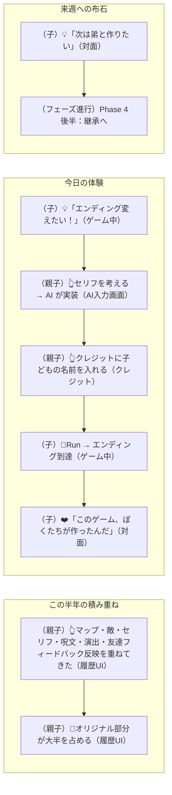
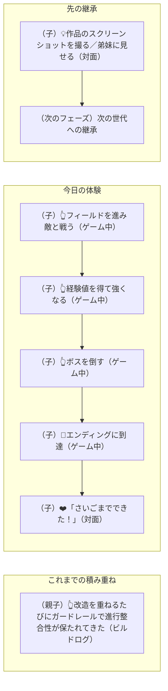
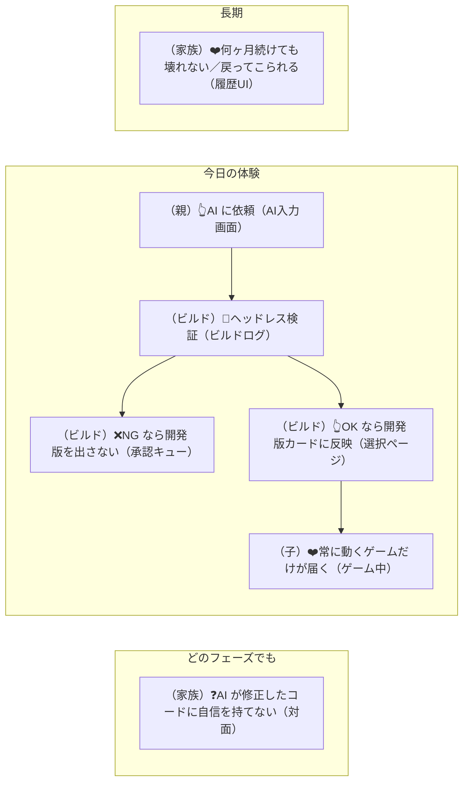

# 実験案 v4：カスタマージャーニー ── ライフサイクル軸

> 実験ラベル：**v4 / ライフサイクル軸**
> 作成日：2026-04-25
> 視点：1 つのジャーニーを「孤立した体験」ではなく「**長期的な家族プロジェクトの中の一節**」として描く。各ジャーニーに「**いつ起きるか（フェーズ）**」と「**そのフェーズでの主要ジョブ**」のラベルを付け、フェーズの中での位置づけを明示する。
> 根拠：[`experimental-customer-jobs-v4.md`](./experimental-customer-jobs-v4.md)

---

## 凡例（v4 固有）

- **ジャーニー冒頭**に `> 📅 Phase X / 主要ジョブ：LX.Y` を明記
- mermaid 内は従来通り `[（人格／主体）絵文字 文（タッチポイント）]`
- subgraph は **Before / After** ではなく **「先週の状態」→「今日の体験」→「来週への布石」** の **時間 3 列**
- ジャーニー末尾に「次のフェーズへの橋渡し」を 1 行

---

## 各フェーズの代表ジャーニー

---

### Phase 0：First Light

#### CJ46-v4: はじめて起動する（**新規ジャーニー候補**）

> 📅 Phase 0 / 主要ジョブ：L0.1, L0.2, L0.3

**感情**：❌新しいツールへの不安（Scratch アカウント？インストール？） →❤️5 分でゲームが動いた

> **次のフェーズへの橋渡し**：`B1` の「マップ変えたい」がループ点火の合図。ここから **Phase 1** に入る。

---

### Phase 1：Loop Ignition

#### CJ01-v4: はじめてのタイル配置（Phase 1 の入り口）

> 📅 Phase 1 / 主要ジョブ：L1.1, L1.2

**感情**：❌「すぐ動かないかも」という不安 →❤️置いた瞬間に画面に反映、もう 1 周回せる手応え

> **次のフェーズへの橋渡し**：1 周目の成功が 2 周目の燃料。これを 5 周以上回すのが Phase 1 のゴール。

---

#### CJ08-v4: 敵が強すぎる（Phase 1 のテンポ確認）

> 📅 Phase 1 / 主要ジョブ：L1.1（5 分以内の 1 周）, L1.3（壊れない）

**感情**：❌「直してる間に集中が切れる」 →❤️3 分で戻ってきて続きを楽しめる

> **次のフェーズへの橋渡し**：「敵調整」が「敵追加」「呪文追加」のような構造的変更欲求につながる。Phase 2 への自然な誘導。

---

### Phase 2：Ownership

#### CJ09-v4: セリフを変えたい（Phase 2 の所有感増幅）

> 📅 Phase 2 / 主要ジョブ：L2.1（オリジナル要素の積み上げ）

**感情**：❌キャラのセリフが「他人事」 →❤️自分たちの言葉に置き換わってオリジナル度が上がる

> **次のフェーズへの橋渡し**：「セリフ → 物語の分岐 → エンディング」の流れが Phase 4 まで続く。

---

#### CJ26-v4:「自分たちのゲーム」と言えるようになる（Phase 2 のクライマックス）

> 📅 Phase 2 → 3 / 主要ジョブ：L2.2（Block Quest 感が薄れる）, L2.3（見た目・音まで触る）

**感情**：❌「Block Quest の改造版」感 →❤️「ぼくたちのゲーム」感

> **次のフェーズへの橋渡し**：所有感が**外向き**に転じる瞬間。Phase 3 への自然な遷移点。

---

### Phase 3：Outreach

#### CJ21-v4: 友達に見せる（Phase 3 の起点）

> 📅 Phase 3 / 主要ジョブ：L3.1（友達に届ける）

**感情**：❌他のプロダクトでは届けにくい →❤️URL × スマホで即プレイ、その場で反応

> **次のフェーズへの橋渡し**：友達のフィードバックが Phase 3 の主役ジャーニー（CJ22）を起動する。

---

#### CJ22-v4: 友達のフィードバックを反映する（Phase 3 の好循環）

> 📅 Phase 3 / 主要ジョブ：L3.2（家族のループに取り込む）

**感情**：❌他プロダクトでは数日のラグ →❤️その場で反映 → 友達がすぐ確認

> **次のフェーズへの橋渡し**：単発のフィードバック反映から、**長期的な届き方**の振り返り（CJ43）に進む。

---

### Phase 4：Inheritance

#### CJ30-v4: エンディングを自分たちで書く（Phase 4 のクライマックス）

> 📅 Phase 4 / 主要ジョブ：L4.2（自分たちの言葉でエンディング）

**感情**：❌「クリアしたけど、これ誰の話？」 →❤️「このゲーム、ぼくたちが作ったんだ」

> **次のフェーズへの橋渡し**：作品の完成が次のプロジェクトの種を蒔く。

---

#### CJ42-v4: 子どもが冒険を最後までやり切れる（Phase 4 の達成）

> 📅 Phase 4 / 主要ジョブ：L4.1（最後まで遊び切る）

**感情**：❌途中で進行が止まる不安 →❤️「さいごまでできた」

> **次のフェーズへの橋渡し**：「やり切った」体験は次のプロジェクトの起爆剤。

---

## 全フェーズ共通：CJ35-v4: ガードレール（フェーズ非依存）

> 📅 全フェーズ常時 / 主要ジョブ：すべてのフェーズの「壊れない」を保つ

**感情**：❌フェーズによらず壊れた版が届くと家族関係が傷む →❤️常に動く版だけが届く

> **次のフェーズへの橋渡し**：ガードレールは**全フェーズで作動する基盤**。フェーズの遷移を支える土台。

---

## このバージョンを採用するときに変わること

- 全 42 ジャーニーに **Phase ラベル** が付く（一覧表に「主要フェーズ」列追加）
- ジャーニーが**フェーズ別ナビゲーション**として整理される（家族が「いま自分たちはどこか」を把握できる）
- マーケティング素材がフェーズ別に分かれる（前述）
- 親(観察者) ダッシュボードに **「いま家族が居るフェーズ」** インジケーターが乗る
- 新規ジャーニー候補：**CJ46（はじめて起動する）** が Phase 0 の代表として追加される

---

## 残り 32 本の方針

各ジャーニーに：
1. **Phase ラベル** を付与
2. mermaid を「**先週の状態 → 今日の体験 → 来週への布石**」の 3 列構造で書き直す
3. ジャーニー末尾に「**次のフェーズへの橋渡し**」を 1 行
4. 一覧表でフェーズ順に並び替える

これで「線形の物語としての家族プロジェクト」が読める。

---

## 参照
- [`experimental-customer-jobs-v4.md`](./experimental-customer-jobs-v4.md)
