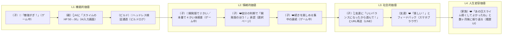
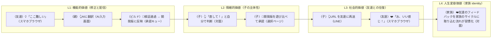
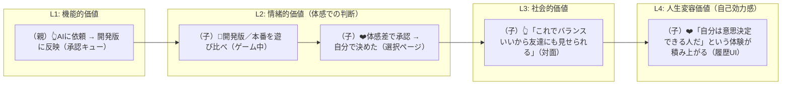
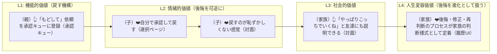
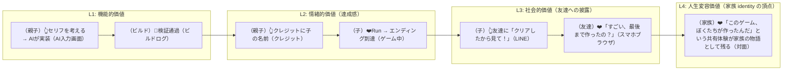
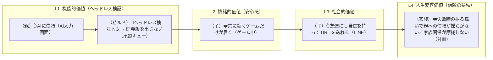
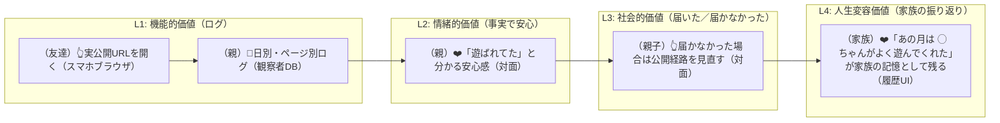
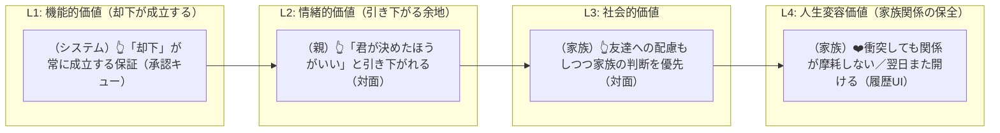

# 実験案 v5：カスタマージャーニー ── 価値階層軸

> 実験ラベル：**v5 / 価値階層軸**
> 作成日：2026-04-25
> 視点：1 つのジャーニーを「**4 つの価値階層を順に立ち上げていくプロセス**」として描く。同じ瞬間が L1 → L2 → L3 → L4 の価値を連続的に提供する。
> 根拠：[`experimental-customer-jobs-v5.md`](./experimental-customer-jobs-v5.md)

---

## 凡例（v5 固有）

- **subgraph の構造**：`L1 機能` → `L2 情緒` → `L3 社会` → `L4 人生変容`
- 各層内のノードはその層の体験を描く
- ノード形式：`[（主体）絵文字 文（タッチポイント）]`
- ジャーニー末尾に「**この瞬間に立ち上がった価値の層**」を 1 行

---

## 代表ジャーニー（4 層構造での書き直し）

---

### CJ08-v5: 敵が強すぎる

**価値階層的な意味**：「敵を弱くする」という機能（L1）が、「集中の連続」（L2）→「友達と笑える」（L3）→「家族で一緒に直した記憶」（L4）まで貫通する瞬間。

> **この瞬間に立ち上がった価値**：L1（HP 変更）→ L2（集中の連続、自己決定）→ L3（友達に共有）→ L4（家族の記憶）。**機能の 1 操作が 4 層全てを貫通**する。

---

### CJ22-v5: 友達のフィードバックを反映する

**価値階層的な意味**：友達のフィードバックを反映する 1 つの行為が、L1 から L4 まで貫通する。

> **この瞬間に立ち上がった価値**：友達フィードバックの反映は、家族の「外と関わる仕方」そのものを形成する。L4 に届く。

---

### CJ31-v5: 子どもが変更を承認する

**価値階層的な意味**：「承認する」という単純な行為が、子の自己効力感（L4 の中核）を作る。

> **この瞬間に立ち上がった価値**：「承認する」が**繰り返される**ことで、L4 の自己効力感が育つ。1 回の承認だけでは L2 で終わる。

---

### CJ34-v5: 承認後に「やっぱり」となる

**価値階層的な意味**：「戻す」という一見ネガティブな行為が、L4 の家族 identity に積み上がる。

> **この瞬間に立ち上がった価値**：「戻す」を恥ずかしくない経験として積むことで、家族全体の判断文化が変わる。

---

### CJ30-v5: エンディングを自分たちで書く

**価値階層的な意味**：プロダクト最大のクライマックス。L1 から L4 までフルに作動する。

> **この瞬間に立ち上がった価値**：CJ30 は CQP の Layer 4 が最も濃く立ち上がる瞬間。**プロダクトの存在意義を集約する**ジャーニー。

---

### CJ35-v5: AI で修正したらエラーが出て動かない

**価値階層的な意味**：ガードレールは L1 の機能だが、家族関係（L4）を守るための仕組み。

> **この瞬間に立ち上がった価値**：ガードレールの本当の役割は L4。L1 のヘッドレス検証は手段であって目的ではない。**目的は家族関係の保護**。

---

### CJ43-v5: 実公開で遊ばれた記録が見える

**価値階層的な意味**：単なるアクセスログ（L1）が、家族の物語の素材（L4）になる。

> **この瞬間に立ち上がった価値**：ログという機能が、半年後の振り返りで「家族の物語」の一部になる。

---

### CJ45-v5: 関係の摩耗（v3 で新規追加、L4 を直接守るジャーニー）

**価値階層的な意味**：このジャーニーは L4 を直接守る。L1-L3 をスキップして L4 から書く稀なケース。

> **この瞬間に立ち上がった価値**：「却下が成立する」という機能が L4（家族関係の保全）の本体。L4 のために L1 を設計するパターン。

---

## このバージョンを採用するときに変わること

- 全ジャーニーが **L1 → L2 → L3 → L4** の流れで描かれる
- 価値階層別 KPI ダッシュボード（親(観察者) ダッシュボードに統合）
- マーケティング素材が層別に分かれ、**最終訴求は L4**（家族の物語）
- 競合分析が層別に整理され、L4 まで届くプロダクトが CQP だけであることを示せる
- 価値階層モデルが**プロダクトの組織哲学**に降りる：「私たちは家族の物語を作るプロダクトです」

---

## 全 42 ジャーニーの 4 層深度マップ（概観）

| ジャーニー | L1 | L2 | L3 | L4 |
|---|---|---|---|---|
| CJ01-CJ07（マップ） | ◎ | ◎ | △ | ○ |
| CJ08-CJ14（デバッグ） | ◎ | ◎ | △ | ○ |
| CJ15-CJ20（演出） | ◎ | ◎ | △ | △ |
| CJ21, CJ22, CJ43（共有） | ◎ | ◎ | ◎ | ○ |
| CJ23-CJ24（リソース） | ◎ | ◎ | △ | ○ |
| CJ25-CJ34（承認） | ◎ | ◎ | ○ | ◎ |
| CJ27-CJ29（発展） | ◎ | ○ | △ | △ |
| CJ30, CJ42（完成） | ◎ | ◎ | ◎ | ◎ |
| CJ26（自分たちのゲーム） | ◎ | ◎ | ○ | ◎ |
| CJ35-CJ41（ガードレール） | ◎ | ◎ | ○ | ◎ |
| CJ44（蒸発・新規） | ○ | ○ | △ | ◎ |
| CJ45（摩耗・新規） | ○ | ○ | △ | ◎ |
| CJ46（初起動・新規） | ◎ | ◎ | △ | △ |

凡例：◎=主要、○=有意義、△=副次的

**気付き**：L4 が ◎ のジャーニーは数えるほど（CJ25-CJ34, CJ30, CJ42, CJ26, CJ35-CJ41, CJ44, CJ45）。これらが**プロダクトの差別化の本丸**。

---

## 参照
- [`experimental-customer-jobs-v5.md`](./experimental-customer-jobs-v5.md)
