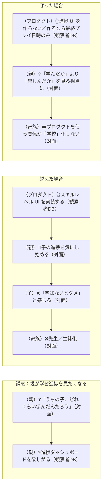
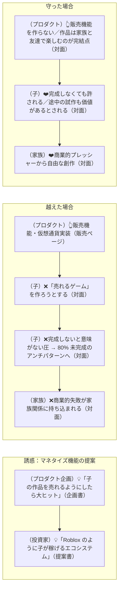
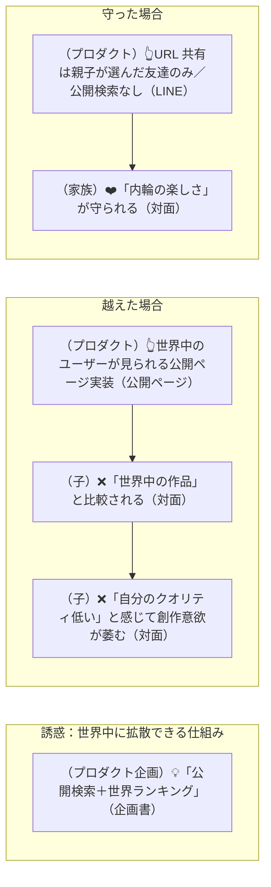
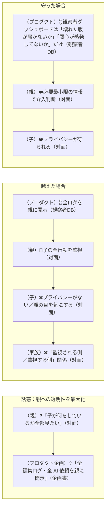
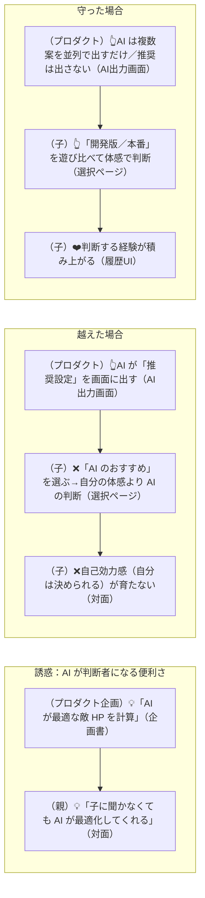
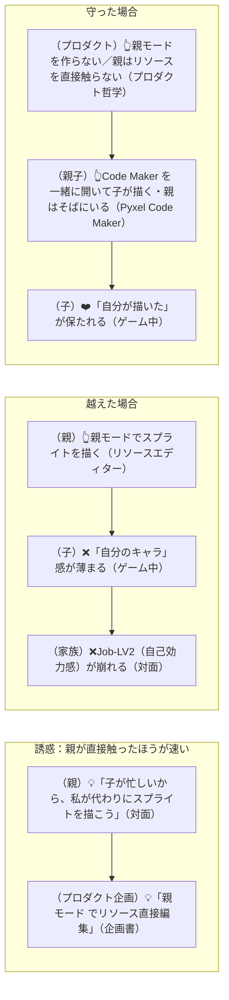
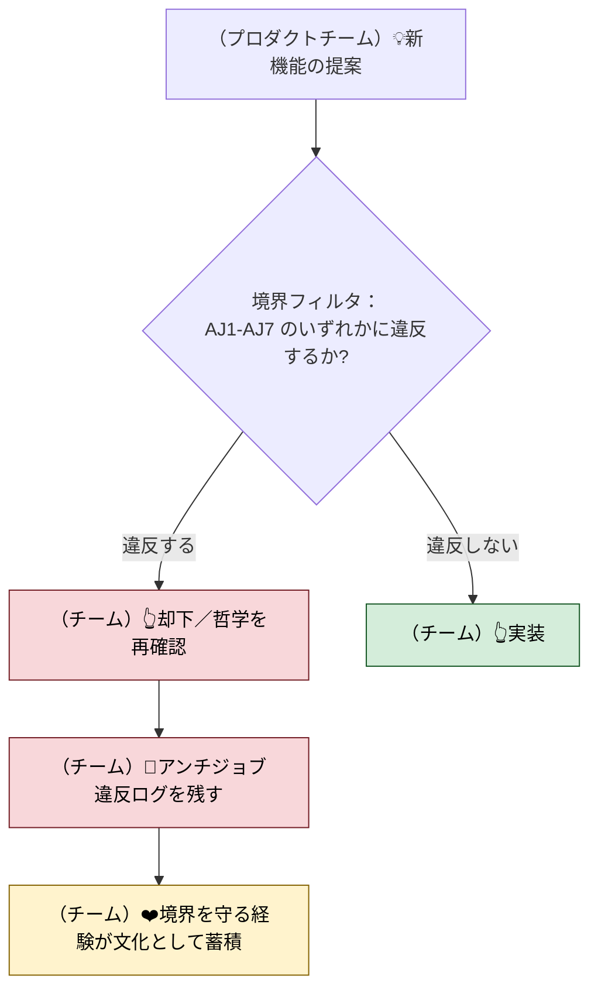

# 実験案 v6：カスタマージャーニー ── アンチジョブ軸（境界を守るシーン）

> 実験ラベル：**v6 / アンチジョブ軸**
> 作成日：2026-04-25
> 視点：ジャーニーを「**境界が試される瞬間**」として描く。ある瞬間、プロダクトは便利さの誘惑にかられる。その時、**境界を守るかどうか**が価値の発生点になる。
> 根拠：[`experimental-customer-jobs-v6.md`](./experimental-customer-jobs-v6.md)

---

## 凡例（v6 固有）

- **subgraph の構造**：
  - `Temptation`：便利さ・機能追加の誘惑が生じる瞬間
  - `Crossing the line`：境界を越えてしまった場合に起きる悪化（反面教師）
  - `Holding the line`：境界を守った場合の体験
- mermaid のラベルに**アンチジョブ番号 (AJ1-AJ7)** を明示

---

## 代表ジャーニー：境界が試される 7 つの瞬間

---

### CJ-AJ1: 「学習進捗を見たい」と親が思った瞬間

**境界**：AJ1（学習効率を最大化しない、評価しない）



> **境界を守ることで生まれる価値**：プロダクトを「学習ツール」ではなく「**家族の遊び場**」として保てる。

---

### CJ-AJ2: 「友達の反応をランキング化したい」と思った瞬間

**境界**：AJ2（評価をプロダクトに持ち込まない）

```mermaid
flowchart LR
    subgraph Temptation["誘惑：友達の反応を可視化したい"]
        T1[（子）💡「友達が遊んでくれた数を知りたい」（対面）]
        T1 --> T2[（プロダクト企画）💦「友達順ランキング」機能を提案（企画書）]
    end
    subgraph Crossed["越えた場合"]
        C1[（プロダクト）👆ランキングを実装（選択ページ）]
        C1 --> C2[（子）❌「◯◯ ちゃんは ◯ 回も遊んでくれたのに、◯◯ ちゃんは…」（対面）]
        C2 --> C3[（子）❌他人の反応を気にして「自分の好み」が薄まる（対面）]
    end
    subgraph Holding["守った場合"]
        H1[（プロダクト）👆ランキングを実装しない／実公開アクセスログだけ親(観察者) が見る（観察者DB）]
        H1 --> H2[（子）👆友達の対面・LINE 反応で十分受け取れる（LINE）]
        H2 --> H3[（家族）❤️作品が「比較対象」ではなく「自分たちのもの」のままでいる（対面）]
    end
```

> **境界を守ることで生まれる価値**：作品が**比較財**にならない。所有感が侵食されない。

---

### CJ-AJ3: 「子のゲームを売れる仕組みを」と提案された瞬間

**境界**：AJ3（課金経済を作らない）



> **境界を守ることで生まれる価値**：「未完成」が許される空間。失敗しても家族関係に響かない。

---

### CJ-AJ4: 「世界中のユーザーに作品を届けたい」と提案された瞬間

**境界**：AJ4（友達コミュニティを大規模化しない）



> **境界を守ることで生まれる価値**：内輪の温度感。外の評価軸に晒されない安全圏。

---

### CJ-AJ5: 「親に詳細な管理ダッシュボードを」と提案された瞬間

**境界**：AJ5（親に過剰な管理機能を渡さない）



> **境界を守ることで生まれる価値**：「観察」と「監視」を区別する。親が**家族関係を守る**のに必要な情報だけ。

---

### CJ-AJ6: 「AI に最適なバランスを判断させたい」と提案された瞬間

**境界**：AJ6（AI に「正解」を判断させない）



> **境界を守ることで生まれる価値**：AI を「翻訳機」に留め、判断者にしない。子の自己効力感が育つ余地を残す。

---

### CJ-AJ7: 「親が直接見た目を編集できる UI が便利」と提案された瞬間

**境界**：AJ7（親がリソースを直接編集しない）



> **境界を守ることで生まれる価値**：**親の便利さ**より**子の所有感**を優先する明確な意思決定。

---

## 全アンチジョブの集約：CJ-AJ-MASTER

「境界を守る」という哲学そのものをジャーニー化する。



> **メタ的な意味**：これはユーザージャーニーではなく、**プロダクトチームのジャーニー**。CQP は内部の意思決定プロセスにアンチジョブを組み込まないと、外向きの境界を保てない。

---

## このバージョンを採用するときに変わること

- 機能 backlog に「**境界フィルタ**」が入る
- プロダクト・ロードマップに「**意図的に作らないリスト**」が公開される
- マーケティングが「**ない機能の自慢**」になる
  - 「ランキングはありません」
  - 「課金はありません」
  - 「学習進捗トラッカーはありません」
  - 「親への監視機能はありません」
- ユーザーが選ぶ理由が「機能の多さ」ではなく「**哲学の一致**」になる
- 採用基準に「アンチジョブを尊重できる人」が入る

---

## 既存ジャーニーへのインパクト

| 既存ジャーニー | アンチジョブによる強化点 |
|---|---|
| CJ20（演出 ON/OFF 体験） | AJ1（学習目的化しない）：演出の良さを「教える」ではなく「**体感させる**」 |
| CJ22（フィードバック反映） | AJ4（コミュニティ大規模化しない）：友達は数人で十分 |
| CJ31-CJ34（承認） | AJ6（AI 判断者化しない）：判断は常に子 |
| CJ26（自分たちのゲーム） | AJ7（親リソース編集しない）：見た目・音は親子の手で |
| CJ43（実公開ログ） | AJ5（親管理過剰化しない）：観察用、監視用ではない |
| CJ35-CJ41（ガードレール） | AJ6（AI 判断者化しない）：壊れた判断はビルドが、創造の判断は子が |

---

## 参照
- [`experimental-customer-jobs-v6.md`](./experimental-customer-jobs-v6.md)
- 関連：[`experimental-customer-jobs-v5.md`](./experimental-customer-jobs-v5.md)（L4 とアンチジョブの相互保護）
