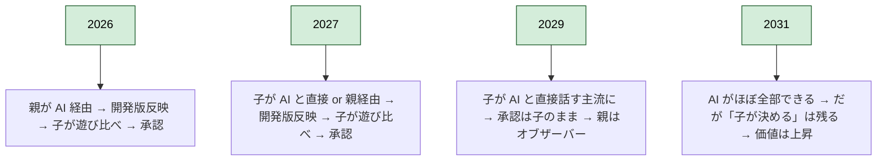
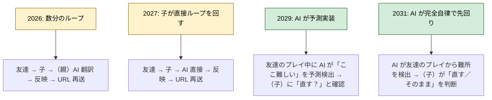
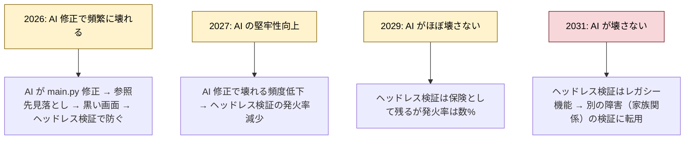

# 実験案 v7：カスタマージャーニー ── AI 進化軸（時間外挿）

> 実験ラベル：**v7 / AI 進化軸**
> 作成日：2026-04-25
> 視点：同じジャーニーを **2026 / 2027 / 2029 / 2031** の 4 時点でどう変化するかを描く。**今のジャーニーが 5 年後どうなるか**を予測しながら、**残るもの**と**消えるもの**を見分ける。
> 根拠：[`experimental-customer-jobs-v7.md`](./experimental-customer-jobs-v7.md)

---

## 凡例（v7 固有）

- **subgraph の構造**：時点別（2026 / 2027 / 2029 / 2031）の 4 列
- ノード形式：従来通り `[（主体）絵文字 文（タッチポイント）]`
- 各時点の末尾に「**陳腐化／残存判定**」を付ける

---

## 代表ジャーニー：時間外挿で変化する／変化しない 6 本

---

### CJ08-v7: 敵が強すぎる（時間外挿版）

**この瞬間の何が陳腐化し、何が残るか**

```mermaid
flowchart TD
    Y2026[2026: 親が AI に翻訳]
    Y2026 --> Y2026b[（子）💢「敵強すぎ！」 →（親）👆AI に「HP 50→30」 →（子）👀遊び比べ承認]

    Y2027[2027: 子が直接 AI と話す]
    Y2027 --> Y2027b[（子）💢「ねえ AI、敵もうちょっと弱くして」 →（AI）👆複数案生成 →（親(セーフティネット)）👀検証 →（子）👀承認]

    Y2029[2029: AI がほぼ完全自律]
    Y2029 --> Y2029b[（子）💢「敵強すぎ！」 →（AI）👆即修正＋複数案 →（家族）👀並列遊び比べ →（子）❤️承認]

    Y2031[2031: AGI 接近]
    Y2031 --> Y2031b[（子）💢「敵強すぎ！」 →（AI）👆理想的なバランスを 0.1 秒で生成 →（子）❤️ただし「自分で決めた」体験が残るかが課題]

    classDef stable fill:#d4edda,stroke:#155724,color:#000000;
    classDef obsolete fill:#f8d7da,stroke:#721c24,color:#000000;
    classDef shifting fill:#fff3cd,stroke:#856404,color:#000000;

    class Y2026 obsolete;
    class Y2027 shifting;
    class Y2029 shifting;
    class Y2031 stable;
```

> **陳腐化判定**：
> - **陳腐化する**：親(翻訳者) のジョブ（2027 で 50%、2029 で消失）／ヘッドレス検証（AI が壊さなくなる）
> - **残る**：「子が体感差で承認する」というジョブ（**むしろ 2031 で価値が上がる**——AI が決めない領域として）
>
> **採用すべき設計**：2026-2027 は親(翻訳者) を機能として残し、2028 以降は「**コミュニケーション機会としての親経由**」に再定義する。

---

### CJ31-v7: 子どもが変更を承認する（5 年後も生存？）



> **陳腐化判定**：
> - **残る（むしろ価値上昇）**：「子が決める」というジョブ。AI が便利になるほど、「自分で決めた」体験が**稀少化**する。承認キューは長期の堀。
>
> **採用すべき設計**：承認キューの UI を **5 年後も中核機能**として位置付ける。AI 直結化しても、判断は人間（子）が下す経路を保つ。

---

### CJ22-v7: 友達のフィードバックを反映する



> **陳腐化判定**：
> - **陳腐化する**：「友達がコメントする」「親が AI に翻訳する」中間ステップ
> - **残る**：「**子が直すかどうかを judge する**」主体性。AI が予測しても判断は子。
>
> **採用すべき設計**：AI が予測する未来でも、「**子の judge**」というジョブは残せる経路を作っておく。

---

### CJ30-v7: エンディングを自分たちで書く（**長期で価値上昇**）

```mermaid
flowchart TD
    Y2026[2026: 親子で考える + AI 実装]
    Y2026 --> Y2026b[親子がセリフを考案 → AI が実装 → クレジットに名前]

    Y2027[2027: 子と AI で対話的に考える]
    Y2027 --> Y2027b[子と AI が対話 → 親(観察者) が見守る → クレジットに名前]

    Y2029[2029: 半自律生成]
    Y2029 --> Y2029b[子の好みから AI が複数案を生成 → 子が選ぶ → クレジットに名前]

    Y2031[2031: AGI 時代]
    Y2031 --> Y2031b[「自分たちで書いた」感が**稀少な体験**として強い意味を持つ → クレジットに名前は記念碑的価値]

    classDef gold fill:#ffd700,stroke:#856404,color:#000000;
    classDef stable fill:#d4edda,stroke:#155724,color:#000000;

    class Y2031 gold;
    class Y2026,Y2027,Y2029 stable;
```

> **陳腐化判定**：
> - **長期で価値が上昇**：AI が何でも書ける時代に「家族の言葉でエンディングを書いた」という体験は、**AI 時代以前の手作り価値**として希少化する。
>
> **採用すべき設計**：CJ30 を**プロダクトの中心的儀式**として位置づける。「クレジットに子の名前」を記念碑化する。

---

### CJ35-v7: AI 修正の破壊（陳腐化リスク高）



> **陳腐化判定**：
> - **陳腐化する**：AI 修正の破壊そのものが減る → ヘッドレス検証の発火率が下がる
> - **残る**：「親(セーフティネット) のジョブ」自体は残る（AI が壊さなくても、家族関係の事故は起きる）。検証対象が「コードの整合性」から「**家族関係への影響**」に移る。
>
> **採用すべき設計**：ヘッドレス検証 → **家族関係インパクト検証**へ進化させる（例：この変更を子が承認しなかったらどうなる？を AI が予想）。

---

### CJ45-v7: 関係の摩耗（**長期で重要性増**）

```mermaid
flowchart TD
    Y2026[2026: 衝突が起きたら却下フローで戻れる]
    Y2026 --> Y2026b[却下成立 → 本番が残る → 翌日再開]

    Y2027[2027: AI が衝突予兆を検出可能に]
    Y2027 --> Y2027b[AI が「これを反映すると衝突しそう」と察知 → 親(観察者) に通知]

    Y2029[2029: AI が家族関係を理解する]
    Y2029 --> Y2029b[AI が過去の衝突パターンを学習 → 危険な変更を事前にフィルタ]

    Y2031[2031: AGI が家族関係の主治医に]
    Y2031 --> Y2031b[AI が家族関係のメタ介入を提案／だが**最終判断は家族**]

    classDef gold fill:#ffd700,stroke:#856404,color:#000000;
    classDef shifting fill:#fff3cd,stroke:#856404,color:#000000;

    class Y2029,Y2031 gold;
    class Y2026,Y2027 shifting;
```

> **陳腐化判定**：
> - **長期で重要性増**：技術的な事故は AI が減らす一方、**家族関係の事故**はむしろ顕在化（AI が便利になることで親が暴走しやすくなる）。CJ45 が**プロダクトの中心ジャーニー**になる可能性。
>
> **採用すべき設計**：AI に家族関係の予兆検出を担わせる UI を 2027-2029 で実装。**ただし最終判断は家族**（AJ6 と整合）。

---

## 全ジャーニーの陳腐化／残存マップ

| ジャーニー | 2026 | 2027 | 2029 | 2031 | 判定 |
|---|---|---|---|---|---|
| CJ01-CJ07（マップ） | ◎ | ◎ | ○ | △ | Layer 1 化、陳腐化リスク |
| CJ08-CJ14（デバッグ） | ◎ | ◎ | ○ | △ | 陳腐化リスク |
| CJ15-CJ20（演出） | ◎ | ○ | △ | △ | AI 生成で代替 |
| CJ21（友達に見せる） | ◎ | ◎ | ◎ | ◎ | 配信は残る |
| CJ22（フィードバック反映） | ◎ | ◎ | ◎ | ◎ | judge は残る |
| CJ23-CJ24（リソース） | ◎ | ○ | △ | △ | AI 生成で代替 |
| CJ25-CJ34（承認） | ◎ | ◎ | ◎ | ◎+ | 価値上昇 |
| CJ27-CJ29（発展） | ◎ | ◎ | ○ | △ | 陳腐化リスク |
| CJ30, CJ42（完成） | ◎ | ◎ | ◎ | ◎+ | 価値上昇 |
| CJ26（自分たちのゲーム） | ◎ | ◎ | ◎ | ◎+ | 価値上昇 |
| CJ35-CJ41（ガードレール） | ◎ | ◎ | ○ | △ | 検証対象が変わる |
| CJ43（実公開ログ） | ◎ | ◎ | ◎ | ◎ | 残る |
| **CJ44（蒸発・新規）** | △ | ◎ | ◎ | ◎+ | **長期で重要** |
| **CJ45（摩耗・新規）** | △ | ○ | ◎ | ◎+ | **長期で重要** |

凡例：◎=主要、○=有意義、△=副次的、◎+=価値上昇

---

## このバージョンを採用するときに変わること

- ロードマップが「**陳腐化に向かうジャーニー**」と「**価値上昇するジャーニー**」に分けて管理される
- **陳腐化グループ**（CJ01-CJ20, CJ23-CJ24, CJ35-CJ41）は機能を維持するが投資配分を下げる
- **価値上昇グループ**（CJ25-CJ34, CJ30, CJ42, CJ26, CJ44, CJ45）に投資を集中させる
- 「家族関係インパクト検証」「衝突予兆検出」など**新規 AI 活用領域**が立ち上がる
- マーケティング軸が「今便利」から「**5 年後も意味を失わないプロダクト**」に
- 競合分析が「現在の機能比較」から「**5 年後の生存可能性**」に切り替わる

---

## 残り 30 本の方針

各ジャーニーに対して：
1. **陳腐化判定** を付ける（陳腐化／中立／価値上昇）
2. 陳腐化グループは**最低限維持**でリリースし続ける
3. 価値上昇グループに**新機能投資**を集中
4. 中立グループは**形を変えて存続**（例：ヘッドレス検証 → 家族関係インパクト検証）

---

## 参照
- [`experimental-customer-jobs-v7.md`](./experimental-customer-jobs-v7.md)
- 関連：[`experimental-customer-jobs-v5.md`](./experimental-customer-jobs-v5.md), [`experimental-customer-jobs-v6.md`](./experimental-customer-jobs-v6.md)
