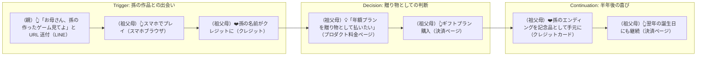
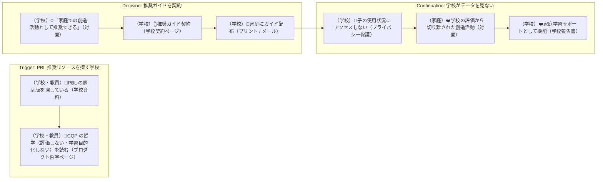
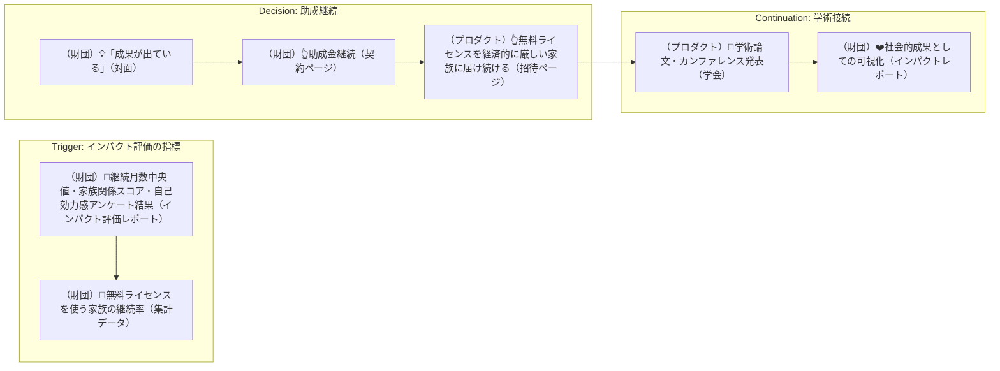
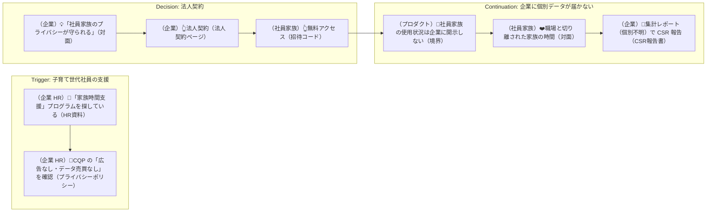
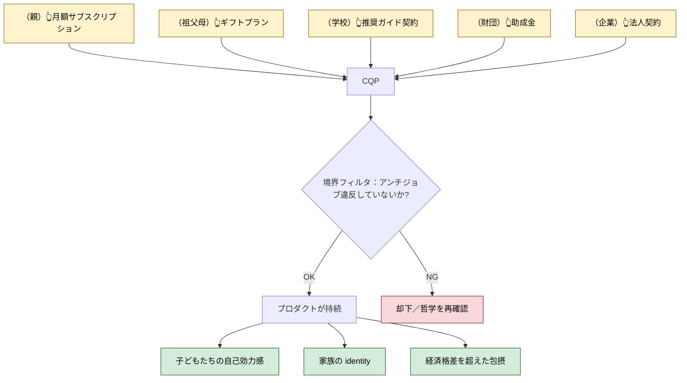

# 実験案 v9：カスタマージャーニー ── 経済モデル軸

> 実験ラベル：**v9 / 経済モデル軸**
> 作成日：2026-04-25
> 視点：「誰が払うか／払う動機が満たされる瞬間」をジャーニーとして描く。ユーザー体験ジャーニーとは別の系統。経済主体（親・祖父母・学校・財団・企業）それぞれの**支払い動機が満たされる瞬間**を可視化する。
> 根拠：[`experimental-customer-jobs-v9.md`](./experimental-customer-jobs-v9.md)

---

## 凡例（v9 固有）

- **subgraph の構造**：`Trigger`（払う動機が湧く瞬間）→ `Decision`（判断）→ `Continuation`（払い続ける動機）
- ノード形式：`[（経済主体）絵文字 文（タッチポイント）]`
- 経済主体：`(親)` `(祖父母)` `(学校)` `(財団)` `(企業)` `(プロダクト)`

---

## 5 つの経済主体ジャーニー

---

### CJ-EC1: 親が「これは払う価値がある」と判断する瞬間

**経済的意味**：プロダクトの存在を**家族の時間と関係性への投資**として捉える価値判断の体験。

```mermaid
flowchart LR
    subgraph Trigger["Trigger: 払う動機が湧く瞬間"]
        T1[（子）❤️「このゲーム、ぼくたちが作ったんだ」（CJ30 完成）（対面）]
        T1 --> T2[（親）👀子の自己効力感が育っているのを見る（対面）]
        T2 --> T3[（親）👀「Roblox のように課金圧がない」「広告がない」「データが守られている」を確認（プライバシーポリシー）]
    end
    subgraph Decision["Decision: 払う判断"]
        D1[（親）💡「月 1,800 円はコーヒー数杯分」（プロダクト料金ページ）]
        D1 --> D2[（親）👆サブスクリプション開始（決済ページ）]
    end
    subgraph Continuation["Continuation: 払い続ける動機"]
        C1[（親(観察者)）👀ダッシュボードで継続月数・家族関係指標を見る（観察者DB）]
        C1 --> C2[（親）❤️「家族の時間を支えている」と実感（対面）]
    end

    T3 --> D1
    D2 --> C1
```

> **支払いが正当化される条件**：（1）アンチジョブ（広告なし・課金経済なし・データ売買なし）が確認できる、（2）家族 identity が育つ実感（CJ30, CJ26 経由）、（3）月額が「家族の時間への投資」として位置づけられる。

---

### CJ-EC2: 祖父母が孫のゲームを遊ぶ瞬間

**経済的意味**：祖父母が**遠くから家族を支援**するための経済的入り口。



> **支払いが正当化される条件**：（1）孫の作品が祖父母にとって**贈り物としての価値**を持つ、（2）プロダクトが祖父母に**孫のデータを露出しない**（プライバシー保護）、（3）記念品（クレジット印刷など）が物理的に残る。

---

### CJ-EC3: 学校がプロダクトを推奨する瞬間

**経済的意味**：学校の**家庭学習サポート**としての位置づけ。AJ1（学校化しない）と整合する設計。



> **支払いが正当化される条件**：（1）学校が**評価軸を持ち込めない**境界が明確、（2）家庭が**学校に監視されない**プライバシー保護、（3）PBL 推奨リソースとしての教育哲学的正統性（v8 と整合）。

---

### CJ-EC4: 財団がインパクト評価で継続を判断する瞬間

**経済的意味**：教育系財団・インパクト投資家による**経済格差是正**の支援。



> **支払いが正当化される条件**：（1）インパクト評価フレーム（家族関係スコア、自己効力感、継続月数）が**追跡可能**、（2）経済格差是正が**実際に起きている**、（3）学術接続による**外部監査可能性**。

---

### CJ-EC5: 企業が社員の家族プログラムに採用する瞬間

**経済的意味**：企業 CSR・福利厚生としての導入。



> **支払いが正当化される条件**：（1）企業が**社員家族の個別データにアクセスできない**境界、（2）職場と家族の時間が**完全に分離**される、（3）集計レポートのみで CSR 報告として機能。

---

### 統合ジャーニー：CJ-EC-MASTER

5 つの経済主体が**プロダクトの持続を支える**全体図。



> **メタ的な意味**：プロダクトが「広告主」「データ売買先」「子のゲームの買い手」ではなく、**家族の利益と一致した経済主体**だけで持続する設計。各主体は**プロダクトに干渉できない**境界を持つ。

---

## 既存ジャーニーとの統合

| 既存ジャーニー | 経済モデル接続点 |
|---|---|
| CJ30（エンディング） | 祖父母ギフトプランの**記念品化**接続 |
| CJ43（実公開ログ） | 親(観察者) ダッシュボードに**「あなたの支払いが支える数字」**として表示 |
| CJ44（蒸発） | 「無理に続けない」哲学が**サブスク解約の心理的ハードルを下げる**（顧客満足度の根本） |
| CJ45（摩耗） | 経済モデルが**家族関係を侵食しない**保証 |
| CJ35-CJ41（ガードレール） | プロダクトの**信頼性**が「払う価値」の根拠 |

---

## このバージョンを採用するときに変わること

- プロダクト料金ページが**「私たちが**しないこと**」**を前面に出す（広告なし・課金経済なし・データ売買なし）
- 祖父母ギフトプラン、学校推奨パッケージ、企業福利厚生、助成金プランの**4 種の追加経路**
- 親(観察者) ダッシュボードに **「あなたの支払いが支える価値」**ビューが追加
- 経済主体ごとの**プライバシー境界**が契約・UI で明示化
- メトリクスが「ARPU」「DAU」ではなく「**継続月数**」「**家族関係スコア**」「**自己効力感アンケート**」へ
- 投資家との対話で**インパクト投資**を主軸にした資金調達戦略

---

## 参照
- [`experimental-customer-jobs-v9.md`](./experimental-customer-jobs-v9.md)
- 関連：[`experimental-customer-jobs-v6.md`](./experimental-customer-jobs-v6.md)（アンチジョブと経済モデルの整合）
