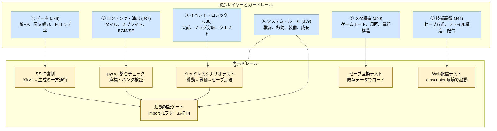

# Gherkin: Guardrails（AI改造のガードレール）

- 対象ジャーニー: J35-J41
- 根拠: [`customer-journeys.md`](./customer-journeys.md)
- 設計経緯: [`docs/steering/20260411-j35-j36-gherkin-landing.md`](../steering/20260411-j35-j36-gherkin-landing.md)
- 方針: AIの改造を「触れなくする」のではなく「壊れたら届けない」で防ぐ

---

## 現状と目標状態

この文書は**目標状態（あるべき姿）**を記述している。現状のコードベースとの差分を以下にまとめる。gherkinの形に少しずつ寄せていく。

| 要素 | 現状 | 目標状態 |
|---|---|---|
| データ定義 | `main.py` / `src/game_data.py` にPython辞書で直書き。`assets/*.yaml` は削除済み | `assets/*.yaml`（SSoT）→ `tools/gen_*.py` → `src/generated/*.py` の一方通行 |
| ローダ | `load_*()` 関数が `main.py` 内にべた書き（ファイルI/Oなし） | `src/loaders/` 経由でのみ生成物にアクセス |
| Hook | 未設定 | `.claude/settings.json` に PreToolUse / PostToolUse hook を設定 |
| ヘッドレステスト | 未実装（`PYXEL_HEADLESS` 未対応） | `make build` 内でヘッドレス起動＋4シナリオ実行 |
| 整合チェック | `_tile_bank_layout_valid()` が起動時に自己修復（ビルド時ではない） | `tools/validate_resources.py` でビルド時に検証 |
| テスト用セーブデータ | なし | ビルドパイプラインが保持 |

**移行方針**: 一気に作り替えない。新規データは YAML に入れる。既存の直書きは段階的に移行する。

---

## AIの能力境界

AIが**構造的にできないこと**を明示する。ブロックするだけでなく、代替手段を案内する。

| 改造 | AIにできるか | 理由 | 代替手段 |
|---|---|---|---|
| マップの地形変更 | **できない** | タイル配置は `.pyxres` の tilemap に焼かれている | Pyxel Code Maker の Tilemap エディタ、または Tiled で `.tmx` を編集 |
| スプライト・グラフィック変更 | **できない** | ピクセルデータは `.pyxres` のイメージバンクに格納 | Pyxel Code Maker の Image エディタで描画 |
| BGM・SE の実体変更 | **できない** | サウンドデータは `.pyxres` に格納 | Pyxel Code Maker の Sound/Music エディタで編集 |
| タイルの通行可否ルール変更 | **できる** | コード上の `PASSABLE_TILES` 等で制御 | — |
| 敵・アイテム・呪文のパラメータ変更 | **できる** | Python 辞書 / YAML で定義 | — |
| セリフ・テキスト変更 | **できる** | `assets/dialogue.yaml` または Python 辞書 | — |
| 戦闘・移動等のロジック変更 | **できる** | `main.py` / `src/` のコード | — |
| イベント・フラグ・会話分岐の追加 | **できる** | `main.py` のコード | — |

```gherkin
Scenario: AIが「できないこと」を頼まれたら代替手段を案内する
  Given 子どもが「敵の絵を変えて」と依頼した
  When 親がAIに伝える
  Then AIは「スプライトの変更は Code Maker の Image エディタで行います。
      変更したいスプライトのバンク番号と座標をお伝えします」と案内する
  And AIはコード側で必要な対応（スプライト座標の定数更新等）を提示する
  And .pyxres を直接編集しようとしない
```

---

## 改造レイヤーの分類

AIによるゲーム改造を6層に分類し、層ごとにガードレールを設計する。

| 層 | Journey | 改造対象 | リスクの性質 |
|---|---|---|---|
| 1. データ | J36 | パラメータ（敵HP、呪文威力、ドロップ率等） | 散在する定数の不整合 |
| 2. コンテンツ・演出 | J37 | タイル、スプライト、BGM、SE | pyxresとコードの乖離 |
| 3. イベント・ロジック | J38 | 会話、フラグ分岐、クエスト | 既存フラグとの衝突 |
| 4. システム・ルール | J39 | 戦闘、移動、装備、成長 | モノリス内の連鎖破壊 |
| 5. メタ構造 | J40 | ゲームモード、進行構造、周回 | セーブデータ互換崩壊 |
| 6. 技術基盤 | J41 | セーブ方式、ファイル構造、配信 | 配信パイプライン破壊 |



---

## J35: 起動検証ゲート（全レイヤー共通）

どのレイヤーの改造であっても、**起動しない版は子どもに届けない**。これが最後の防壁。

**スコープ**: J35の責務は**起動クラッシュの検出のみ**。「動くけどバランスが壊れている」「動くけど見た目がおかしい」といった意味的な誤りはJ35では検出しない。それらは各レイヤー（J36-J41）のガードレールが担う。

```gherkin
Feature: 起動しない版は承認キューに出さない
  好循環を守るため、構文エラー・importエラー・主要シナリオの即死は
  子どもの画面に到達する前にビルドパイプラインで止める。

Background:
  Given ビルドパイプラインは `make build` から実行される
  And パイプラインは「ヘッドレス起動テスト」を必須ステップとして持つ
  And ヘッドレス起動テストは Pyxel を headless モードで import し
      初期化から1フレーム目の描画までを完走させる

Scenario: importエラーを起こす版は選択ページに出ない
  Given AIが main.py を編集した
  And その編集で NameError / AttributeError / ImportError のいずれかが発生する
  When `make build` を実行する
  Then ヘッドレス起動テストが失敗する
  And ビルドは exit code 非0 で終了する
  And 選択ページ (play.html) に壊れた版は出現しない
  And 親のターミナルにエラー要約（ファイル名・行番号・例外名）が表示される

Scenario: 主要シナリオのいずれかが即死する版は選択ページに出ない
  Given AIが任意のレイヤーを修正した
  When `make build` を実行する
  Then 「移動」「戦闘に入る」「1ターン行動する」「セーブする」の
      4つのヘッドレスシナリオが実行される
  And いずれか1つでも例外または無限ループで失敗した場合、ビルドは失敗する
  And 失敗したシナリオ名が親に返される

Scenario: 壊れた版を承認キューから明示的に除外する
  Given 2版ビルド (A版/B版) のうち A版のヘッドレステストが失敗した
  When 承認キュー生成ステップが実行される
  Then B版のみが選択ページに並ぶ
  And A版のスロットには「このばんは うごきませんでした」と表示される
  And 子どもは「動かない画面」を一度も見ない
```

---

## J36: データレベルの改造（パラメータ調整系）

敵・アイテム・呪文・レベルテーブル等のパラメータ変更に対するガードレール。

**改造対象**:
- 敵ステータス（HP、攻撃力、防御力、素早さ、経験値、ドロップ）
- アイテム効果（回復量、価格、レアリティ）
- 呪文・スキル（消費MP、威力、命中率、状態異常付与率）
- 成長テーブル（必要経験値カーブ、レベルアップ時のステータス上昇量、スキル習得レベル）

```gherkin
Feature: データ定義はSSoTに集約し、散在による不整合を防ぐ
  パラメータが main.py 内の複数箇所に散在すると、AIが一箇所を
  更新して別箇所を見落とす不整合が発生する。SSoTに集約し
  自動生成で一貫性を担保する。

Background:
  Given 新規に追加するデータは必ず assets/*.yaml に定義する
  And 既存の main.py 直書き定数は段階的に SSoT へ移行する
  And SSoT から src/generated/*.py への変換は tools/gen_*.py が行う

Scenario: 新しい敵をYAMLに追加すると全参照が自動更新される
  Given AIが assets/enemies.yaml に新しい敵を追加した
  When PostToolUse hook が tools/gen_enemies.py を実行する
  Then src/generated/enemies.py が再生成される
  And ENEMIES リスト、ゾーン別出現テーブル、ドロップテーブルが
      すべて1つのYAMLから派生した一貫した状態になる
  And AIが「LEARN_AT テーブルへの追記を忘れる」ことが構造的に起きない

Scenario: 生成ファイルの直接編集をhookでブロックする
  Given Claude Code の PreToolUse hook が設定されている
  When AIが Edit/Write で src/generated/enemies.py を編集しようとする
  Then hook はツール実行を拒否する
  And AIには「このファイルは生成物です。assets/enemies.yaml を編集して
      `make gen` を実行してください」と返る

Scenario: SSoT編集後に整合チェックが走る
  Given AIが assets/spells.yaml に新しい呪文を追加した
  When PostToolUse hook が gen_spells.py → validate_resources.py を実行する
  Then 呪文IDの重複、習得レベルの欠落、参照先の存在チェックが行われる
  And 不整合がある場合はAIにエラー要約が返り、次のアクションが停止する
```

---

## J37: コンテンツ・演出レベルの改造（見た目・音）

タイル、スプライト、BGM、SEの変更に対するガードレール。`.pyxres`とコード定数の乖離が主な破壊パターン。

**改造対象**:
- タイル配置・地形（通行可否）、隠し通路
- キャラチップ・顔グラ・敵グラフィック・エフェクトスプライト
- BGM差し替え（フィールド、戦闘、ボス等）
- SE・ME（レベルアップ音、アイテム入手音等）
- UIアイコン、カーソル

**制約**: `.pyxres` はバイナリファイルであり、AIが直接編集することはできない。グラフィック・サウンドの実体変更は Pyxel Code Maker 経由のみ。AIの能力境界と代替手段は冒頭の「AIの能力境界」セクションを参照。

**AIにできること / できないこと**:
- **できない**: マップ地形変更、スプライト差し替え、BGM/SE差し替え → Code Maker 経由
- **できる**: タイル通行ルール変更、描画座標の定数更新、音の再生タイミング変更

```gherkin
Feature: pyxresとコード定数の整合性を強制する
  TILE_DATA の順序変更やイメージバンク座標のずれにより、
  ロジックは正しいのに「見えない壁」や「絵が化ける」問題が起きる。
  pyxres とコードの整合性をビルドで検証し、不一致なら自動再生成する。

Background:
  Given blockquest.pyxres はイメージバンク（タイル・スプライト・フォント）
      とサウンドバンクを含むバイナリファイルである
  And TILE_DATA の並び順でイメージバンク上のピクセル座標が決まる
  And イメージバンク番号は固定（0:タイル、1:スプライト、2:フォント）

Scenario: .pyxres の直接編集をhookでブロックする
  Given Claude Code の PreToolUse hook が設定されている
  When AIが Edit/Write で blockquest.pyxres を変更しようとする
  Then hook はツール実行を拒否する
  And AIには「.pyxres は Code Maker 経由でのみ編集可能です」と返る
  And 例外は一切認めない

Scenario: TILE_DATA の順序変更を検出し自動再生成する
  Given AIが TILE_DATA 辞書にタイルを追加または並び替えた
  When ビルド時に _tile_bank_layout_valid() 相当のチェックが走る
  And TILE_DATA のピクセルデータと pyxres のイメージバンクが不一致の場合
  Then pyxres のイメージバンクを TILE_DATA から自動再生成する
  And 再生成後の pyxres で改めてヘッドレステストを実行する

Scenario: イメージバンク番号の競合を検出する
  Given イメージバンクの割り当ては 0:タイル、1:スプライト、2:フォント で固定
  When AIが pyxel.images[0] にスプライトを描画するコードを書こうとする
  Then PostToolUse の lint チェックが「バンク0はタイル専用です」と警告する

Scenario: pyxel.load()後のサウンド上書きを防ぐ
  Given pyxel.load() は .pyxres 内のサウンドデータで既存の sounds を上書きする
  When AIがサウンド初期化の順序を変更する
  Then ビルドテストで「_setup_image_banks の後に AudioManager/SfxSystem を
      再初期化しているか」を検証する
  And 順序が不正ならビルド失敗＋AIにエラー要約を返す
```

---

## J38: イベント・ロジックレベルの改造

会話イベント、フラグ分岐、クエストなどの追加・変更に対するガードレール。

**改造対象**:
- マップイベント（会話、宝箱、ワープ）
- フラグ・スイッチによる条件分岐
- クエスト・ミッション（達成条件、報酬）
- シナリオ分岐・マルチエンド
- 戦闘演出・特殊ギミック（毒の沼、時限イベント等）

```gherkin
Feature: イベント追加が既存シナリオを壊さない
  新しいイベントのフラグが既存フラグと衝突したり、
  進行条件が矛盾して進行不能になることを防ぐ。

Background:
  Given イベントフラグは一元管理される（将来的にSSoT化対象）
  And ヘッドレスシナリオテストが主要な進行パスを走破する

Scenario: 新規イベント追加後に主要シナリオが走破できる
  Given AIが新しい会話イベントを追加した
  When `make build` のヘッドレスシナリオテストが実行される
  Then 「フィールド移動→洞窟進入→戦闘→ボス撃破→エンディング」の
      主要パスが例外なく走破される
  And 新規イベントの追加で既存パスがブロックされていないことが確認される

Scenario: フラグ名の重複を検出する
  Given AIが新しいイベントに flag_cave_boss_defeated を定義した
  And 同名のフラグが既に別のイベントで使われている
  When PostToolUse の lint チェックが走る
  Then 「フラグ名 flag_cave_boss_defeated は既に使用されています」と警告する
  And AIに一意なフラグ名への変更を促す

Scenario: セリフ変更はSSoT経由で行う
  Given セリフデータは assets/dialogue.yaml に定義されている
  When AIがセリフを変更する
  Then assets/dialogue.yaml を編集する
  And main.py 内のセリフ文字列を直接書き換えることはしない
  And PostToolUse hook で自動生成＋整合チェックが走る
```

---

## J39: システム・ルールレベルの改造

ゲームの骨格（戦闘、移動、装備、成長）の変更に対するガードレール。

**改造対象**:
- 戦闘システム（ターン制御、行動順、属性相性、前衛/後衛）
- 移動・探索（エンカウント方式、ダッシュ、地形効果）
- アイテムシステム（装備強化、合成、装備スロット）
- 成長・ビルド（スキルツリー、ジョブチェンジ、リスペック）
- UI/操作（メニュー構成、操作方法、ショートカット）

```gherkin
Feature: システム変更がモノリス内で連鎖破壊を起こさない
  main.py が 6,800行超のモノリスであるため、システムレベルの変更は
  意図しない箇所への波及が起きやすい。ヘッドレステストで検出する。

Background:
  Given main.py は単一ファイルのモノリスである
  And システム変更は複数のメソッド・状態変数に影響する可能性がある

Scenario: 戦闘ロジック変更後に戦闘シナリオが完走する
  Given AIが戦闘の行動順ロジックを変更した
  When ヘッドレス戦闘シナリオが実行される
  Then 「戦闘開始→プレイヤー行動→敵行動→ターン終了→勝利/敗北」が
      例外なく完走する
  And 無限ループ（行動順が決まらない等）が検出された場合はタイムアウトで失敗する

Scenario: 移動ロジック変更後に移動シナリオが完走する
  Given AIが移動や衝突判定のロジックを変更した
  When ヘッドレス移動シナリオが実行される
  Then 「フィールド移動→壁衝突→通行可能タイル通過→マップ遷移」が
      例外なく完走する

Scenario: UI変更後にメニュー操作が完走する
  Given AIがメニュー画面のレイアウトや操作を変更した
  When ヘッドレスシナリオでメニューを開閉する
  Then メニューが開き、アイテム/装備/ステータスの各画面に遷移でき、
      メニューを閉じてフィールドに戻れる
```

---

## J40: メタ構造・ゲームモードレベルの改造

ゲーム全体の遊び方を変える大規模変更に対するガードレール。

**改造対象**:
- ニューゲーム+（引き継ぎ要素）
- タイムアタック、スコアアタック
- 面クリア型（ステージ制）への改造
- ローグライク化（ランダムダンジョン）
- 周回プレイ設計（2周目以降専用イベント、真エンド）

```gherkin
Feature: 大規模構造変更が既存セーブデータを破壊しない
  ゲームモード追加や進行構造の変更は、既存セーブデータとの
  互換性を壊しやすい。子どもの「ぼくのデータなくなった」を防ぐ。

Background:
  Given セーブデータは PlayerSnapshot として JSON シリアライズされる
  And ビルドパイプラインはテスト用のセーブデータを持つ

Scenario: 既存セーブデータで新版がロードできる
  Given AIがゲームの進行構造を変更した（新モード追加等）
  When ビルド時にテスト用セーブデータのロードテストが実行される
  Then 既存セーブデータが例外なくロードできる
  And ロード後にゲームが正常に動作する（フリーズ・クラッシュしない）

Scenario: セーブデータのスキーマ変更を検出する
  Given AIが PlayerSnapshot のフィールドを追加・削除・改名した
  When PostToolUse hook が走る
  Then 「セーブデータのスキーマが変更されました。
      既存データとの互換性を確認してください」と警告する
  And テスト用セーブデータでのロードテストを促す

Scenario: 互換性のない変更は承認キューに出さない
  Given テスト用セーブデータのロードテストが失敗した
  When 承認キュー生成ステップが実行される
  Then その版は選択ページに出ない
  And 親に「既存セーブデータと互換性がありません」と通知される
```

---

## J41: 技術基盤・運用レベルの改造

配信パイプライン・プラットフォームとの結合に関するガードレール。

**改造対象**:
- セーブ/ロード方式（スロット管理、オートセーブ、チェックポイント制）
- Web版/ネイティブ版の差異対応
- データ構造・ファイル構造の変更（外部JSON/CSV化、pyxres分割）
- パフォーマンス最適化（描画負荷、ローディング）
- Mod対応・プラグイン対応（拡張ポイントの設計）

```gherkin
Feature: 技術基盤の変更がWeb配信を壊さない
  ローカルで動いてもWeb版（emscripten）で動かない、
  承認キューの仕組みと噛み合わないといった破壊を防ぐ。

Background:
  Given ゲームは Web (emscripten) と ネイティブ (Python) の両方で動作する
  And Web版は iframe 内で全画面表示される
  And 配信は 承認キュー → 選択ページ → iframe の流れで行われる

Scenario: Web版でのセーブ/ロードが動作する
  Given AIがセーブ/ロードの実装を変更した
  When ビルド時に Web 版ヘッドレステストが実行される
  Then emscripten 環境で セーブ→ロード が正常に動作する
  And ローカルファイルシステムに依存する処理がないことが確認される

Scenario: sys.platform 分岐が正しく動作する
  Given AIが platform 依存のコードを追加した（例: ファイルパス、保存先）
  When ビルド時に Web 版ヘッドレステストが実行される
  Then sys.platform == "emscripten" のパスが正常に動作する
  And ネイティブ版のパスも正常に動作する

Scenario: 新しい外部ファイルがWebビルドに含まれる
  Given AIが新しいデータファイル（JSON、CSV等）を追加した
  When `make build` の Web ビルドステップが実行される
  Then tools/build_web_release.py のファイルリストに新ファイルが含まれる
  And 含まれていない場合はビルドが警告を出す（Web版でファイル不在になるため）

Scenario: Code Maker との互換性を維持する
  Given AIが main.py のエントリポイントや初期化順序を変更した
  When Code Maker 用ビルド (tools/build_codemaker.py) が実行される
  Then code-maker.zip 内の main.py が正常に起動する
  And Code Maker で Run した場合にゲームが動作する
```

---

## ガードレール一覧

| # | ガードレール | 対象レイヤー | 実装手段 | 違反時の挙動 |
|---|---|---|---|---|
| G1 | `src/generated/` 直接編集禁止 | J36 データ | PreToolUse hook | ツール拒否＋再指示 |
| G2 | `*.pyxres` 直接編集禁止 | J37 コンテンツ | PreToolUse hook | ツール拒否 |
| G3 | SSoT編集後の自動Codegen | J36 データ | PostToolUse hook | 自動再生成、失敗時は停止 |
| G4 | TILE_DATA ⇔ pyxres 整合チェック | J37 コンテンツ | `make build` | 不一致なら自動再生成 |
| G5 | イメージバンク番号の競合検出 | J37 コンテンツ | PostToolUse lint | 警告 |
| G6 | サウンド初期化順序の検証 | J37 コンテンツ | `make build` | ビルド失敗 |
| G7 | フラグ名の重複検出 | J38 イベント | PostToolUse lint | 警告＋一意名を促す |
| G8 | ヘッドレス起動テスト | J35 全レイヤー | `make build` | 承認キューから除外 |
| G9 | ヘッドレスシナリオテスト（4シナリオ） | J38-J39 | `make build` | 承認キューから除外 |
| G10 | セーブデータ互換テスト | J40 メタ構造 | `make build` | 承認キューから除外 |
| G11 | Web版ヘッドレステスト | J41 技術基盤 | `make build` | 承認キューから除外 |
| G12 | Code Maker 互換テスト | J41 技術基盤 | `make build` | ビルド失敗 |
| G13 | 生成物の手編集検出 | J36 データ | `make build` 内 git diff | ビルド失敗 |
| G14 | 直接import禁止（ローダ経由強制） | J36 データ | PreToolUse hook + lint | ツール拒否 |

---

## 複合改造シナリオ

実際の要望は1つのレイヤーに収まらない。層をまたぐ典型パターンを列挙し、各層のガードレールがどう連携するかを定義する。

### パターン1: 「新しいボスを追加して」

| ステップ | レイヤー | AI | 人間(Code Maker) | ガードレール |
|---|---|---|---|---|
| 1. ボスのステータス定義 | J36 データ | assets/enemies.yaml に追加 | — | G1, G3: SSoT + 整合チェック |
| 2. ボスのスプライト描画 | J37 コンテンツ | **できない** → バンク座標を案内 | Image エディタで描画 | G2: pyxres直接編集ブロック |
| 3. ボス出現イベント | J38 イベント | main.py にイベント追加 | — | G7: フラグ重複検出, G9: シナリオテスト |
| 4. ボス専用戦闘ロジック | J39 システム | main.py に戦闘パターン追加 | — | G9: 戦闘シナリオ完走テスト |
| 5. 起動確認 | J35 全体 | — | — | G8: ヘッドレス起動テスト |

```gherkin
Scenario: 新ボス追加が全レイヤーを通過する
  Given 親が「洞窟の奥にボスを追加して」と依頼した
  When AIがステータス(YAML)とイベント・戦闘ロジック(main.py)を追加する
  And AIが「スプライトは Code Maker で描いてください。バンク1の
      座標(48,0)に16x16で配置すると、コード側が参照します」と案内する
  And 人間が Code Maker でスプライトを描画する
  And `make build` が実行される
  Then SSoT整合チェック(G3)が通る
  And pyxres整合チェック(G4)が通る
  And ヘッドレスシナリオテスト(G9)でボス戦が完走する
  And 起動テスト(G8)が通る
  And 承認キューにボス入りの版が並ぶ
```

### パターン2: 「新しい呪文を追加して」

| ステップ | レイヤー | AI | 人間(Code Maker) | ガードレール |
|---|---|---|---|---|
| 1. 呪文データ定義 | J36 データ | assets/spells.yaml に追加 | — | G1, G3: SSoT + 整合チェック |
| 2. エフェクト演出 | J37 コンテンツ | コード上の色・パターンで表現 | （派手にしたければ Image エディタ） | G4: pyxres整合 |
| 3. SE追加 | J37 コンテンツ | **できない** → スロット番号を案内 | Sound エディタで作成 | G2, G6: pyxres + 初期化順序 |
| 4. 習得条件・戦闘UI | J39 システム | main.py のレベルテーブル・戦闘UI更新 | — | G9: 戦闘シナリオ完走テスト |

```gherkin
Scenario: 新呪文追加がデータ→演出→ロジックの整合を保つ
  Given 親が「氷の呪文を追加して」と依頼した
  When AIが assets/spells.yaml に呪文データを追加する
  And 自動生成(G3)で src/generated/spells.py が更新される
  And AIが戦闘UI・習得レベルをmain.pyに追加する
  And AIが「SEは Sound エディタでスロット38に作成してください」と案内する
  Then 呪文ID・習得レベル・戦闘UIの参照が一貫している
  And ヘッドレス戦闘テストで新呪文を使用しても例外が出ない
```

### パターン3: 「セリフを変えて、ついでにイベントも足して」

| ステップ | レイヤー | AI | 人間(Code Maker) | ガードレール |
|---|---|---|---|---|
| 1. セリフ変更 | J36 データ | assets/dialogue.yaml を編集 | — | G1, G3: SSoT + 整合チェック |
| 2. 新イベント追加 | J38 イベント | main.py にフラグ分岐追加 | — | G7: フラグ重複検出 |
| 3. イベント内でセリフ参照 | J36 + J38 | 生成されたセリフIDをイベントで参照 | — | G3: 整合チェックで参照先存在を検証 |

```gherkin
Scenario: セリフ変更とイベント追加の整合性
  Given 親が「村長のセリフを変えて、新しい選択肢も追加して」と依頼した
  When AIが assets/dialogue.yaml のセリフを変更し新規追加する
  And AIが main.py にフラグ分岐イベントを追加する
  And イベント内で新しいセリフIDを参照する
  Then 整合チェック(G3)で「参照されたセリフIDが dialogue.yaml に存在する」ことが検証される
  And フラグ重複チェック(G7)で既存フラグとの衝突がないことが確認される
  And ヘッドレスシナリオテスト(G9)でイベントが進行不能にならないことが確認される
```

### パターン4: 「敵を強くして、ドロップアイテムも変えて」

| ステップ | レイヤー | AI | 人間(Code Maker) | ガードレール |
|---|---|---|---|---|
| 1. 敵ステータス変更 | J36 データ | assets/enemies.yaml を編集 | — | G1, G3 |
| 2. ドロップアイテム変更 | J36 データ | assets/items.yaml + enemies.yaml を編集 | — | G3: アイテムID存在チェック |
| 3. バランス確認 | J36 データ | — | — | G9: 戦闘シナリオ（倒せるか） |

```gherkin
Scenario: 敵パラメータとドロップの整合性
  Given 親が「スライムをもっと強くして、薬草を落とすようにして」と依頼した
  When AIが assets/enemies.yaml のスライムのステータスを変更する
  And ドロップテーブルに薬草のアイテムIDを追加する
  Then 整合チェック(G3)で「ドロップに指定されたアイテムIDが items.yaml に存在する」ことが検証される
  And 自動生成でENEMIES辞書とドロップテーブルが一貫して更新される
```

---

## 決定事項

1. **SSoT化の方針**（`20260411-j35-j36-gherkin-landing.md` §2-5 #2 より）：既存の直書き定数は一旦容認。**新規に追加するデータは必ず SSoT（assets/*.yaml）に入れる**。既存分は段階的に移行。YAML に寄せていく方針。
2. **pyxres の例外**：例外なし。Code Maker 経由でのみ編集可能。
3. **hook のスコープ**：`.claude/settings.json`（共有）にコミット。全員に強制。
4. **デバッグ用バイパス**：`CLAUDE_GUARD_BYPASS=1` 環境変数で hook を素通し可能。bypass した操作はログに記録。`debug/` 配下へのコピー編集は許可。
5. **J35のスコープ**：起動クラッシュの検出のみ。「動くけど壊れている」はJ36-J41の責務。
6. **AIの能力境界**：マップ地形変更・スプライト変更・BGM/SE変更の3つはAIにできない設計とする。将来的に適切な方法があれば順次導入する。
7. **目標への移行**：この文書の内容は目標状態。現状との差分は「現状と目標状態」セクションに記録し、gherkinの形に少しずつ寄せていく。
