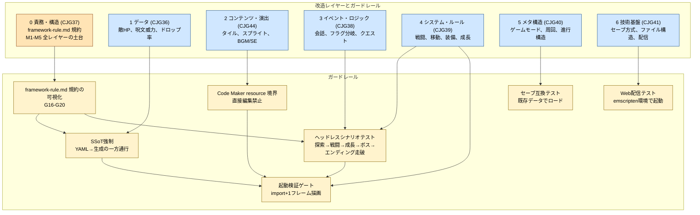

# プロダクト要求: Guardrails（AI改造のガードレール）

- 対象カスタマージャーニー: CJ35-CJ37, CJ38-CJ42（責務構造は CJ37、コンテンツ境界は CJ23/CJ24 の派生）
- 根拠: [`customer-journeys.md`](./customer-journeys.md)
- 規約根拠: [`framework-rule.md`](./framework-rule.md)（MVP 規約 M1〜M5）
- 設計経緯: `steering/done/20260412-guardrails-*.md` シリーズ（SSoT・hook・headless・pyxres・save-compat）、および `steering/20260424-town-framework-rule-align.md` と `steering/20260424-guardrails-prd-framework-rule-sync.md`
- 方針: AIの改造を「何も触れない」ではなく、「壊れたら子どもに届かない」で守る
- 読み方: `Feature` は何を約束するか, `Rule` は何を壊してはいけないか, `Scenario` はどう確かめるか
- 実装状況の読み方: `実装済み` は現行コードとテストで確認できる, `部分実装` はコアはあるが文中の約束を全部は満たしていない, `未実装` は目標, `時間目標` は現状の目標値であり自動保証ではない

---

## 現状と目標状態

この文書は **目標状態の約束** を表す。いまの実装との差は隠さず表にし、どこをこれから寄せるかを明確にする。

| 要素 | 現状 | 目標状態 |
|---|---|---|
| データ定義 | `assets/*.yaml` が SSoT として成立しつつあるが、ゲームバランスの一部は `src/runtime/main_runtime.py` 内の定数や `src/game_data.py` に残る | `assets/*.yaml`（SSoT）→ `tools/gen_*.py` → `src/generated/*.py` の一方通行 |
| ローダ | runtime は `src/runtime/{main_runtime.py, app.py}` に集約され、`src/shared/services/` に `image_banks / audio_system / save_store / world_generation / dialog_runner` 等のサービスが抽出済み | `src/shared/services/` と `src/generated/` の役割を固定し、直接 import を hook で制限 |
| 責務分離 | `src/scenes/<scene>/{model,presenter,view,scene}.py` の 4 〜 5 ファイル階層で MVP 分離を進行中。`town/` は 2026-04 時点で分解完了（`model / presenter / view / view_model / scene`）。`battle / explore / title` 他は段階移行中 | framework-rule.md M1〜M5 に沿って全 scene を分離。scene.py は薄い配線のみ |
| プレイヤー状態 | `src/shared/state/player_model.py` に `PlayerModel` dataclass が導入済み。全 scene が PlayerModel 経由でアクセス（2026-04-24）。旧 `player` dict は `src/shared/services/player_state.py` の互換 shim 内にのみ残る | `player_state.py` shim を削除し、`PlayerModel` のみが player 状態の正本 |
| Hook | 一部のみ、または未設定 | `.claude/settings.json` に PreToolUse / PostToolUse hook を設定 |
| ヘッドレステスト | `python -m pytest test/ -q` で 230 超のテストが通る。Code Maker / Web ビルド周りの smoke は部分実装 | `make build` 内でヘッドレス起動＋主要シナリオ実行 |
| 整合チェック | runtime の自己修復と build の責務が混在している | 人が Code Maker で編集した resource を build / packaging / compatibility test で守る |
| テスト用セーブデータ | 十分に固定されていない | ビルドパイプラインが保持し互換テストに使う |

**移行方針**: 一気に作り替えない。新規データは SSoT に入れる。既存の直書きは段階的に移す。責務分離は scene 単位で段階的に進める。

---

## AIの能力境界

この表は、「AIにできること」と「人が Code Maker でやること」の境界を、親子に誤解なく伝えるためのもの。

| 改造 | AIにできるか | 理由 | 代替手段 |
|---|---|---|---|
| マップの地形変更 | **できない** | タイル配置は `.pyxres` の tilemap に焼かれている | Pyxel Code Maker の Tilemap / Resource Editor で人が編集 |
| スプライト・グラフィック変更 | **できない** | ピクセルデータは `.pyxres` のイメージバンクに格納 | Pyxel Code Maker の Image エディタで描画 |
| BGM・SE の実体変更 | **直接はできない** | 音の中身は子どもが Code Maker で決める。AI は import/build まではできるが、作曲や打ち込みの主体ではない | Pyxel Code Maker の Sound/Music エディタで作り、AI は import/build で本編へ反映 |
| タイルの通行可否ルール変更 | **できる** | コード上の `PASSABLE_TILES` 等で制御 | — |
| 敵・アイテム・呪文のパラメータ変更 | **できる** | YAML / Python データで定義 | — |
| セリフ・テキスト変更 | **できる** | `assets/dialogue.yaml` またはデータ定義 | — |
| 戦闘・移動等のロジック変更 | **できる** | `src/scenes/<scene>/{model,presenter}.py` / `src/shared/services/*.py` のコード | — |
| イベント・フラグ・会話分岐の追加 | **できる** | コードとデータで表現できる | — |

この境界では、「AIが無理なことを無理にやって壊す」のではなく、「できないなら正しい編集面へ案内する」を約束する。

```gherkin
Feature: AIの能力境界を子どもと親に正直に伝える
  AIにできない改造を無理にコードで触ると
  子どもが編集しているつもりの場所と
  本当に変わる場所がずれてしまう
```

```gherkin
Rule: AIにできない改造は代替手段へ案内する
  できないことを隠して壊した版を出すより、正しい編集面へ案内する方が価値を守る

  Scenario: AIが「できないこと」を頼まれたら代替手段を案内する
    Given 子どもが「敵の絵を変えて」と依頼した
    When 親がAIに伝える
    Then AIは「スプライトの変更は Code Maker の Image エディタで行います」と案内する
    And 必要なら参照するバンク番号や座標も提示する
    And `.pyxres` を直接編集しようとしない
```

---

## 改造レイヤーの分類

AI改造を 7 つの層に分ける。何を守るかを先に分けることで、「どのガードレールが何を担当するか」を迷わなくする。

| 層 | カスタマージャーニーgherkin | 改造対象 | リスクの性質 |
|---|---|---|---|
| **0. 責務・構造** | **CJG37** | Model/Presenter/View/Service/Scene の責務境界、共有状態の置き場所 | 責務が曖昧なコードに AI が触れると、直すたびに別のところが壊れる |
| 1. データ | CJG36 | パラメータ（敵HP、呪文威力、ドロップ率等） | 散在する定数の不整合 |
| 2. コンテンツ・演出 | CJG44 | タイル、スプライト、BGM、SE | 人の編集面と code / packaging のずれ |
| 3. イベント・ロジック | CJG38 | 会話、フラグ分岐、クエスト | 既存フラグとの衝突 |
| 4. システム・ルール | CJG39 | 戦闘、移動、装備、成長 | モノリス内の連鎖破壊 |
| 5. メタ構造 | CJG40 | ゲームモード、進行構造、周回 | セーブ互換崩壊 |
| 6. 技術基盤 | CJG41 | セーブ方式、ファイル構造、配信 | 配信パイプライン破壊 |



---

## CJG35: 起動検証ゲート（全レイヤー共通）

この `CJG35` では、「起動しない版は子どもに一度も見せない」を約束する。

実装状況:
- `部分実装`: pytest と個別テスト、Code Maker ビルド、Web ビルドのテストはある
- `未実装`: `make build` が常にヘッドレス主要シナリオと承認キュー除外まで一気に担う構成にはまだなっていない

```gherkin
Feature: CJG35 起動しない版は承認キューに出さない
  好循環を守るには
  構文エラーや import エラーや即死する版を
  子どもの画面へ届く前に止めなければならない
```

```gherkin
Rule: import や初期化で落ちる版はそこで止める
  最初の1秒で壊れる版を見せると、子どもの集中が切れてしまう

  Background:
    Given ビルドパイプラインは `make build` から実行される
    And パイプラインはヘッドレス起動テストを必須ステップとして持つ
    And ヘッドレス起動テストは import から初期化と1フレーム目までを確認する

  Scenario: importエラーを起こす版は選択ページに出ない
    Given AIが `src/scenes/<scene>/*.py` または `src/shared/services/*.py` を編集した
    And その編集で NameError または AttributeError または ImportError が発生する
    When `make build` を実行する
    Then ヘッドレス起動テストが失敗する
    And ビルドは非0で終了する
    And 壊れた版は選択ページに出現しない
    And 親のターミナルにファイル名と行番号を含むエラー要約が表示される
```

```gherkin
Rule: 起動はしても主要操作ですぐ死ぬ版は止める
  タイトルだけ出て次の操作で落ちる版も、子どもには壊れた版である

  Scenario: 主要シナリオのいずれかが即死する版は選択ページに出ない
    Given AIが任意のレイヤーを修正した
    When `make build` を実行する
    Then 「移動」「戦闘に入る」「1ターン行動する」「セーブする」の4つのヘッドレスシナリオが実行される
    And いずれか1つでも例外または無限ループで失敗した場合、ビルドは失敗する
    And 失敗したシナリオ名が親に返される
```

```gherkin
Rule: 壊れた版は承認キューから除外する
  失敗した版を「あとで見ればいい」と残すと、子どもに届く危険が残る

  Scenario: 壊れた版を承認キューから明示的に除外する
    Given 2版ビルドのうち片方のヘッドレステストが失敗した
    When 承認キュー生成ステップが実行される
    Then 通過した版だけが選択ページに並ぶ
    And 失敗した版の位置には動かなかったことが分かる表示が出る
    And 子どもは動かない画面を一度も見ない
```

---

## CJG36: データレベルの改造（パラメータ調整系）

この `CJG36` では、「数値を変えても、参照漏れや散らばった定数で壊れない」を約束する。

実装状況:
- `部分実装`: enemies / spells / dialogue などの YAML と generated モジュールはある
- `部分実装`: 既存コードには still inline data も残る
- `未実装`: 文中の hook や lint が常に全ての参照漏れを止める状態ではない

**改造対象**
- 敵ステータス（HP、攻撃力、防御力、素早さ、経験値、ドロップ）
- アイテム効果（回復量、価格、レアリティ）
- 呪文・スキル（消費MP、威力、命中率、状態異常付与率）
- 成長テーブル（必要経験値、習得レベル、上昇量）

```gherkin
Feature: CJG36 データ定義は SSoT に集約し散在による不整合を防ぐ
  パラメータが複数箇所に散ると
  AIが1か所だけ更新して別の参照を見落としやすい
  だから1つの元データから生成して一貫性を守る
```

```gherkin
Rule: 新しいデータは1つの元から全参照へ広がる
  同じ意味の情報を何か所も手で足す設計は、AI改造と相性が悪い

  Background:
    Given 新規に追加するデータは必ず assets/*.yaml に定義する
    And SSoT から src/generated/*.py への変換は tools/gen_*.py が行う

  Scenario: 新しい敵を SSoT に追加すると全参照が自動更新される
    Given AIが assets/enemies.yaml に新しい敵を追加した
    When 自動生成が実行される
    Then 生成物が再生成される
    And 敵一覧、出現テーブル、ドロップ参照が一貫した状態になる
```

```gherkin
Rule: 生成物の手編集は入口で止める
  生成物を直接直すと、次の生成で消えたり整合が崩れたりする

  Scenario: 生成ファイルの直接編集を hook でブロックする
    Given PreToolUse hook が設定されている
    When AIが `src/generated/*.py` を直接編集しようとする
    Then ツール実行は拒否される
    And AIには「元データを編集して再生成する」案内が返る
```

```gherkin
Rule: SSoT を変えたら整合チェックまで走る
  追加はできても、参照漏れや重複をそのまま通してはいけない

  Scenario: SSoT編集後に整合チェックが走る
    Given AIが assets/spells.yaml に新しい呪文を追加した
    When 自動生成の後に整合チェックが実行される
    Then 呪文IDの重複、習得レベルの欠落、参照先の存在が検証される
    And 不整合がある場合はAIにエラー要約が返る
```

---

## CJG37: 責務が曖昧で直すほど別の所が壊れる（framework-rule.md 規約）

この `CJG37` では、**AI が規約に求められていることとその理由を、PRD と framework-rule.md を読むだけで把握できる状態** を約束する。customer-journeys の `CJ37: 責務が曖昧で直すほど別の所が壊れる`（L1013）に対応。

`docs/framework-rule.md` は **M1〜M5 の 5 つのメタルール** に再編成されている（2026-04-24）。PRD 側は各メタを **親 Rule** として並べ、詳細は framework-rule.md の該当節にリンクで飛ばす（二重管理を避ける）。

実装状況:
- `部分実装`: `docs/framework-rule.md` は M1〜M5 構造に再編済み。`src/scenes/town/`（model/presenter/view/view_model/scene）と `src/shared/state/player_model.py` は M1〜M4 に準拠
- `部分実装`: `battle / explore / title / menu / settings / professor / ending` 等の他 scene は PlayerModel 経由への移行完了、MVP 分離は段階継続中
- `未実装`: M1〜M5 違反を検出する lint / hook / pytest 規約テストは未整備

```gherkin
Feature: CJG37 AI が層規約を読み取って守れる
  責務の書き換え時に AI が
  何を守るべきか と なぜ守るべきか と
  どう検証するか を1か所で読める状態でないと
  直すたびに別のところが壊れる
```

### Rule M1: Pyxel API と入力は View と最外殻の 1 か所に閉じる

`docs/framework-rule.md` M1 参照（`M1-1` Pyxel API / `M1-2` 入力規約 / `M1-3` View の描画範囲）。

**Why**: Pyxel 呼び出しが散ると、テスト時に差し替えが効かず Model がヘッドレスで動かせなくなる。入力取得が散ると、再現性とテスト性が一気に落ちる。

```gherkin
Rule: Pyxel API 直呼びは View と最外殻のみ、入力は InputStateTracker 経由で 1 か所

  Scenario: View 以外での pyxel.* が grep で見つからない
    Given 改修後の src/
    When `grep -nE 'pyxel\.' src/scenes/*/model.py src/scenes/*/presenter.py src/shared/state/*.py src/shared/services/*.py` を実行する
    Then マッチ行が 0 件（`audio_system / save_store / image_banks` など Pyxel 依存ラッパは M1 の例外としてサービス分類表に明示）

  Scenario: Presenter が InputStateTracker 経由でしか入力を取らない
    Given 改修後の Presenter
    When `grep -nE 'pyxel\.btn[p]?' src/scenes/*/presenter.py` を実行する
    Then マッチ 0 件
    And 入力は `game.input_state.btnp(...)` 経由のみ

  Scenario: View / Model が入力を見ない
    Given 改修後の View / Model
    When `grep -nE 'pyxel\.(btn|btnp)|input_state\.' src/scenes/*/view.py src/scenes/*/model.py src/shared/state/*.py` を実行する
    Then マッチ 0 件
```

### Rule M2: View は ViewModel しか見ない

`docs/framework-rule.md` M2 参照（`M2-1` View 責務 / `M2-2` ViewModel / RenderData 規約）。

**Why**: View が Model に直接触ると、やがて「賢いテンプレート」に退化し、見た目修正のつもりで判断ロジックも直す羽目になる。解釈は Presenter で済ませて、View は愚直な描画機械に留める。

```gherkin
Rule: View は ViewModel / RenderData を受け取り、解釈済みの値で描く

  Scenario: View 関数が *ViewModel を引数に取る
    Given 改修後の TownView / BattleView / MenuView 等
    When view.py の render* 関数シグネチャを読む
    Then 引数は `vm: *ViewModel` のみ（Model や GameState を直接受け取らない）

  Scenario: ViewModel に解釈前フィールドが含まれない
    Given 改修後の ViewModel dataclass
    When `grep -nE '(is_|_ratio)\s*:' src/scenes/*/view_model.py` を実行する
    Then is_poisoned / enemy_hp_ratio 等の解釈前フィールドが 0 件
    And 代わりに status_icons / hp_gauge_width 等の「描画すれば済む」値が定義されている
```

### Rule M3: Presenter は入力解釈・Scene 遷移・副作用指揮のみ

`docs/framework-rule.md` M3 参照（`M3-1` Presenter 責務 / `M3-2` Scene 規約 / `M3-3` コマンド規約）。

**Why**: Presenter は太りやすい。MVP が崩れる最大原因は Presenter 肥大。描画も長大なゲームルールも持たせず、副作用は command として返して上位で実行する形に寄せる。

```gherkin
Rule: Presenter は直接描画せず、Scene 遷移は Presenter のみが決める

  Scenario: Presenter に pyxel 描画呼び出しがない
    Given 改修後の Presenter
    When `grep -nE 'pyxel\.(text|rect|rectb|blt|bltm|cls|line|circ)' src/scenes/*/presenter.py` を実行する
    Then マッチ 0 件

  Scenario: Scene 遷移の代入が Presenter 経由のみ
    Given 改修後の src/
    When `grep -nE '(game|game_state)\.state\s*=' src/` を実行する
    Then Presenter 配下（src/scenes/*/presenter.py, src/scenes/*/scene.py の薄い配線）以外で 0 件

  Scenario: Scene は入れ物として薄く保たれる
    Given 改修後の src/scenes/<scene>/scene.py
    When `wc -l src/scenes/*/scene.py` を実行する
    Then 各 scene.py が概ね 50 行以下の配線（本プロジェクトでは Presenter が update/draw を兼ねるところまで縮退してよい）
```

### Rule M4: Model は dataclass 中心、共有状態は明示する

`docs/framework-rule.md` M4 参照（`M4-1` Model 責務 / `M4-2` Service 分類 / `M4-3` GameState 規約 / `M4-4` PlayerModel と GameState 圧縮）。

**Why**: 「なんとなく便利な dict」と「他 scene の内部のぞき込み」が、改修時のデグレ源として最大。`@dataclass` による型・補完・テストと、`GameState` による明示的な共有境界があって初めて AI が参照範囲を追える。

```gherkin
Rule: player は PlayerModel 経由、scene 間の情報受け渡しは GameState / 引数 / Command 経由

  Scenario: player dict 参照が存在しない
    Given 改修後の src/
    When `grep -rnE 'player\[["\x27]|\.player\.get\(' src/` を実行する
    Then 互換 shim（src/shared/services/player_state.py）以外で 0 件

  Scenario: PlayerModel が存在し、ルールを持つ
    Given 改修後の src/shared/state/player_model.py
    When PlayerModel の public method を確認する
    Then apply_damage / heal / stay_at_inn / buy_weapon / buy_armor / buy_item / use_item / gain_exp / advance_npc_talk_idx / to_snapshot / from_snapshot / new_game が揃う

  Scenario: Model が Scene を知らない
    Given 改修後の src/scenes/*/model.py, src/shared/state/*.py
    When `grep -nE '_scene\.(model|_)|game\.state\s*=|import pyxel' src/scenes/*/model.py src/shared/state/*.py` を実行する
    Then マッチ 0 件

  Scenario: scene 間の内部のぞき込みがない
    Given 改修後の src/scenes/
    When `grep -rnE '[a-z_]+_scene\.(model|_[a-z])' src/scenes/` を実行する
    Then 各 scene は自分の *_scene 参照のみ（他 scene の内部を直接読んでいない）

  Scenario: GameState.current_town が shop→town 窓口になっている
    Given 改修後の shop/scene.py
    When `grep -nE '_current_town_index|town_menu_pos' src/` を実行する
    Then マッチ 0 件
    And `game.current_town.index` / `game.current_town.pos` 経由で受け取っている
```

### Rule M5: 層規約は AI が自力で検証できる形で可視化する

`docs/framework-rule.md` M5 参照（`M5-1` 命名規約 / `M5-2` テスト規約 / `M5-3` AI 向けガードレール文面）。

**Why**: 規約は書いただけでは機能しない。AI が次の改修で自然に見つけられる場所に置き、検証コマンドまで書いて初めて、層規約が実際に守られる。

```gherkin
Rule: 命名規約・テスト優先順位・AI ガードレール文面を可視化する

  Scenario: Scene 配下のファイル名が固定
    Given 改修後の src/scenes/
    When `find src/scenes -maxdepth 2 -type f -name '*.py' ! -name '__init__.py'` を実行する
    Then ファイル名は model.py / presenter.py / view.py / view_model.py / scene.py のいずれか
    And Scene 名 prefix フラット配置（battle_model.py 等）は 0 件

  Scenario: Model / Presenter の単体テストがある（または `未実装` 宣言）
    Given 改修後の test/
    When `ls test/test_*_model.py test/test_*_presenter.py` を確認する
    Then 少なくとも `test/test_player_model.py` が存在し、32 テスト以上が green
    And 他 scene の Model / Presenter テストは未実装として note に記録される

  Scenario: fragile テストが追加されていない
    Given 改修後の test/
    Then Pyxel 描画結果に強く依存するテスト、フレーム数依存、private 状態確認テストの新規追加がない
```

### PlayerModel / GameState 圧縮の方針（M4-4）

- `PlayerModel`（dataclass）が player 状態の正本。`@dataclass class PlayerModel` に `hp / mp / gold / weapon / armor / items / poisoned / ...` を持ち、ルール（`apply_damage / stay_at_inn / buy_* / use_item / gain_exp`）を自ら持つ
- `item_use.py` は薄い委譲に縮退し、`player_state.py` は段階的に削除予定の shim（既存テスト互換のみ）
- `GameState` は保存価値のあるもの（`player_model / ProgressFlags / world_map / dungeon_map / last_town_pos / world_return_*`）に圧縮予定
- `cam_x/cam_y` は `ExploreModel` / `state/prev_state` は `SceneManager` / `debug_mode` は `DebugService` に移すのが目標（framework-rule.md 付録 B 参照）
- 詳細は `framework-rule.md` M4-4「PlayerModel と GameState 圧縮」の 3 Level 戦略

---

## CJG38: イベント・ロジックレベルの改造

この `CJG38` では、「会話やイベントを足しても、既存の冒険の流れが途中で止まらない」を約束する。

実装状況:
- `部分実装`: dialogue 整合性テストや landmark / boss 系イベントの個別テストはある
- `未実装`: 汎用のフラグ重複 lint や主要シナリオ走破テストはまだ目標

**改造対象**
- マップイベント（会話、宝箱、ワープ）
- フラグ・スイッチによる条件分岐
- クエスト・ミッション
- シナリオ分岐・マルチエンド
- 特殊ギミック

```gherkin
Feature: CJG38 イベント追加が既存シナリオを壊さない
  新しいイベントや分岐を足しても
  既存の冒険が途中で詰んだり
  以前の会話が壊れたりしてはいけない
```

```gherkin
Rule: 主要な進行パスは最後までつながる
  新イベントが面白くても、既存の物語が止まったら子どもは最後まで遊べない

  Background:
    Given ヘッドレスシナリオテストが主要な進行パスを走破する

  Scenario: 新規イベント追加後に主要シナリオが走破できる
    Given AIが新しい会話イベントを追加した
    When ヘッドレスシナリオテストが実行される
    Then 「探索→通常戦闘→経験値獲得→成長確認→ボス撃破→エンディング」の主要パスが例外なく走破される
    And 新規イベントの追加で既存パスがブロックされていないことが確認される
```

```gherkin
Rule: フラグは他のイベントとぶつからない
  同じ名前のフラグが別の意味で使われると、AIにも人にも原因が追えなくなる

  Scenario: フラグ名の重複を検出する
    Given AIが新しいイベントフラグを定義した
    And 同名のフラグが既に別の用途で使われている
    When lint チェックが走る
    Then 重複が警告される
    And AIに一意なフラグ名への変更が促される
```

```gherkin
Rule: 会話の変更は会話データから行う
  イベント側にセリフを直書きし始めると、会話の正本が崩れていく

  Scenario: セリフ変更は SSoT 経由で行う
    Given セリフデータは `assets/dialogue.yaml` などの正本に定義されている
    When AIがセリフを変更する
    Then 会話データ側を編集する
    And 生成や整合チェックが走る
```

---

## CJG39: システム・ルールレベルの改造

この `CJG39` では、「戦闘、移動、メニューの骨格を変えても、RPGとして普通に遊び続けられる」を約束する。

実装状況:
- `部分実装`: 戦闘逃走、呪文、被ダメージ VFX、移動関連の個別テストはある
- `未実装`: 文書のような包括的ヘッドレスシナリオセットはまだ build に統合されていない

**改造対象**
- 戦闘システム（ターン制御、行動順、属性相性）
- 移動・探索（エンカウント、ダッシュ、地形効果）
- アイテム・装備・成長
- UI / 操作

```gherkin
Feature: CJG39 システム変更が連鎖破壊を起こさない
  ゲームの骨格を変える改造は影響範囲が広い
  だから一部だけ直って他が静かに壊れる状態を
  テストで先に止めなければならない
```

```gherkin
Rule: 戦闘を変えても戦闘の1周が完走する
  行動順や逃走や勝敗判定が途中で止まると、RPGの中心が壊れる

  Background:
    Given 戦闘ロジックは `src/scenes/battle/` に集約される（M3-1 / M4-1）

  Scenario: 戦闘ロジック変更後に戦闘シナリオが完走する
    Given AIが `src/scenes/battle/presenter.py` の行動順ロジックを変更した
    When ヘッドレス戦闘シナリオが実行される
    Then 「戦闘開始→プレイヤー行動→敵行動→ターン終了→勝利または敗北」が例外なく完走する
    And 無限ループはタイムアウトで失敗として検出される

  Scenario: 逃走失敗後も戦闘ターンが継続する
    Given AIが逃走ロジックまたは行動順ロジックを変更した
    When ヘッドレス戦闘シナリオで逃走に失敗する
    Then 敵ターンが正常に実行される
    And 次のターンへ進行できる
```

```gherkin
Rule: 移動や遭遇の変更で別の戦闘経路を壊さない
  通常戦闘とイベント戦闘が混ざると、子どもは何が起きたか理解しにくい

  Scenario: イベント専用の敵は通常エンカウントに混ざらない
    Given 一部の敵はイベント専用フラグを持つ
    When 通常エンカウント候補を組み立てる
    Then イベント専用の敵は候補に含まれない
    And 専用イベントから始まる戦闘経路は維持される

  Scenario: 移動ロジック変更後に移動シナリオが完走する
    Given AIが `src/scenes/explore/presenter.py` の移動や衝突判定を変更した
    When ヘッドレス移動シナリオが実行される
    Then 「フィールド移動→壁衝突→通行可能タイル通過→マップ遷移」が例外なく完走する
```

```gherkin
Rule: UI を変えても基本操作は迷子にならない
  メニューが開かない、閉じられない、戻れない、は子どもにとって大きな破綻である

  Scenario: UI変更後にメニュー操作が完走する
    Given AIが `src/scenes/menu/` のレイアウトや操作を変更した
    When ヘッドレスシナリオでメニューを開閉する
    Then アイテム、装備、ステータスへ遷移できる
    And メニューを閉じてフィールドへ戻れる
```

---

## CJG40: メタ構造・ゲームモードレベルの改造

この `CJG40` では、「大きな遊び方を変えても、子どものセーブデータが消えない」を約束する。

実装状況:
- `実装済み`: `PlayerModel.to_snapshot / from_snapshot` でセーブ互換を保ったまま state を再構成できる（2026-04-24）。互換テストは `test/test_player_model.py` と `test/test_player_snapshot.py`
- `部分実装`: `src/shared/services/save_store.py` / `src/shared/services/player_state.py` shim、セーブ互換テスト用スクリプトはある
- `未実装`: 承認キューから自動で除外するところまで統合された gate はまだ目標

**改造対象**
- ニューゲーム+
- タイムアタック、スコアアタック
- 面クリア型やローグライク化
- 周回プレイ設計

```gherkin
Feature: CJG40 大規模構造変更が既存セーブデータを破壊しない
  ゲームモード追加や進行構造の変更をしても
  子どものこれまでの冒険が
  読めなくなったり消えたりしてはいけない
```

```gherkin
Rule: 既存セーブは新版でも読める
  新モードが面白くても、前のデータが使えなければ信頼を失う

  Background:
    Given セーブデータは `PlayerModel.to_snapshot(town_pos)` で dict 化され、`PlayerModel.from_snapshot(snapshot)` で復元される（M4-4）
    And `src/shared/state/player_model.py` の `SAVED_FIELDS` に保存対象を明示
    And ビルドパイプラインはテスト用セーブデータを持つ

  Scenario: 既存セーブデータで新版がロードできる
    Given AIがゲームの進行構造を変更した
    When ビルド時にテスト用セーブデータのロードテストが実行される
    Then 既存セーブデータが例外なくロードできる
    And ロード後にゲームが正常に動作する
```

```gherkin
Rule: セーブ構造を変えたら互換性チェックが必要だと分かる
  スキーマ変更を黙って通すと、後から壊れた理由が追えない

  Scenario: セーブデータのスキーマ変更を検出する
    Given AIが `PlayerModel` のフィールドを追加、削除、改名した
    When lint または hook が走る
    Then 互換性確認が必要だと警告される
    And テスト用セーブデータでのロードテストが促される
```

```gherkin
Rule: 互換性のない版は子どもに出さない
  セーブが読めない版を承認キューに出すと、子どもの冒険を壊す

  Scenario: 互換性のない変更は承認キューに出さない
    Given テスト用セーブデータのロードテストが失敗した
    When 承認キュー生成ステップが実行される
    Then その版は選択ページに出ない
    And 親には既存セーブ互換がないと通知される
```

---

## CJG41: 技術基盤・運用レベルの改造

この `CJG41` では、「ローカルでは動くのに Web では壊れる、Code Maker では開けない、を防ぐ」を約束する。

実装状況:
- `部分実装`: Web build テスト、`emscripten` ガード、Code Maker zip テスト、wrapper の session logging はある
- `未実装`: 公開運用まで一体で保証する総合 gate はまだ目標

**改造対象**
- セーブ/ロード方式
- Web版 / ネイティブ版の差異対応
- データ構造・ファイル構造の変更
- パフォーマンス最適化
- Mod / プラグイン対応

```gherkin
Feature: CJG41 技術基盤の変更が配信経路を壊さない
  ローカルだけで動く変更では足りない
  Web配信と Code Maker という実際の使われ方まで
  通して守らなければならない
```

```gherkin
Rule: Web版でも保存と読み込みができる
  ローカルでだけ動く保存方式は、共有した瞬間に壊れる

  Background:
    Given ゲームは Web とネイティブの両方で動作する
    And Web版は iframe 内で全画面表示される

  Scenario: Web版でのセーブとロードが動作する
    Given AIがセーブ/ロードの実装を変更した
    When ビルド時に Web 版テストが実行される
    Then emscripten 環境でセーブとロードが正常に動作する
    And ローカルファイルシステム専用の処理に依存しない

  Scenario: sys.platform 分岐が正しく動作する
    Given AIが platform 依存コードを追加した
    When Web版とネイティブ版の両方でテストする
    Then それぞれの分岐が正常に動作する
```

```gherkin
Rule: 新しいファイルは Web 配布物に必ず乗る
  ローカルにはあるが公開版にはない、を作ってはいけない

  Scenario: 新しい外部ファイルが Web ビルドに含まれる
    Given AIが新しい JSON や CSV などのデータファイルを追加した
    When Web ビルドステップが実行される
    Then `tools/build_web_release.py` の配布対象に新ファイルが含まれる
    And 含まれていない場合は警告または失敗で分かる
```

```gherkin
Rule: Code Maker 互換はビルド時点で守る
  開発版を持ち出しても開けない、Run できない、では編集体験が壊れる

  Scenario: Code Maker との互換性を維持する
    Given AIがエントリポイントや初期化順序を変更した
    When Code Maker 用ビルドが実行される
    Then `production/code-maker.zip` 内の `main.py` が正常に起動する
    And Code Maker で Run した場合にゲームが動作する

  Scenario: Code Maker 教材版のコア領域が壊れていたら開始前に止める
    Given Code Maker 用教材版の `main.py` のコア領域が改変されている
    When Code Maker で Run する
    Then ゲーム本編は開始しない
    And コアが変わっていることを知らせる案内が表示される
```

---

## CJG44: リソース境界（スプライト・サウンド authoring）

この `CJG44` では、「見た目や音の実体は人が Code Maker で修正し、AI / Codex はその境界を破らない」を約束する。`customer-journeys.md` の `CJ23: スプライトを自分で描く`（L253）と `CJ24: 効果音を自分で作る`（L276）から派生するガードレール。

実装状況:
- `実装済み`: `.pyxres` の直接編集禁止 hook と Code Maker 互換ビルドはある
- `部分実装`: `production/code-maker.zip` / `development/code-maker.zip` に resource を含めて配る流れはあるが、freshness と E2E 保証はまだ薄い
- `未実装`: runtime が resource を勝手に更新しないこと、build が stale resource を必ず止めることの固定はまだ目標
- `未実装`: `AudioManager` / `SfxSystem` が imported `Sound / Music` を固定データで上書きしないことはまだ固定できていない

**改造対象**
- タイル配置・地形、隠し通路
- キャラチップ、敵グラフィック、エフェクトスプライト
- BGM 差し替え、SE・ME
- UI アイコン、カーソル

**制約**
- `.pyxres` はバイナリであり、AI / Codex が直接編集しない
- グラフィック・サウンドの実体変更は人が Pyxel Code Maker 経由で行う
- `Sound / Music` は authoring 後に code 側 audio asset へ取り込まれてから runtime で使う

```gherkin
Feature: CJG44 リソースの実体は人が Code Maker で修正する
  見た目や音の中身まで AI / Codex が直接触ると
  子どもが使う編集面と内部実装の境界が壊れる
  だから AI / Codex は authoring を奪わず、code / import / build / packaging / verify に責務を絞る
```

```gherkin
Rule: `.pyxres` の中身は人が正しい編集面で触る
  AI / Codex が直接バイナリを触ると、壊した理由も直し方も分かりにくくなる

  Background:
    Given blockquest.pyxres はイメージバンクとサウンドバンクを含む
    And 実体変更は Code Maker で行う

  Scenario: `.pyxres` の直接編集を hook でブロックする
    Given PreToolUse hook が設定されている
    When AIが `.pyxres` を編集しようとする
    Then ツール実行は拒否される
    And AIには Code Maker 経由で編集する案内が返る
```

```gherkin
Rule: build は人が編集した resource をそのまま届ける
  Code Maker で作った見た目や音が配布時に別物へ変わると、子どもは何を直したか分からなくなる

  Scenario: Code Maker 用 zip には人が編集した resource が入る
    Given 人が Code Maker で `.pyxres` を編集した
    When Code Maker 用 zip を build する
    Then zip には人が最後に編集した resource が含まれる
    And AI / Codex が resource 実体を勝手に描き替えない

  Scenario: stale な resource を現在の版として配らない
    Given code 側または packaging 側が更新された
    And Code Maker 用 resource が現在の版と一致していない
    When build または関連テストを実行する
    Then stale な resource は検知される
    And 人が修正した current / development resource と一致しない配布物は止める
```

```gherkin
Rule: Sound / Music は import 後に hardcoded audio で上書きしない
  Code Maker で音を作っても runtime が固定メロディや固定 SE を流すなら、編集面が真実でなくなる

  Scenario: imported Sound / Music が runtime audio の正本になる
    Given 人が Code Maker の Sound / Music エディタで音を編集した
    And selector import がその内容を code 側 audio asset に取り込んだ
    When runtime が audio を初期化する
    Then `AudioManager` / `SfxSystem` は imported 音データを使う
    And 固定の `CHIPTUNE_TRACKS` / `SFX_DEFINITIONS` で上書きしない
```

```gherkin
Rule: runtime は人の resource を勝手に別物へ更新しない
  起動しただけで resource が書き換わると、どれが人の編集結果か分からなくなる

  Scenario: desktop 実行だけで `.pyxres` を勝手に更新しない
    Given 人が Code Maker で編集した `.pyxres` がある
    When desktop でゲームを起動する
    Then runtime はその `.pyxres` を勝手に別内容へ保存しない
    And 必要な不一致は build / test で検知する
```

```gherkin
Rule: 画像や音の参照先に競合を作らない
  バンク番号や初期化順序が壊れると、見た目や音は人が正しく編集していても破綻する

  Scenario: イメージバンク番号の競合を検出する
    Given イメージバンクの用途が固定されている
    When AIが誤ったバンク番号を使うコードを書く
    Then lint または整合チェックが不正な参照を警告する

  Scenario: サウンド初期化責務の破綻を検出する
    Given AIがサウンド初期化の順序や import 経路を変更した
    When ビルドテストが実行される
    Then imported `Sound / Music` が runtime で上書きされていないか検証される
    And 不正ならビルド失敗になる
```

---

## ガードレール一覧

この表は、「どのガードレールがどのレイヤーを守るか」を一目で確認するための索引である。

| # | ガードレール | 対象レイヤー | 実装手段 | 違反時の挙動 |
|---|---|---|---|---|
| **G16** | **M1 Pyxel API と入力の境界** | **CJG37 責務・構造** | `grep 'pyxel\.'` / `pyxel.btn[p]?` lint, InputStateTracker 経由強制 | 未実装 |
| **G17** | **M2 View は ViewModel 限定** | **CJG37 責務・構造** | View 関数シグネチャ型検査, ViewModel に解釈前フィールドが無い確認 | 未実装 |
| **G18** | **M3 Presenter 責務と副作用コマンド化** | **CJG37 責務・構造** | `game.state =` 発生点の grep, 副作用コマンド化の段階導入 | 未実装 |
| **G19** | **M4 Model dataclass と共有状態明示** | **CJG37 責務・構造** | `player\[` / `_scene.model.` の grep lint, dict 新規導入 PR レビュー, PlayerModel / GameState 圧縮チェック | 未実装 |
| **G20** | **M5 命名・テスト・AI ガードレール可視化** | **CJG37 責務・構造** | `src/scenes/<scene>/` 命名 find, Model / Presenter 単体テスト存在, AGENTS.md / ARCHITECTURE.md 取り込み | 未実装 |
| G1 | `src/generated/` 直接編集禁止 | CJG36 データ | PreToolUse hook + chmod 444 | ツール拒否＋再指示 |
| G2 | `*.pyxres` 直接編集禁止 | CJG44 コンテンツ | PreToolUse hook | ツール拒否 |
| G3 | SSoT編集後の自動 codegen + テスト | CJG36 データ | PostToolUse hook | 自動再生成 → pytest 実行、失敗時は停止 |
| G4 | Code Maker resource 互換 / freshness チェック | CJG44 コンテンツ | `make build` | stale resource や境界破りを失敗させる |
| G5 | イメージバンク番号の競合検出 | CJG44 コンテンツ | lint / build check | 警告または失敗 |
| G6 | サウンド初期化順序の検証 | CJG44 コンテンツ | `make build` | ビルド失敗 |
| G7 | フラグ名の重複検出 | CJG38 イベント | lint / hook | 警告＋一意名を促す |
| G8 | ヘッドレス起動テスト | CJG35 全レイヤー | `make build` | 承認キューから除外 |
| G9 | ヘッドレスシナリオテスト | CJG38-CJG39 | `make build` | 承認キューから除外 |
| G10 | セーブデータ互換テスト | CJG40 メタ構造 | `make build` | 承認キューから除外 |
| G11 | Web版テスト | CJG41 技術基盤 | `make build` | 承認キューから除外 |
| G12 | Code Maker 互換テスト | CJG41 技術基盤 | `make build` | ビルド失敗 |
| G13 | 生成物の手編集検出 | CJG36 データ | `make build` 内 diff | ビルド失敗 |
| G14 | 直接 import 禁止（ローダ経由強制） | CJG36 データ | hook + lint | ツール拒否 |
| G15 | テストコードによる挙動固定 | 全レイヤー | hook + pytest | テスト失敗で停止 |

---

## 防御層の全体像

Claude Code だけでなく、他の AI や人の手動編集でも守りが効くように、防御を重ねる。

| 層 | 仕組み | Claude Code | Codex | 人間 |
|---|---|---|---|---|
| 1. Claude Code hooks (PreToolUse) | ファイル編集をツールレベルでブロック | ✅ | ❌ | ❌ |
| 2. ファイル権限 (chmod 444) | `src/generated/*.py` を読み取り専用にして OS レベルで書き込み拒否 | ✅ | ✅ | ✅ |
| 3. AGENTS.md / ARCHITECTURE.md | SSoTルール・編集禁止ファイル・テスト必須・framework-rule.md M1〜M5 を明記 | ✅ | ✅ | — |
| 4. git pre-commit hook | `git commit` 時に pytest を自動実行し失敗ならブロック | ✅ | ✅ | ✅ |

---

## G15: テストコードによる挙動固定

この `G15` では、「正しいファイルを編集していても、壊れた挙動はテストで止める」を約束する。

実装状況:
- `実装済み`: `python -m pytest test/ -q` と関連 hook スクリプトが現行リポジトリにある（2026-04-24 時点で 230 超のテストが green）

```gherkin
Feature: G15 AIの改変で既存の挙動が壊れたらテストが検出する
  hook で防げるのは間違った入口だけである
  正しい入口からでも壊れることはある
  だから重要な挙動はテストで固定する
```

```gherkin
Rule: データ変更後はデータのつながりを確認する
  数値を変えただけでも、参照先の欠落や型崩れは起こりうる

  Background:
    Given ゲームの重要な挙動は pytest で固定されている

  Scenario: データ改変後にゲームデータの整合性が保たれている
    Given AIが敵や呪文やアイテムの元データを編集した
    When pytest が実行される
    Then 参照先の存在と読み込みが確認される
```

```gherkin
Rule: ロジック変更後は基本動作の破綻を検出する
  戦闘、移動、保存のどれかが壊れると、子どもは冒険を続けられない

  Scenario: ロジック改変後に戦闘と移動の基本挙動が維持されている
    Given AIが `src/scenes/battle/` や `src/scenes/explore/` のロジックを変更した
    When pytest が実行される
    Then ダメージ計算が期待どおり動く
    And 移動判定が期待どおり動く
    And セーブとロードの往復が成功する
```

```gherkin
Rule: 会話変更後は物語の構造を確認する
  セリフは表示されても、会話の枝が切れていたら体験は壊れる

  Scenario: セリフ改変後にダイアログ構造が壊れていない
    Given AIがセリフデータを変更した
    When pytest が実行される
    Then 必要なキーが存在する
    And 参照されるシーンやIDがすべて定義されている
```

```gherkin
Rule: テスト失敗時には次の修正に進めるだけの情報を返す
  ただ失敗しただけでは、AIも人も直しに進めない

  Scenario: テスト失敗時にAIに原因が伝わる
    Given AIの改変でテストが失敗した
    When pytest の出力がAIに返される
    Then 失敗したテスト名と期待値/実際値の差分が表示される
    And AIが修正すべき箇所を特定できる
```

---

## 複合改造シナリオ

実際の依頼は1つのレイヤーで終わらない。この節では、「層をまたぐときに何が連携して守るか」を具体例で固定する。

### パターン1: 「新しいボスを追加して」

| ステップ | レイヤー | AI | 人間(Code Maker) | ガードレール |
|---|---|---|---|---|
| 1. ボスのステータス定義 | CJG36 データ | assets/enemies.yaml に追加 | — | G1, G3 |
| 2. ボスのスプライト描画 | CJG44 コンテンツ | **できない** → 座標案内 | Image エディタで描画 | G2 |
| 3. ボス出現イベント | CJG38 イベント | `src/scenes/explore/presenter.py` 等にイベント追加 | — | G7, G9 |
| 4. ボス専用戦闘ロジック | CJG39 システム | `src/scenes/battle/presenter.py` に戦闘パターン追加 | — | G9 |
| 5. 層規約の遵守 | CJG37 責務・構造 | View 以外で pyxel を呼ばない、Model に副作用を持たせない | — | G16, G17, G18, G19 |
| 6. 起動確認 | CJG35 全体 | — | — | G8 |

```gherkin
Feature: 複合改造シナリオ 新しいボス
  ボス追加のような複数レイヤー改造でも
  どこか1つが抜けたせいで
  子どもに壊れた版が届いてはいけない
```

```gherkin
Rule: ステータス、見た目、イベント、戦闘、層規約がそろってはじめて通す
  どれか1つだけできても、子どもから見れば完成していない

  Scenario: 新ボス追加が全レイヤーを通過する
    Given 親が「洞窟の奥にボスを追加して」と依頼した
    When AIがステータスとイベントと戦闘ロジックを追加する
    And AIがスプライトは Code Maker で描くよう案内する
    And 人間が Code Maker でスプライトを描画する
    And AI が追加コードで framework-rule.md M1〜M5 を守っている
    And `make build` が実行される
    Then SSoT 整合チェックが通る
    And コンテンツ整合チェックが通る
    And 責務・構造 lint（G16-G20）が通る
    And シナリオテストでボス戦が完走する
    And 起動テストが通る
    And 承認キューにボス入りの版が並ぶ
```

### パターン2: 「新しい呪文を追加して」

| ステップ | レイヤー | AI | 人間(Code Maker) | ガードレール |
|---|---|---|---|---|
| 1. 呪文データ定義 | CJG36 データ | assets/spells.yaml に追加 | — | G1, G3 |
| 2. エフェクト演出 | CJG44 コンテンツ | コード上の色・パターンで表現 | 必要なら Image エディタ | G4 |
| 3. SE追加 | CJG44 コンテンツ | **できない** → スロット番号を案内 | Sound エディタで作成 | G2, G6 |
| 4. 習得条件・戦闘UI | CJG39 システム | `src/scenes/battle/` を更新 | — | G9 |
| 5. 層規約の遵守 | CJG37 責務・構造 | Model に計算、Presenter に遷移、View に描画 | — | G16, G17, G18, G19 |

```gherkin
Feature: 複合改造シナリオ 新しい呪文
  呪文追加はデータと演出と UI がそろって
  はじめて子どもに新しい技として伝わる
```

```gherkin
Rule: 呪文ID、習得条件、音や見た目の参照、層規約が一貫する
  どれかが抜けると「あるのに使えない」呪文になる

  Scenario: 新呪文追加がデータと演出とロジックと層規約の整合を保つ
    Given 親が「氷の呪文を追加して」と依頼した
    When AIが呪文データを追加し、戦闘UIと習得条件を更新する
    And AIが必要なら SE を Code Maker で作るよう案内する
    Then 呪文IDと習得レベルと戦闘UIの参照が一貫している
    And BattleModel に呪文効果が計算され、BattlePresenter が副作用を指揮する
    And ヘッドレス戦闘テストで新呪文を使っても例外が出ない
```

### パターン3: 「セリフを変えて、ついでにイベントも足して」

| ステップ | レイヤー | AI | 人間(Code Maker) | ガードレール |
|---|---|---|---|---|
| 1. セリフ変更 | CJG36 データ | 会話データを編集 | — | G1, G3 |
| 2. 新イベント追加 | CJG38 イベント | `src/scenes/explore/presenter.py` に分岐追加 | — | G7 |
| 3. イベント内でセリフ参照 | CJG36 + CJG38 | 生成されたセリフIDを参照 | — | G3, G9 |

```gherkin
Feature: 複合改造シナリオ セリフ変更とイベント追加
  会話とイベントを同時に変えても
  物語のつながりが切れてはいけない
```

```gherkin
Rule: 会話IDとイベント分岐の参照は両方通る
  片方だけ直ると、会話はあるのに呼べない、分岐はあるのに飛べない、が起きる

  Scenario: セリフ変更とイベント追加の整合性
    Given 親が「村長のセリフを変えて、新しい選択肢も追加して」と依頼した
    When AIが会話データを変更し、新規セリフを追加し、イベント分岐を足す
    Then 整合チェックで参照された会話IDが存在することが確認される
    And フラグ重複チェックで既存イベントと衝突しない
    And シナリオテストで進行不能にならない
```

### パターン4: 「敵を強くして、ドロップアイテムも変えて」

| ステップ | レイヤー | AI | 人間(Code Maker) | ガードレール |
|---|---|---|---|---|
| 1. 敵ステータス変更 | CJG36 データ | 敵データを編集 | — | G1, G3 |
| 2. ドロップアイテム変更 | CJG36 データ | アイテムと敵データを編集 | — | G3 |
| 3. バランス確認 | CJG36 データ | — | — | G9 |

```gherkin
Feature: 複合改造シナリオ 敵強化とドロップ変更
  強さと報酬を同時に変える時は
  倒せるかと報酬が正しく落ちるかを
  一緒に見なければならない
```

```gherkin
Rule: 報酬参照が壊れず、戦闘も成立する
  強くしただけ、落とすだけ、ではなく RPG として回ることが必要である

  Scenario: 敵パラメータとドロップの整合性
    Given 親が「スライムをもっと強くして、薬草を落とすようにして」と依頼した
    When AIが敵のステータスとドロップテーブルを更新する
    Then 整合チェックでドロップに指定したアイテムIDが存在することが検証される
    And 自動生成で敵データとドロップ参照が一貫して更新される
```

---

## 決定事項

1. 新規に追加するデータは必ず SSoT に入れる。既存の直書きは段階的に移行する。
2. `.pyxres` の直接編集に例外は設けない。実体変更は Code Maker 経由のみとする（CJG44）。
3. hook の設定は共有し、チーム全体に強制する。
4. デバッグ用バイパスが必要な場合でも、使った事実を残し、通常ルートでは使わない。
5. `CJG35` の責務は起動クラッシュの検出である。「動くけど壊れている」は `CJG36-CJG41` と `CJG44` で守る。
6. AIの能力境界として、地形変更、スプライト変更、BGM/SE の実体変更は AI にはさせない（CJG44）。
7. **`CJG37` は framework-rule.md M1〜M5 の規約を守る層である。全レイヤーの土台として、他のガードレール（CJG35, CJG36, CJG38-CJG44）の前提になる。PRD は親 Rule のみを書き、詳細は `docs/framework-rule.md` に一本化する（二重管理を避ける）。**
8. **`PlayerModel` を player 状態の正本とする（M4-4）。`GameState` は保存価値のあるものに圧縮し、一時 UI 状態・アニメ途中値・メッセージ index 等は scene-local Model / Service に出す。**
9. この文書は目標状態を先に固定する。現状との差は「現状と目標状態」に残し、少しずつ実装を寄せる。
