# カスタマージャーニー集

- 作成日: 2026-04-10
- 根拠: [`customer-problem.md`](./customer-problem.md)
- 分類: 作る（子どもが主体）/ 直す（親がAIで対応）/ 磨く（演出を加える）/ 共有（外に見せる）/ 育てる（好循環を重ねる）/ 守る（主体性をシステムで守る）/ 避ける（アンチパターン）
- 正式ID: `CJxx` をカスタマージャーニーIDとして使う。古い note にある `Jxx` は旧表記。
- 対応するカスタマージャーニーgherkin は `CJGxx` を使う。

> 読み方: 各CJは `Before / After` の流れに加えて、`感情` で体験中の気持ちの変化、`タッチポイント` でその時に触る画面・道具・導線を明示する。

---

## 作るループ（子どもが主体で変える）

### CJ01: はじめてのタイル配置

子どもがTilemapエディタで初めてタイルを1個置き、Runして変化を確認する。

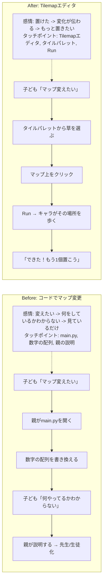

### CJ02: 道を作る

子どもが草タイルを並べて、町と町をつなぐ道を作る。

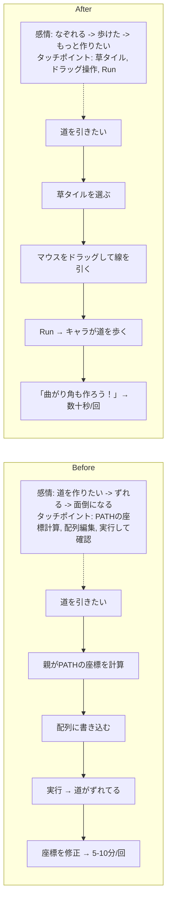

### CJ03: 森を作る

子どもが木タイルを密集させて、「ロジックのもり」を自分で拡張する。

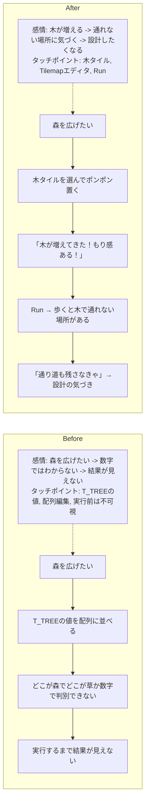

### CJ04: 水辺を作る

子どもが水タイルと岸タイルを組み合わせて湖や川を作る。

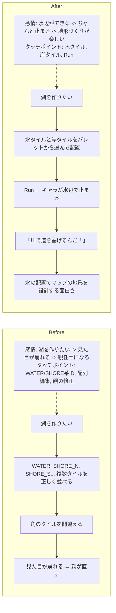

### CJ05: 装飾で世界を彩る

子どもが花・岩・キノコなどの装飾タイルを配置して、ゾーンに個性を持たせる。

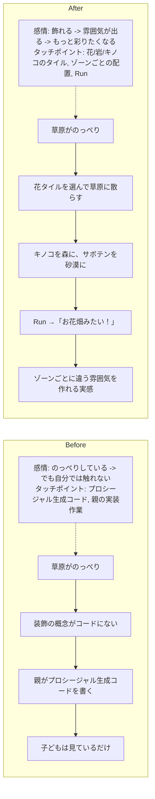

### CJ06: 迷路を作る

子どもが壁と道を組み合わせて、洞窟の中に迷路を設計する。

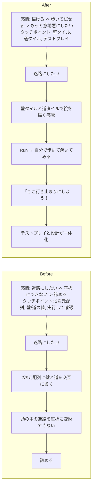

### CJ07: ランドマークを配置する

子どもがマルチタイルの世界樹や通信塔を好きな場所に配置する。

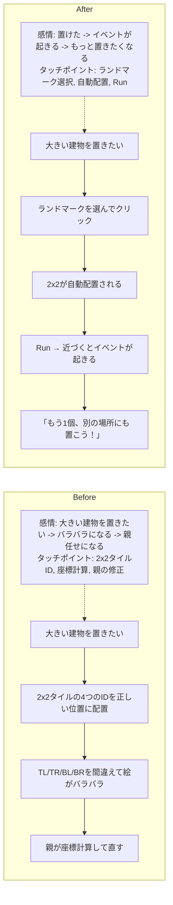

### CJ23: スプライトを自分で描く

子どもがスプライトエディタで主人公の見た目を変える。

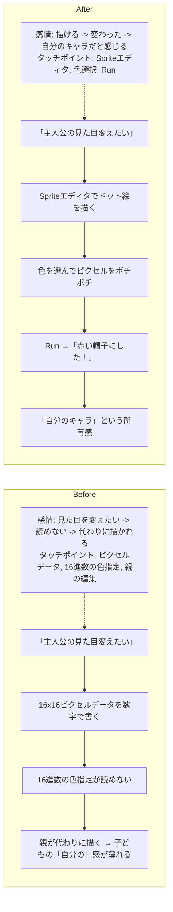

### CJ24: 効果音を自分で作る

子どもがSoundエディタで攻撃音や回復音を作る。

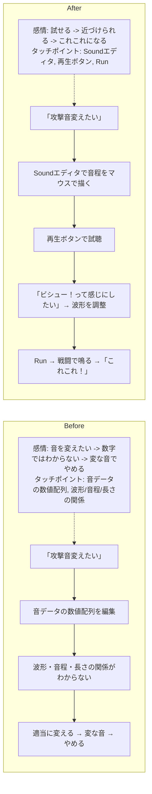

---

## 直すループ（テストプレイ → 親がAIで修正）

### CJ08: 敵が強すぎる

子どもがテストプレイで「この敵強すぎ！」→ 親がAIにHP調整を頼む。

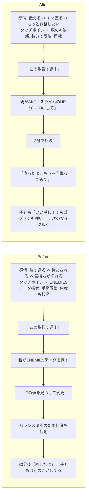

### CJ09: セリフを変えたい

子どもが「この人のセリフつまんない」→ 親がAIに面白いセリフを考えてもらう。

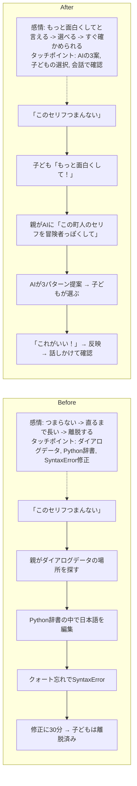

### CJ10: 新しい敵を追加したい

子どもが「ドラゴン出したい！」→ 親がAIに敵データの追加を頼む。

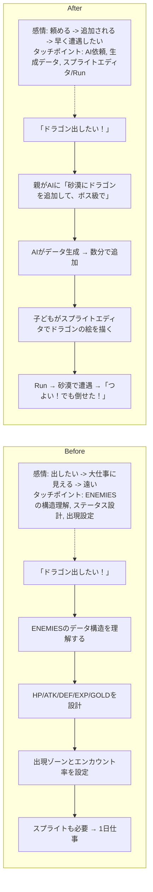

### CJ11: BGMの雰囲気を変えたい

子どもが「この音楽暗すぎる」→ 親がAIに曲調の変更を頼む。

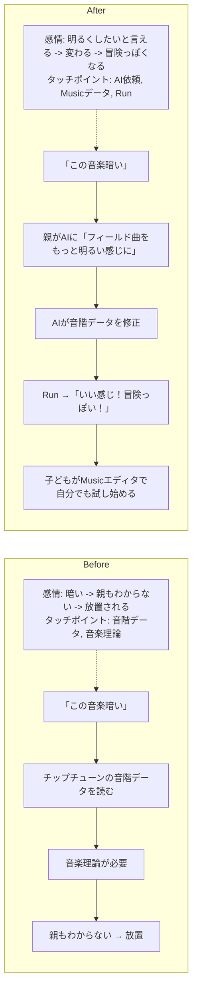

### CJ12: 歩いたら壁にハマった

子どもがテストプレイ中にバグを発見 → 親がAIで修正。

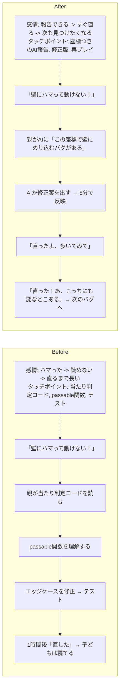

### CJ13: 新しい呪文がほしい

子どもが「かっこいい技出したい」→ 親がAIに呪文追加を頼む。

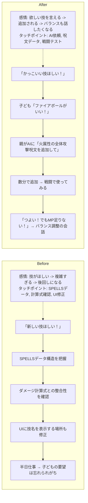

### CJ14: マップが広すぎて迷う

子どもがテストプレイで迷子になる → 親がAIにガイド機能を追加してもらう。

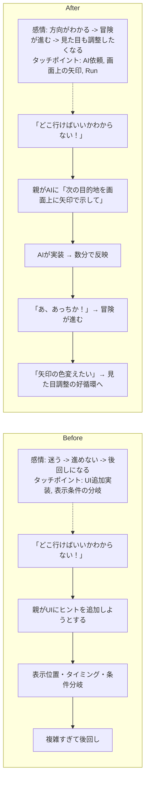

---

## 磨くループ（親が方針を決め、AIが演出を自動生成する）

演出（BGM・SFX・VFX）がないと、マップや敵を追加しても「動くだけ」で止まる。「ちゃんとしたゲーム」に見えるかどうかは、最低限の演出があるかどうかで決まる。ただし演出の実装は子どもの手には余る。ここは親が方針を考え、AIに生成させる領域。

### CJ15: フィールドBGMをゾーンごとに付ける

親が「草原は明るく、森は神秘的に」と方針を決め、AIがチップチューンデータを生成する。

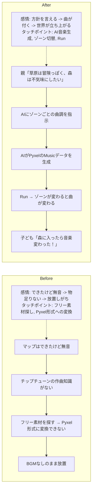

### CJ16: 戦闘BGMを付ける

戦闘に入ったときにBGMが切り替わるだけで、緊張感がまったく変わる。

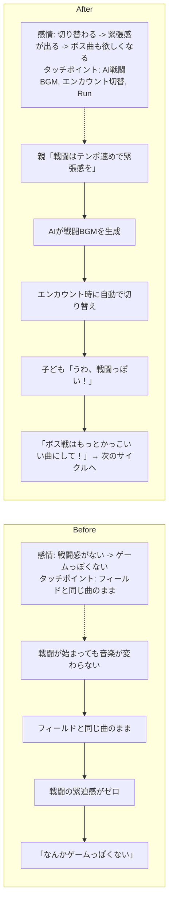

### CJ17: 効果音をイベントに紐づける

攻撃、回復、レベルアップ、扉を開けるなど、操作に音がつくと「手ごたえ」が生まれる。

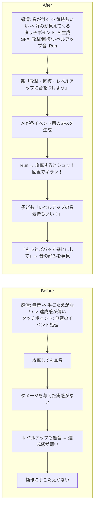

### CJ18: ダメージ演出を付ける

画面フラッシュや点滅など、最低限のVFXでゲームの「手ざわり」が激変する。

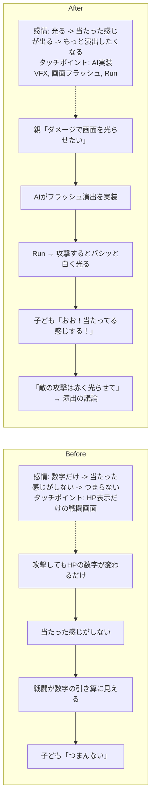

### CJ19: 場面転換の演出

町に入る、戦闘が始まる、セーブする。場面が変わるときのフェードが「それっぽさ」を一気に上げる。

```mermaid
flowchart LR
    subgraph Before["Before"]
        BM["感情: 唐突 -> 安っぽい -> なんか違う<br/>タッチポイント: 即時切替だけの画面遷移"]
        BM -.-> B1
        B1[町に入ると画面がパッと切り替わる] --> B2[唐突で安っぽい]
        B2 --> B3[「本物のゲーム」はもっと滑らかに変わる]
        B3 --> B4[子ども「なんか違う」]
    end
    subgraph After["After"]
        AM["感情: なめらか -> ゲームっぽい -> 作品感が出る<br/>タッチポイント: AI実装のフェード, 場面転換, Run"]
        AM -.-> A1
        A1[親「場面転換にフェードをつけよう」] --> A2[AIがフェードイン/アウトを実装]
        A2 --> A3[Run → 町に入ると画面がすーっと暗くなって明るくなる]
        A3 --> A4[子ども「ゲームっぽい！」]
        A4 --> A5[演出ひとつで「習作」から「作品」に近づく実感]
    end
```

### CJ20: 演出の有無でゲームの印象が変わることを体験する

親が演出を一括でON/OFFして、子どもと一緒に違いを確認する。

```mermaid
flowchart LR
    subgraph Before["Before"]
        BM["感情: 価値を言葉で説明しにくい -> 一方的になる<br/>タッチポイント: 口頭説明だけ"]
        BM -.-> B1
        B1[演出の価値が言葉で説明しにくい] --> B2[子どもは「別にいいじゃん」]
        B2 --> B3[親が一方的に追加する → 先生化]
    end
    subgraph After["After"]
        AM["感情: 比べるとわかる -> 全然違う -> 一緒に考えたくなる<br/>タッチポイント: 演出ON/OFF切替, 実プレイ比較"]
        AM -.-> A1
        A1[親「音と光をオフにして遊んでみて」] --> A2[子どもが無音・演出なしでプレイ]
        A2 --> A3[「なんか寂しい…」]
        A3 --> A4[親がONに戻す → 「全然違う！こっちがいい！」]
        A4 --> A5[演出の大事さを体感 → 何を足すか一緒に考える]
    end
```

---

## 共有ループ（外に見せる・フィードバックをもらう）

スマホで遊べることが、このループの起点になる。友達はURLを開くだけ――インストールも会員登録も不要。この手軽さが「ちょっとやってみて」を可能にし、フィードバックの出し手を親子の外にまで広げる。フィードバックが増えると好循環が速く回り、プロダクトの進化が加速する。

### CJ21: 友達に見せる

子どもが作ったゲームを友達にURLで送る。スマホで即プレイできることが「見せる」のハードルを劇的に下げる。友達がその場で遊べるから、「これ作ったの！？」「ここすごい！」という反応がすぐ返ってくる。

```mermaid
flowchart LR
    subgraph Before["Before"]
        BM["感情: 見せたい -> 配れない -> 諦める<br/>タッチポイント: zip配布, .exe, 友達の環境依存"]
        BM -.-> B1
        B1[「友達に見せたい！」] --> B2[ビルド → zipを渡す]
        B2 --> B3[「どうやって開くの？」「.exe怖い」]
        B3 --> B4[友達の環境で動かない]
        B4 --> B5[見せるのを諦める]
    end
    subgraph After["After"]
        AM["感情: 送れる -> すぐ遊ばれる -> 誇らしくなる<br/>タッチポイント: URL, LINE, スマホブラウザ"]
        AM -.-> A1
        A1[「友達に見せたい！」] --> A2[URLをLINEで送る]
        A2 --> A3[友達がスマホで開く → 即プレイ]
        A3 --> A4[「え、これ作ったの！？すごい！」]
        A4 --> A5[子どもの誇り → もっと作りたい]
    end
```

### CJ43: 実公開で遊ばれた記録が見える

親が「このVMで実際に公開しているURL」で遊ばれた記録を見て、共有が届いているかを事実で確認できる。内部テスト用の記録ではなく、友達が本当に開いた導線の記録が見えることで、「遊ばれている」「届いていない」「公開経路が壊れている」を勘ではなくログで判断できる。

```mermaid
flowchart LR
    subgraph Before["Before"]
        BM["感情: 送った -> 見えない -> 勘で判断するしかない<br/>タッチポイント: 見えない公開導線"]
        BM -.-> B1
        B1[URLを送る] --> B2[友達は遊んでいる]
        B2 --> B3[でも親の手元では記録が増えない]
        B3 --> B4[「遊ばれてないのかな？」と勘で考える]
        B4 --> B5[声かけも修正判断もずれる]
    end
    subgraph After["After"]
        AM["感情: 開かれる -> 記録が残る -> 事実で見直せる<br/>タッチポイント: 実公開URL, 実公開アクセスログ, 日別/ページ別確認"]
        AM -.-> A1
        A1[URLを送る] --> A2[友達が実公開URLを開く]
        A2 --> A3[実公開の導線でプレイ記録が残る]
        A3 --> A4[親が日別・ページ別で確認できる]
        A4 --> A5[遊ばれていれば嬉しい]
        A4 --> A6[記録がなければ公開経路や声かけを見直せる]
    end
```

### CJ22: 友達のフィードバックを反映する

友達がスマホで遊んで「ここ難しすぎ」→ 子どもが「直して！」と判断 → 親がAIで直す → URLを再送信 → 友達がすぐ確認。スマホで即プレイできるから、フィードバック→修正→再確認のサイクルがその場で何周も回る。ただし、友達のフィードバックをどう扱うか（直すか・無視するか・後回しにするか）を決めるのは子ども。親が勝手にトリアージしない。

```mermaid
flowchart LR
    subgraph Before["Before"]
        BM["感情: 難しいと言われる -> 後回しになる -> 熱が冷める<br/>タッチポイント: メモ, 後日修正"]
        BM -.-> B1
        B1[友達「ここ難しい」] --> B2[メモしておく → 後で直す]
        B2 --> B3[数日後に修正]
        B3 --> B4[友達はもう遊んでいない]
    end
    subgraph After["After"]
        AM["感情: その場で直したいと決める -> すぐ反映される -> 得意顔になる<br/>タッチポイント: スマホプレイ, AI修正, URL再送"]
        AM -.-> A1
        A1[友達「ここ難しい」] --> A2[子ども「パパ直して！」]
        A2 --> A3[親がAIに頼む → 数分で修正]
        A3 --> A4[「直ったよ、もう一回やってみて」]
        A4 --> A5[友達「お、いい感じ！」→ 子ども得意顔]
    end
```

---

## 育てるループ（好循環を重ねて成長する）

### CJ27: ストーリーの分岐を作る

子どもが「選択肢で話が変わるようにしたい」→ 親がAIにダイアログ分岐を頼む。

```mermaid
flowchart LR
    subgraph Before["Before"]
        BM["感情: 変えたい -> 複雑すぎる -> 後回し<br/>タッチポイント: 条件分岐ロジック, フラグ管理"]
        BM -.-> B1
        B1[「はい/いいえで変わるようにしたい」] --> B2[条件分岐のロジックを書く]
        B2 --> B3[フラグ管理・状態遷移が複雑]
        B3 --> B4[親でも設計に時間がかかる → 後回し]
    end
    subgraph After["After"]
        AM["感情: もしもを試せる -> 反応が返る -> もっと分岐したくなる<br/>タッチポイント: AI依頼, 分岐ダイアログ, Run"]
        AM -.-> A1
        A1[子ども「王様にNoって言ったらどうなる？」] --> A2[親がAIに「王様の依頼を断る分岐を追加して」]
        A2 --> A3[AIが分岐ダイアログを生成]
        A3 --> A4[Run →「断ったら怒られた！おもしろい！」]
        A4 --> A5[「じゃあ3回断ったらどうなる？」→ 物語の共同設計]
    end
```

### CJ28: 新しいエリアをまるごと追加する

マップ・敵・BGM・イベントを組み合わせて、子どもが構想した世界を実現する。

```mermaid
flowchart LR
    subgraph Before["Before"]
        BM["感情: ほしい -> やることが多すぎる -> 構想が消える<br/>タッチポイント: タイル追加, 敵配置, BGM/イベント設定"]
        BM -.-> B1
        B1[「雪のエリアがほしい！」] --> B2[タイル追加・敵配置・ゾーン判定・BGM…]
        B2 --> B3[やることが多すぎて1日では終わらない]
        B3 --> B4[子どもの構想は実現されないまま消える]
    end
    subgraph After["After"]
        AM["感情: 並べられる -> 動き出す -> もっと具体化したくなる<br/>タッチポイント: Tilemap, AI追加, テストプレイ"]
        AM -.-> A1
        A1[「雪のエリアがほしい！」] --> A2[子どもがTilemapで白いタイルを並べる]
        A2 --> A3[親がAIに「雪ゾーンの敵・BGM・エンカウント率を追加して」]
        A3 --> A4[数十分で「雪エリア」が動く]
        A4 --> A5[テストプレイ →「敵を雪だるまにして！」→ 次のサイクル]
    end
```

### CJ29: 全体のバランスを調整する

何度も敵や呪文を追加した結果、バランスが崩れてきた → 親がAIに全体調整を頼む。

```mermaid
flowchart LR
    subgraph Before["Before"]
        BM["感情: 足すほど崩れる -> 調整が地味で長い -> 離れる<br/>タッチポイント: 全敵一覧, 手動調整ループ"]
        BM -.-> B1
        B1[新しい敵や技を足すたびバランスが崩れる] --> B2[全敵のHP/ATK/EXP一覧を見ながら手動調整]
        B2 --> B3[調整→テスト→また調整のループが地味で長い]
        B3 --> B4[子どもは退屈 → 離脱]
    end
    subgraph After["After"]
        AM["感情: 全体を直せる -> 通しで確かめる -> ちょうどいいに近づく<br/>タッチポイント: AI一括調整, 通しプレイ"]
        AM -.-> A1
        A1[親「全体的に後半が簡単すぎるね」] --> A2[AIに「ゾーン3以降の敵を1.5倍にして経験値カーブも調整して」]
        A2 --> A3[AIが全データを一括調整]
        A3 --> A4[子どもが通しプレイで確認「うん、ちょうどいい！」]
        A4 --> A5[数値調整はAI、面白いかの判断は子ども]
    end
```

### CJ30: エンディングを自分たちで書く

ゲームの最後を自分たちの言葉で飾る。好循環の集大成として「自分たちのゲーム」というアイデンティティを獲得する瞬間。何度もサイクルを回した結果、オリジナル部分が積み上がり、エンディングがその到達点になる。

```mermaid
flowchart LR
    subgraph Before["Before"]
        BM["感情: 遊ぶだけ -> 誰の話かわからない -> 通り過ぎる<br/>タッチポイント: 既製のエンディング"]
        BM -.-> B1
        B1[既製のゲームを遊ぶ／エンディングは元のまま] --> B2[「クリアしたけど、これ誰の話？」]
        B2 --> B3[作る側の実感がない → 飽きたら次のゲームへ]
    end
    subgraph After["After"]
        AM["感情: 積み上げてきた実感がある -> 最後を書ける -> 自分たちのゲームになる<br/>タッチポイント: 親子の言葉, AI実装, クレジット/Run"]
        AM -.-> A1
        A1[最初は既存のBlock Questを改造] --> A2[マップ・敵・セリフを書き換え → オリジナル部分が半分以上]
        A2 --> A3[子ども「エンディング変えたい！」]
        A3 --> A4[親子でセリフを考える → AIが実装 → クレジットに子どもの名前]
        A4 --> A5[Run → エンディング到達 →「このゲーム、ぼくたちが作ったんだ」]
        A5 --> A6[友達に見せる → 褒められる → もっと作る]
    end
```

### CJ42: 子どもが冒険を最後までやり切れる

子どもが自分たちで育てたゲームを、探索して、戦って、強くなって、ボスを倒し、エンディングまでやり切れる。RPGとしての基本の流れが最後までつながっていることで、「自分たちのゲームを遊び切れた」という手応えが生まれる。

```mermaid
flowchart LR
    subgraph Before["Before"]
        BM["感情: 途中で止まる -> 最後まで遊べない<br/>タッチポイント: 壊れた進行, 不完全な戦闘/エンディング"]
        BM -.-> B1
        B1[歩けるし戦える] --> B2[でもどこかで進行が止まる]
        B2 --> B3[逃走失敗で敵ターンが来ない]
        B2 --> B4[強くなっても先へ進めない]
        B2 --> B5[ボスを倒しても終わらない]
        B3 --> B6[「RPGなのに最後まで遊べない」]
        B4 --> B6
        B5 --> B6
    end
    subgraph After["After"]
        AM["感情: 進める -> 勝てる -> さいごまでできた<br/>タッチポイント: フィールド, 戦闘, 成長, ボス, エンディング"]
        AM -.-> A1
        A1[フィールドを進む] --> A2[敵と戦う]
        A2 --> A3[経験値を得て強くなる]
        A3 --> A4[ボスを倒す]
        A4 --> A5[エンディングに到達する]
        A5 --> A6[「さいごまでできた！」]
    end
```

---

## 守るループ（子どもの主体性をシステムで守る）

好循環が速く回るほど、親が「しゃしゃり出す」リスクも上がる。AIで何でも数分で直せるから、子どもに聞かずに先回りしてしまう。ここでは、新しい変更をまず `おためしばん` として見せ、子どもが遊んだあとに親が明示的に採否を確定することで、この問題をシステムで防ぐ。ハンドルを子どもが握り続けるためのブレーキは、「まず遊んで、いやなら止められる」ことにある。

### CJ31: 子どもが変更を承認する

親がAIに頼んだ修正を、子どもが「おためし」と「もとのまま」の両方で遊び比べて、自分の体感で「こっち！」と決める。親がAIに変更を頼んだら、その変更の受け皿は常に preview（おためしばん）であり、current（もとのままばん）は直前までに通った内容を配る。`おためしばん` は「まだ採否を決めていない候補版」であり、自動では current に上がらない。子どもが遊んで「こっち！」と決めたあと、親が明示的な昇格コマンドを実行したときだけ current に反映される。却下すると current はそのまま残り、おためしばんは取り下げられる。選択ページの説明は、その時点で存在する preview に実際に入っている変更から自動で出て、「ここを変えたから、遊んでみて！」と子どもに伝わる形でなければならない。

```mermaid
flowchart LR
    subgraph Before["Before: 文字だけで判断"]
        BM["感情: 文字だけではわからない -> 親の説明に乗るしかない<br/>タッチポイント: 承認画面の文字説明"]
        BM -.-> B1
        B1["承認画面に\n「スライムのHP: 50→30」"] --> B2["子ども「30ってどのくらい？\nよくわかんない」"]
        B2 --> B3["親「弱くなるってことだよ」"]
        B3 --> B4["子ども「じゃあ…いいよ」"]
        B4 --> B5["親の説明で決めた\n→ 自分で判断した感覚がない"]
    end
    subgraph After["After: 遊び比べて判断"]
        AM["感情: 遊び比べられる -> 体感差がわかる -> 自分で決められる<br/>タッチポイント: 選択ページ, おためしばん, もとのままばん, 比較プレイ"]
        AM -.-> A1
        A1["承認画面を開く"] --> A2["「おためし」で遊ぶ\nスライムHP=30で戦闘"]
        A2 --> A3["「2かいで たおせた！」"]
        A3 --> A4["「もとのまま」で遊ぶ\nスライムHP=50で戦闘"]
        A4 --> A5["「こっちは 4かい かかる」"]
        A5 --> A6["「おためしのほう！」→ 承認"]
    end
```

### CJ32: 子どもが変更を却下する

子どもが両方遊んだ結果「まえのがいい」と自信を持って却下する。親の理屈に言い返せなくても、遊んだ体感が根拠になる。ここでは親が明示的な却下コマンドを実行し、current をそのまま保ち、おためしばんを取り下げる。

```mermaid
flowchart LR
    subgraph Before["Before: 却下しづらい"]
        BM["感情: 反対しづらい -> 親の理屈に負ける<br/>タッチポイント: 親の口頭説明, 直接反映された変更"]
        BM -.-> B1
        B1["親「バランス的にHP下げたほうがいい」"] --> B2["親が修正して反映"]
        B2 --> B3["子ども「なんか違う気がする…」"]
        B3 --> B4["自分の感覚を言葉にできない\n→ 親の理屈に負ける"]
        B4 --> B5["親の判断が常に優先 → 先生/生徒化"]
    end
    subgraph After["After: 体感で却下できる"]
        AM["感情: 試してつまらないと感じる -> 前の方がいいと言える -> 却下できる<br/>タッチポイント: おためしばん, もとのままばん, 却下フロー"]
        AM -.-> A1
        A1["「おためし」で遊ぶ\nスライムHP=30"] --> A2["「かんたんすぎて\nつまんない！」"]
        A2 --> A3["「もとのまま」で遊ぶ\nスライムHP=50"]
        A3 --> A4["「こっち！ギリギリで\nたおすのが たのしい！」"]
        A4 --> A5["「まえの が いい」→ 却下\n遊んだ事実が根拠になる"]
    end
```

### CJ33: 子どもが変更を選んで適用する

親がAIに複数の修正を頼んだとき、子どもがどれを採用するか・どの順で入れるかを選ぶ。優先順位を決めるのは子ども。選択ページの変更一覧は、親があとから別に手で説明を書くものではなく、その時点の preview に入っている変更から自動生成され、実際に遊べる変更と一対一に対応している必要がある。ここでいう一覧は「いま存在する `おためしばん`」だけを説明するもので、前の候補が残っていても自動で current に混ぜてはいけない。新しい候補を試したいときは、親が current を土台に新しい preview を作り直す。

```mermaid
flowchart LR
    subgraph Before["Before: 親がまとめて反映"]
        BM["感情: まとめて反映される -> 何が変わったかわからない -> お客さん化する<br/>タッチポイント: 一括反映, 手書き説明"]
        BM -.-> B1
        B1[友達から3つフィードバック] --> B2[親が全部まとめてAIに頼む]
        B2 --> B3[一括反映 → 何が変わったか子どもにはわからない]
        B3 --> B4[説明が古い / ずれていると\n選ぶ根拠も崩れる]
        B4 --> B5[子どもの意見を聞かずに進む → お客さん化]
    end
    subgraph After["After: 子どもが選ぶ"]
        AM["感情: 候補が並ぶ -> 自分で順番を決める -> 気に入ったものだけ通せる<br/>タッチポイント: 承認キュー, 自動生成の変更一覧, 遊び比べ"]
        AM -.-> A1
        A1[友達から3つフィードバック] --> A2[親がAIに3つの修正案を作らせる]
        A2 --> A3[承認キューに3件並ぶ]
        A3 --> A4[子ども「まずこれ！次はこれ！これはいらない」]
        A4 --> A5[一覧の説明どおりに1つずつ遊び比べ]
        A5 --> A6[気に入ったものだけ承認]
    end
```

### CJ34: 承認したあとに「やっぱり」となる

一度承認した変更で遊んでみたら「やっぱり前のほうがよかった」。巻き戻しも同じ承認キューで回る。

```mermaid
flowchart LR
    subgraph Before["Before: 戻せない"]
        BM["感情: 戻したい -> 戻し方がわからない -> また親任せ<br/>タッチポイント: 戻し方のない承認後状態"]
        BM -.-> B1
        B1["承認して反映した"] --> B2["しばらく遊ぶ"]
        B2 --> B3["「やっぱり前のほうが\nよかったかも…」"]
        B3 --> B4["戻し方がわからない"]
        B4 --> B5["親に頼む →\n結局また親が決める構造に"]
    end
    subgraph After["After: 「もどして」も承認キューで回る"]
        AM["感情: 違和感に気づく -> もどしてと言える -> 自分で戻せる<br/>タッチポイント: 承認キュー, もどして依頼, 再承認"]
        AM -.-> A1
        A1["承認して反映した"] --> A2["しばらく遊ぶ"]
        A2 --> A3["「やっぱり前のがよかった！」"]
        A3 --> A4["子ども「おとうさん、もどして！」"]
        A4 --> A5["承認キューに\n「スライムのHP: 30→50」が追加"]
        A5 --> A6["子どもが承認して元に戻る"]
    end
```

### CJ25: 親子で役割を交代する

親がマップを描き、子どもがテストプレイヤーになる。ただし「何を作るか」「何を直すか」の判断は常に子ども側にある。役割が交代しても、ハンドルは子どもが握っている。

```mermaid
flowchart LR
    subgraph Before["Before"]
        BM["感情: 役割が固定 -> 待つだけ -> 退屈<br/>タッチポイント: 親のコード作業"]
        BM -.-> B1
        B1[親がコードを書く] --> B2[子どもは横で見ているだけ]
        B2 --> B3[「まだ？」「もうちょっと」]
        B3 --> B4[役割が固定 → 退屈]
    end
    subgraph After["After"]
        AM["感情: 役割を交代できる -> でも決めるのは自分 -> 仲間感が出る<br/>タッチポイント: Tilemap, テストプレイ, 口頭フィードバック"]
        AM -.-> A1
        A1[親「今度はパパが描くから、テストしてね」] --> A2[親がTilemapで新エリアを作る]
        A2 --> A3[子どもがプレイ →「ここ壁で詰む！」]
        A3 --> A4[親「あ、ほんとだ。直すね」]
        A4 --> A5[立場が入れ替わっても対等 → 仲間の関係]
    end
```

---

## 避けるべきジャーニー（アンチパターン）

好循環の速度が上がるほど、AIの修正が**壊れた状態で子どもの画面に届く**リスクが顔を出す。以下2つは実際にこのプロジェクトで起きた／再現性のあるトラブルで、放置すると「直ったよ → うごかない／なおってない」という**逆フィードバック**で好循環を破壊する。これらを前提に承認キュー・ビルドパイプライン・テストを設計する。

**Before** = 防がないと起きる体験 / **After** = 仕組みで防いだ状態

### CJ35: AIで修正したらエラーが出て動かない

子どもが新機能を頼み、AIが `main.py`（6,823行のモノリス）に加筆 → 別箇所で参照されている定数・関数シグネチャ・呪文リスト等との整合が崩れ、起動時に `NameError` / `AttributeError` / `IndexError` でクラッシュ。子どもは黒い画面とエラーテキストを見ることになる。

- **具体ケース**：呪文追加（`feat: implement 5-spell system with level-based learning` 前後のように、呪文と習得レベルの対応表が複数箇所に散っている）のとき、AIが `SPELLS` 辞書に6番目を足したが `LEARN_AT` テーブルへの追記を忘れる → レベル到達時に `KeyError` でクラッシュ。`main.py` が大きすぎて AI が全参照箇所を追えない。

```mermaid
flowchart LR
    subgraph Before["Before: 壊れた版が子どもの画面に届く"]
        BM["感情: 頼んだのに壊れた版が届く -> なんでとなる -> 集中が切れる<br/>タッチポイント: AI修正, main.py, 黒いエラー画面"]
        BM -.-> B1
        B1[子ども「新しい技ほしい！」] --> B2[親がAIに依頼]
        B2 --> B3[AIがmain.pyに呪文を追記<br/>参照先を一箇所見落とす]
        B3 --> B4[Run → 起動はする]
        B4 --> B5[レベルアップ時に KeyError で<br/>黒い画面＋エラーログ]
        B5 --> B6[子ども「うごかない！なんで！？」]
        B6 --> B7[親がログを読みAIに再依頼<br/>5分の約束が30分に]
        B7 --> B8[好循環が途切れる<br/>子どもの集中が切れる]
    end
    subgraph After["After: 壊れた版は子どもに届かない"]
        AM["感情: 自動で弾かれる -> 動く版だけ届く -> 安心して待てる<br/>タッチポイント: ビルド検証, ヘッドレス実行, エラー要約, 承認キュー"]
        AM -.-> A1
        A1[子ども「新しい技ほしい！」] --> A2[親がAIに依頼]
        A2 --> A3[AIがmain.pyを修正]
        A3 --> A4[ビルド時に自動検証<br/>import／主要シナリオをヘッドレス実行]
        A4 --> A5{起動・主要操作が通るか?}
        A5 -->|NG| A6[おためしばんを出さない<br/>親にエラー要約を返す<br/>→ AIに再依頼]
        A5 -->|OK| A7[選択ページに「おためしばん」が並ぶ]
        A7 --> A8[子どもは常に動くゲームだけを見る]
    end
```

### CJ36: データを変えたらバランスが崩壊した

AIがアイテム・敵・呪文・レベルテーブル等の**パラメータ**を変更した結果、戦闘バランスが崩壊する。HPを10倍にした敵が倒せない、回復アイテムが強すぎてゲームにならない等。データ定義が `main.py` の複数箇所に散在しているため、AIが全箇所を一貫して更新できない。

- **対象**: 敵ステータス、アイテム効果量、呪文威力・消費MP、経験値カーブ、ドロップ率、成長テーブル
- **根本原因**: データが SSoT 化されておらず `main.py` 内の複数辞書に直書きされている

```mermaid
flowchart LR
    subgraph Before["Before: パラメータ散在で不整合"]
        BM["感情: 強い敵がほしい -> でも壊れる -> ゲームにならない<br/>タッチポイント: main.py内の複数辞書"]
        BM -.-> B1
        B1[子ども「もっと強い敵ほしい！」] --> B2[親がAIに依頼]
        B2 --> B3[AIがENEMIES辞書にボスを追加<br/>LEARN_ATテーブルの更新を忘れる]
        B3 --> B4[戦闘開始 → KeyErrorでクラッシュ<br/>or バランス崩壊]
    end
    subgraph After["After: SSoTから自動生成"]
        AM["感情: YAMLだけ直せばいい -> 一貫して動く -> 安心して増やせる<br/>タッチポイント: assets/*.yaml, コード生成, 整合チェック"]
        AM -.-> A1
        A1[子ども「もっと強い敵ほしい！」] --> A2[親がAIに依頼]
        A2 --> A3[AIがassets/enemies.yamlを編集]
        A3 --> A4[自動生成＋整合チェック]
        A4 --> A5[一貫したデータで動作]
    end
```

---

### CJ37: 見た目・音を変えたら表示が壊れた

AIがタイル・スプライト・BGM・SEなどの**コンテンツ・演出**を変更した結果、見た目や音がおかしくなる。ロジック上は正しいのに画面上の結果が違う。`.pyxres`とコード定数の乖離が主原因。

- **対象**: タイル配置、スプライト画像、イメージバンク座標、BGM/SE、UIアイコン
- **具体ケース**（`docs/steering/20260411-tile-bug-research.md`）：AIが `TILE_DATA` に新タイルを追加 → `.pyxres` のピクセル座標がずれる → タイルIDが化けて通行可能タイルが「見えない壁」になる
- **制約**: `.pyxres` はバイナリでありAIが直接編集できない。Pyxel Code Maker 経由でのみ変更可能

```mermaid
flowchart LR
    subgraph Before["Before: pyxresとコードの不整合"]
        BM["感情: 増やしたのに壊れて見える -> なおってないと感じる<br/>タッチポイント: TILE_DATA, .pyxres, 画面での破綻"]
        BM -.-> B1
        B1[子ども「お花を増やして！」] --> B2[親がAIに依頼]
        B2 --> B3[AIがTILE_DATAを変更<br/>.pyxresの座標がずれる]
        B3 --> B4[花は増えたが<br/>通れない壁になっている]
        B4 --> B5[子ども「なおってない！」]
    end
    subgraph After["After: 整合性をビルドが保証"]
        AM["感情: 整合が取れて届く -> 見た目と挙動が一致して安心できる<br/>タッチポイント: SSoT編集, pyxres整合チェック, 再生成"]
        AM -.-> A1
        A1[子ども「お花を増やして！」] --> A2[親がAIに依頼]
        A2 --> A3[AIがSSoTを編集]
        A3 --> A4[pyxresとの整合チェック<br/>→ 不一致なら自動再生成]
        A4 --> A5[見た目と挙動が一致]
    end
```

---

### CJ38: 新しいイベントを追加したら既存が壊れた

AIが会話イベント・宝箱・フラグ分岐・クエストなどの**イベント・ロジック**を追加した結果、既存のイベントやフラグと衝突して進行不能になる。

- **対象**: マップイベント、会話分岐、フラグ条件、宝箱配置、シナリオ分岐
- **根本原因**: イベントフラグが暗黙的に管理されており、AIが既存フラグとの衝突を検出できない

```mermaid
flowchart LR
    subgraph Before["Before: フラグ衝突で進行不能"]
        BM["感情: 新しいことを足したい -> 衝突して進めない -> 何が起きたかわからない<br/>タッチポイント: AIイベント追加, 暗黙フラグ, 進行不能なイベント"]
        BM -.-> B1
        B1[子ども「洞窟にボスを追加して！」] --> B2[親がAIに依頼]
        B2 --> B3[AIがイベントを追加<br/>既存フラグと衝突]
        B3 --> B4[洞窟に入ると<br/>会話が無限ループ]
    end
    subgraph After["After: イベント整合性チェック"]
        AM["感情: 追加しても自動で検証される -> 壊れた版は届かない<br/>タッチポイント: AI依頼, 主要シナリオのヘッドレス検証, 承認前ゲート"]
        AM -.-> A1
        A1[子ども「洞窟にボスを追加して！」] --> A2[親がAIに依頼]
        A2 --> A3[AIがイベントを追加]
        A3 --> A4[ヘッドレステストで<br/>主要シナリオ走破を検証]
        A4 --> A5[進行不能は子どもに届かない]
    end
```

---

### CJ39: システムを変えたらゲーム全体が壊れた

AIが戦闘システム・移動ルール・アイテムシステムなどの**ゲームの骨格**を変更した結果、広範囲に影響が波及してゲーム全体が不安定になる。

- **対象**: 戦闘ターン制御、行動順ロジック、属性相性、装備システム、成長システム、UI/操作
- **根本原因**: `main.py` が6,800行超のモノリスであり、システム変更の影響範囲をAIが把握しきれない

```mermaid
flowchart LR
    subgraph Before["Before: モノリス内の連鎖破壊"]
        BM["感情: 欲しい機能を頼む -> 連鎖的に壊れる -> 全体が不安になる<br/>タッチポイント: main.pyのモノリス, 戦闘ロジック, セーブデータ"]
        BM -.-> B1
        B1[子ども「逃げるボタンほしい！」] --> B2[親がAIに依頼]
        B2 --> B3[AIが戦闘ロジックを変更<br/>6800行の別箇所と矛盾]
        B3 --> B4[逃げると画面がフリーズ<br/>セーブデータも壊れる]
    end
    subgraph After["After: 起動ゲート＋シナリオテスト"]
        AM["感情: 複数シナリオで止められる -> 壊れた版が出ない<br/>タッチポイント: 移動/戦闘/セーブのヘッドレス検証, ビルドゲート, 承認キュー"]
        AM -.-> A1
        A1[子ども「逃げるボタンほしい！」] --> A2[親がAIに依頼]
        A2 --> A3[AIが戦闘ロジックを変更]
        A3 --> A4[ヘッドレスで移動・戦闘<br/>・セーブの4シナリオ検証]
        A4 --> A5[壊れた版は承認キューに出ない]
    end
```

---

### CJ40: ゲームモードを追加したら収拾がつかなくなった

AIがニューゲーム+、タイムアタック、ローグライク化などの**ゲーム全体の遊び方**を変える大規模変更を行った結果、既存のセーブデータ・進行状態と互換性がなくなる。

- **対象**: ゲームモード追加、進行構造変更、周回要素、ステージ制化
- **根本原因**: ゲーム状態の管理がセーブ/ロードと密結合しており、構造変更がデータ破壊を招く

```mermaid
flowchart LR
    subgraph Before["Before: セーブデータ互換崩壊"]
        BM["感情: 新モードは楽しそう -> でもデータが消えると最悪<br/>タッチポイント: 進行構造変更, 既存セーブデータ"]
        BM -.-> B1
        B1[親「2周目モード作ろう」] --> B2[AIが進行構造を変更]
        B2 --> B3[既存セーブデータで<br/>ロードするとクラッシュ]
        B3 --> B4[子ども「ぼくのデータ<br/>なくなった！！」]
    end
    subgraph After["After: セーブ互換テスト"]
        AM["感情: 互換テストで先に止まる -> 大事なデータを守れる<br/>タッチポイント: セーブ互換テスト, 既存セーブでのロード確認, 失敗通知"]
        AM -.-> A1
        A1[親「2周目モード作ろう」] --> A2[AIが進行構造を変更]
        A2 --> A3[ビルド時に既存セーブデータで<br/>ロードテストを実行]
        A3 --> A4[互換性が壊れたら<br/>ビルド失敗＋親に通知]
    end
```

---

### CJ41: 技術基盤を変えたら配信できなくなった

AIがセーブ方式・ファイル構造・パフォーマンス最適化などの**技術基盤**を変更した結果、Web配信・Code Maker連携・承認キューなど運用の仕組みが壊れる。

- **対象**: セーブ/ロード方式、データ構造変更、Web/ネイティブ差異、pyxres分割、外部ファイル化
- **根本原因**: 配信パイプライン（Webビルド → 承認キュー → 選択ページ）との結合が暗黙的

```mermaid
flowchart LR
    subgraph Before["Before: 配信パイプラインが壊れる"]
        BM["感情: ローカルで動いても配れない -> 直ったはずなのに届かない<br/>タッチポイント: ローカル実行, セーブ方式変更, 暗黙の配信パイプライン"]
        BM -.-> B1
        B1[親「セーブをJSON形式に変えよう」] --> B2[AIがセーブ方式を変更]
        B2 --> B3[ローカルでは動くが<br/>Web版でセーブ不可]
        B3 --> B4[承認キューの版が<br/>全部セーブできない]
    end
    subgraph After["After: Web配信テスト込みのビルド"]
        AM["感情: Web側まで検証される -> 配れる版だけ残る<br/>タッチポイント: Webビルド, ヘッドレスWebテスト, 承認キュー"]
        AM -.-> A1
        A1[親「セーブをJSON形式に変えよう」] --> A2[AIがセーブ方式を変更]
        A2 --> A3[ビルド時にWeb版<br/>ヘッドレステストも実行]
        A3 --> A4[Web版で動かないなら<br/>ビルド失敗＋通知]
    end
```

---

## カスタマージャーニー一覧

`構成` は、そのジャーニーを主に支える `Buy` / `Make` を示す。

| # | 分類 | タイトル | ジョブ | 構成 |
|---|---|---|---|---|
| CJ01 | 作る | はじめてのタイル配置 | Job2: 好循環 | Buy2, Make2 |
| CJ02 | 作る | 道を作る | Job2: 好循環 | Buy2, Make2 |
| CJ03 | 作る | 森を作る | Job2: 好循環 | Buy2, Make2 |
| CJ04 | 作る | 水辺を作る | Job2: 好循環 | Buy2, Make2 |
| CJ05 | 作る | 装飾で世界を彩る | Job2: 好循環 | Buy2, Make2 |
| CJ06 | 作る | 迷路を作る | Job2: 好循環 | Buy2, Make2 |
| CJ07 | 作る | ランドマークを配置する | Job2: 好循環 | Buy2, Make2 |
| CJ08 | 直す | 敵が強すぎる | Job1: コミュニケーション, Job2: 好循環 | Buy3 |
| CJ09 | 直す | セリフを変えたい | Job1: コミュニケーション, Job2: 好循環 | Buy3 |
| CJ10 | 直す | 新しい敵を追加したい | Job2: 好循環 | Buy3 |
| CJ11 | 直す | BGMの雰囲気を変えたい | Job2: 好循環 | Buy3 |
| CJ12 | 直す | 歩いたら壁にハマった | Job1: コミュニケーション, Job2: 好循環 | Buy3 |
| CJ13 | 直す | 新しい呪文がほしい | Job1: コミュニケーション, Job2: 好循環 | Buy3 |
| CJ14 | 直す | マップが広すぎて迷う | Job2: 好循環 | Buy3 |
| CJ15 | 磨く | フィールドBGMをゾーンごとに付ける | Job3: アウトプット品質 | Buy3 |
| CJ16 | 磨く | 戦闘BGMを付ける | Job3: アウトプット品質 | Buy3 |
| CJ17 | 磨く | 効果音をイベントに紐づける | Job3: アウトプット品質 | Buy3 |
| CJ18 | 磨く | ダメージ演出を付ける | Job3: アウトプット品質 | Buy3 |
| CJ19 | 磨く | 場面転換の演出 | Job3: アウトプット品質 | Buy3 |
| CJ20 | 磨く | 演出ON/OFFで違いを体験する | Job1: コミュニケーション, Job3: アウトプット品質 | Buy3 |
| CJ21 | 共有 | 友達に見せる | Job2: 好循環, Job3: アウトプット品質 | Buy4 |
| CJ43 | 共有 | 実公開で遊ばれた記録が見える | Job1: コミュニケーション, Job2: 好循環 | Buy4 |
| CJ22 | 共有 | 友達のフィードバックを反映する | Job1: コミュニケーション, Job2: 好循環, Job3: アウトプット品質 | Buy4 |
| CJ23 | 作る | スプライトを自分で描く | Job2: 好循環, Job3: アウトプット品質 | Buy2, Make2 |
| CJ24 | 作る | 効果音を自分で作る | Job2: 好循環, Job3: アウトプット品質 | Buy2, Make2 |
| CJ25 | 守る | 親子で役割を交代する | Job1: コミュニケーション | Make1 |
| CJ27 | 育てる | ストーリーの分岐を作る | Job1: コミュニケーション, Job2: 好循環 | Buy3, Make3 |
| CJ28 | 育てる | 新しいエリアをまるごと追加する | Job2: 好循環, Job3: アウトプット品質 | Buy3, Make3 |
| CJ29 | 育てる | 全体のバランスを調整する | Job2: 好循環 | Buy3, Make3 |
| CJ30 | 育てる | エンディングを自分たちで書く | Job1, Job2, Job3 すべて | Buy3, Make3 |
| CJ42 | 育てる | 子どもが冒険を最後までやり切れる | Job2: 好循環 | Buy3, Make3 |
| CJ31 | 守る | 子どもが変更を承認する | Job1: コミュニケーション, Job2: 好循環 | Make1 |
| CJ32 | 守る | 子どもが変更を却下する | Job1: コミュニケーション | Make1 |
| CJ33 | 守る | 子どもが変更を選んで適用する | Job1: コミュニケーション, Job2: 好循環 | Make1 |
| CJ34 | 守る | 承認したあとに「やっぱり」となる | Job1: コミュニケーション, Job2: 好循環 | Make1 |
| CJ35 | 避ける | AIで修正したらエラーが出て動かない | Job2: 好循環（ブレーキ役） | Make3 |
| CJ36 | 避ける | データを変えたらバランスが崩壊した | Job2: 好循環 | Make3 |
| CJ37 | 避ける | 見た目・音を変えたら表示が壊れた | Job1: コミュニケーション, Job2: 好循環 | Make3 |
| CJ38 | 避ける | 新しいイベントを追加したら既存が壊れた | Job2: 好循環 | Make3 |
| CJ39 | 避ける | システムを変えたらゲーム全体が壊れた | Job2: 好循環 | Make3 |
| CJ40 | 避ける | ゲームモードを追加したら収拾がつかなくなった | Job2: 好循環 | Make3 |
| CJ41 | 避ける | 技術基盤を変えたら配信できなくなった | Job2: 好循環, Job3: アウトプット品質 | Make3 |
