# カスタマージャーニー集

- 作成日: 2026-04-10
- 根拠: [`000-customer-problem.md`](./000-customer-problem.md)
- 分類: 作るループ（子どもが主体）/ 直すループ（親がAIで対応）/ 共有ループ（外に見せる）

---

## 作るループ（子どもが主体で変える）

### J01: はじめてのタイル配置

子どもがTilemapエディタで初めてタイルを1個置き、Runして変化を確認する。

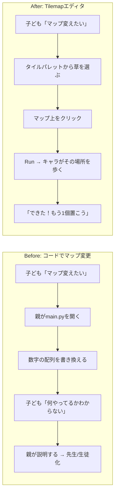

### J02: 道を作る

子どもが草タイルを並べて、町と町をつなぐ道を作る。

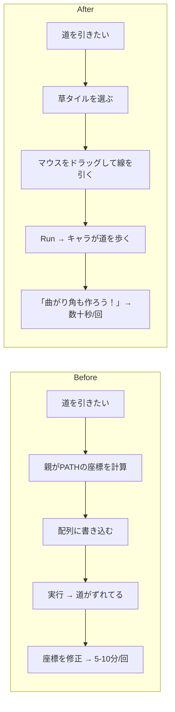

### J03: 森を作る

子どもが木タイルを密集させて、「ロジックのもり」を自分で拡張する。

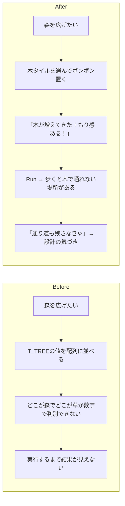

### J04: 水辺を作る

子どもが水タイルと岸タイルを組み合わせて湖や川を作る。

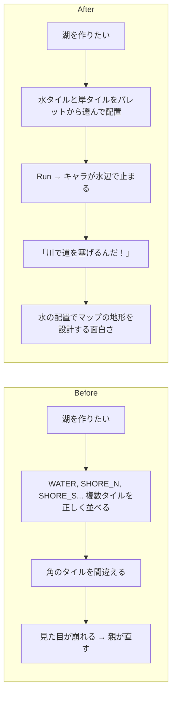

### J05: 装飾で世界を彩る

子どもが花・岩・キノコなどの装飾タイルを配置して、ゾーンに個性を持たせる。

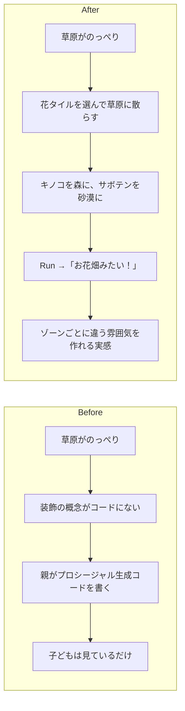

### J06: 迷路を作る

子どもが壁と道を組み合わせて、洞窟の中に迷路を設計する。

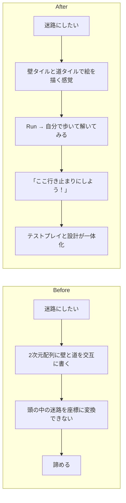

### J07: ランドマークを配置する

子どもがマルチタイルの世界樹や通信塔を好きな場所に配置する。

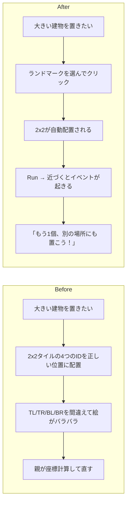

---

## 直すループ（テストプレイ → 親がAIで修正）

### J08: 敵が強すぎる

子どもがテストプレイで「この敵強すぎ！」→ 親がAIにHP調整を頼む。

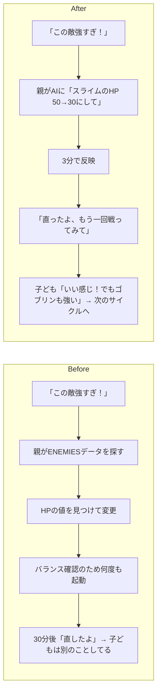

### J09: セリフを変えたい

子どもが「この人のセリフつまんない」→ 親がAIに面白いセリフを考えてもらう。

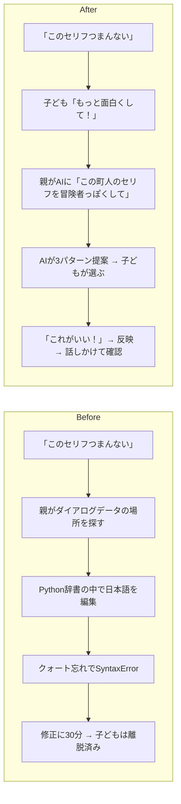

### J10: 新しい敵を追加したい

子どもが「ドラゴン出したい！」→ 親がAIに敵データの追加を頼む。

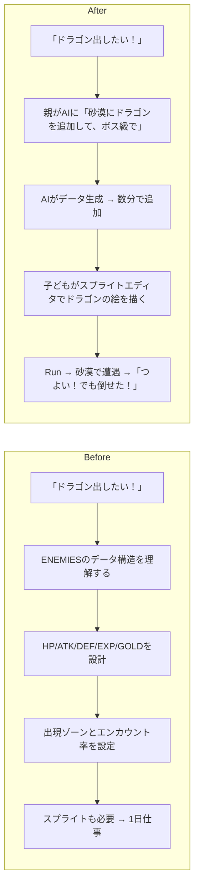

### J11: BGMの雰囲気を変えたい

子どもが「この音楽暗すぎる」→ 親がAIに曲調の変更を頼む。

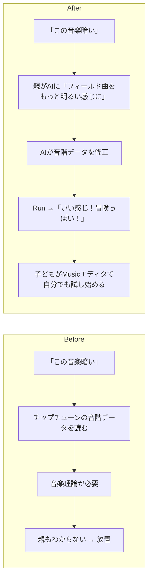

### J12: 歩いたら壁にハマった

子どもがテストプレイ中にバグを発見 → 親がAIで修正。

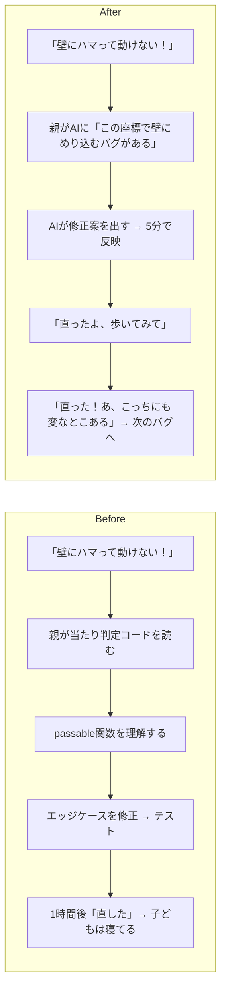

### J13: 新しい呪文がほしい

子どもが「かっこいい技出したい」→ 親がAIに呪文追加を頼む。

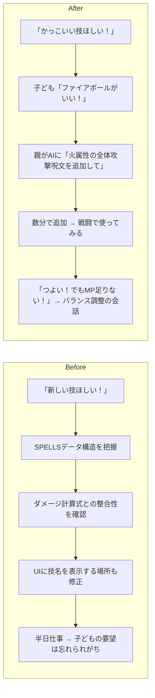

### J14: マップが広すぎて迷う

子どもがテストプレイで迷子になる → 親がAIにガイド機能を追加してもらう。

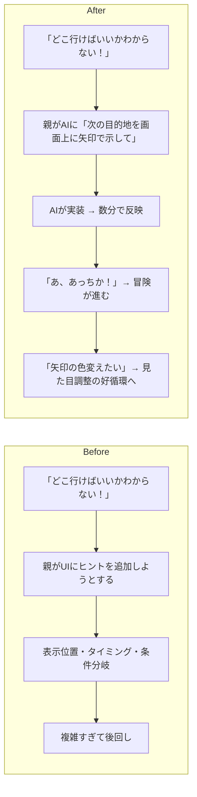

---

## 磨くループ（親が方針を決め、AIが演出を自動生成する）

演出（BGM・SFX・VFX）がないと、マップや敵を追加しても「動くだけ」で止まる。「ちゃんとしたゲーム」に見えるかどうかは、最低限の演出があるかどうかで決まる。ただし演出の実装は子どもの手には余る。ここは親が方針を考え、AIに生成させる領域。

### J15: フィールドBGMをゾーンごとに付ける

親が「草原は明るく、森は神秘的に」と方針を決め、AIがチップチューンデータを生成する。

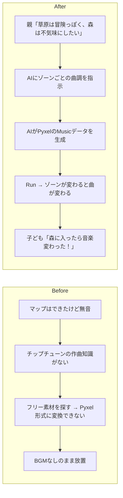

### J16: 戦闘BGMを付ける

戦闘に入ったときにBGMが切り替わるだけで、緊張感がまったく変わる。

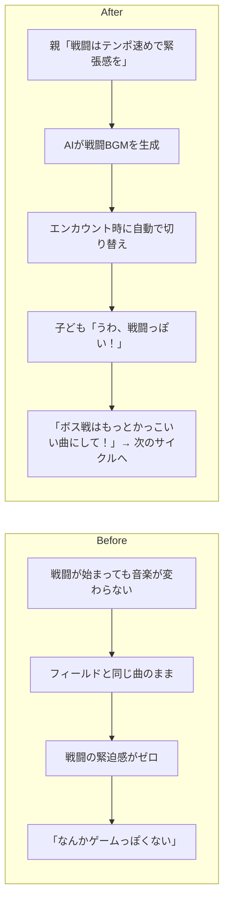

### J17: 効果音をイベントに紐づける

攻撃、回復、レベルアップ、扉を開けるなど、操作に音がつくと「手ごたえ」が生まれる。

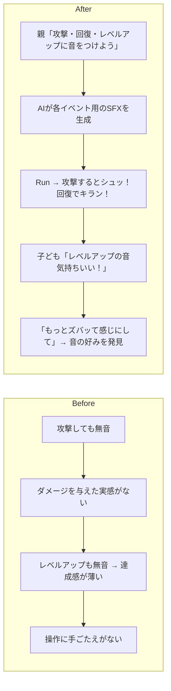

### J18: ダメージ演出を付ける

画面フラッシュや点滅など、最低限のVFXでゲームの「手ざわり」が激変する。

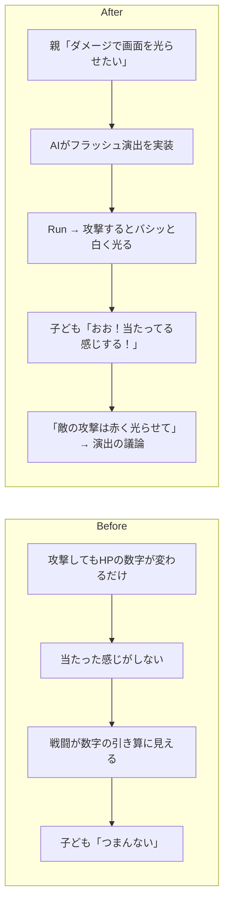

### J19: 場面転換の演出

町に入る、戦闘が始まる、セーブする。場面が変わるときのフェードが「それっぽさ」を一気に上げる。

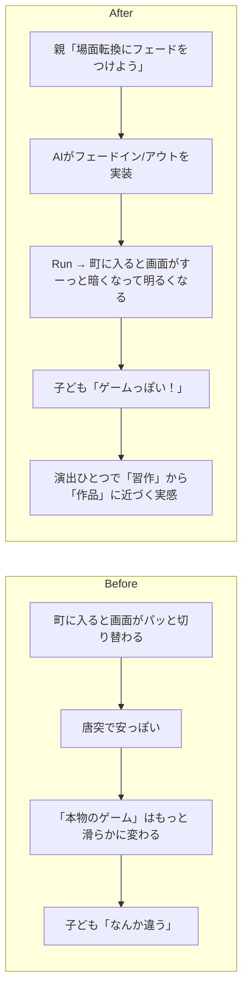

### J20: 演出の有無でゲームの印象が変わることを体験する

親が演出を一括でON/OFFして、子どもと一緒に違いを確認する。

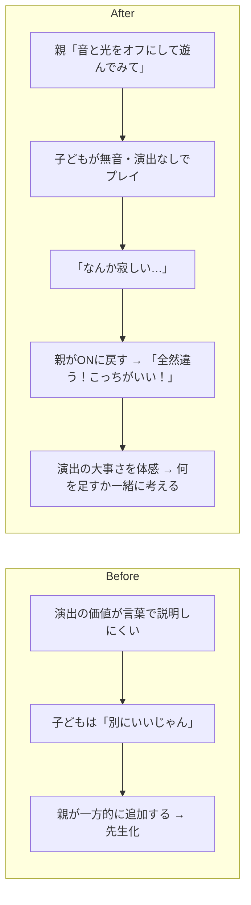

---

## 共有ループ（外に見せる・フィードバックをもらう）

スマホで遊べることが、このループの起点になる。友達はURLを開くだけ――インストールも会員登録も不要。この手軽さが「ちょっとやってみて」を可能にし、フィードバックの出し手を親子の外にまで広げる。フィードバックが増えると好循環が速く回り、プロダクトの進化が加速する。

### J21: 友達に見せる

子どもが作ったゲームを友達にURLで送る。スマホで即プレイできることが「見せる」のハードルを劇的に下げる。

```mermaid
flowchart LR
    subgraph Before["Before"]
        B1[「友達に見せたい！」] --> B2[ビルド → zipを渡す]
        B2 --> B3[「どうやって開くの？」「.exe怖い」]
        B3 --> B4[友達の環境で動かない]
        B4 --> B5[見せるのを諦める]
    end
    subgraph After["After"]
        A1[「友達に見せたい！」] --> A2[URLをLINEで送る]
        A2 --> A3[友達がスマホで開く → 即プレイ]
        A3 --> A4[「え、これ作ったの！？すごい！」]
        A4 --> A5[子どもの誇り → もっと作りたい]
    end
```

### J22: 友達のフィードバックを反映する

友達がスマホで遊んで「ここ難しすぎ」→ 子どもが「直して！」と判断 → 親がAIで直す → URLを再送信 → 友達がすぐ確認。スマホで即プレイできるから、フィードバック→修正→再確認のサイクルがその場で何周も回る。ただし、友達のフィードバックをどう扱うか（直すか・無視するか・後回しにするか）を決めるのは子ども。親が勝手にトリアージしない。

```mermaid
flowchart LR
    subgraph Before["Before"]
        B1[友達「ここ難しい」] --> B2[メモしておく → 後で直す]
        B2 --> B3[数日後に修正]
        B3 --> B4[友達はもう遊んでいない]
    end
    subgraph After["After"]
        A1[友達「ここ難しい」] --> A2[子ども「パパ直して！」]
        A2 --> A3[親がAIに頼む → 数分で修正]
        A3 --> A4[「直ったよ、もう一回やってみて」]
        A4 --> A5[友達「お、いい感じ！」→ 子ども得意顔]
    end
```

### J23: スプライトを自分で描く

子どもがスプライトエディタで主人公の見た目を変える。

```mermaid
flowchart LR
    subgraph Before["Before"]
        B1[「主人公の見た目変えたい」] --> B2[16x16ピクセルデータを数字で書く]
        B2 --> B3[16進数の色指定が読めない]
        B3 --> B4[親が代わりに描く → 子どもの「自分の」感が薄れる]
    end
    subgraph After["After"]
        A1[「主人公の見た目変えたい」] --> A2[Spriteエディタでドット絵を描く]
        A2 --> A3[色を選んでピクセルをポチポチ]
        A3 --> A4[Run →「赤い帽子にした！」]
        A4 --> A5[「自分のキャラ」という所有感]
    end
```

### J24: 効果音を自分で作る

子どもがSoundエディタで攻撃音や回復音を作る。

```mermaid
flowchart LR
    subgraph Before["Before"]
        B1[「攻撃音変えたい」] --> B2[音データの数値配列を編集]
        B2 --> B3[波形・音程・長さの関係がわからない]
        B3 --> B4[適当に変える → 変な音 → やめる]
    end
    subgraph After["After"]
        A1[「攻撃音変えたい」] --> A2[Soundエディタで音程をマウスで描く]
        A2 --> A3[再生ボタンで試聴]
        A3 --> A4[「ビシュー！って感じにしたい」→ 波形を調整]
        A4 --> A5[Run → 戦闘で鳴る →「これこれ！」]
    end
```

### J25: 親子で役割を交代する

親がマップを描き、子どもがテストプレイヤーになる。ただし「何を作るか」「何を直すか」の判断は常に子ども側にある。役割が交代しても、ハンドルは子どもが握っている。

```mermaid
flowchart LR
    subgraph Before["Before"]
        B1[親がコードを書く] --> B2[子どもは横で見ているだけ]
        B2 --> B3[「まだ？」「もうちょっと」]
        B3 --> B4[役割が固定 → 退屈]
    end
    subgraph After["After"]
        A1[親「今度はパパが描くから、テストしてね」] --> A2[親がTilemapで新エリアを作る]
        A2 --> A3[子どもがプレイ →「ここ壁で詰む！」]
        A3 --> A4[親「あ、ほんとだ。直すね」]
        A4 --> A5[立場が入れ替わっても対等 → 仲間の関係]
    end
```

### J26: 「自分たちのゲーム」と言えるようになる

何度もサイクルを回した結果、元のゲームから大きく変わり、子どもが「自分のゲーム」と認識する。

```mermaid
flowchart LR
    subgraph Before["Before"]
        B1[既製のゲームを遊ぶ] --> B2[楽しいけど「誰かが作ったもの」]
        B2 --> B3[飽きたら次のゲームへ]
        B3 --> B4[作る側の実感がない]
    end
    subgraph After["After"]
        A1[最初は既存のBlock Questを改造] --> A2[マップを変え、敵を足し、セリフを書き換え]
        A2 --> A3[気づけばオリジナル部分が半分以上]
        A3 --> A4[「これ、ぼくが作ったゲームだよ」]
        A4 --> A5[友達に見せる → 褒められる → もっと作る]
    end
```

---

## 育てるループ（好循環を重ねて成長する）

### J27: ストーリーの分岐を作る

子どもが「選択肢で話が変わるようにしたい」→ 親がAIにダイアログ分岐を頼む。

```mermaid
flowchart LR
    subgraph Before["Before"]
        B1[「はい/いいえで変わるようにしたい」] --> B2[条件分岐のロジックを書く]
        B2 --> B3[フラグ管理・状態遷移が複雑]
        B3 --> B4[親でも設計に時間がかかる → 後回し]
    end
    subgraph After["After"]
        A1[子ども「王様にNoって言ったらどうなる？」] --> A2[親がAIに「王様の依頼を断る分岐を追加して」]
        A2 --> A3[AIが分岐ダイアログを生成]
        A3 --> A4[Run →「断ったら怒られた！おもしろい！」]
        A4 --> A5[「じゃあ3回断ったらどうなる？」→ 物語の共同設計]
    end
```

### J28: 新しいエリアをまるごと追加する

マップ・敵・BGM・イベントを組み合わせて、子どもが構想した世界を実現する。

```mermaid
flowchart LR
    subgraph Before["Before"]
        B1[「雪のエリアがほしい！」] --> B2[タイル追加・敵配置・ゾーン判定・BGM…]
        B2 --> B3[やることが多すぎて1日では終わらない]
        B3 --> B4[子どもの構想は実現されないまま消える]
    end
    subgraph After["After"]
        A1[「雪のエリアがほしい！」] --> A2[子どもがTilemapで白いタイルを並べる]
        A2 --> A3[親がAIに「雪ゾーンの敵・BGM・エンカウント率を追加して」]
        A3 --> A4[数十分で「雪エリア」が動く]
        A4 --> A5[テストプレイ →「敵を雪だるまにして！」→ 次のサイクル]
    end
```

### J29: 全体のバランスを調整する

何度も敵や呪文を追加した結果、バランスが崩れてきた → 親がAIに全体調整を頼む。

```mermaid
flowchart LR
    subgraph Before["Before"]
        B1[新しい敵や技を足すたびバランスが崩れる] --> B2[全敵のHP/ATK/EXP一覧を見ながら手動調整]
        B2 --> B3[調整→テスト→また調整のループが地味で長い]
        B3 --> B4[子どもは退屈 → 離脱]
    end
    subgraph After["After"]
        A1[親「全体的に後半が簡単すぎるね」] --> A2[AIに「ゾーン3以降の敵を1.5倍にして経験値カーブも調整して」]
        A2 --> A3[AIが全データを一括調整]
        A3 --> A4[子どもが通しプレイで確認「うん、ちょうどいい！」]
        A4 --> A5[数値調整はAI、面白いかの判断は子ども]
    end
```

### J30: エンディングを自分たちで書く

ゲームの最後を自分たちの言葉で飾る。好循環の集大成。

```mermaid
flowchart LR
    subgraph Before["Before"]
        B1[エンディングは元のまま] --> B2[自分たちが作った感じがしない]
        B2 --> B3[「クリアしたけど、これ誰の話？」]
    end
    subgraph After["After"]
        A1[子ども「エンディング変えたい！」] --> A2[親子でセリフを考える → AIが実装]
        A2 --> A3[クレジットに子どもの名前を入れる]
        A3 --> A4[Run → エンディング到達]
        A4 --> A5[「このゲーム、ぼくたちが作ったんだ」]
    end
```

---

## 守るループ（子どもの主体性をシステムで守る）

好循環が速く回るほど、親が「しゃしゃり出す」リスクも上がる。AIで何でも数分で直せるから、子どもに聞かずに先回りしてしまう。「承認キュー」は、この問題をシステムで防ぐ仕組み。親がAIに頼んだ変更は、子どもが「OK」するまで反映されない。ハンドルを子どもが握り続けるためのブレーキ。

### J31: 子どもが変更を承認する

親がAIに頼んだ修正を、子どもが「これにする！」と承認して初めてゲームに反映される。

```mermaid
flowchart LR
    subgraph Before["Before: 親が直接反映"]
        B1[子ども「この敵強すぎ」] --> B2[親がAIに頼む]
        B2 --> B3[即反映 → Run]
        B3 --> B4[子ども「あれ、なんか変わった？」]
        B4 --> B5[何が変わったかわからない → 所有感が薄れる]
    end
    subgraph After["After: 承認キュー"]
        A1[子ども「この敵強すぎ」] --> A2[親がAIに頼む]
        A2 --> A3[「スライムのHP 50→30」と表示される]
        A3 --> A4[子ども「うん、それでいい！」→ 承認]
        A4 --> A5[反映 → Run →「よし、ちょうどいい！」]
    end
```

### J32: 子どもが変更を却下する

親がAIに頼んだ修正を、子どもが「やっぱりやめる」と却下できる。親の判断より子どもの感覚が優先される。

```mermaid
flowchart LR
    subgraph Before["Before: 親が正しいと押し通す"]
        B1[親「バランス的にHP下げたほうがいい」] --> B2[親が修正して反映]
        B2 --> B3[子ども「前のほうがよかった…」]
        B3 --> B4[戻し方がわからない → 受け入れるしかない]
        B4 --> B5[親の判断が常に優先 → 先生/生徒化]
    end
    subgraph After["After: 却下できる"]
        A1[親がAIに修正を頼む] --> A2[「スライムのHP 50→30」と表示]
        A2 --> A3[子ども「えー、50のままがいい。強い敵のほうが燃える！」]
        A3 --> A4[却下 → 変更は破棄される]
        A4 --> A5[子どもの感覚が最終決定 → 対等な関係が保たれる]
    end
```

### J33: 子どもが変更を選んで適用する

親がAIに複数の修正を頼んだとき、子どもがどれを採用するか・どの順で入れるかを選ぶ。優先順位を決めるのは子ども。

```mermaid
flowchart LR
    subgraph Before["Before: 親がまとめて反映"]
        B1[友達から3つフィードバック] --> B2[親が全部まとめてAIに頼む]
        B2 --> B3[一括反映 → 何が変わったか子どもにはわからない]
        B3 --> B4[子どもの意見を聞かずに進む → お客さん化]
    end
    subgraph After["After: 子どもが選ぶ"]
        A1[友達から3つフィードバック] --> A2[親がAIに3つの修正案を作らせる]
        A2 --> A3[承認キューに3件並ぶ]
        A3 --> A4[子ども「まずこれ！次はこれ！これはいらない」]
        A4 --> A5[1つずつ反映 → テストプレイ → 次を選ぶ]
    end
```

---

## ジャーニー一覧

| # | 分類 | タイトル | ジョブ |
|---|---|---|---|
| J01 | 作る | はじめてのタイル配置 | J2: 好循環 |
| J02 | 作る | 道を作る | J2: 好循環 |
| J03 | 作る | 森を作る | J2: 好循環 |
| J04 | 作る | 水辺を作る | J2: 好循環 |
| J05 | 作る | 装飾で世界を彩る | J2: 好循環 |
| J06 | 作る | 迷路を作る | J2: 好循環 |
| J07 | 作る | ランドマークを配置する | J2: 好循環 |
| J08 | 直す | 敵が強すぎる | J1: コミュニケーション, J2: 好循環 |
| J09 | 直す | セリフを変えたい | J1: コミュニケーション, J2: 好循環 |
| J10 | 直す | 新しい敵を追加したい | J2: 好循環 |
| J11 | 直す | BGMの雰囲気を変えたい | J2: 好循環 |
| J12 | 直す | 歩いたら壁にハマった | J1: コミュニケーション, J2: 好循環 |
| J13 | 直す | 新しい呪文がほしい | J1: コミュニケーション, J2: 好循環 |
| J14 | 直す | マップが広すぎて迷う | J2: 好循環 |
| J15 | 磨く | フィールドBGMをゾーンごとに付ける | J3: アウトプット品質 |
| J16 | 磨く | 戦闘BGMを付ける | J3: アウトプット品質 |
| J17 | 磨く | 効果音をイベントに紐づける | J3: アウトプット品質 |
| J18 | 磨く | ダメージ演出を付ける | J3: アウトプット品質 |
| J19 | 磨く | 場面転換の演出 | J3: アウトプット品質 |
| J20 | 磨く | 演出ON/OFFで違いを体験する | J1: コミュニケーション, J3: アウトプット品質 |
| J21 | 共有 | 友達に見せる | J2: 好循環, J3: アウトプット品質 |
| J22 | 共有 | 友達のフィードバックを反映する | J1: コミュニケーション, J2: 好循環, J3: アウトプット品質 |
| J23 | 共有 | スプライトを自分で描く | J2: 好循環, J3: アウトプット品質 |
| J24 | 共有 | 効果音を自分で作る | J2: 好循環, J3: アウトプット品質 |
| J25 | 共有 | 親子で役割を交代する | J1: コミュニケーション |
| J26 | 共有 | 「自分たちのゲーム」と言える | J1, J2, J3 すべて |
| J27 | 育てる | ストーリーの分岐を作る | J1: コミュニケーション, J2: 好循環 |
| J28 | 育てる | 新しいエリアをまるごと追加する | J2: 好循環, J3: アウトプット品質 |
| J29 | 育てる | 全体のバランスを調整する | J2: 好循環 |
| J30 | 育てる | エンディングを自分たちで書く | J1, J2, J3 すべて |
| J31 | 守る | 子どもが変更を承認する | J1: コミュニケーション, J2: 好循環 |
| J32 | 守る | 子どもが変更を却下する | J1: コミュニケーション |
| J33 | 守る | 子どもが変更を選んで適用する | J1: コミュニケーション, J2: 好循環 |
