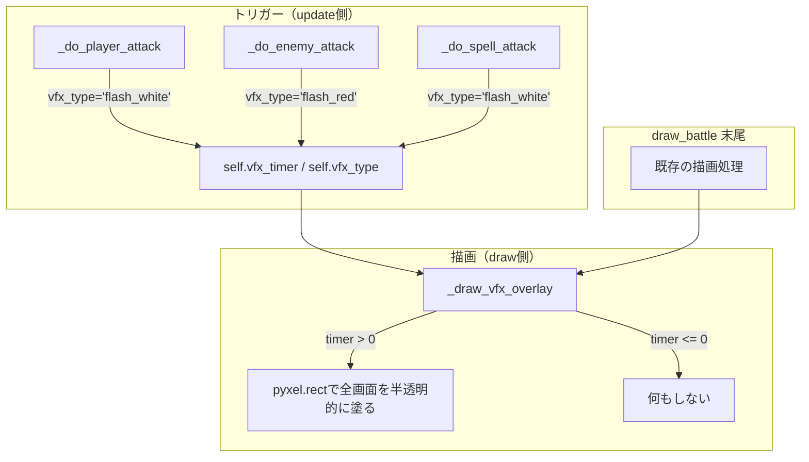

# Structure Design: Damage VFX（ダメージ演出）

- 対象ジャーニー: J18
- 対象gherkin: [`gherkin-av.md`](./gherkin-av.md) の J18 セクション
- 作成日: 2026-04-10

---

## 1. 現状

戦闘画面（`draw_battle`）には**視覚的なフィードバックが一切ない**。

- プレイヤーが攻撃 → テキスト「○○に △△ ダメージ！」が表示されるだけ
- 敵が攻撃 → テキスト「○○から △△ ダメージ！」が表示されるだけ
- 画面の見た目は攻撃前後で変化しない
- SFXは `sfx.play("attack")` / `sfx.play("hit")` で鳴るが、目に見える変化がない

結果として「当たった感じがしない」「戦闘が数字の引き算に見える」。

---

## 2. 設計方針

### 原則

- **フレームカウンタベース**: Pyxelに透明度やブレンドモードはない。`pyxel.frame_count` を使った時限式の色変化で演出する
- **既存描画パイプラインへの最小侵入**: `draw_battle` の末尾にオーバーレイを1層追加するだけ
- **データはmain.py内**: 外部ファイル不使用（C1, A2準拠）
- **演出なしでも動く**: VFX状態が未設定ならオーバーレイをスキップ（gherkin共通条件準拠）

### やること / やらないこと

| やること | やらないこと |
|---|---|
| 画面フラッシュ（全画面を一瞬単色で塗る） | パーティクルエフェクト |
| 敵スプライトの点滅（被ダメ時） | スプライトの拡縮・回転アニメーション |
| 色は攻撃=白(7)、被ダメ=赤(8) | 複雑なカラーパレット切り替え |

---

## 3. 構成図



---

## 4. データ構造

### VFX状態（Gameインスタンス変数）

```python
# __init__ に追加
self.vfx_timer = 0      # 残りフレーム数。0 = 演出なし
self.vfx_type = ""       # "flash_white" | "flash_red" | ""
```

### VFX定義（定数）

```python
VFX_FLASH = {
    "flash_white": {"color": 7, "duration": 4},   # 白フラッシュ 4フレーム
    "flash_red":   {"color": 8, "duration": 6},    # 赤フラッシュ 6フレーム
}
```

4フレーム = 約0.13秒（30fps時）。一瞬だが確実に目に入る長さ。

---

## 5. 処理フロー

### 5-1. トリガー（update側）

`_do_player_attack` と `_do_enemy_attack` の既存コードに**1行ずつ追加**するだけ。

```
_do_player_attack:
    ...
    self.sfx.play("attack")
    self.battle_enemy_hp = max(0, self.battle_enemy_hp - dmg)
+   self._start_vfx("flash_white")     # ← 追加
    ...

_do_enemy_attack:
    ...
    self.sfx.play("hit")
    p["hp"] = max(0, p["hp"] - dmg)
+   self._start_vfx("flash_red")       # ← 追加
    ...
```

### 5-2. VFX開始

```python
def _start_vfx(self, vfx_type):
    cfg = VFX_FLASH.get(vfx_type)
    if cfg:
        self.vfx_type = vfx_type
        self.vfx_timer = cfg["duration"]
```

### 5-3. VFXタイマー更新（update側）

`update_battle` の**先頭**でデクリメント。戦闘フェーズとは独立に動く。

```python
def update_battle(self):
    if self.vfx_timer > 0:
        self.vfx_timer -= 1
    # ... 既存の戦闘ロジック
```

### 5-4. VFX描画（draw側）

`draw_battle` の**末尾**で呼ぶ。既存の描画をすべて終えた上にオーバーレイを載せる。

```python
def _draw_vfx_overlay(self):
    if self.vfx_timer <= 0:
        return
    cfg = VFX_FLASH.get(self.vfx_type)
    if not cfg:
        return
    # フレーム交互に色を載せる（点滅効果）
    if self.vfx_timer % 2 == 0:
        pyxel.rect(0, 0, 256, 256, cfg["color"])
```

**ポイント**: `vfx_timer % 2 == 0` で偶数フレームだけ塗ることで、画面が完全に塗りつぶされるのではなく**点滅**になる。これにより：
- 奇数フレーム → 通常の戦闘画面が見える
- 偶数フレーム → 単色で塗られる
- 人間の目には「バシッと光った」ように見える

### 5-5. draw_battle への組み込み

```python
def draw_battle(self):
    # ... 既存の描画処理すべて ...
    
    # 末尾に追加
    self._draw_vfx_overlay()
```

---

## 6. 影響範囲

| ファイル | 変更内容 | 行数目安 |
|---|---|---|
| main.py `__init__` | `vfx_timer`, `vfx_type` 初期化 | +2行 |
| main.py 定数エリア | `VFX_FLASH` 辞書 | +4行 |
| main.py `_start_vfx` | 新規メソッド | +5行 |
| main.py `_draw_vfx_overlay` | 新規メソッド | +7行 |
| main.py `_do_player_attack` | `_start_vfx("flash_white")` 呼び出し | +1行 |
| main.py `_do_enemy_attack` | `_start_vfx("flash_red")` 呼び出し | +1行 |
| main.py `update_battle` | `vfx_timer` デクリメント | +2行 |
| main.py `draw_battle` | `_draw_vfx_overlay()` 呼び出し | +1行 |
| **合計** | | **約23行** |

### 触らないもの

- 戦闘ロジック（ダメージ計算、フェーズ遷移）
- SFXシステム（既存の`sfx.play`はそのまま）
- セーブ/ロード
- 他の画面の描画

---

## 7. Gherkin との対応

| Gherkin シナリオ | 本設計での担保 |
|---|---|
| 敵にダメージを与えたとき画面が白くフラッシュする | `_do_player_attack` → `_start_vfx("flash_white")` → `_draw_vfx_overlay` で白(7)を描画 |
| プレイヤーがダメージを受けたとき画面が赤く光る | `_do_enemy_attack` → `_start_vfx("flash_red")` → `_draw_vfx_overlay` で赤(8)を描画 |
| VFXがゲームの動作を妨げない | タイマーは戦闘フェーズと独立。`vfx_timer <= 0` で即スキップ。フレームレートへの影響は `pyxel.rect` 1回分のみ |
| 演出が無効でもゲームが正常に動作する | `vfx_timer` 初期値 0、`_draw_vfx_overlay` は timer <= 0 で即return |

---

## 8. 拡張余地

現在のスコープ外だが、同じ `_start_vfx` + `_draw_vfx_overlay` 機構で将来的に追加可能:

| 拡張 | 方法 |
|---|---|
| 敵スプライト点滅 | `draw_battle` 内の敵描画ループで `vfx_timer % 2` なら描画スキップ |
| レベルアップフラッシュ | `_battle_victory` 内で `_start_vfx("flash_yellow")` |
| ボスフェーズ移行演出 | `_check_boss_phase_transition` 内で `_start_vfx("flash_purple")` |
| フェードイン/アウト（J19） | `vfx_type` に `"fade_out"` を追加し、`_draw_vfx_overlay` でタイマーに応じた塗り面積を変える |
