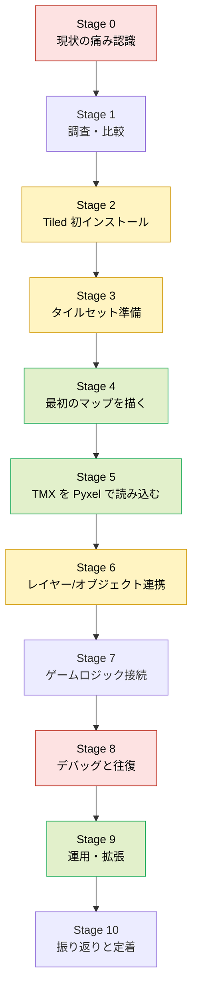
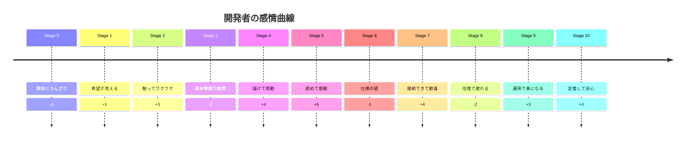
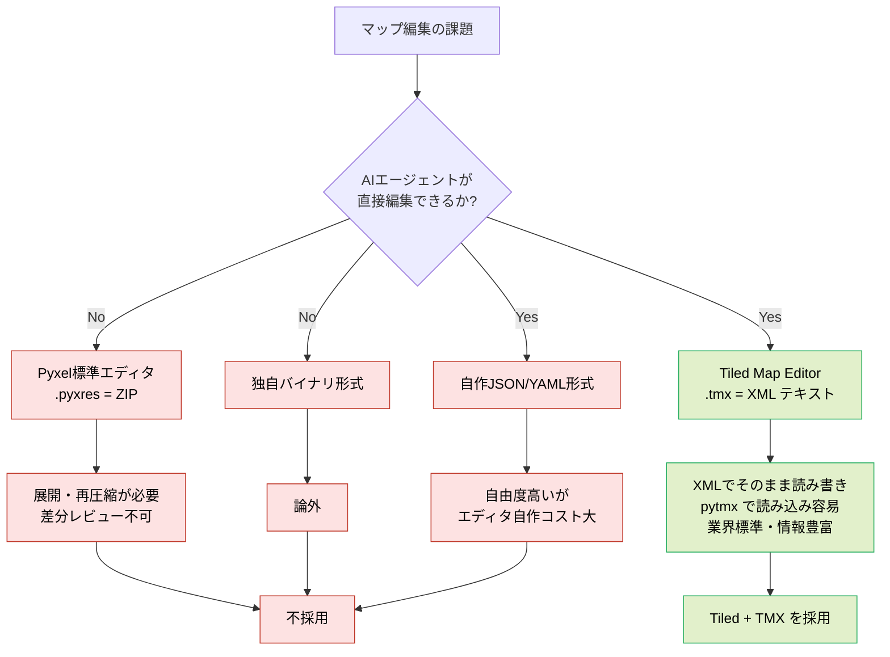
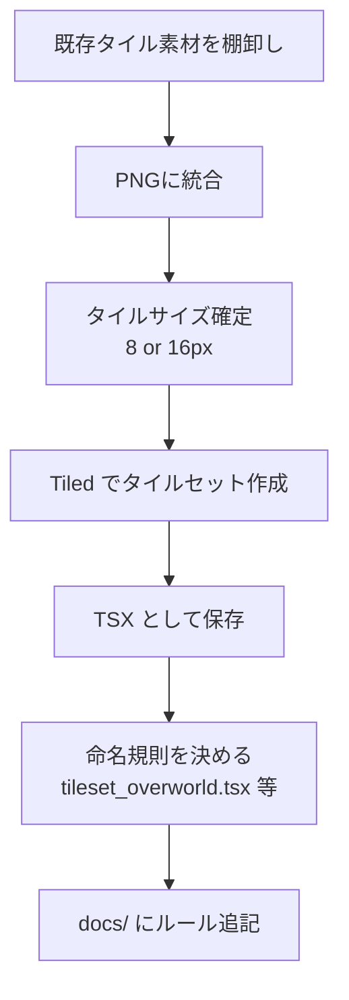
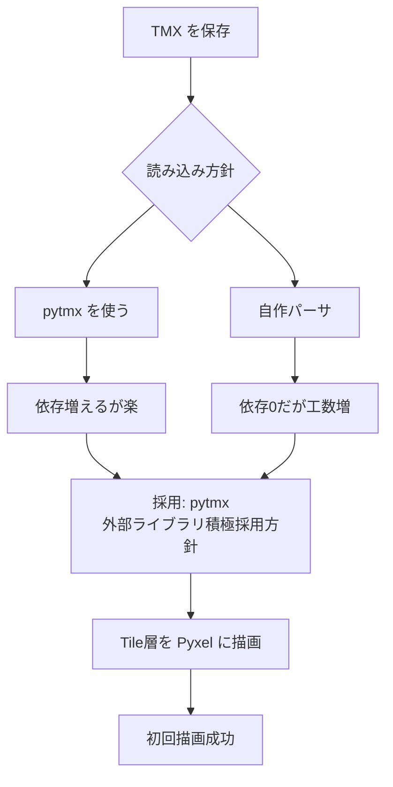
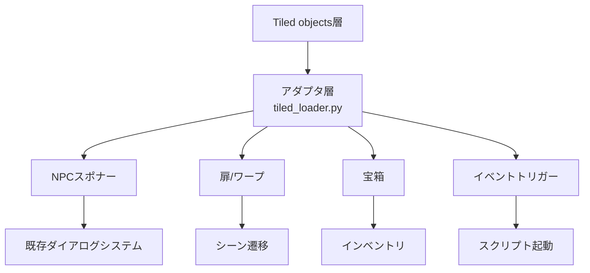

# カスタマージャーニーマップ: Tiled Map Editor 導入

- 作成日: 2026-04-06
- 対象プロジェクト: Pyxel版 code-quest
- 顧客（ユーザー）: 開発者である私（個人開発者、マップ制作も一人で担当）
- 目的: 「Tiled Map Editor で編集 → TMX を読む」という設計思想を導入した場合に、開発者として何を体験するのかを時系列で見える化し、導入判断と準備作業の抜け漏れを防ぐ。

---

## 1. ペルソナ: 個人開発者としての私

| 項目 | 内容 |
| --- | --- |
| 役割 | Pyxel版 code-quest の企画・実装・マップ制作・デバッグを一人で担当 |
| 技術背景 | Python/Pyxel、タイル描画は既知。TMX/Tiled は概念レベルで知っているが本格利用は未経験 |
| 価値観 | 「外部ライブラリ積極採用」。車輪の再発明は避けたい。ただし依存は最小限に抑えたい |
| ゴール | マップを「コードで座標を書く」のではなく、ビジュアルで編集して即ゲームに反映したい。**かつAIエージェント（Claude Code等）にも同じマップファイルを直接編集させたい** |
| 痛み | `main.py` や辞書の中に座標を直書きする辛さ、レイヤー管理の限界、差分レビューの難しさ、**バイナリ形式だとAIに任せられない** |

---

## 2. ジャーニー全体図（縦長）

---

## 3. 感情曲線（縦長タイムライン）

---

## 4. ステージ別 詳細ジャーニー

### Stage 0 — 現状の痛み認識

| 観点 | 内容 |
| --- | --- |
| 行動 | `main.py` に直書きされたマップ座標や、`dungeon.py` のハードコード配列を眺める |
| 思考 | 「町を1タイル広げるだけで3ファイル触るの、もう無理」 |
| 感情 | うんざり、停滞感 |
| 痛み点 | 差分が読めない／レイヤーがない／敵配置が座標羅列／レビュー不能／**AIエージェントに編集させづらい** |
| 期待 | ビジュアルで編集して、そのままゲームが動いてほしい。**人間もAIも同じファイルを触れる状態にしたい** |

### Stage 1 — 調査・比較

#### 最重要の前提: 「AIエージェントで編集したい」

この設計判断の **一番の軸は、AIエージェント（Claude Code等）がマップを直接読み書きできること**。つまりマップデータは **プレーンテキストで、行単位の差分が意味を持つ形式** でなければならない。

この軸を先に固めると、選択肢はほぼ自動的に絞られる。

#### 選択肢の比較表

| 選択肢 | ファイル形式 | AIエージェント編集 | Git差分 | オブジェクト層 | 学習コスト | 結論 |
| --- | --- | --- | --- | --- | --- | --- |
| Pyxel標準エディタ (`.pyxres`) | ZIP（中身はテキスト） | △ 展開/再圧縮が必要 | △ バイナリ扱い | なし | 低 | 不採用 |
| 自作エディタ | 任意 | ◎ | ◎ | 自作次第 | 極高 | 不採用 |
| Tiled Map Editor (`.tmx`) | XML（プレーンテキスト） | ◎ そのまま編集可 | ◎ 行単位で読める | あり | 中 | **採用** |

#### `.pyxres` が不採用になった理由（詳細）

- `.pyxres` は **ZIPアーカイブ**。中の `tilemap0` 等はテキスト（空白区切りのタイル番号）だが、ファイル単位ではバイナリ扱い
- AIエージェントに編集させるには毎回 「unzip → 編集 → zip」 のラウンドトリップが必要で、ワークフローが壊れる
- オブジェクト層・タイルプロパティの概念がないため、NPC配置やイベント定義をマップ側に持たせられない
- 結果として **「AIエージェントで編集したい」という第一原則を満たせない**

#### TMX が選ばれた理由

- XMLなのでエージェントが `Read`/`Edit`/`Write` でそのまま触れる
- 人間は Tiled GUI で直感的に描け、AIはテキストで精密に編集できる **二刀流** が成立する
- pytmx 等の読み込みライブラリが成熟しており、Pyxel側の実装負担が小さい

- 行動: Web・Pyxelコミュニティ・他Python製ゲームの事例を調査
- 思考: 「TMXならAIに『この部屋に宝箱を3つ追加して』と頼める。`.pyxres` じゃそれができない」
- 感情: 前向き、期待
- 意思決定: 「Tiled で編集、TMX を Pyxel で読み込み、**AIエージェントも同じTMXを直接編集する**」を正式採用

### Stage 2 — Tiled 初インストール

- 行動: Tiled をダウンロード、起動、UI を触る
- 思考: 「思ったより直感的」「ショートカット覚えたい」
- 感情: ワクワク
- リスク: バージョン差によるTMXスキーマ揺れ → インストール時のバージョンをメモしておく

### Stage 3 — タイルセット準備

- 行動: `assets/tile_*.png` を統合タイルセットに再編
- 思考: 「今のバラバラ PNG のままだと Tiled が扱いづらい」
- 感情: 疲弊、面倒くささ
- 痛み点: 素材準備コストが想定より重い
- 施策: 一度作れば資産になるので、最初に時間を投資する覚悟を決める

### Stage 4 — 最初のマップを描く

- 行動: 町マップ1枚を Tiled で描き直してみる
- 思考: 「レイヤー分け最高」「スタンプツールで一瞬」
- 感情: 感動、創作意欲の復活
- 成功体験: コードを触らずに町が広がる／縮む

### Stage 5 — TMX を Pyxel で読み込む

- 行動: `pytmx` を導入、Pyxel の描画ループから TMX を読み込む薄いアダプタを書く
- 思考: 「読み込み層は 1 ファイルに閉じたい」
- 感情: 感動（描画成功の瞬間）
- 成功基準: ゲーム画面に Tiled で描いた町がそのまま出る

### Stage 6 — レイヤー / オブジェクト連携

| レイヤー種別 | Pyxel側の扱い | 用途 |
| --- | --- | --- |
| ground       | そのまま描画 | 草・床 |
| decoration   | そのまま描画 | 木・岩 |
| collision    | 不可視、当たり判定のみ | 壁 |
| objects      | オブジェクト層として解釈 | NPC配置、イベントトリガー、宝箱 |
| spawn        | プレイヤー初期位置 | 町⇄ダンジョン遷移 |

- 行動: レイヤー命名規則を策定、Tiled のオブジェクト層で NPC や扉を配置
- 思考: 「座標直書きをゼロにしたい」「イベントキーをプロパティで持たせたい」
- 感情: 仕様固めの壁、少しストレス
- リスク: 命名規則ブレ → `docs/` で規約化

### Stage 7 — ゲームロジック接続

- 行動: `tiled_loader.py` を薄いアダプタとして用意、既存ロジックに橋渡し
- 思考: 「既存コードは壊したくない。差し替えは段階的に」
- 感情: 接続成功時に歓喜
- 設計方針: アダプタ1枚で閉じる。既存コードから見ると入口が1つだけ

### Stage 8 — デバッグと往復

- 行動: Tiled で編集 → Pyxel 再起動 → 表示確認 → Tiled に戻る
- 思考: 「ホットリロード欲しい」「保存忘れでハマる」
- 感情: 地味な疲労、繰り返しストレス
- 改善案:
  - `--watch` モードで TMX 再読み込み
  - 起動時に TMX バリデーション（未使用タイル、未命名レイヤー検出）

### Stage 9 — 運用・拡張

- 行動: 新ダンジョン追加、ボス部屋追加、町の拡張
- 思考: 「もうコードに座標は書きたくない」
- 感情: 楽、速い、楽しい
- 成果: マップ追加のリードタイムが劇的に短縮

### Stage 10 — 振り返りと定着

- 行動: ガイドを `docs/` に残す（タイルセット規約、レイヤー命名、オブジェクト種別）
- 思考: 「未来の自分のために書いておく」
- 感情: 安心、達成感
- 定着条件: 規約が `docs/steering/` か `docs/` に明文化、サンプルTMXが1枚リポジトリに存在

---

## 5. タッチポイント × 課題 × 施策（縦長表）

| Stage | タッチポイント | 主な課題 | 施策 |
| --- | --- | --- | --- |
| 0 | `main.py`, 既存マップ辞書 | 直書きで変更困難 | 可視化して痛みを言語化 |
| 1 | 検索エンジン、コミュニティ | 採用判断 | この文書で意思決定を残す |
| 2 | Tiled GUI | 学習コスト | ショートカット表を用意 |
| 3 | PNG 素材、TSX | 素材再編成 | タイルセット命名規約 |
| 4 | Tiled マップ編集 | レイヤー方針 | 命名規約を先に決める |
| 5 | pytmx, Pyxel API | 読み込み層設計 | `tiled_loader.py` に集約 |
| 6 | オブジェクト層 | 命名ブレ | プロパティキー辞書 |
| 7 | 既存ロジック | 結合リスク | アダプタ経由で段階移行 |
| 8 | 編集↔実行の往復 | 反復コスト | watch モード、バリデータ |
| 9 | docs/, 追加マップ | 再現性 | サンプルTMXを同梱 |
| 10 | `docs/steering/` | 知識散逸 | 本ドキュメント＋規約集 |

---

## 6. 成功指標（開発者として）

- マップ追加時、Python コードを 1 行も触らずに反映できる
- 新レイヤー追加が Tiled 上で完結し、アダプタ層の変更は最小
- 過去の自分が書いたマップを 3 か月後に見ても迷わず編集できる
- 依存は `pytmx`（または自作の軽量パーサ）1つに閉じる
- **AIエージェントに「この部屋に宝箱を追加して」「町の北側を拡張して」と依頼し、TMXを直接編集させられる**
- **人間はTiled GUI、AIはテキスト編集、どちらも同じTMXファイルを触って競合しない**

---

## 7. 次アクション

1. Stage 3 のタイルセット棚卸しから着手
2. `tiled_loader.py` のインターフェース案を別ドキュメントで設計
3. レイヤー命名規約とオブジェクトプロパティ辞書を `docs/steering/20260406-TiledMapEditor/` 配下に追記
4. サンプル TMX（町1枚）をリポジトリに追加して定着の起点にする
