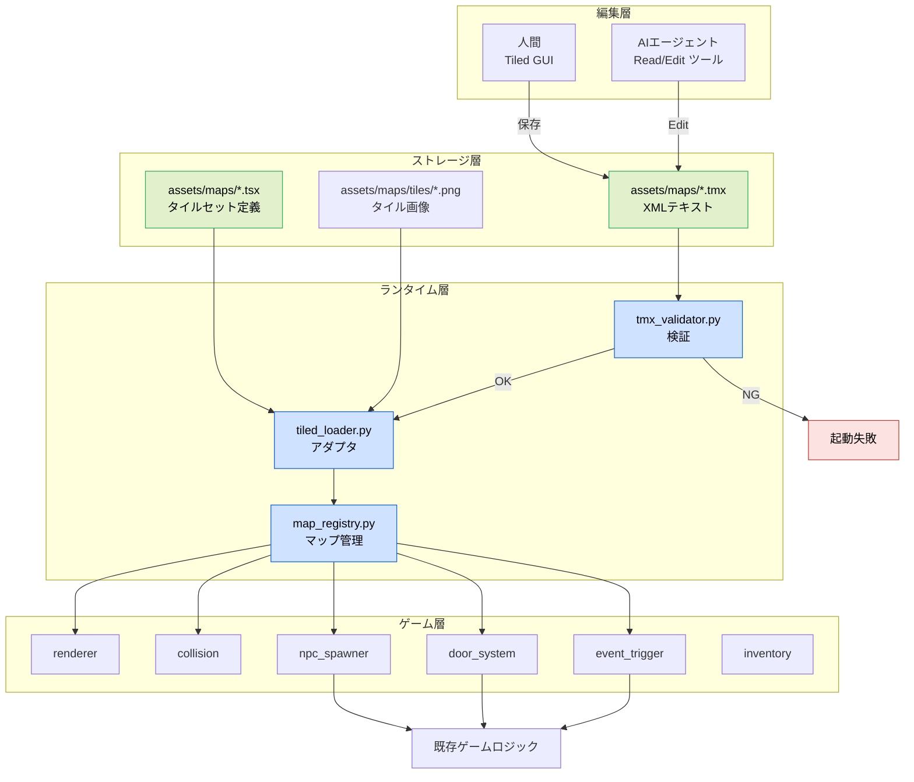
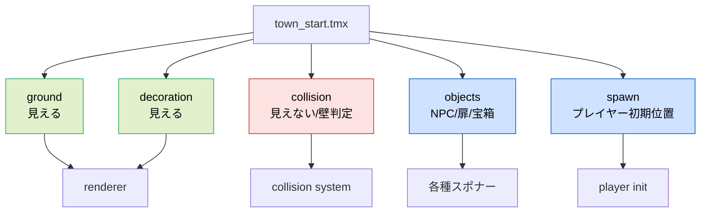
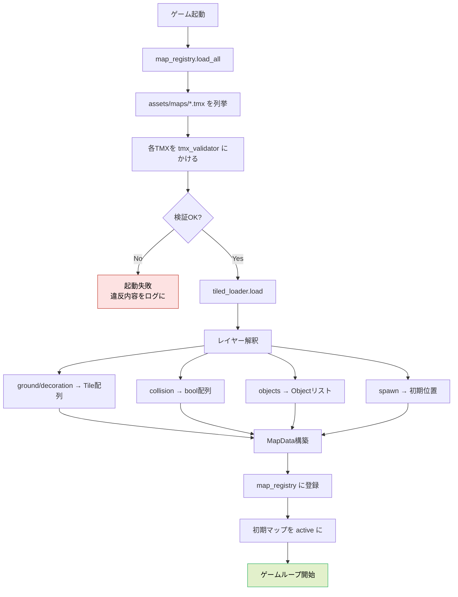
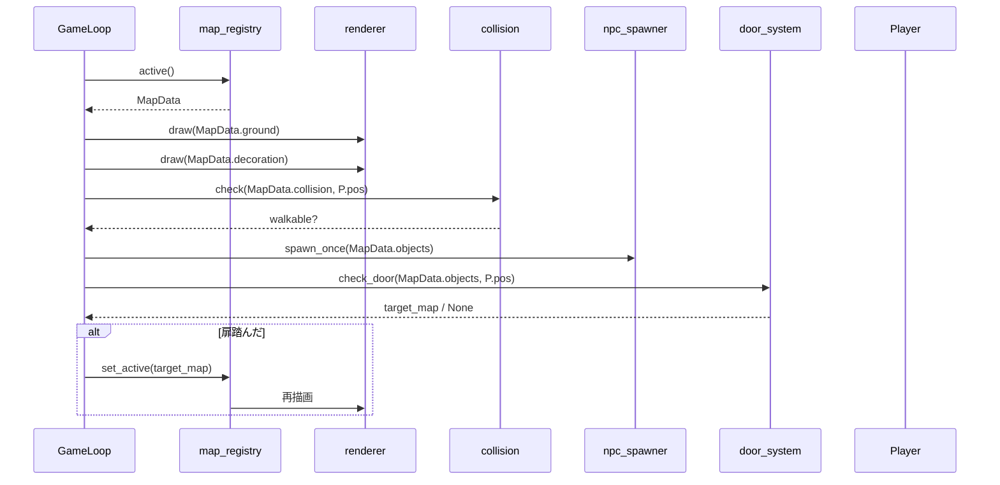
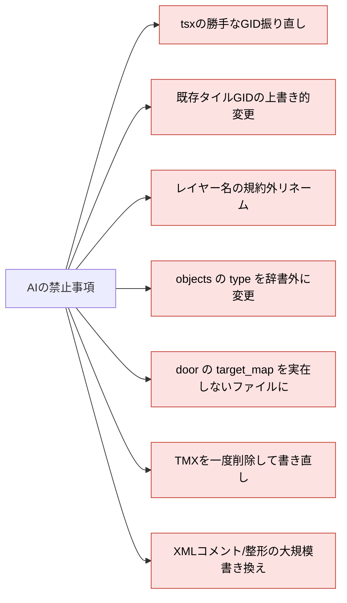
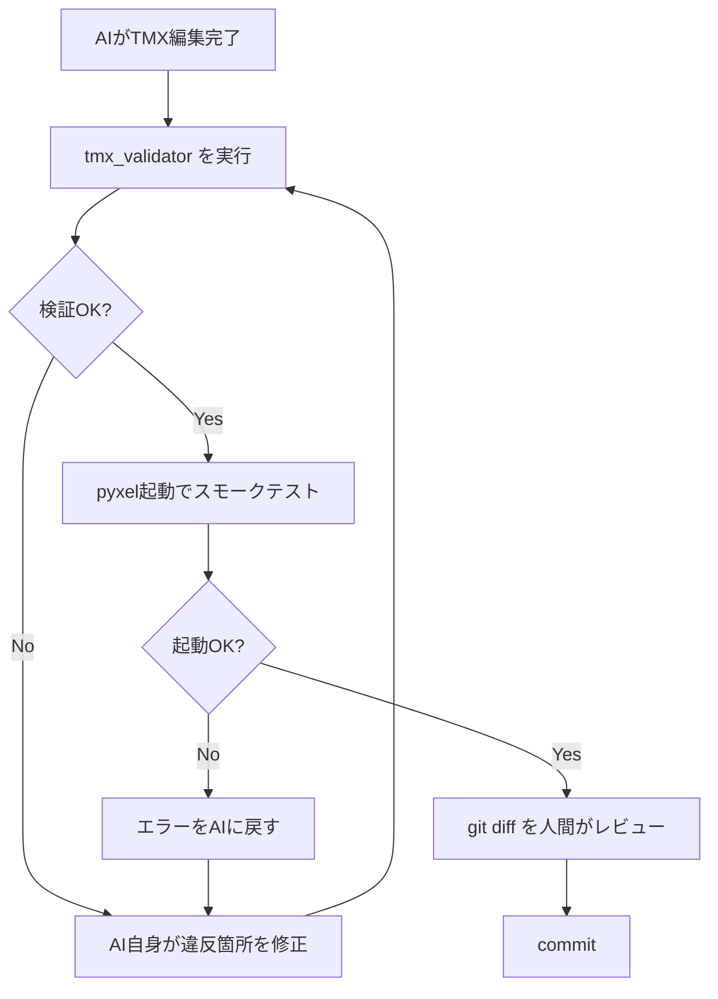
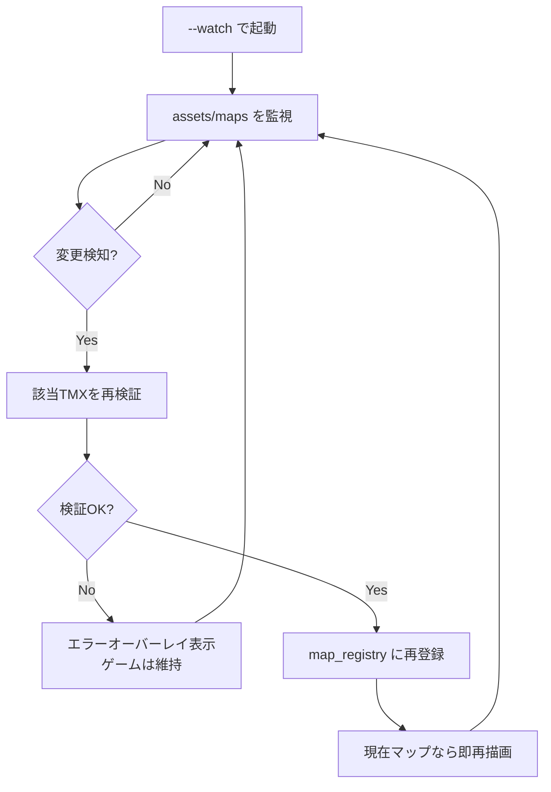
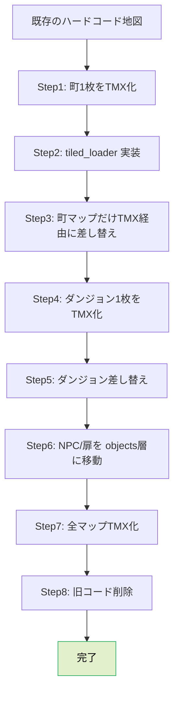

# 設計書: Tiled Map Editor + TMX + AIエージェント編集基盤

- 作成日: 2026-04-06
- 対象プロジェクト: Pyxel版 code-quest
- 関連文書: `customer-journey-map.md`, `gherkin.md`
- 目的: 「Tiled で編集 → TMX を読む」方式と「AIエージェントも同じ TMX を直接編集する」運用を、 **モジュール構成・データ形式・規約・インターフェース** のレベルで具体的に設計する。

---

## 1. 設計原則

1. **プレーンテキスト第一**: マップデータは全て人間・AI・Git がそのまま読めるテキスト（XML）で保持する
2. **アダプタ1枚ルール**: TMX とゲーム内部構造の橋渡しは `tiled_loader.py` 1枚に閉じる
3. **座標ハードコード禁止**: Python コード内にマップ座標・NPC 位置・扉位置を書かない
4. **規約で守る**: レイヤー名・オブジェクト型・プロパティ名は命名規約で強制する
5. **バリデーション必須**: 不正な TMX は起動時に必ず検出し、沈黙の失敗を許さない
6. **AI編集ファースト**: AIエージェントがラウンドトリップ（解凍/再圧縮）なしで直接編集できる形にする

---

## 2. 全体アーキテクチャ（縦長）



---

## 3. ディレクトリ構成

```
code-quest-pyxel/
├── assets/
│   └── maps/
│       ├── tiles/                  # タイル画像（PNG, 8x8 or 16x16）
│       │   ├── tileset_overworld.png
│       │   ├── tileset_dungeon.png
│       │   └── tileset_town.png
│       ├── tileset_overworld.tsx   # Tiled タイルセット定義
│       ├── tileset_dungeon.tsx
│       ├── tileset_town.tsx
│       ├── town_start.tmx          # 町マップ
│       ├── dungeon_01.tmx          # ダンジョン1階
│       └── world.tmx               # ワールドマップ
├── src/
│   ├── tiled_loader.py             # TMX → ゲーム内部構造アダプタ
│   ├── tmx_validator.py            # TMX 検証
│   ├── map_registry.py             # ロード済みマップの管理
│   ├── renderer.py                 # タイル描画
│   ├── collision.py                # 当たり判定
│   ├── npc_spawner.py              # NPC生成
│   ├── door_system.py              # 場面遷移
│   └── event_trigger.py            # イベント起動
└── docs/
    └── steering/
        └── 20260406-TiledMapEditor/
            ├── customer-journey-map.md
            ├── gherkin.md
            └── design.md           # 本書
```

---

## 4. レイヤー命名規約

TMX 内のレイヤー名は **完全固定** とし、アダプタがこの名前で解釈する。

| レイヤー名 | 種別 | 可視 | 用途 | 必須 |
| --- | --- | --- | --- | --- |
| `ground` | TileLayer | ○ | 地面（草・床・砂など） | ○ |
| `decoration` | TileLayer | ○ | 装飾（木・岩・柵） | × |
| `collision` | TileLayer | × | 当たり判定専用（非0=壁） | ○ |
| `objects` | ObjectGroup | — | NPC・扉・宝箱・イベント | × |
| `spawn` | ObjectGroup | — | プレイヤー初期位置 | ○ |



---

## 5. オブジェクトプロパティ辞書

`objects` 層に配置する各オブジェクトは、`type` 属性で種別を判定し、`properties` でパラメータを持つ。

| type | 必須プロパティ | 任意プロパティ | 挙動 |
| --- | --- | --- | --- |
| `npc` | `dialog_id` | `sprite`, `direction`, `name` | NPC を配置し、話しかけるとダイアログ起動 |
| `door` | `target_map`, `spawn_point` | `locked`, `key_id` | 踏むと別マップへ遷移 |
| `chest` | `item_id` | `gold`, `trap_id` | 開けると中身を取得 |
| `trigger` | `event_id` | `once` | 踏むとイベント起動 |
| `spawn` | `name` | `facing` | プレイヤー初期位置（spawn層専用） |

### TMXの実例

```xml
<objectgroup name="objects">
  <object id="1" name="oldman" type="npc" x="64" y="48">
    <properties>
      <property name="dialog_id" value="intro_01"/>
      <property name="sprite" value="sprite_oldman.png"/>
    </properties>
  </object>
  <object id="2" name="north_gate" type="door" x="128" y="0" width="16" height="16">
    <properties>
      <property name="target_map" value="dungeon_01.tmx"/>
      <property name="spawn_point" value="entrance"/>
    </properties>
  </object>
</objectgroup>
```

---

## 6. 読み込みフロー（縦長）



---

## 7. モジュール設計

### 7.1 `tiled_loader.py`

```python
# 疑似コード（型ヒントで意図を示す）
class MapData:
    name: str
    width: int
    height: int
    tile_size: int
    ground: list[list[int]]       # タイルGID配列
    decoration: list[list[int]]
    collision: list[list[bool]]
    objects: list[GameObject]
    spawn_points: dict[str, tuple[int, int]]

class GameObject:
    id: int
    type: str                     # npc / door / chest / trigger
    name: str
    x: int
    y: int
    properties: dict[str, str]

def load(path: str) -> MapData:
    """TMX を読み込み MapData を返す。検証は呼び出し側で済ませる前提。"""
```

### 7.2 `tmx_validator.py`

```python
class ValidationError(Exception): ...

def validate(path: str) -> None:
    """違反があれば ValidationError を投げる。"""
    # 1. ground / collision / spawn 層の存在
    # 2. レイヤー名が規約集合に含まれる
    # 3. objects の type が辞書に存在
    # 4. 必須プロパティが揃っている
    # 5. door の target_map が実在する
    # 6. 未使用GIDの警告
```

### 7.3 `map_registry.py`

```python
class MapRegistry:
    _maps: dict[str, MapData]
    _active: str | None

    def load_all(self, maps_dir: str) -> None: ...
    def get(self, name: str) -> MapData: ...
    def set_active(self, name: str) -> None: ...
    def active(self) -> MapData: ...
```

---

## 8. ランタイムのデータ流れ（縦長）



---

## 9. AIエージェント編集プロトコル

AI が TMX を編集する際の **お作法** をここで決めておく。破ると人間の作業や CI が壊れる。

### 9.1 やってよいこと

- `assets/maps/*.tmx` を `Read` して現状を把握する
- `Edit` で XML 要素の追加・属性変更・プロパティ追加を行う
- `map` 要素の `width` / `height` を増やし、各 `data` 要素を拡張する
- 新しい TMX ファイルを `Write` で作成する（対応するバリデーション通過が条件）

### 9.2 やってはいけないこと



### 9.3 AI編集後の確認フロー



---

## 10. エラー処理方針

| 種類 | 検出タイミング | 挙動 |
| --- | --- | --- |
| レイヤー命名違反 | `validate()` | 起動失敗、違反レイヤー名を表示 |
| 必須プロパティ欠如 | `validate()` | 起動失敗、オブジェクトIDとキーを表示 |
| 扉の遷移先不在 | `validate()` | 起動失敗、リンク切れを表示 |
| 未使用GID | `validate()` | 警告ログのみ、起動は続行 |
| XMLパース失敗 | `load()` | 起動失敗、パーサのエラー箇所を表示 |
| ランタイムの範囲外アクセス | `renderer`/`collision` | 警告ログ、該当タイルをスキップ |

**原則**: 沈黙の失敗を作らない。起動時に全マップを検証して、動き出したら落ちない状態にしておく。

---

## 11. パフォーマンス設計

- TMX ロードはゲーム起動時に **全マップ一括** で行う（Pyxelのマップ数は高々20枚程度を想定）
- 各 `MapData` は **メモリに常駐** させ、シーン遷移時は参照切り替えのみ
- ランタイム中の TMX 再パースは **行わない**（ホットリロード専用モードを除く）
- `collision` 層は `list[list[bool]]` ではなく `bytearray` での保持も検討（将来最適化）

---

## 12. ホットリロード（任意機能）

開発時のみ `--watch` フラグで有効化する。



---

## 13. テスト戦略

| レベル | 対象 | 手段 |
| --- | --- | --- |
| Unit | `tmx_validator` | 正常/異常TMXの固定ファイル |
| Unit | `tiled_loader` | 小さな手書きTMXで期待MapData |
| Integration | 全マップ | CI で `validate()` を全件実行 |
| Smoke | 起動 | CI でヘッドレス Pyxel 起動→即終了 |
| Regression | AI編集 | AI編集後に上記3つを自動実行 |

---

## 14. マイグレーション計画

現行の `main.py` 内ハードコード → TMX への移行手順。



**重要**: 各ステップで **ゲームは常に動く状態を保つ**。全量移行してから動かす、は禁止。

---

## 15. 未決事項

- タイルサイズを 8px にするか 16px にするかは素材棚卸し後に決定
- pytmx の採用可否（ライセンス・保守状況を確認した上で最終決定）
- Tiled のバージョン固定方針（プロジェクトルートに `.tiled-version` を置くか）
- objects プロパティスキーマを別ファイル（例: `docs/steering/20260406-TiledMapEditor/object_schema.md`）に切り出すか

---

## 16. 参照

- `customer-journey-map.md` — なぜこの設計を選ぶかの背景
- `gherkin.md` — この設計が満たすべき受け入れ基準
- Tiled 公式: https://www.mapeditor.org/
- TMX Format Spec: https://doc.mapeditor.org/en/stable/reference/tmx-map-format/
