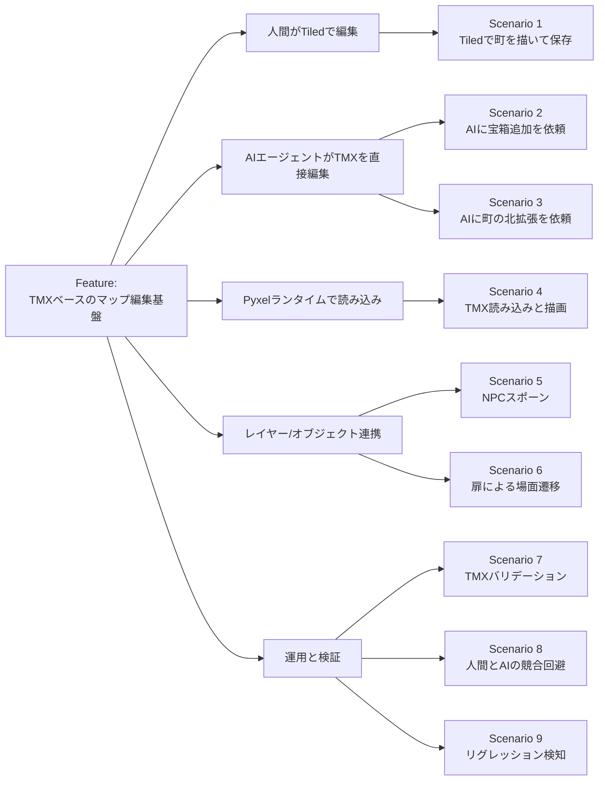
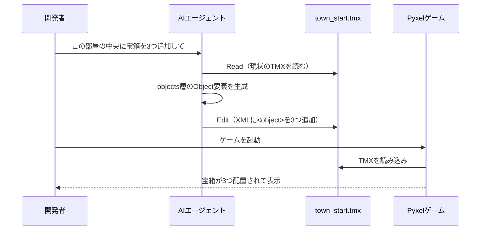
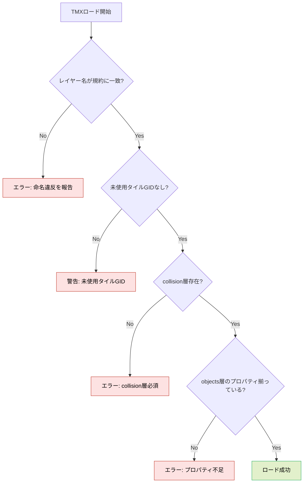
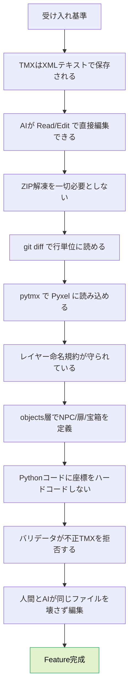

# Gherkinシナリオ: Tiled Map Editor + TMX + AIエージェント編集

- 作成日: 2026-04-06
- 対象プロジェクト: Pyxel版 code-quest
- 目的: 「Tiled で編集 → TMX を読む」設計思想と「AIエージェントも同じTMXを直接編集する」運用を、 **Given / When / Then** の振る舞い記述で明文化する。
- 読み方: 各シナリオは **「前提 → 操作 → 期待結果」** の順で書かれている。実装時の受け入れ基準としても使う。

---

## 1. 全体像（縦長フロー）



---

## 2. Feature 定義

```gherkin
Feature: TMXベースのマップ編集基盤
  個人開発者である私は
  Tiled Map Editor で描いた TMX ファイルを Pyxel ゲームに読み込みたい
  そして AIエージェント（Claude Code 等）にも同じ TMX を直接編集させたい
  なぜなら人間の直感的なビジュアル編集と
  AI のテキストベースな一括編集を同じファイルで両立したいからだ
```

---

## 3. シナリオ一覧

### Scenario 1: 人間がTiledで町を描いて保存する

```gherkin
Scenario: 人間がTiledで町を描いて保存する
  Given Tiled Map Editor がインストールされている
  And タイルセット "tileset_overworld.tsx" が存在する
  And レイヤー命名規約（ground / decoration / collision / objects / spawn）が決まっている
  When 私が Tiled を起動し、新規マップ "town_start.tmx" を作成する
  And 5つのレイヤーを規約どおりに追加する
  And ground 層に草タイルをペイントする
  And decoration 層に木と岩を配置する
  And collision 層に不可視の壁を配置する
  And ファイルを assets/maps/town_start.tmx に保存する
  Then TMX は XML プレーンテキストで保存される
  And git diff で各レイヤーの変更が行単位で読める
```

### Scenario 2: AIエージェントに宝箱の追加を依頼する



```gherkin
Scenario: AIエージェントに宝箱の追加を依頼する
  Given "assets/maps/town_start.tmx" が XML テキストとして存在する
  And TMX には objects レイヤーが含まれている
  And AIエージェントが Read/Edit ツールでリポジトリにアクセスできる
  When 私が AI に "この部屋の中央に宝箱を3つ追加して" と依頼する
  Then AI は town_start.tmx を Read で読み取る
  And AI は objects 層に <object type="chest"> を3つ Edit で追記する
  And AI は .pyxres のような ZIP 解凍/再圧縮を一切行わない
  And 追加された宝箱の座標は部屋の境界内に収まっている
  And git diff で追加された3行が明確に読める
```

### Scenario 3: AIエージェントに町の北側拡張を依頼する

```gherkin
Scenario: AIエージェントに町の北側拡張を依頼する
  Given "town_start.tmx" のマップサイズが 32x32 タイルである
  When 私が AI に "町を北側に16タイル拡張して道を繋げて" と依頼する
  Then AI は map 要素の height を 32 から 48 に変更する
  And AI は各レイヤーの data を拡張分だけ追記する
  And 既存領域のタイルインデックスは一切変更されない
  And Pyxel でゲームを起動すると拡張された町が表示される
  And プレイヤーは新エリアに移動できる
```

### Scenario 4: Pyxelランタイムが TMX を読み込んで描画する

```gherkin
Scenario: Pyxelランタイムが TMX を読み込んで描画する
  Given Pyxel プロジェクトに tiled_loader.py が実装されている
  And pytmx（または軽量パーサ）が依存として追加されている
  When ゲームを起動する
  Then tiled_loader.py は "assets/maps/town_start.tmx" を読み込む
  And ground / decoration 層がタイル単位で Pyxel 画面に描画される
  And collision 層は描画されないが当たり判定として機能する
  And 描画に要する時間は1フレーム以内に収まる
```

### Scenario 5: objects 層から NPC をスポーンする

```gherkin
Scenario: objects 層から NPC をスポーンする
  Given "town_start.tmx" の objects 層に type="npc" のオブジェクトが存在する
  And そのオブジェクトに name="oldman" と property "dialog_id=intro_01" が設定されている
  When ゲームがマップをロードする
  Then tiled_loader.py は該当オブジェクトを NPC スポーン指示として解釈する
  And 既存の NPC スポナーが "oldman" を指定座標に配置する
  And プレイヤーが話しかけると "intro_01" のダイアログが再生される
  And Python コード側に座標が一切ハードコードされていない
```

### Scenario 6: 扉オブジェクトで場面遷移する

```gherkin
Scenario: 扉オブジェクトで場面遷移する
  Given objects 層に type="door" のオブジェクトが存在する
  And そのオブジェクトに property "target_map=dungeon_01.tmx" と "spawn_point=entrance" が設定されている
  When プレイヤーが扉タイルに乗る
  Then ゲームは "dungeon_01.tmx" をロードする
  And プレイヤーは "entrance" で指定されたスポーン地点に配置される
  And 遷移はコードの変更なしで TMX 編集のみで追加できる
```

### Scenario 7: TMX バリデーションが不正なマップを拒否する



```gherkin
Scenario: TMX バリデーションが不正なマップを拒否する
  Given バリデータが tiled_loader.py に組み込まれている
  When 命名規約に違反したレイヤーを含む TMX をロードしようとする
  Then バリデータはロードを中断する
  And 違反したレイヤー名とファイル名をエラーメッセージに含める
  And ゲームは起動時に失敗を明示する

Scenario: 必須プロパティが欠けたオブジェクトを検出する
  Given type="door" のオブジェクトから target_map プロパティが欠けている
  When ゲームがマップをロードする
  Then バリデータは欠けているプロパティ名を報告する
  And 該当オブジェクトは無効化され、ゲームはクラッシュしない
```

### Scenario 8: 人間の編集と AI の編集が競合しない

```gherkin
Scenario: 人間の編集と AI の編集が同じTMXで競合しない
  Given 人間が Tiled で "town_start.tmx" を開いて編集中である
  And AI エージェントが別セッションで "town_start.tmx" の編集を依頼されている
  When AI が Edit ツールで TMX を更新する
  And 人間が Tiled で保存操作を行う
  Then どちらの保存もファイルシステム上で観測可能になる
  And git status で両者の変更が検出される
  And 競合が発生した場合は通常のテキストマージで解決できる
  And バイナリ形式に起因するマージ不能状態は発生しない
```

### Scenario 9: リグレッション検知

```gherkin
Scenario: 既存マップを壊さないリグレッションテスト
  Given CI に TMX ロードテストが組み込まれている
  When AI が任意のマップを編集する
  Then CI は全 TMX をロードしてバリデータを通す
  And 1つでも失敗すればプルリクエストはマージできない
  And 失敗したマップ名と違反内容がログに残る
```

---

## 4. 受け入れ基準サマリ（縦長チェックリスト）



---

## 5. 今後のシナリオ候補

- Scenario 10: タイルセットのバージョンアップ時の互換性維持
- Scenario 11: 複数マップ間の参照整合性（扉の遷移先が存在すること）
- Scenario 12: AIによるマップ自動生成（ダンジョンの初期レイアウト生成）
- Scenario 13: Tiled のカスタムプロパティスキーマをリポジトリで共有する
