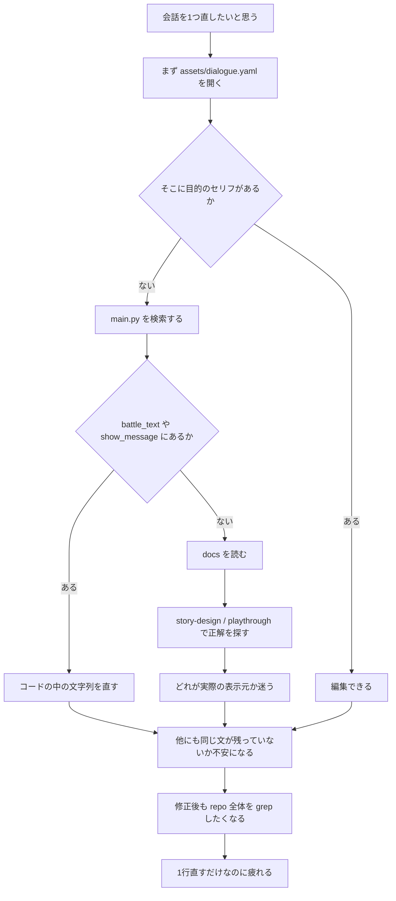
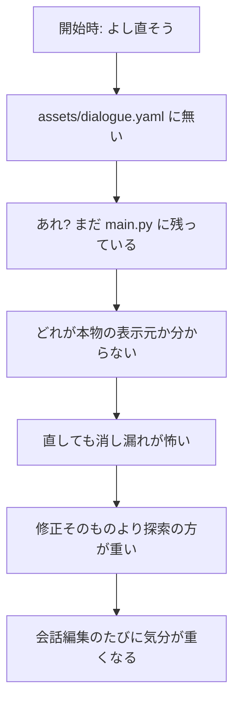
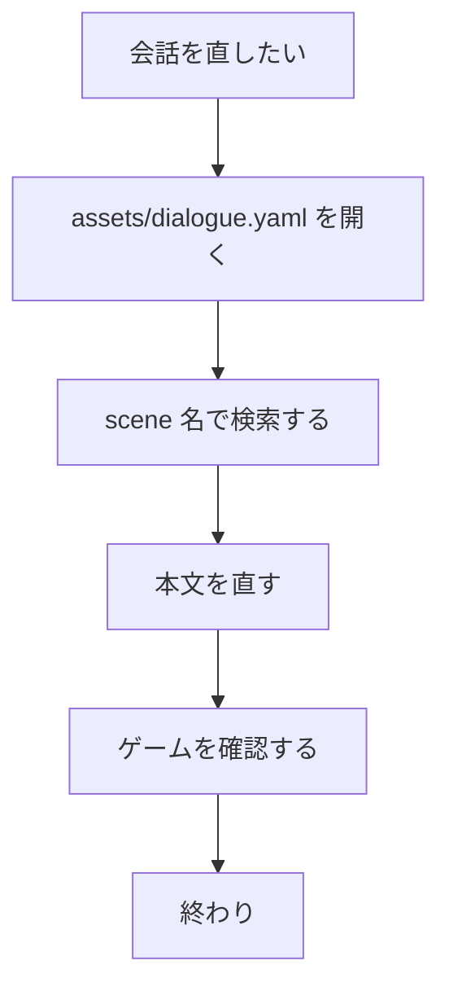
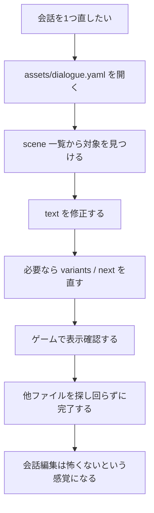
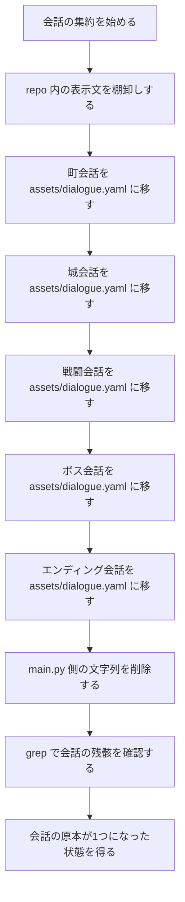
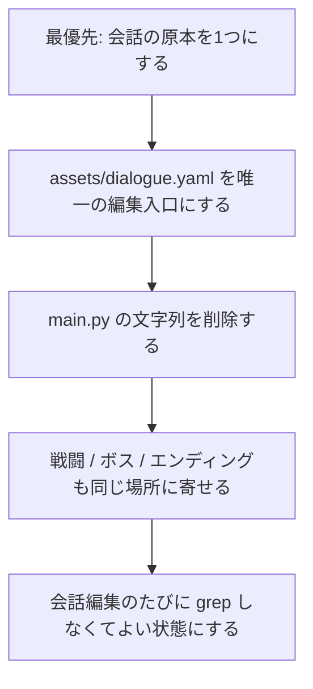

# Customer Journey Map: `assets/dialogue.yaml` 集約

この文書は、**「ゲーム内のすべての会話を `assets/dialogue.yaml` に集約し、他のファイルから消したい」** というカスタマー（あなた）の体験を整理したジャーニーマップである。

## 1. カスタマー像

- 役割: このゲームの作者
- 目的: セリフを迷わず直せる状態にしたい
- 不満: 会話が `assets/dialogue.yaml` と `main.py` などに散っていて、直す場所が毎回変わる
- 成功条件: 「会話を直す = `assets/dialogue.yaml` を開く」で済む

## 2. 現在のジャーニー

## 3. 現在の感情の流れ

## 4. カスタマーが本当に欲しい体験

- 探す場所が 1 つ
- 消す場所も 1 つ
- 正解の原本も 1 つ
- 「この文、別の場所にもあるかも」という不安がない

## 5. 理想ジャーニー

## 6. 集約作業そのもののジャーニー

## 7. ステージ別マップ

| ステージ | あなたの行動 | 頭の中 | 痛み |
|---|---|---|---|
| 会話を直したい | まずファイルを開く | 「どこにある?」 | 原本が1つではない |
| 探索する | `assets/dialogue.yaml` と `main.py` を見る | 「まだ別の場所にもありそう」 | 探索コストが高い |
| 修正する | 文字列を直す | 「これで本当に全部?」 | 消し漏れ不安が残る |
| 確認する | 実機で表示を見る | 「見た目は直ったが構造は汚いまま」 | 毎回同じ不安が再発する |
| 理想状態 | `assets/dialogue.yaml` だけ直す | 「ここが唯一の原本」 | 探索ストレスが消える |

## 8. このジャーニーマップが示す優先順位

## 9. 完了した時のあなたの状態

- 「会話を直す場所はどこ?」で止まらない
- `assets/dialogue.yaml` を見れば全体像が見える
- 会話の追加と削除が怖くない
- 仕様変更が来ても、触る中心がぶれない
