# Design: `assets/dialogue.yaml` 全会話集約

この文書は、**ゲーム中に実際に表示される会話本文を `assets/dialogue.yaml` に集約し、他の runtime ファイルから削除する**ための設計をまとめる。  
方針は一言で言うと、**「本文は YAML にだけ置く。コードは scene 名と状態だけを扱う」** である。

## 1. 設計の大方針

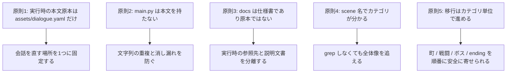

## 2. まず直すべき不整合

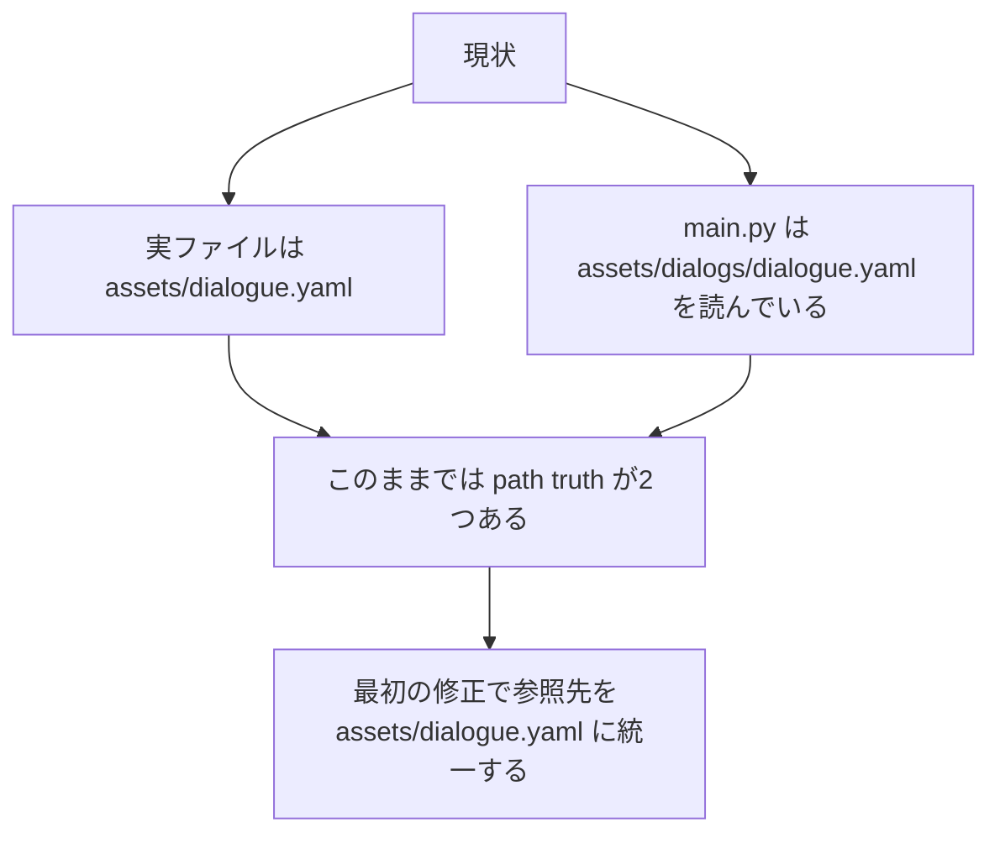

この不整合は小さく見えるが、会話原本を 1 つにする設計では最優先で解消すべきである。  
原本のパスがぶれている状態では、「どこを見ればよいか」が再び曖昧になる。

## 3. 完成後のレイヤー構成

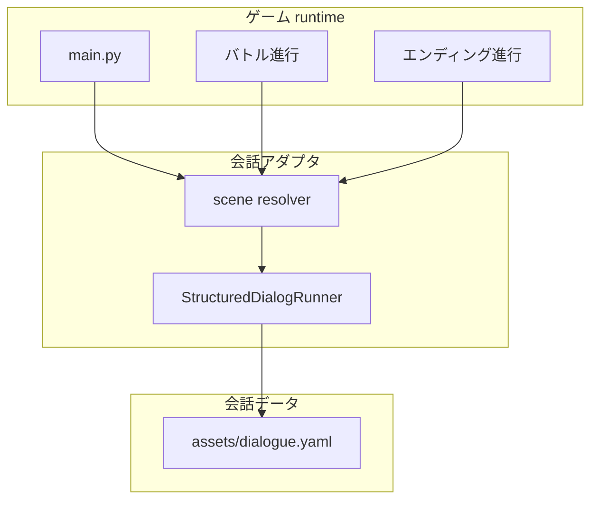

完成後、`main.py` は「どの scene を開くか」「今の状態は何か」を渡すだけにする。  
本文、分岐、連結、選択肢、ボスフェーズ文はすべて `assets/dialogue.yaml` 側に置く。

## 4. 対象範囲

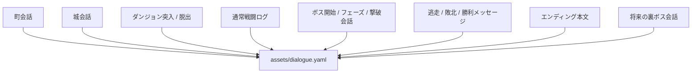

今回の設計では、**「ユーザーに見せる文章」** を対象にする。  
敵名、アイテム名、ステータス名のようなデータラベルは別テーブルのままでもよいが、画面に出るメッセージ文は YAML に集約する。

## 5. `assets/dialogue.yaml` の構造

### 5.1 ルート構造

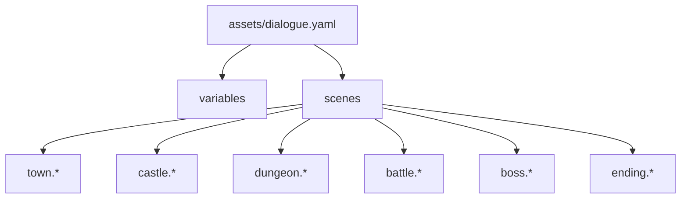

### 5.2 scene 名の命名規則

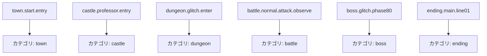

命名規則は以下で固定する。

- `town.*`
- `castle.*`
- `dungeon.*`
- `battle.*`
- `boss.*`
- `ending.*`

これにより、作者は scene 名だけで会話カテゴリを追える。

## 6. データモデル

### 6.1 使うキー

- `variables`
- `scenes`
- `speaker`
- `text`
- `set`
- `choices`
- `next`
- `variants`
- `when`

### 6.2 使い方

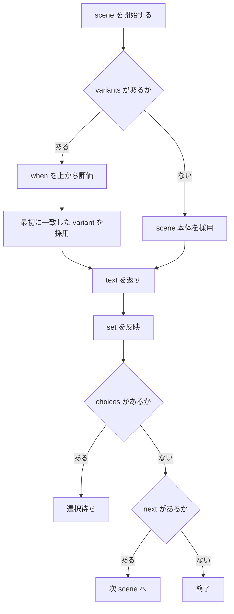

### 6.3 実際の整理方針

- 1行ずつ順送りする文は `next` で連結する
- 進行度差分は `variants` で扱う
- 選択肢が必要な会話は `choices` を使う
- 連続する戦闘文の固定フレーズも scene として置く

## 7. main.py 側の責務

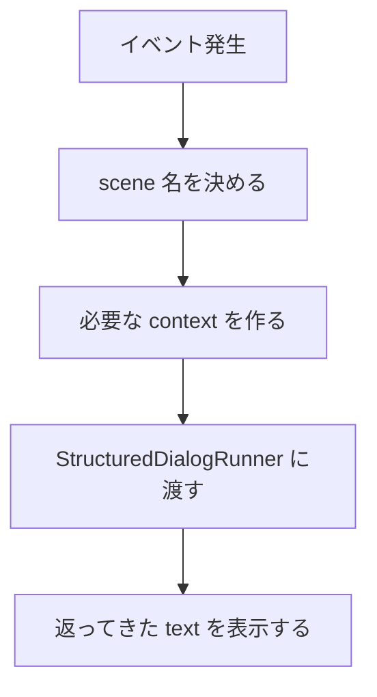

`main.py` が持つ責務は次の 3 つだけに絞る。

1. scene 名の決定  
2. context の生成  
3. 表示タイミングの制御

逆に `main.py` から外す責務は次の通り。

- 本文文字列の保持
- フェーズごとのセリフ分岐の本文部分
- エンディング文の直書き
- 敗北や逃走の固定メッセージ文

## 8. context 設計

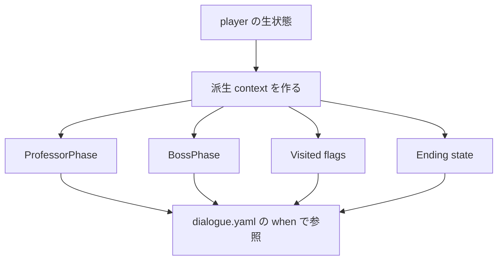

YAML 側には複雑な比較式を書かない。  
たとえば `max_zone_reached >= 3` をそのまま書くのではなく、Python 側で `ProfessorPhase = late` を作って渡す。

### 8.1 代表的な派生 context

- `ProfessorPhase = early | mid | late`
- `BossPhase = intro | phase80 | phase60 | phase40 | phase20 | phase08 | defeat`
- `EndingState = before_clear | after_clear`

## 9. カテゴリ別の実装方式

### 9.1 町 / 城 / ダンジョン

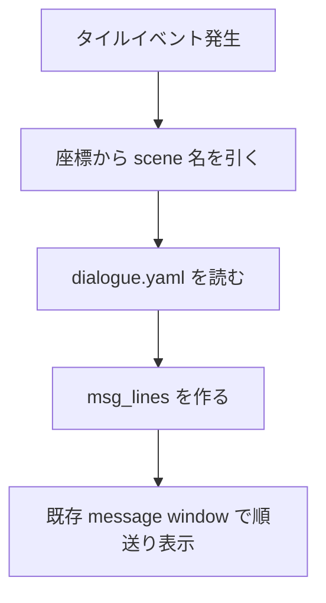

ここはすでに `show_message(lines)` の流れがあるので、最も移行しやすい。

### 9.2 通常戦闘

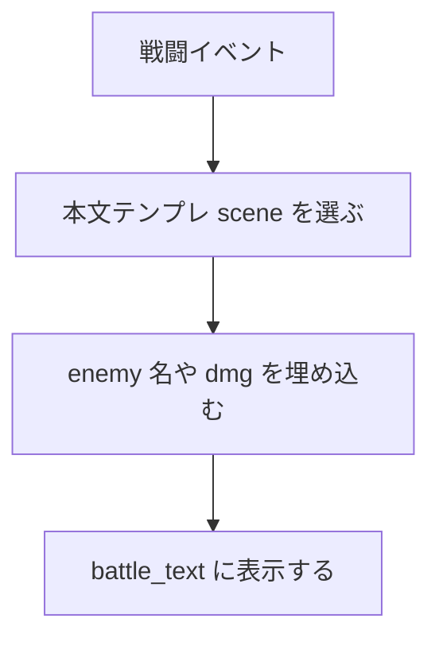

通常戦闘では、完全固定文だけでなくテンプレート文字列が必要になる。  
そのため `text` は将来的に `{enemy}` や `{dmg}` のような置換を許す設計に寄せる。

### 9.3 ボス会話

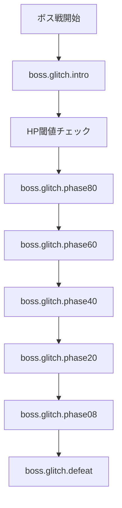

ボス会話は scene 名が最も素直に効く領域である。  
HP 閾値判定は Python 側、本文は YAML 側に完全分離する。

### 9.4 エンディング

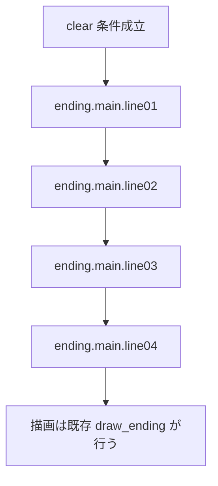

エンディングは今 `draw_ending` に直書きが残りやすいので、ここも scene 連結に統一する。

## 10. 移行順

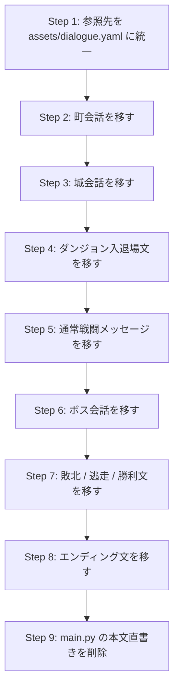

この順にする理由は、**線形で単純な会話から先に寄せる方が安全だから**である。

## 11. 削除ルール

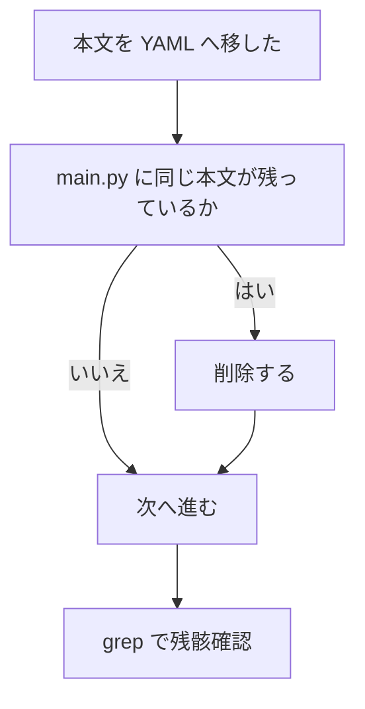

削除対象の原則は次の通り。

- `show_message([...])` の固定本文
- `battle_text = "..."` の固定本文
- `draw_ending()` の固定本文
- 旧会話ファイル

削除しないものは次の通り。

- docs 内の説明用引用
- 敵名やアイテム名などのラベルデータ
- UI レイアウトそのもの

## 12. 検証方法

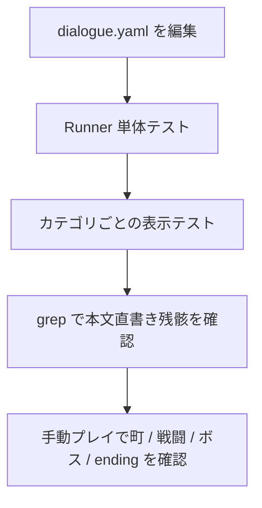

最低限必要な検証は次の通り。

- `assets/dialogue.yaml` がロードできる
- scene 名参照が壊れていない
- `variants` が想定どおり分岐する
- `next` 連結が正しく動く
- `main.py` に本文直書きが残っていない

## 13. この設計で得るもの

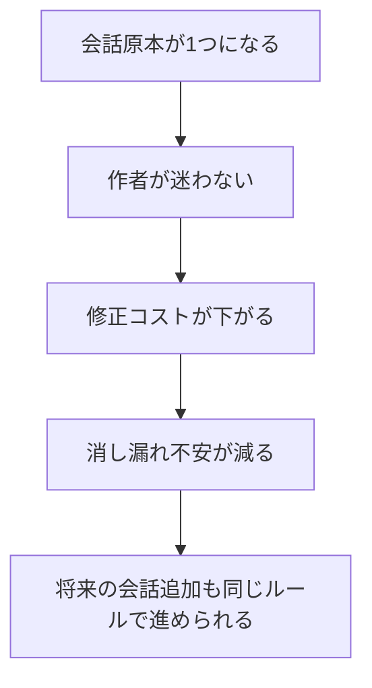

この設計の価値は、新しい会話言語を導入することではない。  
**「会話を直す時にどこを触ればよいか」を一度で分かるようにすること**にある。
