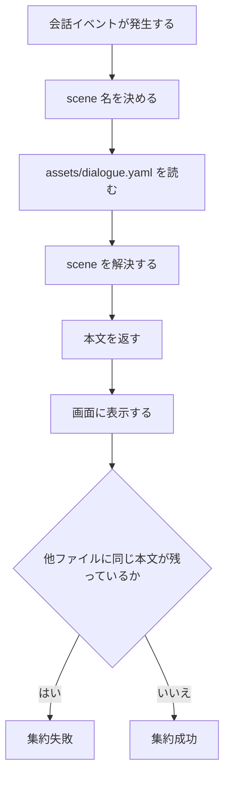
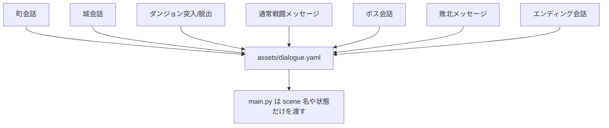
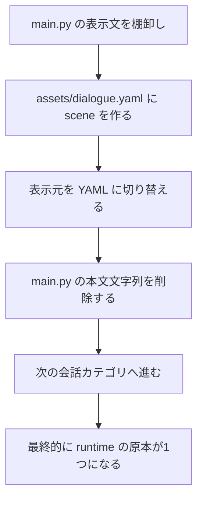

# Gherkins: `assets/dialogue.yaml` 全会話集約

この文書は、**ゲーム中に実際に表示される会話本文を `assets/dialogue.yaml` に集約し、他の runtime ファイルから削除する**ための受け入れ条件を定義する。

## 1. 受け入れの全体像



## 2. 目指す完成形



## 3. 移行順のイメージ



## 4. Gherkin

```gherkin
Feature: 実行時に表示される会話本文を assets/dialogue.yaml に集約する
  Block Quest の作者として
  会話を直すたびに main.py や複数ファイルを探し回りたくない
  そのため実行時の会話本文は assets/dialogue.yaml だけを原本にしたい

  Scenario: runtime の会話原本は 1 ファイルだけである
    Given 会話原本ファイル "assets/dialogue.yaml" が存在する
    When ゲーム中の表示会話の保存先を確認する
    Then 実行時に使う会話本文は "assets/dialogue.yaml" に集約されている
    And runtime 用の別会話ファイルを前提にしない

  Scenario: 町会話は assets/dialogue.yaml から再生される
    Given プレイヤーが「はじめの村」「ロジックタウン」「アルゴリズムの街」のいずれかに入る
    When 町イベントが発火する
    Then 表示本文は "assets/dialogue.yaml" 内の対応 scene から取得される
    And main.py に町会話本文は残っていない

  Scenario: 城のプロフェッサー会話は assets/dialogue.yaml から再生される
    Given プレイヤーが城イベントを発火する
    And 進行度に応じて early / mid / late の差分がある
    When 城会話が再生される
    Then 表示本文は "assets/dialogue.yaml" の professor 系 scene から取得される
    And main.py は進行状態を渡すだけで本文を持たない

  Scenario: ダンジョン突入と脱出のメッセージは assets/dialogue.yaml から再生される
    Given プレイヤーがグリッチのサーバーに入るか出る
    When 突入または脱出イベントが発火する
    Then 表示本文は "assets/dialogue.yaml" の dungeon 系 scene から取得される
    And main.py に突入/脱出本文は残っていない

  Scenario: 通常戦闘メッセージは assets/dialogue.yaml にある
    Given 戦闘開始、通常攻撃、被ダメージ、勝利、逃走、敗北の表示が存在する
    When バトル中の本文定義元を確認する
    Then それらの本文は "assets/dialogue.yaml" の battle 系 scene に存在する
    And battle_text の代入で本文を直書きしない

  Scenario: ボス会話は assets/dialogue.yaml にある
    Given 魔王グリッチ戦に開始セリフとHPフェーズごとの会話がある
    When ボス会話の定義元を確認する
    Then それらは "assets/dialogue.yaml" の boss 系 scene に存在する
    And main.py にボス会話本文は残っていない

  Scenario: エンディング表示文は assets/dialogue.yaml にある
    Given エンディング画面で表示される文がある
    When エンディング本文の定義元を確認する
    Then その本文は "assets/dialogue.yaml" の ending 系 scene に存在する
    And draw_ending 内で本文を直書きしない

  Scenario: scene 名で会話カテゴリが追える
    Given assets/dialogue.yaml に town, castle, dungeon, battle, boss, ending の会話がある
    When 作者が scene 名一覧を見る
    Then どの会話がどのカテゴリか名前で判別できる
    And grep しなくても全体像を追いやすい

  Scenario: 会話本文を変える時は assets/dialogue.yaml だけを編集すればよい
    Given 作者が表示文を1つ修正したい
    When 対象の scene を assets/dialogue.yaml で編集する
    Then runtime の表示結果が変わる
    And 他の source file に同じ本文を探しに行く必要がない

  Scenario: runtime ファイルに会話本文の残骸があれば未完了である
    Given main.py や他の runtime module にユーザー向け会話本文が残っている
    When 集約の完了判定を行う
    Then その状態は未完了として扱われる
    And 残っている本文は assets/dialogue.yaml に移したうえで削除される

  Scenario: docs は残ってもよいが runtime 原本には数えない
    Given story-design や playthrough のような説明用文書が存在する
    When 会話原本の場所を判定する
    Then docs は仕様書として扱う
    And 実行時の会話原本は "assets/dialogue.yaml" だけである
```
