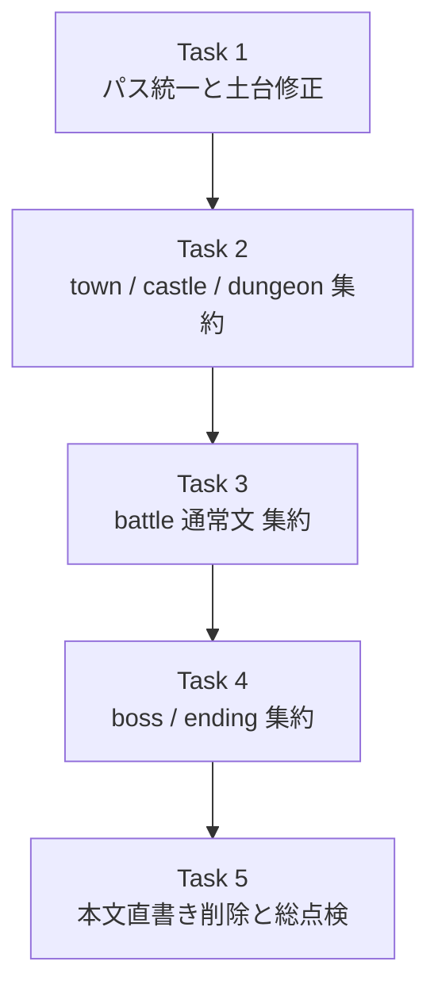
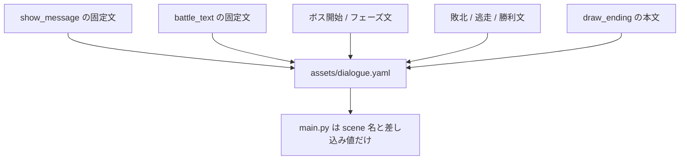

# Dialogue Consolidation Migration Plan

> **For agentic workers:** REQUIRED SUB-SKILL: Use superpowers:subagent-driven-development (recommended) or superpowers:executing-plans to implement this plan task-by-task. Steps use checkbox (`- [ ]`) syntax for tracking.

**Goal:** ゲーム中に実際に表示される会話本文を `assets/dialogue.yaml` に集約し、`main.py` などの runtime ファイルから本文直書きを除去する。

**Architecture:** `main.py` は本文を持たず、scene 名と派生 context だけを `StructuredDialogRunner` に渡す。`assets/dialogue.yaml` は town / castle / dungeon / battle / boss / ending の scene をカテゴリ別に持ち、固定文と分岐文の原本を一元管理する。戦闘文のような動的本文は YAML のテンプレ文字列と Python 側の差し込み値で構成する。

**Tech Stack:** Python 3, Pyxel, `yaml` (PyYAML), `unittest`, `py_compile`, `rg`

---

## File Structure

- `assets/dialogue.yaml`
  - 実行時に表示される会話本文の唯一の原本
- `src/structured_dialog.py`
  - YAML のロード、validation、scene 解決、分岐、順送り、テンプレ差し込み
- `main.py`
  - scene 名決定、context 生成、表示制御
- `test/test_structured_dialog.py`
  - runner の単体テスト
- `test/test_dialogue_integration.py`
  - 実ファイルと `main.py` 接続の統合テストを追加する候補
- `docs/steering/20260406-consolidate-dialogue-yaml/design.md`
  - 実装後に path やカテゴリ名のずれが出たら更新する

## Migration Flow



## Text Ownership Target



### Task 1: パス統一と runner 土台修正

**Files:**
- Modify: `main.py`
- Modify: `src/structured_dialog.py`
- Modify: `test/test_structured_dialog.py`

- [ ] **Step 1: path の不整合を固定する failing test を書く**

```python
def test_main_uses_assets_dialogue_yaml_path(self):
    text = (PYXEL_ROOT / "main.py").read_text(encoding="utf-8")
    self.assertIn('StructuredDialogRunner("assets/dialogue.yaml")', text)
```

- [ ] **Step 2: Run test to verify it fails**

Run: `python -m unittest test.test_structured_dialog -v`
Expected: FAIL with `assets/dialogs/dialogue.yaml` が残っている旨の失敗

- [ ] **Step 3: minimal implementation で path を統一する**

```python
self.dialog = StructuredDialogRunner("assets/dialogue.yaml")
```

- [ ] **Step 4: battle 用テンプレ差し込みの failing test を追加する**

```python
def test_format_text_interpolates_runtime_values(self):
    path = self._write_dialogue(
        "_tmp_template.yaml",
        '''
        variables: []
        scenes:
          battle.attack:
            text: "{enemy}に{dmg}のダメージ！"
        ''',
    )
    runner = StructuredDialogRunner(path)
    step = runner.start("battle.attack", state={}, extra_context={"enemy": "スライム", "dmg": 7})
    self.assertEqual(step.text, "スライムに7のダメージ！")
```

- [ ] **Step 5: Run test to verify it fails**

Run: `python test/test_structured_dialog.py`
Expected: FAIL with text 未置換

- [ ] **Step 6: `StructuredDialogRunner` に最小の format 処理を追加する**

```python
def _format_text(self, text: str) -> str:
    values = {**self._mutable_state, **self._extra_context}
    return text.format(**values)
```

- [ ] **Step 7: Run tests to verify Task 1 passes**

Run: `python test/test_structured_dialog.py`
Expected: PASS

- [ ] **Step 8: Commit**

```bash
git add main.py src/structured_dialog.py test/test_structured_dialog.py
git commit -m "refactor: align dialogue yaml path and template support"
```

### Task 2: town / castle / dungeon を YAML に集約する

**Files:**
- Modify: `assets/dialogue.yaml`
- Modify: `main.py`
- Modify: `test/test_structured_dialog.py`

- [ ] **Step 1: 町・城・ダンジョンの期待本文をテストへ列挙する**

```python
def test_dialogue_yaml_contains_overworld_and_dungeon_scenes(self):
    runner = StructuredDialogRunner(PYXEL_ROOT / "assets" / "dialogue.yaml")
    self.assertEqual(runner.load_all_lines("town.start.entry", state={}), [...])
    self.assertEqual(runner.load_all_lines("castle.professor.entry", state={}, extra_context={"ProfessorPhase": "mid"}), [...])
    self.assertEqual(runner.load_all_lines("dungeon.glitch.enter", state={}), [...])
    self.assertEqual(runner.load_all_lines("dungeon.glitch.exit", state={}), [...])
```

- [ ] **Step 2: Run test to verify it fails**

Run: `python test/test_structured_dialog.py`
Expected: FAIL with missing scene names

- [ ] **Step 3: `assets/dialogue.yaml` をカテゴリ名ベースの scene 名へ整理する**

```yaml
scenes:
  town.start.entry:
    text: "はじめの村へようこそ！"
    next: town.start.line02
  castle.professor.entry:
    variants:
      - when: { ProfessorPhase: early }
        text: "町に立ち寄り、装備を整えよう。"
  dungeon.glitch.enter:
    text: "グリッチのサーバーに侵入した…"
```

- [ ] **Step 4: `main.py` の tile-to-scene map を新命名規則へ合わせる**

```python
TOWN_DIALOG_SCENES = {
    (20, 12): "town.start.entry",
    (30, 22): "town.logic.entry",
    (18, 34): "town.algo.entry",
    (25, 6): "castle.professor.entry",
}
```

- [ ] **Step 5: ダンジョン入退場メッセージの scene 参照ポイントを追加する**

```python
lines = self.dialog.load_all_lines("dungeon.glitch.enter", state=self.player["dialog_flags"])
```

- [ ] **Step 6: Run tests to verify Task 2 passes**

Run: `python -m unittest test.test_structured_dialog -v`
Expected: PASS

- [ ] **Step 7: Commit**

```bash
git add assets/dialogue.yaml main.py test/test_structured_dialog.py
git commit -m "feat: move overworld and dungeon dialogue into yaml"
```

### Task 3: 通常戦闘メッセージを YAML へ移す

**Files:**
- Modify: `assets/dialogue.yaml`
- Modify: `main.py`
- Modify: `test/test_structured_dialog.py`
- Create: `test/test_dialogue_integration.py`

- [ ] **Step 1: 通常戦闘文のテンプレ期待値を統合テストに書く**

```python
def test_battle_attack_scene_formats_enemy_and_damage(self):
    runner = StructuredDialogRunner(PYXEL_ROOT / "assets" / "dialogue.yaml")
    step = runner.start(
        "battle.normal.attack.observe",
        state={},
        extra_context={"enemy": "10ほスライム", "dmg": 5},
    )
    self.assertEqual(step.text, "順番を見直した。10ほスライムに5のダメージ！")
```

- [ ] **Step 2: Run test to verify it fails**

Run: `python -m unittest test.test_dialogue_integration -v`
Expected: FAIL with missing battle scene

- [ ] **Step 3: `assets/dialogue.yaml` に battle 系 scene を追加する**

```yaml
battle.normal.attack.observe:
  text: "順番を見直した。{enemy}に{dmg}のダメージ！"
battle.normal.enemy_hit.sequential:
  text: "{enemy}の攻撃！プログラマーに{dmg}のダメージ！手順が崩れている。"
battle.normal.victory.early:
  text: "{enemy}を理解した！少し分かった。{exp}EXPと{gold}Cを手に入れた！"
```

- [ ] **Step 4: `main.py` の `battle_text = ...` を scene 解決へ置き換える**

```python
self.battle_text = self.dialog.start(
    "battle.normal.attack.observe",
    state=self.player["dialog_flags"],
    extra_context={"enemy": e["name"], "dmg": dmg},
).text
```

- [ ] **Step 5: 勝利・敗北・逃走・被ダメージも同じ方式へ寄せる**

Run grep target after edit: `rg -n 'battle_text = ".*"|battle_text = f".*"' main.py`
Expected: YAML に移した固定本文はヒットしない

- [ ] **Step 6: Run tests to verify Task 3 passes**

Run: `python -m unittest test.test_dialogue_integration test.test_structured_dialog -v`
Expected: PASS

- [ ] **Step 7: Commit**

```bash
git add assets/dialogue.yaml main.py test/test_dialogue_integration.py test/test_structured_dialog.py
git commit -m "feat: externalize normal battle dialogue into yaml"
```

### Task 4: boss / ending を YAML に集約する

**Files:**
- Modify: `assets/dialogue.yaml`
- Modify: `main.py`
- Modify: `test/test_dialogue_integration.py`

- [ ] **Step 1: ボス開始・フェーズ・撃破・ending の期待本文をテストに書く**

```python
def test_boss_phase_scene_resolves_from_context(self):
    runner = StructuredDialogRunner(PYXEL_ROOT / "assets" / "dialogue.yaml")
    step = runner.start("boss.glitch.phase80", state={}, extra_context={})
    self.assertIn("わたしは、まちがえたかったわけじゃない！", step.text)

def test_ending_scene_returns_all_lines(self):
    runner = StructuredDialogRunner(PYXEL_ROOT / "assets" / "dialogue.yaml")
    self.assertEqual(runner.load_all_lines("ending.main.line01", state={})[:2], ["おめでとう！", "魔王グリッチを倒した！"])
```

- [ ] **Step 2: Run test to verify it fails**

Run: `python -m unittest test.test_dialogue_integration -v`
Expected: FAIL with missing boss / ending scenes

- [ ] **Step 3: `assets/dialogue.yaml` に boss / ending scene を追加する**

```yaml
boss.glitch.intro:
  text: "グリッチが現れた。理解を拒んでいる。"
boss.glitch.phase80:
  text: "グリッチ「わたしは、まちがえたかったわけじゃない！」"
ending.main.line01:
  text: "おめでとう！"
  next: ending.main.line02
```

- [ ] **Step 4: `main.py` のボス会話表示と `draw_ending()` の本文参照を YAML 化する**

```python
ending_lines = self.dialog.load_all_lines("ending.main.line01", state=self.player["dialog_flags"])
for i, line in enumerate(ending_lines[:4]):
    pyxel.text(..., line, 7, self.font)
```

- [ ] **Step 5: Run tests to verify Task 4 passes**

Run: `python -m unittest test.test_dialogue_integration test.test_structured_dialog -v`
Expected: PASS

- [ ] **Step 6: Commit**

```bash
git add assets/dialogue.yaml main.py test/test_dialogue_integration.py
git commit -m "feat: move boss and ending dialogue into yaml"
```

### Task 5: 本文直書き削除と総点検

**Files:**
- Modify: `main.py`
- Modify: `docs/steering/20260406-consolidate-dialogue-yaml/design.md`
- Modify: `docs/steering/20260406-consolidate-dialogue-yaml/gherkins.md`

- [ ] **Step 1: 本文直書き残骸を grep で洗い出す**

Run: `rg -n 'show_message\\(|battle_text =|draw_ending|\".*[ぁ-んァ-ン一-龥].*\"' main.py`
Expected: scene 名や UI ラベル以外の会話本文候補が残っていれば一覧化される

- [ ] **Step 2: YAML に移した本文直書きを削除する**

Keep:
- UI ラベル
- 敵名 / アイテム名

Remove:
- プレイヤー向けメッセージ文
- エンディング本文
- ボス会話本文

- [ ] **Step 3: 実装結果に合わせて steering docs の path / scene 名を更新する**

Examples:
- `assets/dialogue.yaml`
- `town.start.entry`
- `boss.glitch.phase80`

- [ ] **Step 4: Run full verification**

Run: `python -m unittest discover -s test -p 'test_*.py' -v`
Expected: PASS

Run: `python -m py_compile main.py src/structured_dialog.py test/test_structured_dialog.py test/test_dialogue_integration.py`
Expected: exit 0

Run: `rg -n "battle_text = \\\"|show_message\\(\\[|draw_ending\\(.*\\\"|assets/dialogs/dialogue.yaml" -S main.py`
Expected: no matches for migrated dialogue patterns and no stale path

- [ ] **Step 5: Commit**

```bash
git add main.py assets/dialogue.yaml src/structured_dialog.py test docs/steering/20260406-consolidate-dialogue-yaml
git commit -m "refactor: consolidate runtime dialogue into assets/dialogue.yaml"
```

## Validation Checklist

- [ ] `main.py` の runner 参照先が `assets/dialogue.yaml` になっている
- [ ] town / castle / dungeon / battle / boss / ending の scene が `assets/dialogue.yaml` に存在する
- [ ] `battle_text` の固定本文直書きが消えている
- [ ] `draw_ending()` の本文直書きが消えている
- [ ] 進行度差分は Python 側 context と YAML 側 `variants` に分離されている
- [ ] docs は runtime 原本ではなく説明用文書として残っている

## Scope Review

- `design.md` の対象範囲は town / castle / dungeon / battle / boss / ending で、各 Task に反映済み
- `gherkins.md` の「runtime 原本は `assets/dialogue.yaml` だけ」は Task 5 の grep と削除ルールで担保
- 今回の plan には選択肢 UI の新規導入は含めていない。必要なら別 plan に切り出す
