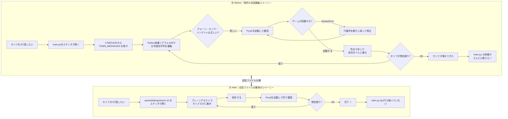
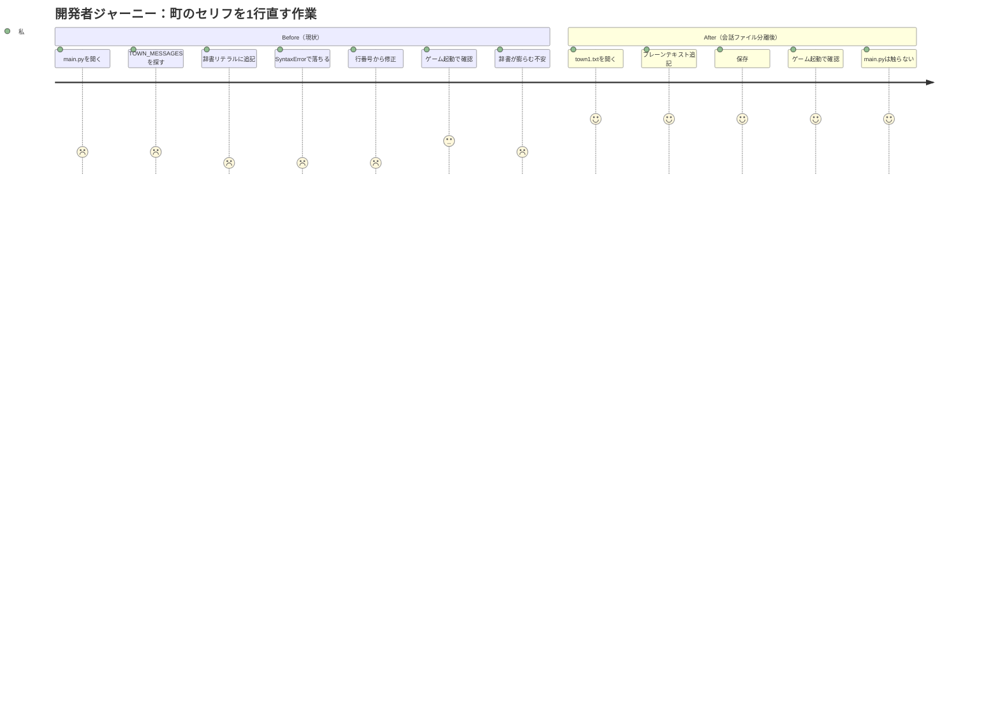
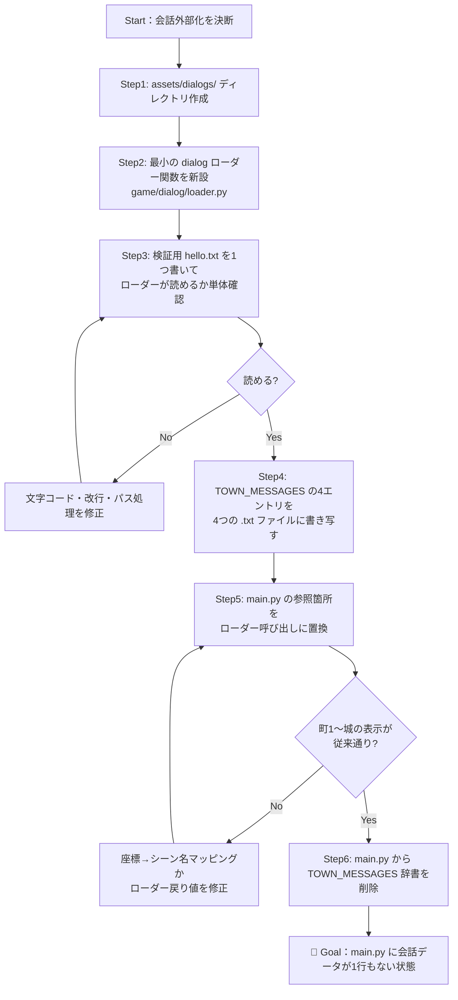
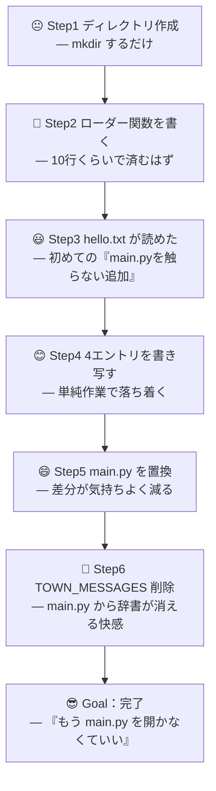
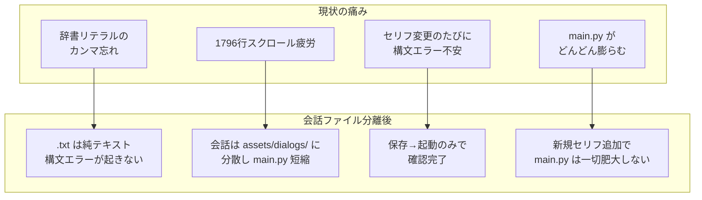

# カスタマージャーニーマップ：会話データを main.py から追い出して楽したい

- 対象ステアリング: Pyxel版code-questの「会話データ外部化」
- 主役（カスタマー）: **開発者である私自身**。目的はただひとつ「**楽したい**」
- 方針: 外部ライブラリに頼らず、**プレーンテキスト `.txt` ファイル**に会話データを追い出す
- 根拠: `design-scratch.md` で「外部依存ゼロで自前実装する」方針に転換済み

---

## 1. 私（開発者）のペルソナ

| 項目 | 内容 |
|---|---|
| 役割 | Pyxel版code-questの唯一の開発者 |
| 本音 | **会話のセリフ調整のたびに main.py を開きたくない** |
| 嫌いなこと | Python辞書リテラルの中で日本語セリフを編集すること。カンマ忘れ・クォート忘れでゲームが落ちる |
| 好きなこと | テキストエディタで会話ファイルを開いて、セリフだけに集中してカタカタ書くこと |
| 成功の定義 | `main.py` を一切触らずに、町やNPCのセリフを追加・修正できる |

---

## 2. Before / After 全体像（縦長フロー）

---

## 3. ステージ別ジャーニー（縦長）

---

## 4. 導入ステップ（私が踏む手順、縦長）

---

## 5. 感情曲線（縦長）

---

## 6. タッチポイント別の「痛み」と「解放後」

---

## 7. 成功条件（このジャーニーの終点）

1. `main.py` から `TOWN_MESSAGES` が消えている
2. 会話の追加・修正が `assets/dialogs/*.txt` の編集と保存のみで完結する
3. ローダー関数は `game/dialog/loader.py` の1ファイルに閉じており、外部ライブラリ依存ゼロ
4. 新しい町を追加するとき「会話は `.txt` に書く」が自然なデフォルトになっている
5. 私が「セリフを1行直すのに3分以上かかる」と感じる瞬間が消えている

---

## 8. やらないこと（スコープ外）

- 戦闘バランスや敵データ (`ZONE_ENEMIES` / `ENEMIES`) の外部化 → 別ステアリングで扱う
- 装備データ (`WEAPONS` / `ARMORS`) の外部化 → 別ステアリングで扱う
- 選択肢つき会話／進行度分岐／変数システムなどの高度な会話機能 → 現状不要
- 外部ライブラリの導入（ink runtime 等）→ 事実上採用可能な Python 実装が存在しないため今回は行わない
- セーブデータ互換性の維持 → 開発者が「壊れて良い」と明言済み
