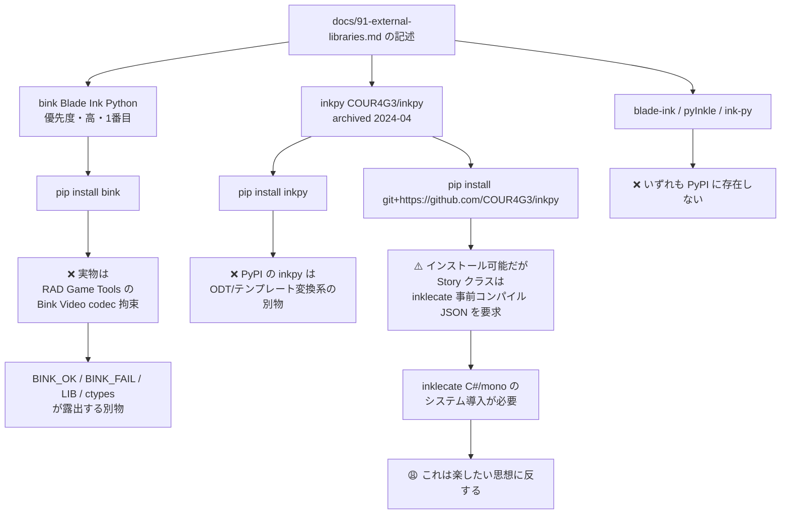
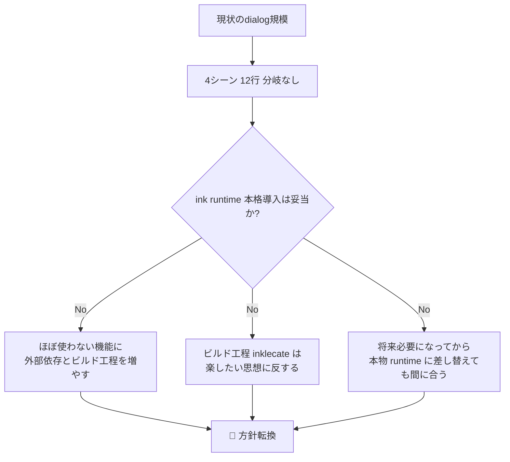
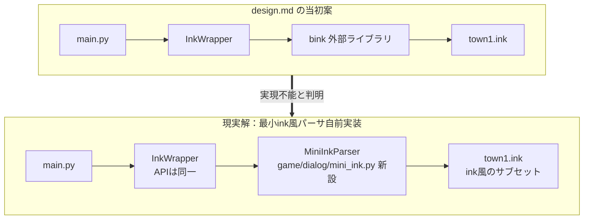
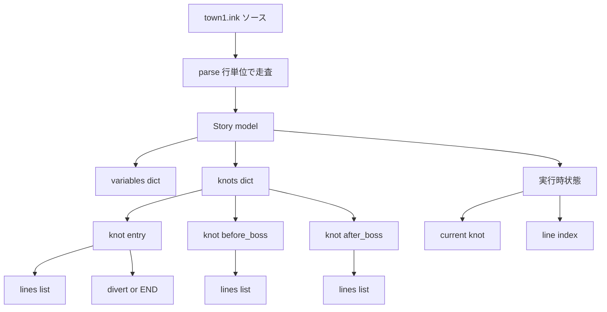
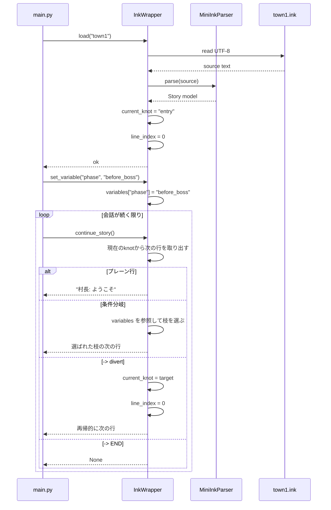
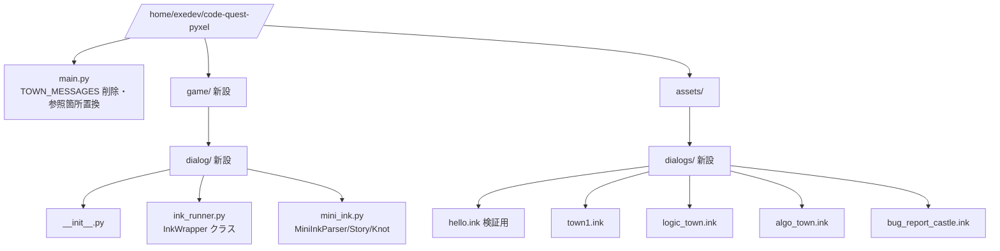
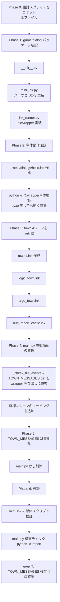
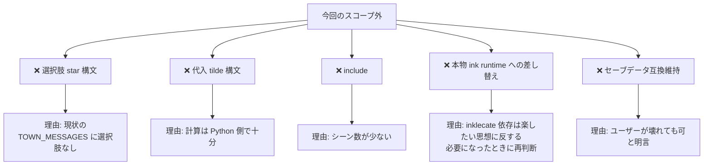
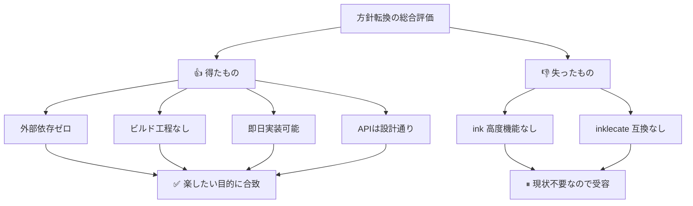

# Design Scratch: bink導入の再設計（発見事項と方針転換）

`design.md` は「bink（Blade Ink Python）を `pip install` して使う」前提で書かれていた。
しかし実装着手時に調査した結果、**その前提自体が成立しない**ことが判明した。
このスクラッチは、発見した事実と、それを踏まえた **現実的な方針** を残すためのメモ。

- 親設計: `design.md`（理想形。InkWrapperのAPI設計は有効）
- 親要件: `requirements.md`（開発者体験の要件は変わらず有効）
- このスクラッチの位置づけ: **実装前に一度立ち止まって、方針を切り替えるためのスクラッチ**

---

## 1. 発見した事実（悲報）



### 要約

| 候補 | 結果 | 理由 |
|---|---|---|
| `pip install bink` | ❌ | 同名の Bink Video codec bindings であり ink とは無関係 |
| `pip install inkpy` | ❌ | 同名の ODT/テンプレート変換ライブラリであり ink とは無関係 |
| GitHub `COUR4G3/inkpy` | ❌採用不可 | Story が inklecate 事前コンパイル JSON を要求。ビルド工程増 |
| `blade-ink` / `pyInkle` / `ink-py` | ❌ | PyPI に存在しない |

→ **Python エコシステムに、raw `.ink` を読めて保守されている runtime は事実上存在しない。**

---

## 2. 現在のdialogデータの実態（想定より遥かに小さい）

`TOWN_MESSAGES` の現物を確認した結果：

```python
TOWN_MESSAGES = {
    (20, 12): ["はじめの村へようこそ！", "ここではプログラミングの", "基礎を学べます。"],
    (30, 22): ["ロジックタウンだ。", "条件分岐とループを", "マスターしよう！"],
    (18, 34): ["アルゴリズムの街。", "効率的な解法を", "見つけよう！"],
    (25, 6):  ["バグレポート城。", "世界の平和を", "取り戻すのだ！"],
}
```

**たった4エントリ・合計12行のセリフ**。進行度分岐も選択肢もなし。
使用箇所は `main.py:1254` の1箇所のみ：

```python
lines = TOWN_MESSAGES.get(key, ["..."])
self.show_message(lines)
```

つまり **いま inkle ink の本格runtime（変数・分岐・選択肢・VAR）を入れるのは、明らかにオーバーキル**。



---

## 3. 方針転換：最小ink風パーサを自前で持つ

**InkWrapper の外部API (`load` / `continue_story` / `choose` / `set_variable`) は design.md のまま据え置く**。
内部実装だけを「外部bink依存」から「自前の最小パーサ」に差し替える。



### 対応する ink サブセット（最小）

| ink 機能 | 対応 | 備考 |
|---|---|---|
| プレーンテキスト行 | ✅ | 1行1メッセージ |
| `// コメント` | ✅ | 行頭/行中スキップ |
| `=== knot_name ===` | ✅ | セクション |
| `-> target` divert | ✅ | knot 間ジャンプ |
| `-> END` | ✅ | 会話終了 |
| `{var: case - ... - else}` 条件分岐 | ✅ | set_variable 連動の単純条件のみ |
| `VAR x = "..."` 宣言 | ✅ | 文字列変数のみ |
| `* [choice]` 選択肢 | ⏸ 今回未対応 | code-quest の現状で不要 |
| `~ x = ...` 代入式・計算 | ⏸ 今回未対応 | 不要 |
| include | ⏸ 今回未対応 | 不要 |

→ **「今、本当に必要な範囲だけ」** 実装する。将来不足したら機能追加する（あるいは本物 runtime に差し替える）。

---

## 4. MiniInkParser のデータモデル（縦長）



### 実行フロー



---

## 5. ファイル構成（方針転換版）



**外部依存ゼロ**。Pyxel と Python 標準ライブラリだけで完結する。

---

## 6. town1.ink の想定内容（最小）

```ink
// はじめの村 入口
=== entry ===
はじめの村へようこそ！
ここではプログラミングの
基礎を学べます。
-> END
```

現状の `TOWN_MESSAGES` の1エントリをそのまま1ファイルに写す。将来、魔王前/後で文言を変えたくなったらこうする：

```ink
VAR phase = "before_boss"

=== entry ===
{ phase:
  - "before_boss": -> before_boss
  - "after_boss":  -> after_boss
}

=== before_boss ===
はじめの村へようこそ！
ここではプログラミングの基礎を学べます。
-> END

=== after_boss ===
英雄よ、ようこそ戻った！
もう学ぶことはあまりないだろう。
-> END
```

---

## 7. 段階的な実装プラン（縦長）



---

## 8. 今回のスコープで意図的に「やらない」こと



---

## 9. この方針転換で守れること / 守れないこと

### 守れること（design.md から継承）

- ✅ **main.py に会話データ直書きをやめる** — 根本目的は達成
- ✅ **InkWrapper の3メソッド公開API** — シグネチャはそのまま
- ✅ **シーン単位 `.ink` ファイル分割**
- ✅ **ink風の knot/divert 構文** — 将来 inkle ink 本体に差し替える可能性を残す
- ✅ **進行度分岐を Python の if から ink 側へ移す余地**
- ✅ **外部依存ゼロ** — 実はこちらの方が「楽」

### 守れないこと

- ❌ **本物 inkle ink runtime** — パーサはサブセットで、高度な ink 記法は落ちる
- ❌ **ink 互換の .ink ファイル** — inklecate で通らない書き方になる可能性

### トレードオフの総合評価



---

## 10. 決定事項

1. **本スクラッチを採用** し、`design.md` の外部 bink 依存部分はこのスクラッチで上書きされたものとして扱う
2. **`game/dialog/mini_ink.py` と `game/dialog/ink_runner.py` を新設**
3. **`assets/dialogs/` 配下に4つの `.ink` を作成**
4. **main.py の `TOWN_MESSAGES` は削除**、参照箇所は InkWrapper 呼び出しに置換
5. **検証**: mini_ink 単体スクリプトで読める／`main.py` の import が通る／`TOWN_MESSAGES` の grep がゼロ

この順で実装に入る。
