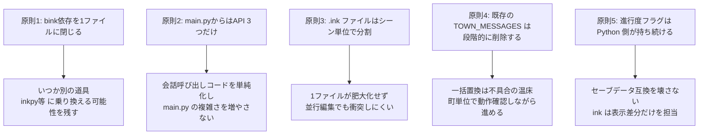
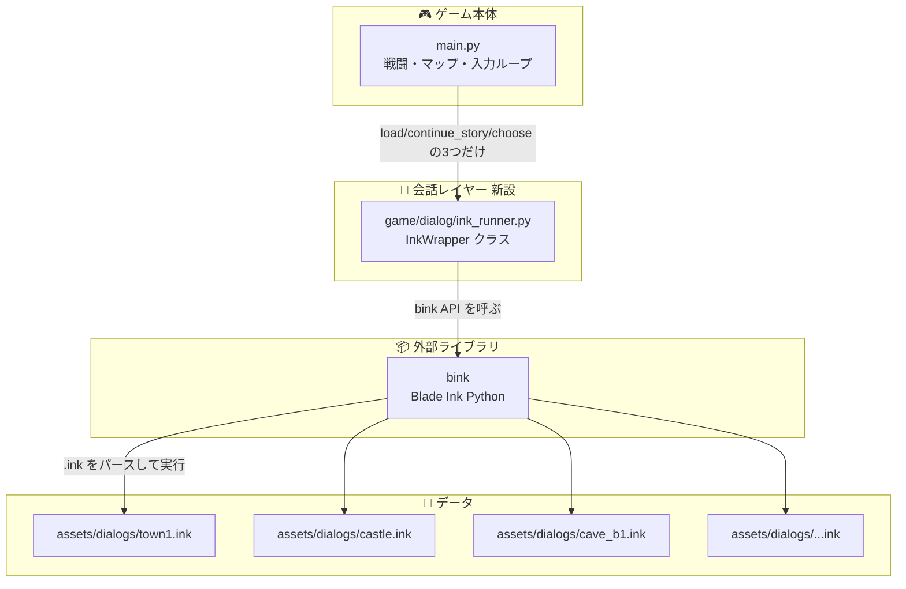
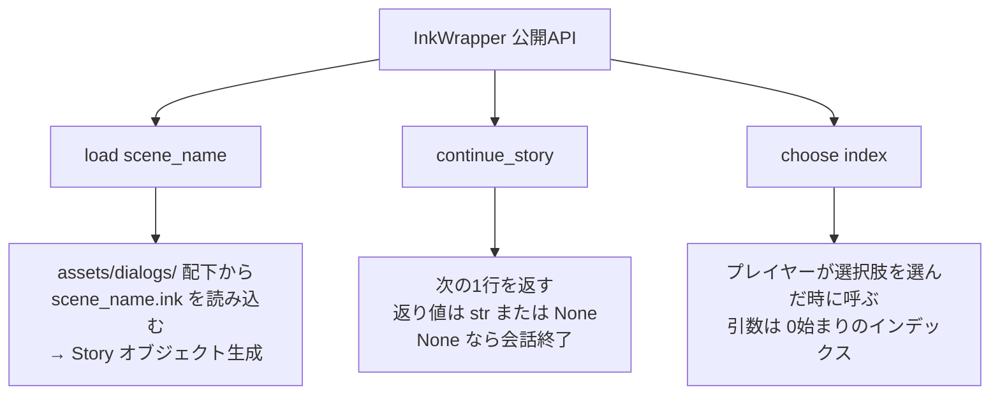
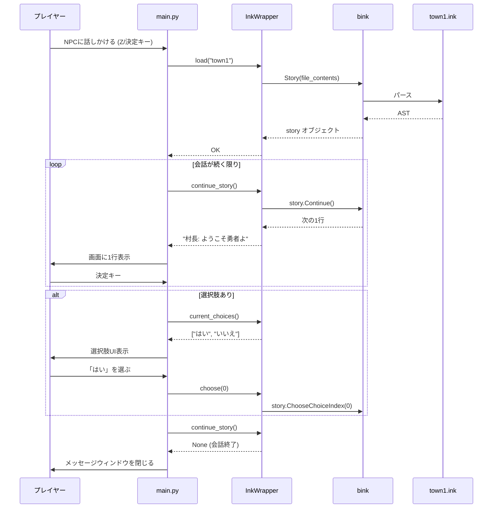
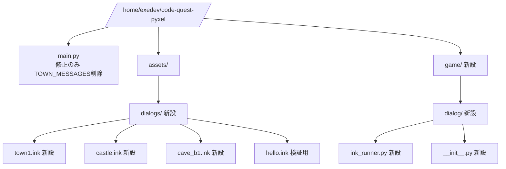
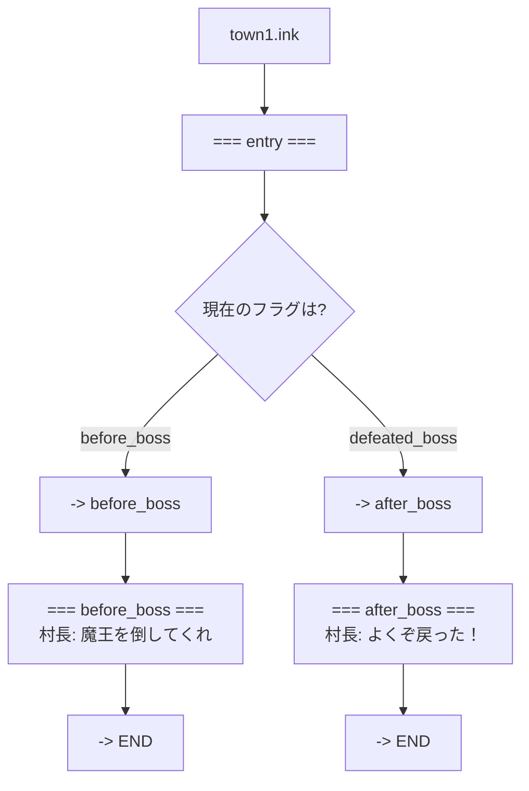
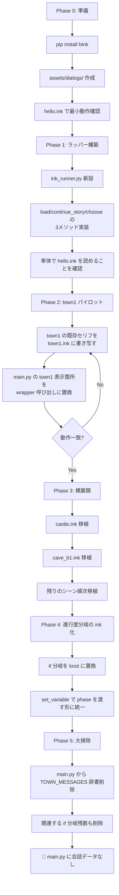
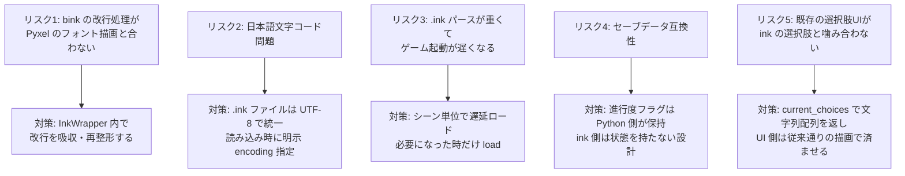
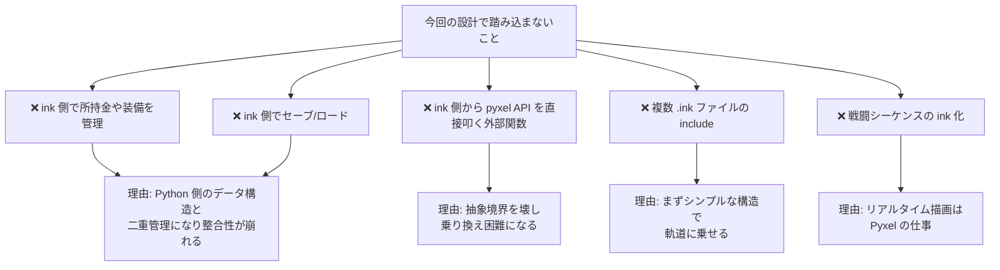
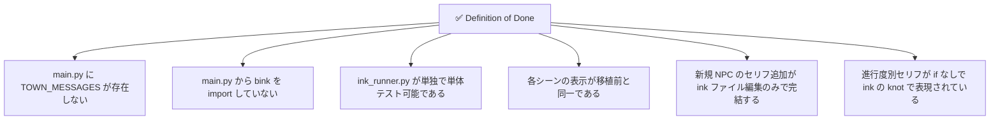

# Design: Pyxel版code-questへのbink導入設計

`requirements.md` で定義した要件を、**どう実装するか**の設計ドキュメント。
方針は一言で言うと **「bink依存を1ファイルに閉じ込め、main.pyには薄いAPIだけを見せる」**。

---

## 1. 設計の大方針



---

## 2. レイヤー構成（縦長）



**ポイント**: main.py は Bink の存在を知らない。InkWrapper の3つのメソッドだけが見えている。

---

## 3. InkWrapper の公開API（最小3つ）



### メソッドシグネチャ（案）

```python
class InkWrapper:
    def load(self, scene_name: str) -> None: ...
    def continue_story(self) -> str | None: ...
    def choose(self, index: int) -> None: ...

    # 補助（内部参照用）
    def current_choices(self) -> list[str]: ...
    def set_variable(self, name: str, value) -> None: ...
    def get_variable(self, name: str): ...
```

`set_variable` / `get_variable` は ink 側の `VAR` を Python から出し入れするための窓口。これも **ink_runner.py の中に閉じる**。

---

## 4. 会話呼び出しのシーケンス（縦長）



---

## 5. ファイル構成（新設ファイル）



- 既存ファイルは `main.py` の修正のみ
- `game/` パッケージは新設（将来の分割のための入れ物も兼ねる）
- `assets/dialogs/` 配下の `.ink` はテキストエディタで直接編集

---

## 6. .ink ファイルの内部構造（進行度分岐の設計）



### ink側のサンプル（イメージ）

```ink
VAR phase = "before_boss"

=== entry ===
{ phase:
    - "before_boss": -> before_boss
    - "after_boss":  -> after_boss
}

=== before_boss ===
村長: 魔王を倒してくれ、勇者よ。
-> END

=== after_boss ===
村長: よくぞ戻った！ 英雄よ！
-> END
```

### Python側の呼び出しイメージ

```python
wrapper.load("town1")
wrapper.set_variable("phase",
    "after_boss" if self.flags.get("defeated_boss") else "before_boss")
while line := wrapper.continue_story():
    self.message_queue.append(line)
```

**進行度フラグ自体は Python 側の `self.flags` が持ち続ける**。inkは表示差分だけを担当。セーブデータ互換を壊さないための妥協点。

---

## 7. 移植順序（町単位で段階的に）



---

## 8. リスクと対策



---

## 9. 設計の「やらない」こと



---

## 10. 完了の定義（Definition of Done）


