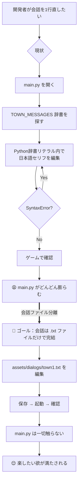
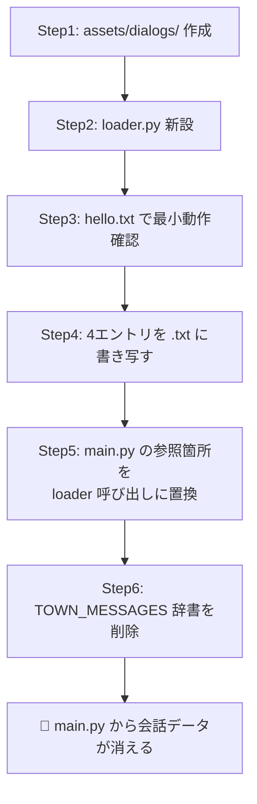
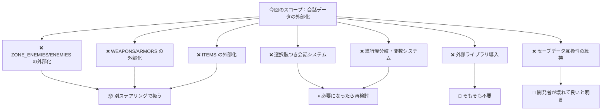
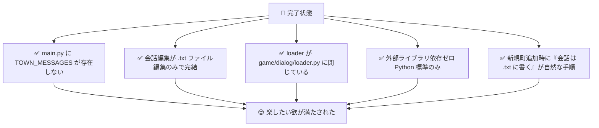

# Requirements: 会話データを main.py から外部ファイルへ分離する

本ドキュメントは Gherkin 形式の要件定義を Markdown にまとめたもの。

- **対象**: Pyxel版code-quest (`/home/exedev/code-quest-pyxel`)
- **目的**: `main.py` から会話データ（`TOWN_MESSAGES`）を切り離し、外部のプレーンテキストファイルで管理できるようにする
- **方針**: 外部ライブラリに依存せず、Python 標準ライブラリのみで実装する（`design-scratch.md` 参照）
- **ねらい**: 開発者（私自身）が「セリフ1行の修正で `main.py` を開かなくて済む」状態を作る

---

## 全体像



---

## Feature

```gherkin
Feature: 会話データを main.py から外部ファイルへ分離する
  As a Pyxel版code-questの唯一の開発者
  I want to 町・城のセリフを assets/dialogs/ 配下のテキストファイルへ移動する
  So that main.py を触らずにセリフ追加・修正ができ、楽をできる
```

### Background

```gherkin
Background:
  Given 現行プロジェクトのルートは "/home/exedev/code-quest-pyxel" である
  And "main.py" は約1796行あり、その中に TOWN_MESSAGES 辞書が直書きされている
  And TOWN_MESSAGES は4エントリ・合計12行のセリフで構成されている
  And 会話の参照箇所は "main.py" の _check_tile_events 内の1箇所のみである
  And 外部ライブラリは新規追加しない方針である
```

---

## 導入ステップの全体フロー



---

## Scenarios

### Scenario 1: 会話ファイル用のディレクトリ構造を用意する

```gherkin
Scenario: 会話ファイル用のディレクトリ構造を用意する
  Given "assets/" 配下に会話用の専用ディレクトリがまだ存在しない
  When 開発者が会話データの置き場所を決める
  Then "assets/dialogs/" ディレクトリが作成されている
  And その配下にはシーン単位の ".txt" ファイルを置く方針が共有されている
  And ファイル名はシーン名で決める (例: "town1.txt", "logic_town.txt")
```

### Scenario 2: 会話ローダーを1ファイルに閉じ込める

```gherkin
Scenario: 会話ローダーを薄い関数として1ファイルに閉じ込める
  Given main.py から会話ローダーを直接の辞書操作として実装したくない
  When 開発者が会話読み出し用のモジュールを新設する
  Then "game/dialog/loader.py" が作成される
  And そのモジュールは Python 標準ライブラリのみを使う
  And 外部公開 API は "load_dialog(scene_name) -> list[str]" の1関数に限定される
  And main.py からは loader 経由でしか会話ファイルを触らない
```

### Scenario 3: 最小の .txt ファイルで動作検証する

```gherkin
Scenario: 最小の .txt ファイルで動作検証する
  Given "assets/dialogs/hello.txt" に1行だけのセリフが書かれている
  When 開発者が "load_dialog('hello')" を呼ぶ
  Then 戻り値は長さ1の文字列リストである
  And その要素はファイルに書いたセリフと一致する
  And 既存の戦闘・マップ表示・BGMには影響が出ていない
```

### Scenario 4: TOWN_MESSAGES の4エントリを .txt に移植する

```gherkin
Scenario: TOWN_MESSAGES の4エントリを .txt に移植する
  Given 現状 "TOWN_MESSAGES" (main.py:987付近) に4エントリの町・城セリフが書かれている
  When 開発者が各エントリを個別の .txt ファイルへ書き写す
  Then "assets/dialogs/town1.txt" が存在し、はじめの村のセリフを含む
  And "assets/dialogs/logic_town.txt" が存在し、ロジックタウンのセリフを含む
  And "assets/dialogs/algo_town.txt" が存在し、アルゴリズムの街のセリフを含む
  And "assets/dialogs/bug_report_castle.txt" が存在し、バグレポート城のセリフを含む
  And 各ファイルの行数・文言は移植前と完全に一致する
```

### Scenario 5: 座標→シーン名のマッピングを持つ

```gherkin
Scenario: 座標からシーン名へのマッピングを持つ
  Given 現状は (x, y) 座標をキーとして TOWN_MESSAGES からセリフを引いている
  When 開発者が座標→シーン名の対応表を新しく定義する
  Then "main.py" に TOWN_DIALOG_SCENES などの定数辞書として (x, y) -> scene_name の対応が書かれている
  And その定数は文字列のみを値に持ち、セリフ本体は含まない
```

### Scenario 6: main.py の参照箇所を loader 呼び出しに置換する

```gherkin
Scenario: main.py の参照箇所を loader 呼び出しに置換する
  Given _check_tile_events 内で "TOWN_MESSAGES.get(key, ['...'])" を呼んでいる
  When 開発者がその行を loader 経由の呼び出しに置き換える
  Then 置き換え後のコードは scene_name を座標から引き、load_dialog(scene_name) を呼ぶ
  And シーン名が未登録の座標のときは従来通り "..." を表示する
  And ゲーム内で各町・城のタイルに乗った結果は移植前と同一である
```

### Scenario 7: TOWN_MESSAGES 辞書を削除する

```gherkin
Scenario: TOWN_MESSAGES 辞書を削除する
  Given すべてのシーンのセリフが "assets/dialogs/*.txt" へ移植されている
  And 参照箇所はすべて loader 呼び出しに置き換わっている
  When 開発者が "main.py" から "TOWN_MESSAGES" 辞書を削除する
  Then "grep TOWN_MESSAGES main.py" の結果が空である
  And main.py からセリフの直書きデータが1行も残っていない
  And main.py の総行数が削減されている
```

### Scenario 8: 会話追加の開発者体験が「.txt を編集して保存」だけになる

```gherkin
Scenario: 会話追加の開発者体験が txt を編集して保存だけになる
  Given 会話ファイル分離が完了している
  When 開発者が既存の町のセリフを1行追加したくなる
  Then 開発者は "assets/dialogs/" 配下の .txt ファイルだけを編集する
  And main.py は1行も変更されない
  And セリフ追加後は Pyxel を起動してその町のタイルに乗るだけで確認が完了する
```

---

## スコープ外（今回はやらない）



```gherkin
Scenario: スコープ外の変更を今回は行わない
  Given 今回のステアリングは「会話データの外部化」に限定されている
  When 開発中に戦闘データや装備データの外部化の誘惑が発生する
  Then それらは本ステアリングのスコープ外として別ステアリングに回される
  And 本ステアリングでは外部ライブラリを新規に追加しない
```

---

## 成功条件サマリ


