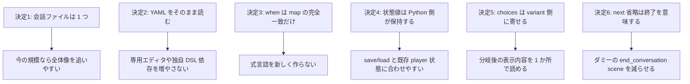
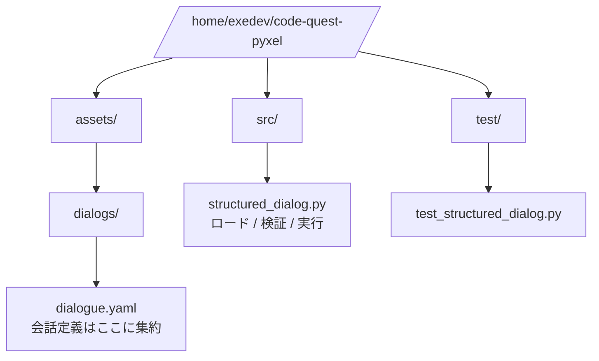
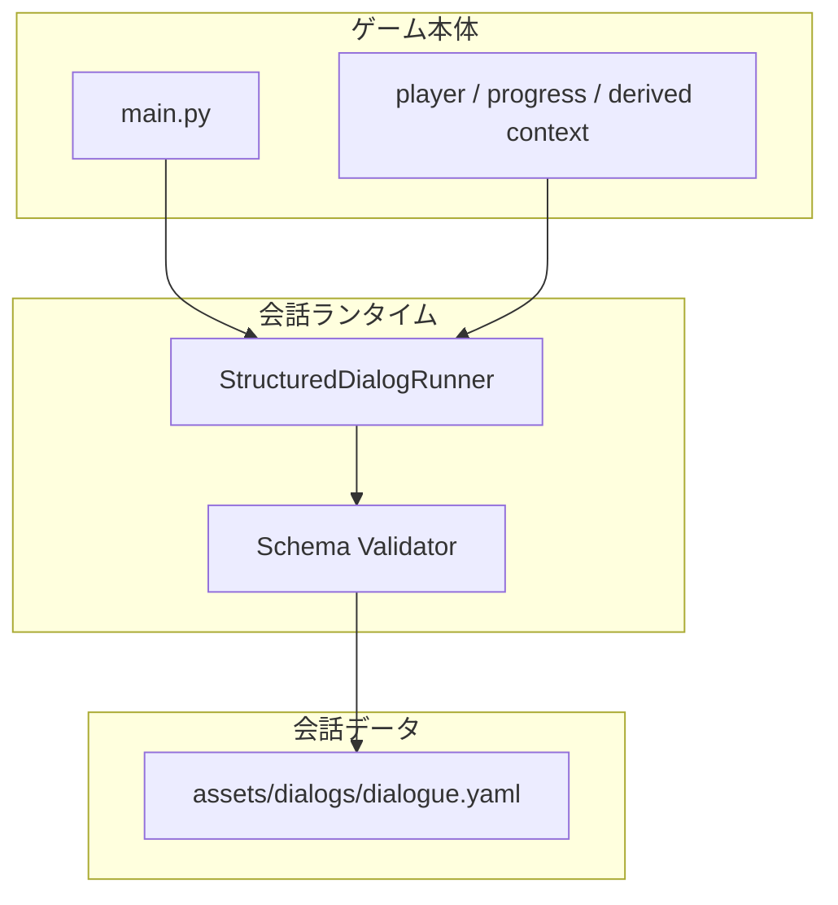
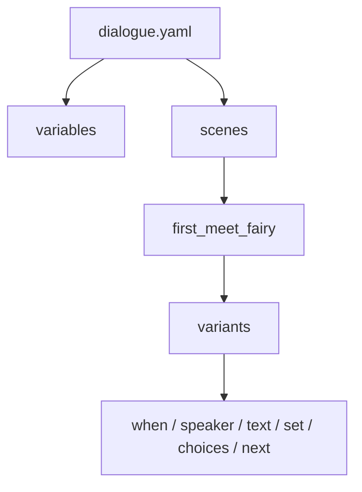
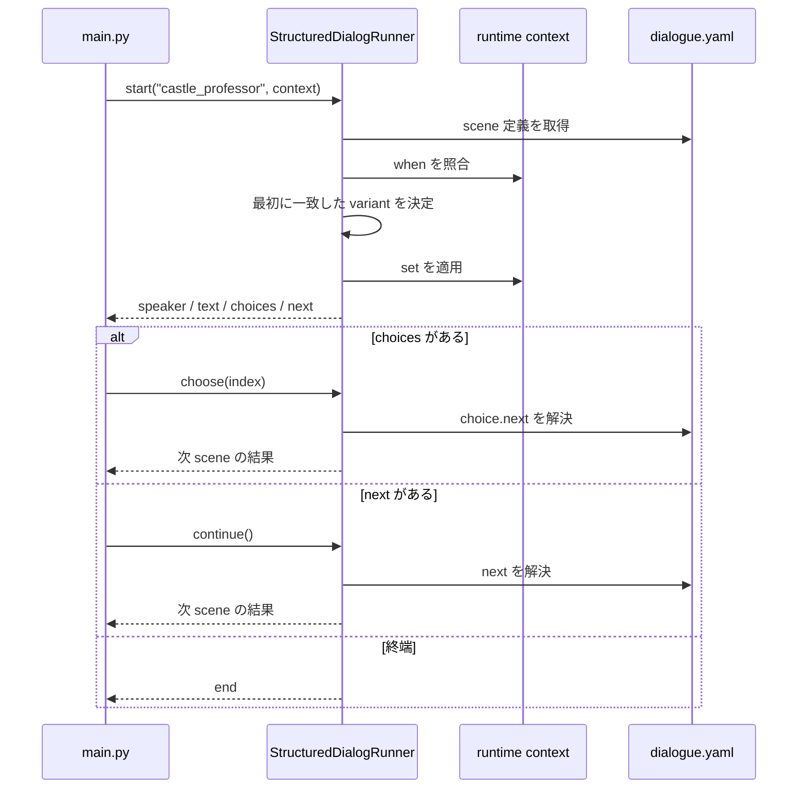
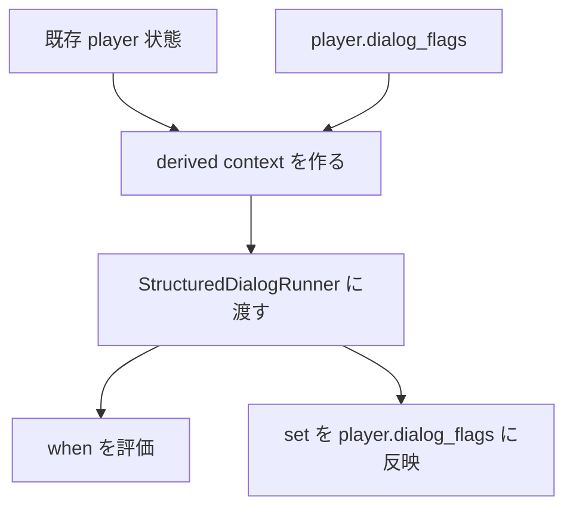
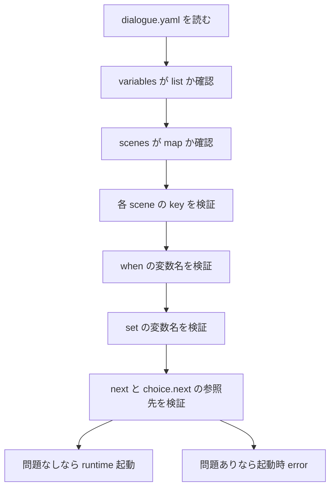
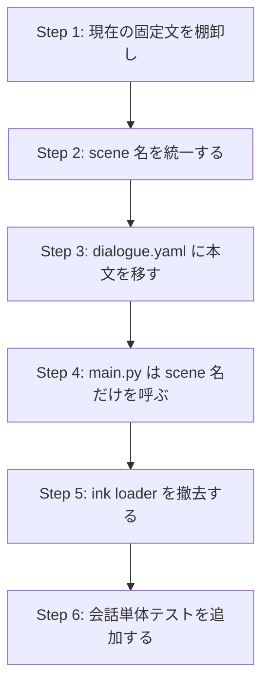

# Design: 構造化会話データ形式

この文書は、Block Quest の会話を **外部 DSL 依存なしの単一 YAML** へ寄せる設計をまとめる。  
今回の設計方針は一言で言うと、**「会話は 1 ファイル、状態は Python 側、分岐は exact match だけ」** である。

## 1. 設計判断



## 2. 採用するファイル構成



`assets/dialogs/*.ink` のようなシーン分割はやめ、まずは `assets/dialogs/dialogue.yaml` の 1 ファイルにまとめる。  
今の会話量ではその方が見通しがよく、検索も差分レビューも単純になる。

## 3. レイヤー構成



`main.py` は「どの scene を開くか」と「現在の状態が何か」だけを渡す。  
会話の文法解釈、variant 選択、`set` 適用、`next` 解決は `StructuredDialogRunner` に閉じ込める。

## 4. 形式の最終案

### 4.1 ルート構造



### 4.2 YAML 例

```yaml
variables:
  - HasMetFairy
  - AcceptedQuest_FindLute
  - ProfessorPhase

scenes:
  first_meet_fairy:
    variants:
      - when:
          HasMetFairy: false
        speaker: fairy
        text: "初めまして、旅人さん。"
        set:
          HasMetFairy: true
        choices:
          - text: "困っていることは？"
            next: quest_offer_lute
          - text: "先を急ぐんだ"

      - when:
          HasMetFairy: true
        speaker: fairy
        text: "また会ったわね。"
        choices:
          - text: "困っていることは？"
            next: quest_offer_lute
          - text: "先を急ぐんだ"

  quest_offer_lute:
    variants:
      - when:
          AcceptedQuest_FindLute: false
        speaker: fairy
        text: "実は…落としたリュートを探してほしいの。"
        choices:
          - text: "引き受ける"
            next: quest_accept_lute
          - text: "今は無理だ"

      - when:
          AcceptedQuest_FindLute: true
        speaker: fairy
        text: "リュートの件、頼んだわね。"

  quest_accept_lute:
    speaker: hero
    text: "わかった、探してみるよ。"
    set:
      AcceptedQuest_FindLute: true

  castle_professor:
    variants:
      - when:
          ProfessorPhase: early
        speaker: professor
        text: "町に立ち寄り、装備を整えよう。"
      - when:
          ProfessorPhase: mid
        speaker: professor
        text: "なぜお前だけが気づくのか、考えたことはあるか？"
      - when:
          ProfessorPhase: late
        speaker: professor
        text: "それでもなお、理解し続けるのか？"
```

## 5. スキーマ規則

### 5.1 scene が持てるキー

- `speaker`
- `text`
- `set`
- `choices`
- `next`
- `variants`

### 5.2 variant が持てるキー

- `when`
- `speaker`
- `text`
- `set`
- `choices`
- `next`

### 5.3 制約

- `variants` を使う scene では、`speaker/text/set/choices/next` は **variant 側に寄せる**。scene 直下には置かない。
- `when` は **完全一致の map** に限定する。自由記述式は扱わない。
- `set` は **map** に限定する。`"Flag = true"` のような文字列式は使わない。
- `choices` の各要素は `text` を必須とし、`next` は任意とする。`next` が無い choice はそこで会話終了。
- `next` が無い scene / variant は会話終了。

## 6. 実行シーケンス



### 6.1 評価順

1. scene を名前で引く
2. `variants` があるなら上から `when` を照合する
3. 最初に一致した entry を採用する
4. `speaker/text` を返す
5. `set` を現在の状態へ反映する
6. `choices` があれば選択待ちに入る
7. `choices` が無く `next` があれば次 scene へ進む
8. どちらも無ければ終了する

## 7. 状態モデル



### 7.1 分け方

- `player.dialog_flags`
  - 会話自身が読み書きする状態
  - 例: `HasMetFairy`, `AcceptedQuest_FindLute`
- `derived context`
  - 既存ゲーム状態から Python 側で正規化して渡す読み取り専用の状態
  - 例: `ProfessorPhase = early | mid | late`

### 7.2 なぜ式を禁止するのか

今のゲームには `maxZoneReached >= 3` のような分岐がありうる。  
これをそのまま会話ファイルに持ち込むと、結局「条件式を解釈する小さな言語」を自作することになる。  
そこで Python 側で `ProfessorPhase` のような**意味のある派生状態**へ変換し、YAML 側は完全一致だけにする。

## 8. バリデーション設計



起動時 validation で落とす対象は少なくとも次の通り。

- 未宣言の変数参照
- 未定義 scene への `next`
- `variants` と scene 直下 `choices` の混在
- `set` の文字列式
- `when` の自由記述式

## 9. 現行コードからの移行



### 9.1 初回移行の対象

- `main.py` に残っている固定会話
- 旧 `assets/dialogs/*.ink` にあった町 / 城の本文

### 9.2 初回移行でやらないこと

- 複雑な式文字列の導入
- 複数 YAML ファイルへの分割
- 専用エディタ依存
- 外部ランタイム依存

## 10. テスト観点

- scene 単体再生
- `variants` の first-match
- fallback variant
- `set` の反映順
- `choice.next` 遷移
- `next` 省略時の終了
- validation error の内容

この設計なら、会話の管理単位は「専用言語のノード」ではなく、**ゲーム状態に反応する scene** になる。  
それが今回の目的に最も合っている。
