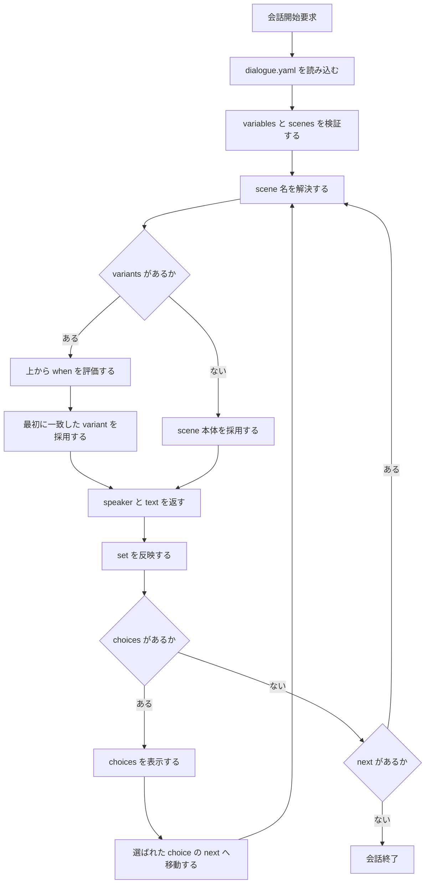
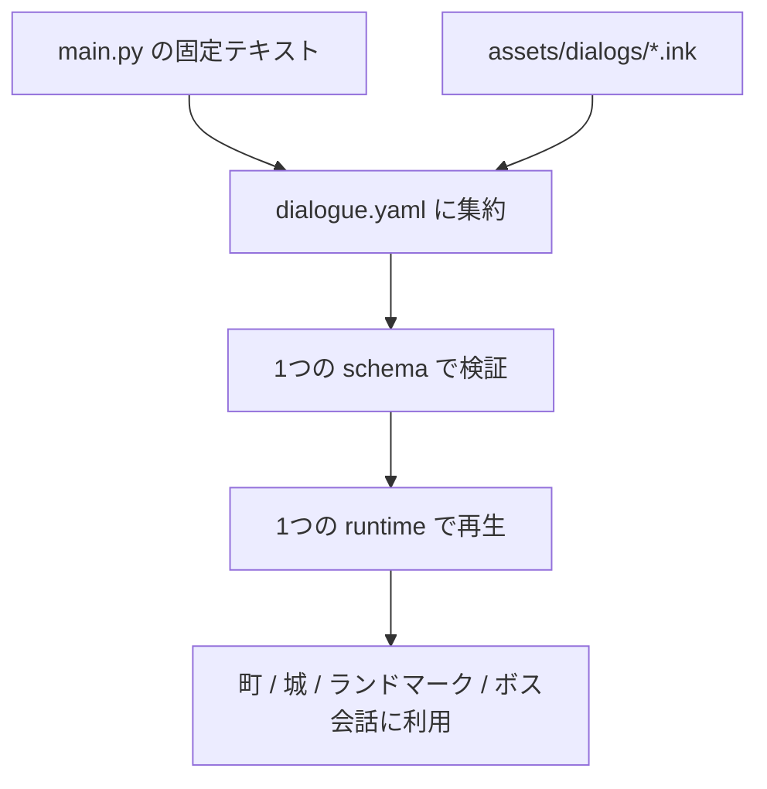

# Gherkins: 構造化会話データ形式

この文書は、`bink` や `yarn` のような外部会話言語ではなく、`assets/dialogs/dialogue.yaml` のような**単一の構造化データ**で会話を管理するための受け入れ条件を定義する。

## 1. 受け入れの全体像



## 2. 今回の移行対象



## 3. Gherkin

```gherkin
Feature: 構造化会話データでゲーム状態に応じた会話を再生する
  Block Quest の会話管理者として
  外部会話言語ではなく YAML ベースの単一データで
  会話本文と分岐条件を一貫して管理したい

  Scenario: 会話ファイルは 1 つにまとまっている
    Given 会話定義ファイル "assets/dialogs/dialogue.yaml" が存在する
    Then variables と scenes が同じファイル内に定義されている
    And 町ごとの .ink や .yarn を前提にしない

  Scenario: 宣言された変数だけを会話条件で参照できる
    Given variables に "HasMetFairy" が宣言されている
    And variables に "AcceptedQuest_FindLute" が宣言されている
    When scene の when または set が評価される
    Then 宣言済みの変数名だけが使われる
    And 未宣言の変数名があれば validation error になる

  Scenario: variants は上から順に評価され最初の一致が採用される
    Given scene "first_meet_fairy" に複数の variants がある
    And 現在の状態で "HasMetFairy = false" である
    When scene "first_meet_fairy" を再生する
    Then "HasMetFairy: false" に一致する variant が選ばれる
    And それより下の variant は評価されても採用されない

  Scenario: when を持たない variant はフォールバックとして使える
    Given scene "first_meet_fairy" の最後の variant に when が書かれていない
    And それ以前の variant がどれも一致しない
    When scene "first_meet_fairy" を再生する
    Then when を持たない最後の variant が採用される

  Scenario: variants を使う scene では choices を scene 直下に置かない
    Given scene "first_meet_fairy" が variants を持つ
    When scene 直下に choices が書かれている
    Then validation error になる
    And "choices は採用される variant 側に置く" と案内される

  Scenario: set は文字列代入ではなく構造化された map で書く
    Given scene "quest_accept_lute" に状態変更がある
    When 会話定義が保存される
    Then set は "AcceptedQuest_FindLute: true" のような map で書かれる
    And "AcceptedQuest_FindLute = true" のような式文字列は使わない

  Scenario: set は次の分岐より前に反映される
    Given scene "first_meet_fairy" で "HasMetFairy" が false である
    And 採用された variant が set で "HasMetFairy: true" を持つ
    When その variant の text を表示し終える
    Then 現在の状態に "HasMetFairy = true" が保存される
    And 次に同じ scene を開くと再会用の variant が選ばれる

  Scenario: choices は採用された variant のものだけが表示される
    Given scene "quest_offer_lute" に "AcceptedQuest_FindLute" に応じた variants がある
    And 現在の状態で "AcceptedQuest_FindLute = false" である
    When scene "quest_offer_lute" を再生する
    Then 未受諾 variant の choices だけが表示される
    And 受諾済み variant の choices は表示されない

  Scenario: choice を選ぶと対応する next scene に遷移する
    Given scene "quest_offer_lute" に "引き受ける" の choice がある
    And その choice の next は "quest_accept_lute" である
    When プレイヤーが "引き受ける" を選ぶ
    Then 次に再生される scene は "quest_accept_lute" になる

  Scenario: next が無い scene は会話終了として扱う
    Given scene "quest_accept_lute" に next が定義されていない
    And choices も定義されていない
    When scene "quest_accept_lute" の text を表示し終える
    Then 会話はその場で終了する

  Scenario: next の参照先は起動時に検証される
    Given scene "quest_offer_lute" の choice が "quest_accept_lute" を next に持つ
    When dialogue.yaml をロードする
    Then "quest_accept_lute" が scenes に存在することが検証される
    And 不足していれば起動時に validation error になる

  Scenario: 数値比較や複雑な式は会話ファイルに書かない
    Given 既存ゲームに "maxZoneReached >= 3" のような分岐がある
    When その条件を会話形式へ移す
    Then Python 側で "ProfessorPhase = late" のような派生状態へ正規化する
    And dialogue.yaml 側では完全一致の when だけを使う
```
