# 設計書: 町メニューによるセーブ機能

`journey.md` / `gherkin.md` で合意済みのプロダクト判断（町でのみセーブ／3つの文言／個人メニューには項目なし／やどや と セーブ の分離）を、Pyxel 実装に落とすための設計。

プロダクト判断はここで覆さない。技術選定・実装方針のみを扱う。

---

## 設計判断の論点

| # | 論点 | 決定 | 理由 | 代替案と却下理由 |
|---|---|---|---|---|
| D1 | 永続化先 | **デスクトップ**: `save.json` ファイル／**web (pyxel.html)**: `localStorage`。`SaveStore` を抽象化して環境ごとに切替（D16〜D18） | このプロジェクトは `tools/build_web_release.py` で web 版も配布する。Pyxel web は Pyodide 上で動き、通常のファイルI/Oは MEMFS なのでリロードで消える。永続化するには JS の `localStorage` か IndexedDB が必要 | ファイルI/Oだけ：web版で消える／localStorageだけ：デスクトップでは `js` モジュールがなく動かない |
| D2 | セーブ可能ガードの場所 | **状態機械の構造そのものが保証**（`town_menu` ステートからしか `save_game()` を呼ばない） | 「町の外でセーブを試みる経路」自体を作らないことで、ランタイム判定とエラーメッセージが要らない | `save_game()` 内で `state == "town"` チェック：拒否ダイアログを実装することになり、gherkin シナリオ2の「項目自体が出ない」に反する |
| D3 | セーブデータのスキーマ | フラットな `dict`、`save_version: 1` を必須キーに含める | JSON で読みやすい／将来のマイグレーションは `save_version` で分岐 | dataclass + asdict：循環参照リスクと可読性低下 |
| D4 | 保存対象 | プレイヤー状態（位置・HP/MP・LV・EXP・所持金・インベントリ・装備・進行フラグ）+ 現在マップID | デバッグモードや戦闘一時状態は含めない（既存 `92-functional-design.md` の方針を踏襲） | 全 `Game` 属性を保存：debugMode 等が漏れる |
| D5 | ロード後の出現位置 | `save.json` に記録された **マップID + 座標**（必ず町の中になる） | セーブが町メニューからのみ呼ばれるので、保存座標が町の外になる経路がない | 「最後に訪れた町」を別途記録：保存タイミングと不整合になる可能性 |
| D6 | 町メニューの実装 | 既存 `town` ステートを **`town_menu` に置き換え**、`processTownInput` の流れに7項目選択を入れる | 既存 `TOWN_DIALOG_SCENES` の `はなす` 経路を残しつつ統一できる | 別ステート `town_shop` `town_inn` `town_save` に分割：状態数が増え遷移が複雑化 |
| D7 | 「やどや」と「セーブ」の分離実装 | 別ハンドラ `do_inn()` / `do_save()` として明確に分ける（共有ロジックなし） | 「休む」と「書き留める」を別の意味として印象づけたい（gherkin P1b） | 共通の「町施設」関数：意味の混在を招く |
| D8 | タイトル画面 `つづきから` の表示制御 | 起動時に `save.json` の存在チェックを行い、無ければ「つづきから」を **グレーアウトで選択不可**（gherkin P9） | 項目自体は常時並べて「セーブの存在」を初プレイヤーにも示し、空ロードのがっかり体験は手前で防ぐ | 非表示：初プレイヤーが「つづきから」の存在を知る機会を失う／常時選択可：シナリオ6の独白文言が頻発し興醒め |
| D9 | 保存失敗時の表示（gherkin P7） | システム的なエラーダイアログ `セーブに失敗しました（権限/容量を確認してください）` を出す | 世界観文言で吸収すると原因が伝わらず、プレイヤーが対処できない | 主人公独白：原因が伝わらない／クラッシュ：データ復旧ができない |
| D10 | やどや の料金（gherkin P8） | 固定 10G を消費（不足時は `コインが たりません` で町メニューに戻る） | 帰還＋休息に小さなコストを乗せ、町経済に意味を持たせる | 無料：町を「ただの全回復スポット」にしてしまい、ショップとの経済的緊張がなくなる／レベル比例：本作テーマと無関係 |
| D11 | セーブ完了後の遷移先（gherkin P10） | `message` を閉じたら `town_menu` に戻る | やどや/ショップ/でる を続けられる自然なRPG挙動。「セーブ＝強制終了の合図」にしない | map に直行：他の用事ができなくなる／自動終了：プレイヤーの自由度を奪う |
| D12 | デスクトップ版の `save.json` 物理位置 | `Path(__file__).resolve().parent / "save.json"`（ゲームディレクトリ直下） | コピー配布で素直に動く／ユーザーがファイルを目で見つけやすい | CWD：起動位置依存で予期しない場所に出る／ユーザーホーム配下：パッケージ化に強いが、初版ではPyInstaller対応はスコープ外。将来 D12 を差替可能にする|
| D13 | 「でる」を選んだ直後のプレイヤー位置 | 町タイル上にそのまま立たせ、`map` ステートで **Aボタン入力にクールダウン** を入れる | 隣タイルに押し出す方式と違い、地形（山・水）のフォールバックが要らない／無限再進入ループを最小コードで防げる | 隣タイルに押し出し：地形フォールバックが複雑／町前の座標を記憶：状態が1つ増える |
| D14 | 「はなす」の構造 | 「はなす」を選ぶと **その町の NPC リスト** が表示され、個別 NPC を選んで会話する | プロダクト判断 P11 として gherkin に追加。既存 `TOWN_DIALOG_SCENES`（町=シーン1対1）を **`TOWN_NPCS`（町→NPC配列）** に分解する必要あり | 自動再生：状態管理が複雑／町に入ったとき自動：「はなす」項目の意味が薄い |
| D15 | ロード後の出現座標 | セーブ実行時に記録した **町タイルの座標**（同じ町の同じセル） | 「町で書き留めた」体験と一致／町メニューの A クールダウン（D13）と組み合わせれば、ロード直後に町メニューが暴発しない | 町の固定スポーン点：複数の町を跨いだあとでも同じ点に戻ってしまい混乱／町外座標：仕様上ありえない |
| D16 | デスクトップ／web の分岐方式 | `SaveStore` を **Protocol（インターフェース）** にし、`FileSaveStore`（デスクトップ）と `LocalStorageSaveStore`（web）の2実装を提供 | ビジネスロジック（`do_save`/`do_load`）は同じまま、永続層だけ差し替えられる。ユニットテスト時は `InMemorySaveStore` も追加可能 | 関数内 if 分岐：テストしづらく、責務が混ざる／ビルド時差替え：ビルド手順が複雑で、IDE 補完も効かない |
| D17 | 環境検出方法 | 起動時に `try: import js; IS_WEB = True except ImportError: IS_WEB = False` を1ヶ所で実行し、結果に基づき `SaveStore` を選ぶ | Pyodide には `js` モジュールが必ずあり、デスクトップにはない。最も確実な判定 | `sys.platform` 判定：`emscripten` 等の値が Pyxel バージョン間で揺れる可能性／環境変数：手動設定が必要 |
| D18 | デスクトップと web のセーブデータ互換 | **同じ JSON スキーマ・同じキー名 `blockquest_save`**（gherkin P12） | スマホ web → PC デスクトップ の手動エクスポート / 将来クラウド同期 が容易。デバッグ用にもスキーマ統一が効く | スキーマ独立：将来移行できなくなる |
| D19 | web `localStorage` のキー名 | `blockquest_save_v1`（D3 の `save_version` を含めて将来分離可能） | 名前空間衝突を避けつつ、バージョン間共存も可能 | 単に `save`：他ゲームと衝突 |

---

## アーキテクチャ概要

セーブ機能は、既存の状態機械に **`town_menu` ステート** を追加し、既存 `save_game()` / `load_game()` を **その遷移の中からのみ呼ぶ**構造で実現する。「町の外でセーブできない」は **コードではなく状態遷移図のレベル**で保証する。

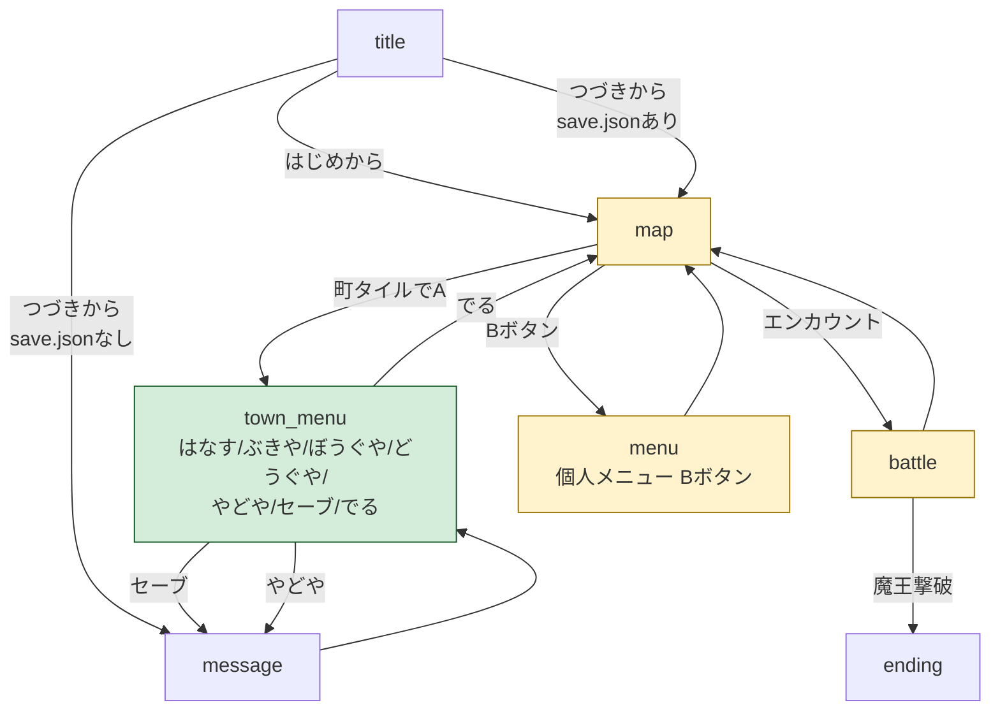

**この図が伝えたい不変条件**:
- `save_game()` を呼ぶ矢印は **`townMenu` から `message` への1本だけ** に存在する
- `menu`（個人メニュー）にはそもそも save への矢印がない
- `map` から save への直接矢印もない
- セーブ後 `message` を閉じると `townMenu` に戻る（D11 / gherkin P10）。`map` への直行はしない

---

## コンポーネント設計

### 1. SaveStore（永続化レイヤー / 抽象 + 2実装）

**責務**（インターフェース共通）:
- セーブデータ（dict）の読み書き
- スキーマバージョンチェック（D3）
- 「データが存在するか」の問い合わせ
- 書き込み失敗時は例外を投げ、`TownMenuController` 側で捕捉

**実装の要点**:
- `Protocol` として `exists() / load() / save(data)` を定義
- 起動時に `IS_WEB` を判定し、`FileSaveStore` または `LocalStorageSaveStore` を選択（D17）
- どちらも **同じ JSON スキーマ・同じキー名** を使い、互換を保つ（D18）

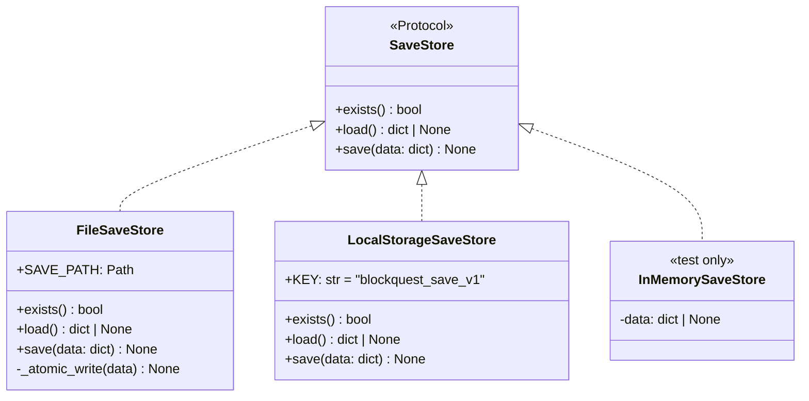

**FileSaveStore（デスクトップ）**:
- パス: `Path(__file__).resolve().parent / "save.json"`（D12）
- 書き込み: `save.json.tmp` に書いて `os.replace`（アトミック）
- 失敗時: `OSError` を投げる

**LocalStorageSaveStore（web / Pyodide）**:
- バックエンド: `import js; js.localStorage.setItem(KEY, json_str)`
- キー: `blockquest_save_v1`（D19）
- 読み込み失敗（不在）: `js.localStorage.getItem` が `None` を返したらこちらも `None`
- 書き込み失敗: `localStorage` 容量超過など → `js.Error` を捕捉して `OSError` に正規化（呼び出し側のエラーハンドリングを統一）

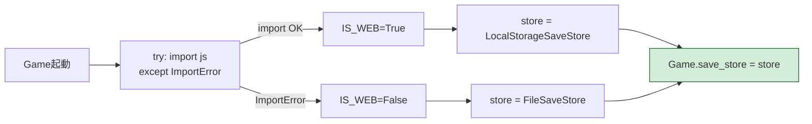

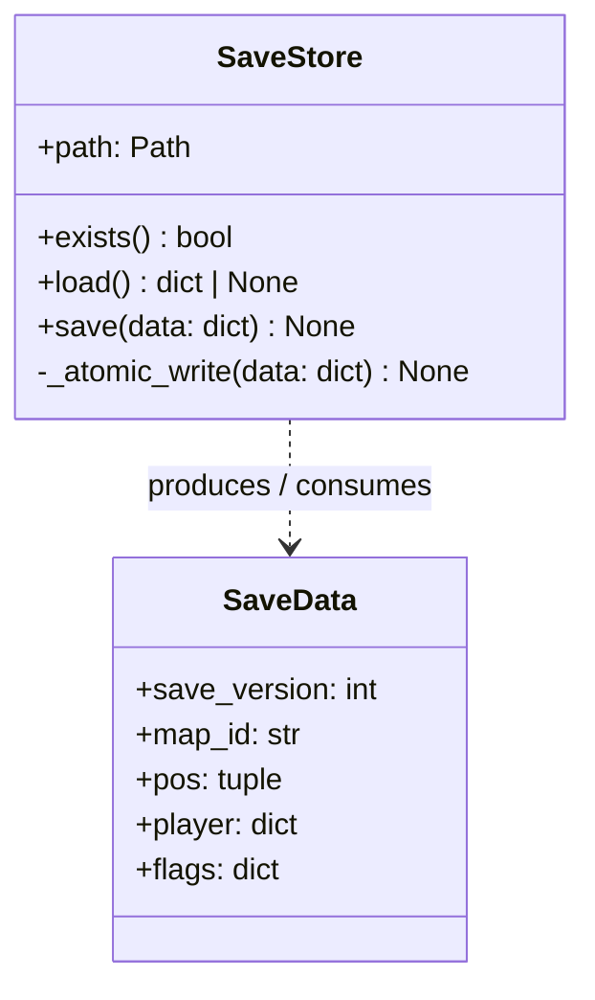

### 2. TownMenuController

**責務**:
- 7項目の選択UI（はなす/ぶきや/ぼうぐや/どうぐや/やどや/セーブ/でる）
- 各項目への分岐
- `セーブ` 選択時に `SaveStore.save(snapshot())` を呼び、書き込み失敗を捕捉してシステムエラーダイアログに流す
- `でる` 選択時に `state = "map"` に戻し、**Aボタンクールダウンフラグ** を立てる（D13）

**実装の要点**:
- 「はなす」は **NPCリストのサブメニュー**を開く（D14）。既存 `TOWN_DIALOG_SCENES` を **`TOWN_NPCS: dict[TownId, list[NPC]]`** に分解する
- `ぶきや/ぼうぐや/どうぐや` は既存ショップロジックに `shop_type` を渡して再利用
- 戦闘中は到達不可能（状態遷移上、`battle` から `town_menu` への矢印がない）

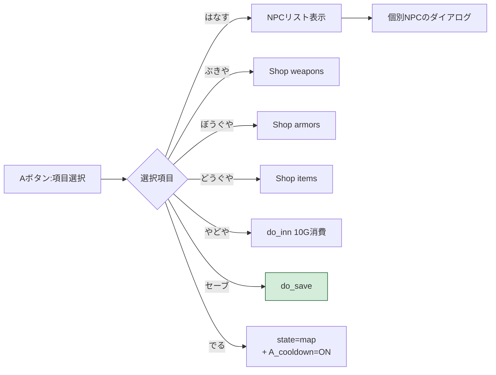

**「はなす」サブメニューのデータ構造**:

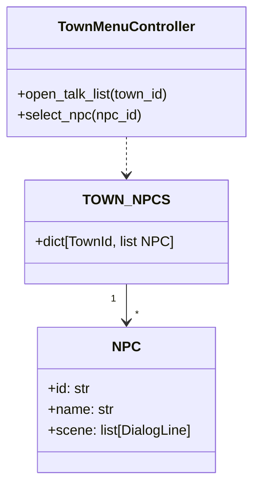

**スコープ注**: D14 により既存 `TOWN_DIALOG_SCENES` のリファクタが必要。本steeringの `tasklist.md` にデータ構造移行タスクを明示する。

### 3. TitleController（拡張）

**責務**:
- 起動時に `SaveStore.exists()` を一度だけ呼び、結果を `has_save: bool` としてキャッシュ
- `はじめから` / `つづきから` を縦に並べる
- `has_save == False` のとき `つづきから` を **グレーアウトしてカーソル選択不可**（D8 / gherkin P9）
- `has_save == True` の `つづきから` 選択時に `load_game()` を呼ぶ
- セーフティネット: `has_save == True` でロードが失敗した場合のみ `まだ何も書き留めていない…` の独白文言を出してタイトルに戻る（D9 のエラーダイアログとは別経路、シナリオ6の例外系）

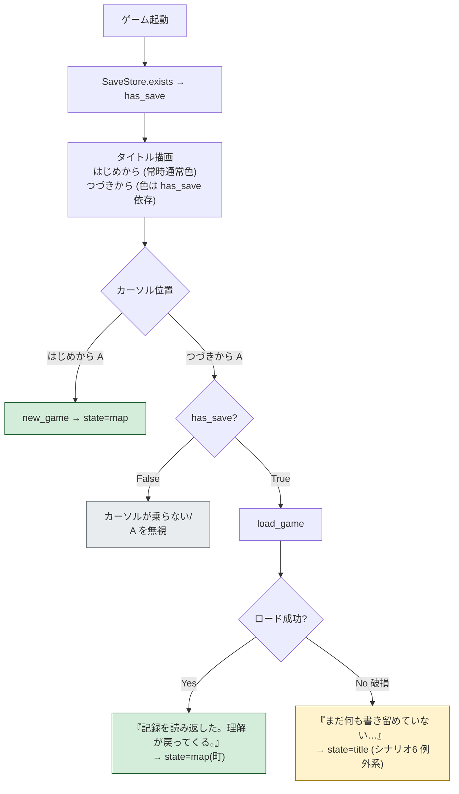

### 4. PlayerSnapshot（純粋関数）

**責務**:
- `Game` インスタンスから保存対象だけを抜き出して dict を返す
- dict から `Game` の状態を復元する

**実装の要点**:
- 保存対象は **明示リスト**（`SAVED_KEYS`）で管理し、新しい属性が増えたとき意識的に追加する
- これにより `debugMode` 等が「うっかり保存される」事故を防ぐ（D4）
- 座標は **必ず町タイル** であることが構造上保証される（D2 + D15）

### 5. Mapステート: Aボタンクールダウン（D13）

**責務**:
- 「でる」直後に町タイル上で A 連打→再進入ループが起きるのを防ぐ

**実装の要点**:
- `Game` に `_a_cooldown: bool` フラグを持つ（既定 False）
- `townMenu → map` 遷移時に True にする
- `map` ステートで A の押下を読むときに、`_a_cooldown == True` ならその入力を捨てて False に戻す
- ロード直後にも True にする（D15 と組み合わせ。町タイルの上に出現した瞬間に町メニューが暴発しないように）

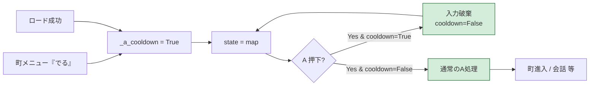

---

## データフロー

### ユースケース1: 町でセーブする

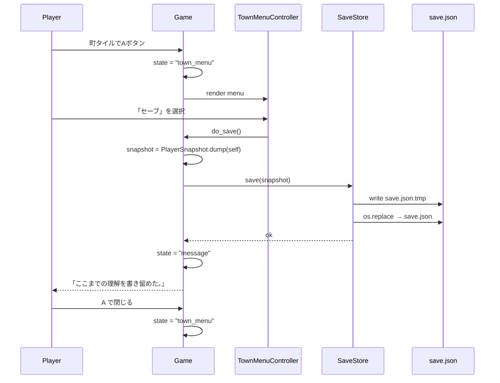

### ユースケース2: つづきから再開

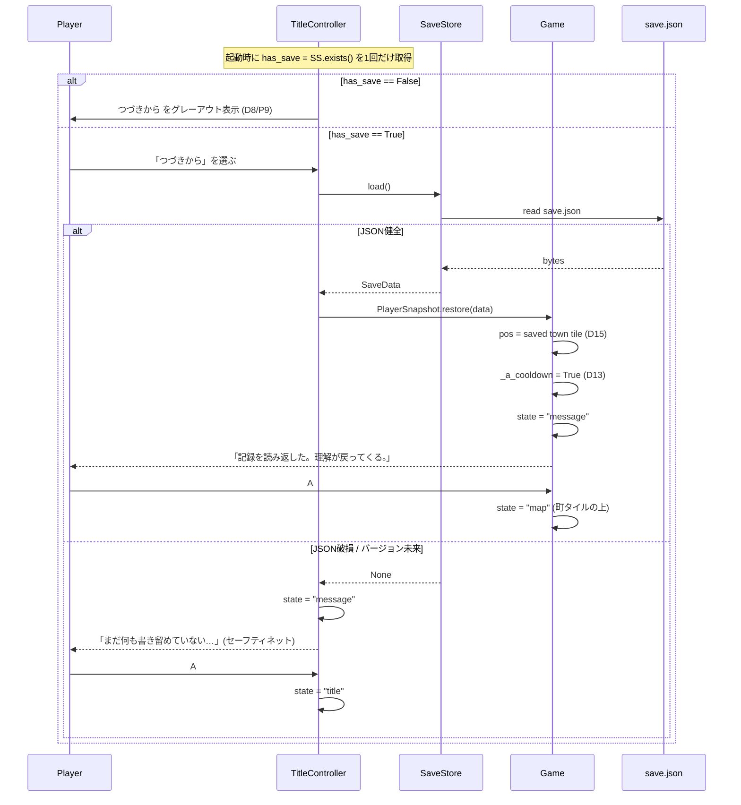

### ユースケース3: やどや（休む / 10G 消費 D10）

```mermaid
sequenceDiagram
    participant P as Player
    participant TM as TownMenuController
    participant G as Game

    P->>TM: 「やどや」を選択
    TM->>G: do_inn()
    alt coin >= 10
        G->>G: coin -= 10
        G->>G: hp = max_hp; mp = max_mp; flags.bug_taint = False
        G->>G: state = "message"
        G-->>P: 「安全な場所で休んだ。思考が冴える。HPとMPが かいふくした！」
    else coin < 10
        G->>G: state = "message"
        G-->>P: 「コインが たりません」
    end
    P->>G: A
    G->>G: state = "town_menu"
```

**注**: `do_save()` と `do_inn()` は **互いを呼ばない**（D7）。プレイヤーの動線として2つを連続で実行することはできるが、関数レベルでは独立。料金 10G は `INN_COST` 定数で1ヶ所定義する。

---

## エラーハンドリング戦略

`gherkin.md` の P7 / P9 / D9 に基づき、**世界観文言とシステムエラー文言を明確に分離**する。

| 失敗 | 発生箇所 | 対応 | 文言種別 |
|---|---|---|---|
| デスクトップ: `save.json` 書き込み失敗（権限・容量） | `FileSaveStore.save()` | tmp 削除→`OSError` を投げる→システムエラーダイアログ→`town_menu` に戻る | **システム** `セーブに失敗しました（権限/容量を確認してください）` |
| web: `localStorage.setItem` 失敗（容量超過 / プライベートブラウズ拒否） | `LocalStorageSaveStore.save()` | `js.Error` を捕捉して `OSError` に正規化→以下同上 | **システム** `セーブに失敗しました（ブラウザの保存領域を確認してください）` |
| データ JSON 破損 | `*.load()` | `None` を返す→TitleController が独白文言→タイトルに戻る | **世界観** `まだ何も書き留めていない…`（シナリオ6 例外系） |
| `save_version` が未来 | `*.load()` | 同上（破損扱い） | 同上 |
| データ不在（通常の初プレイ） | 起動時 `*.exists()` | `つづきから` をグレーアウト。文言は出さない | **無し**（D8 で手前に防ぐ） |

**設計の意図**: 「書き込み失敗」は **対処可能なユーザー責任**（容量空けろ・権限直せ）なのでシステム文言で原因を伝える。「データ破損」は **対処不能な事故**なので独白文言で吸収する。

### 一時ファイル方針

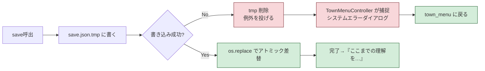

---

## テスト戦略

### ユニットテスト

- `PlayerSnapshot.dump` が `SAVED_KEYS` 以外を含めない（debugMode リーク検証）
- `PlayerSnapshot.dump` → `restore` のラウンドトリップで全フィールドが一致
- `SaveStore.save` がアトミック（書き込み中のクラッシュをシミュレートして元データが残ることを確認）
- `SaveStore.load` の不在 / 破損 / バージョン未来 が **すべて None を返す**

### 統合テスト（状態遷移ベース）

- `state == "town_menu"` 以外から `do_save()` が**呼べない**ことを静的に確認（grep ベースのテスト: `do_save()` の呼出元が TownMenuController だけ）
- 起動 → タイトル → はじめから → 町 → セーブ → 終了 → 起動 → つづきから の往復で player 状態が一致

### Gherkin → テスト名マッピング

| シナリオ | テスト名（案） |
|---|---|
| 1 町メニューからセーブ | `test_save_from_town_menu_persists_player_state` |
| 2 個人メニューにセーブ項目なし | `test_personal_menu_never_includes_save_tab` |
| 3 帰還判断 | テスト対象外（プレイヤー判断） |
| 4 タイトル画面 | `test_title_shows_continue_when_save_exists` |
| 5 つづきから | `test_load_restores_player_in_town` |
| 6 記録なしでつづきから | `test_load_without_save_shows_no_record_message` |
| 7 5分プレイ | E2E 手動 |

---

## 依存ライブラリ

新規追加なし。

- **デスクトップ**: 標準ライブラリ `json` / `pathlib` / `os`
- **web**: Pyodide ランタイムが提供する `js` モジュール経由で `js.localStorage`（追加依存なし）

`js` モジュールはデスクトップ Python には存在しないため、`LocalStorageSaveStore` の中でのみ `import js` を行う（モジュールトップでは行わない）。

---

## ディレクトリ構造

新規ファイルは作らず、既存 `main.py` 内に章を追加する方針（プロジェクト現状に合わせる）。将来 `main.py` が肥大化したら以下に切り出す:

```
pyxel/
├── main.py              # ゲームループ（既存）
├── save_store.py        # SaveStore（将来切り出し候補）
├── player_snapshot.py   # PlayerSnapshot（将来切り出し候補）
├── town_menu.py         # TownMenuController（将来切り出し候補）
└── save.json            # 実行時生成
```

---

## 実装の順序

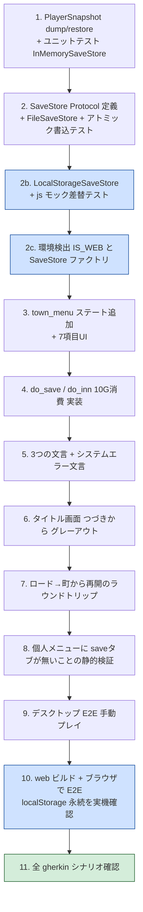

**web実機確認の重要ポイント（P10）**:
- ブラウザを完全リロードしてもセーブが残ること
- プライベートブラウジング（Safari/Chromeの`localStorage`制限環境）でセーブを試み、システムエラーダイアログが正しく出ること
- スマホブラウザ（iOS Safari / Android Chrome）でも動くこと（gherkin シナリオ7「5分プレイ」の主要シナリオ）

**TDD の進め方**:
- 各ステップで **Red（失敗するテスト）→ Green（最小実装）** の順
- 特に P1, P2, P8 はテストが書きやすいので先に Red を出す
- P3〜P5 は見た目要素なので、メッセージ文字列の不変条件（`"ここまでの理解を書き留めた。"` がコード上どこかに存在する）をテスト化する

---

## セキュリティ考慮事項

### データアクセス認可チェック
本機能はローカルゲームのファイル保存であり、マルチユーザー認可の概念はない。`save.json` はゲームディレクトリ直下の単一ファイル。

### その他
- `save.json` は **ユーザーが手で編集してチート可能** だが、本ゲームのスコープでは許容する（シングルプレイ・スコア競争なし）
- パス traversal リスクなし（ファイル名は固定）

---

## パフォーマンス考慮事項

- セーブ書き込みはプレイヤー操作ベースで頻繁ではない（町でのみ）。最大数十KBを想定し、同期書き込みで十分
- 起動時の `SaveStore.exists()` は1回だけ（タイトル表示前）
- ロードは1回・JSON パースのみで体感即時

---

## 将来の拡張性

スコープ外として封印しているが、構造は次の拡張を阻害しない:

- **複数スロット**: `SaveStore` を `slot_id` 引数化すれば対応可能
- **オートセーブ**: `town_menu` 遷移時に自動で `do_save()` を呼ぶだけで実装できる（プロダクト判断 P5 で却下中）
- **クラウド同期**: `SaveStore` を抽象化し、`LocalSaveStore` / `CloudSaveStore` を切替可能にする
- **マイグレーション**: `save_version` の分岐で対応

これらは `journey.md` の「スコープ外」に明示済み。実装時には本ファイルから `SaveStore` の境界を崩さないことだけ守ればよい。

---

## 参照

- `./journey.md` — ユーザージャーニー
- `./gherkin.md` — 受け入れ条件・プロダクト判断
- `docs/00-pyxel-design.md` — Pyxel全体構成・ファイル配置
- `docs/92-functional-design.md` — 既存セーブ対象方針（debugMode 除外）
- `docs/97-acceptance.md` — メニュー / 町メニュー受入条件
