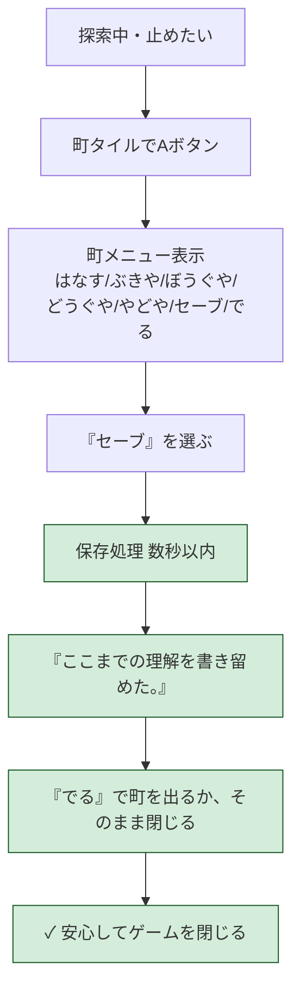
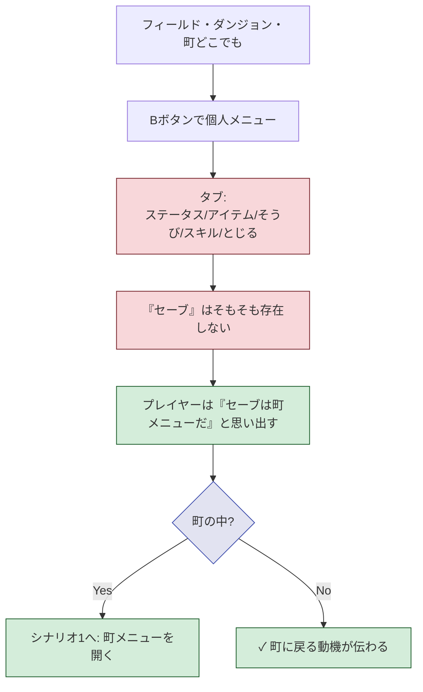
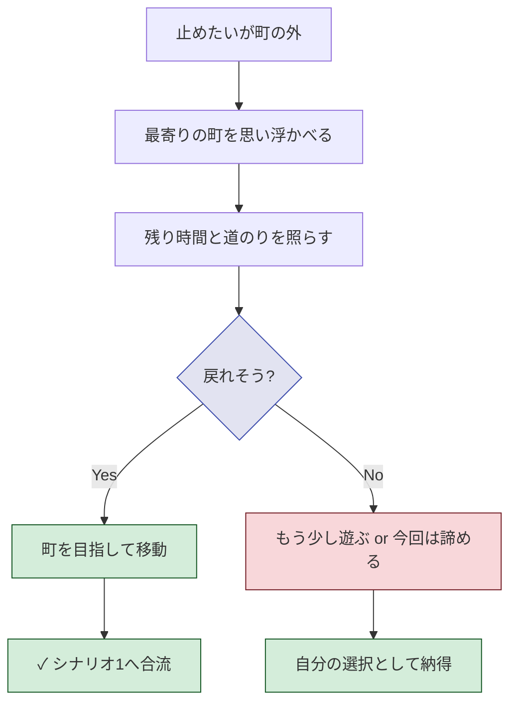
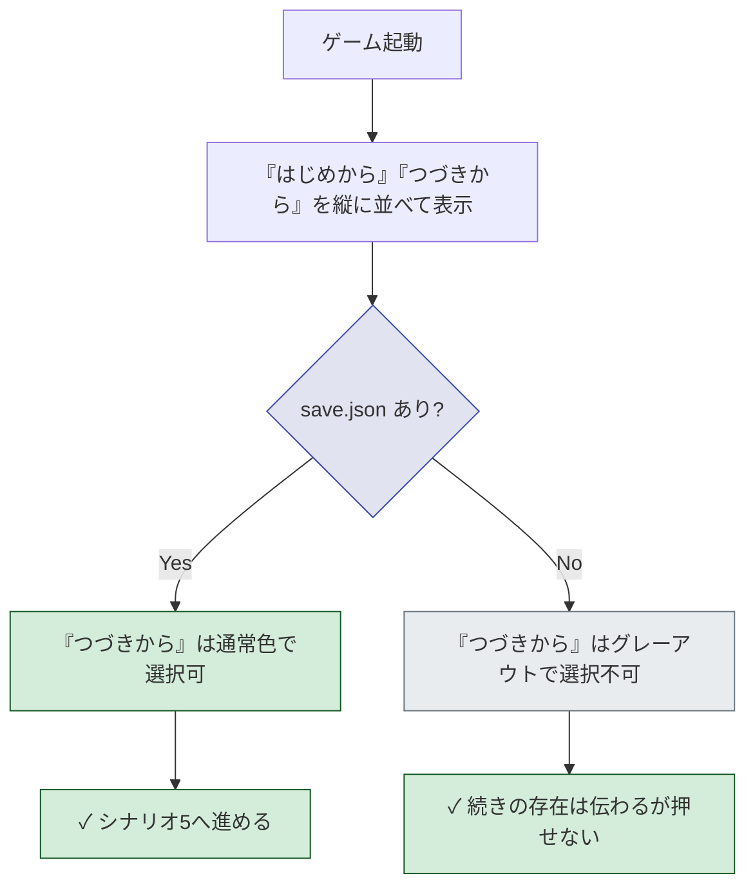
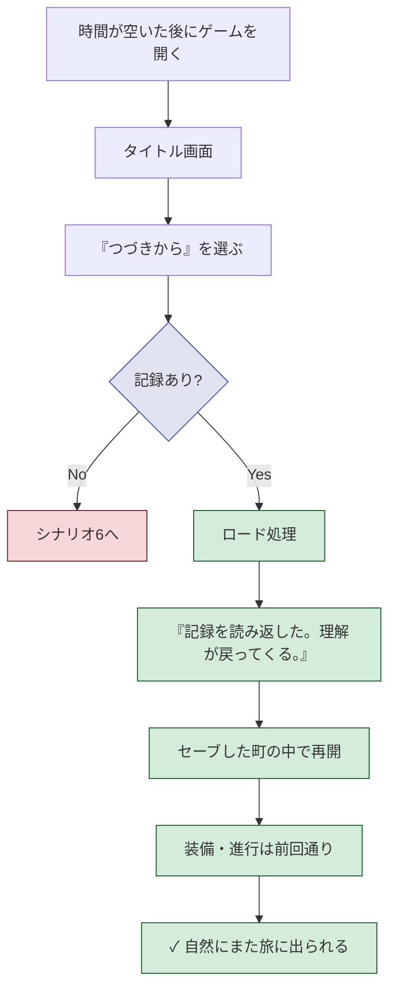
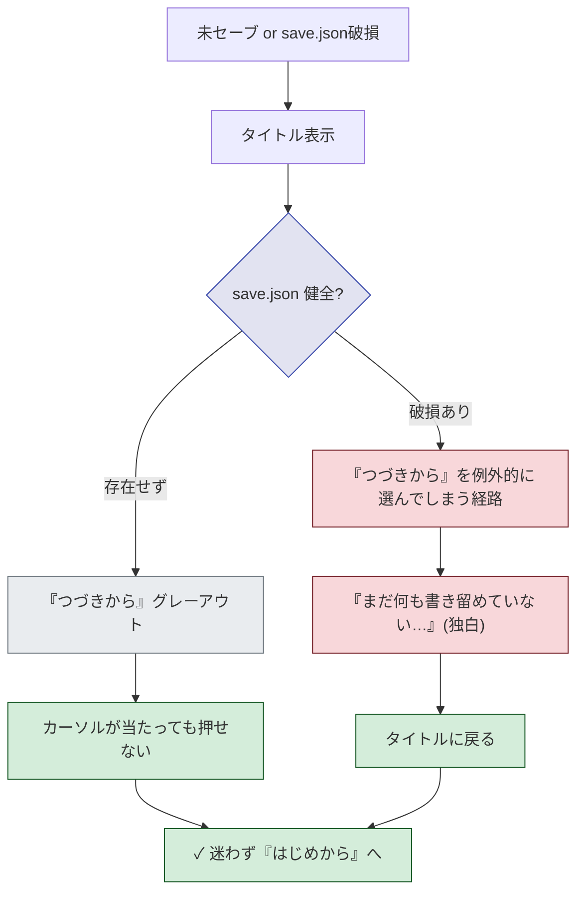
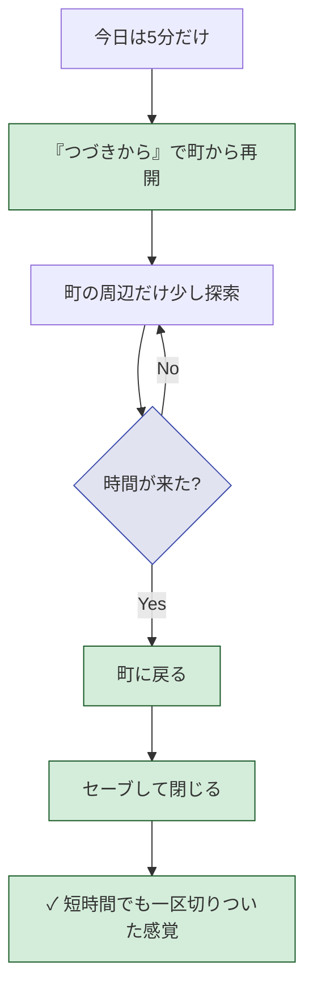
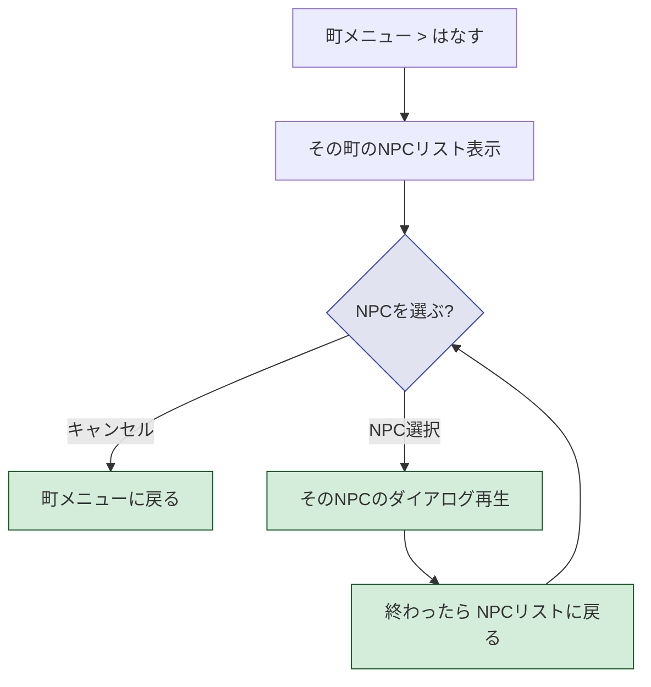
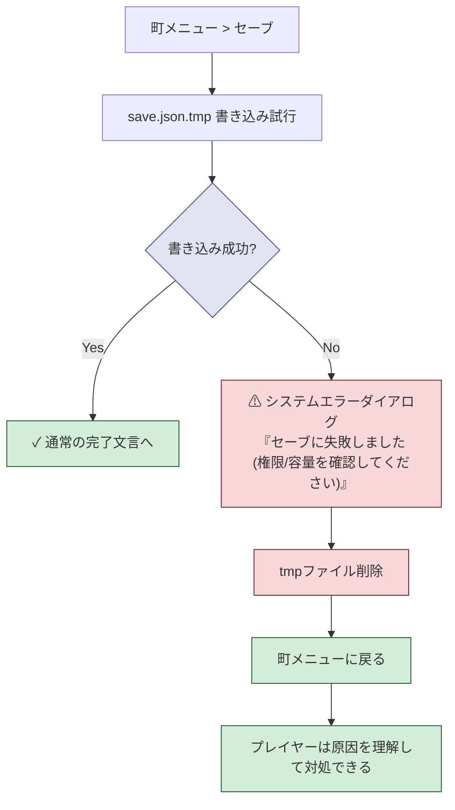
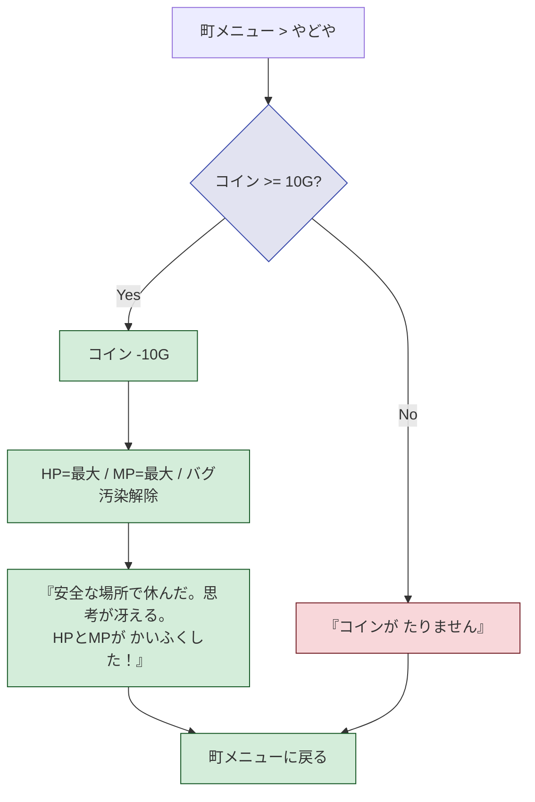

# 受け入れ条件: ブロッククエストのセーブ機能

> 各シナリオは `flowchart TD` 1枚 + 1行サマリー Gherkin のみ。詳細な体験設計は `journey.md` を参照。

## プロダクト判断の合意事項

| # | 論点 | 決定 | 理由 |
|---|---|---|---|
| P1 | セーブできる場所 | 町メニュー（はなす/ぶきや/ぼうぐや/どうぐや/やどや/セーブ/でる）の中だけ。個人メニュー(Bボタン)には常時セーブ項目なし | 町を「帰ってくる場所」として印象づける／拒否ダイアログでがっかりさせない |
| P1b | やどや と セーブ の分離 | やどや＝HP/MP回復、セーブ＝記録の書き留め、別項目にする | 「休むこと」と「書き留めること」を別の意味として印象づける |
| P7 | セーブ書き込み失敗時 | システム的なエラーダイアログを出す（世界観文言ではない） | 「失敗を主人公の独白で吸収する」と原因（権限・容量）が伝わらず、ユーザーが対処できなくなる |
| P8 | やどや の料金 | 固定 10G を消費する | 帰還＋休息に小さなコストを乗せ、町経済に意味を持たせる。ただし高くしてプレイヤーを萎縮させない |
| P9 | 初回起動時の「つづきから」 | グレーアウトで表示し、選択不可にする | 「セーブの存在」を初プレイヤーにも示しつつ、空ロードのがっかり体験を防ぐ。結果としてシナリオ6（独白文言）の出番は実用上ほぼなくなる |
| P10 | セーブ完了後の遷移先 | 町メニューに戻る | 「セーブ＝強制終了の合図」ではなく、他の用事（やどや/ショップ/でる）を続けられる自然なRPG挙動 |
| P11 | 「はなす」の構造 | 「はなす」を選ぶとその町の **NPCリスト** が出て、個別 NPC を選んで会話する | 町に複数の人がいる手応えを出す。既存の「町に入った瞬間ダイアログ自動再生」より能動的な探索に変える |
| P12 | web版でのセーブ | web版（pyxel.html）でも localStorage で永続化する。デスクトップとは別の保存先だがJSONスキーマは同一 | journey.md の「スマホで少し進めて、あとで続きをやりたい」体験にはweb版の永続化が不可欠 |
| P13 | web版セーブの失敗時 | プライベートブラウジング等で `localStorage` 拒否時はシステムエラー `セーブに失敗しました（ブラウザの保存領域を確認してください）` | 原因の所在をブラウザ側だと分からせて、ユーザーが対処できるようにする |
| P2 | セーブ成功時の文言 | `ここまでの理解を書き留めた。` | システム通知ではなく主人公の独白として読ませる |
| P3 | ロード成功時の文言 | `記録を読み返した。理解が戻ってくる。` | 再開時にテーマ（理解の旅）を呼び戻す |
| P4 | 記録なし時の文言 | `まだ何も書き留めていない…` | 責めずに世界観の独白として伝える |
| P5 | オートセーブ | 入れない | プレイヤー自身の帰還判断を体験の核にするため |
| P6 | スロット数 | 1つだけ | 「書き留める／読み返す」体験の単純さを保つ |

---

## シナリオ1：町メニューからセーブして安心して閉じる

> **シナリオ1**：町に入った中断したいプレイヤー が 町メニューで `セーブ` を選ぶ と `ここまでの理解を書き留めた。` が返り安心して閉じられる

---

## シナリオ2：個人メニュー(Bボタン)にはどこでもセーブ項目がない

> **シナリオ2**：探索中のプレイヤー が Bボタンで個人メニューを開く と タブに `セーブ` が存在せず町に戻る動機が伝わる

---

## シナリオ3：帰還判断をする

> **シナリオ3**：止めたいが町の外にいるプレイヤー が 残り時間と道のりを照らす と 自分で帰還するか諦めるかを納得して選ぶ

---

## シナリオ4：タイトル画面で続きの存在が一目で分かる

> **シナリオ4**：プレイヤー が ゲームを起動する と `はじめから` と `つづきから` が並んで見え、セーブ有無で `つづきから` の選択可否が変わる

---

## シナリオ5：「つづきから」で町から再開する

> **シナリオ5**：前回町でセーブしたプレイヤー が `つづきから` を選ぶ と `記録を読み返した。理解が戻ってくる。` が返り町から自然に再開する

---

## シナリオ6：記録なしで「つづきから」を選ぼうとする

> **シナリオ6**：未セーブのプレイヤー が グレーアウトされた `つづきから` にカーソルを合わせる と 押せず迷わず `はじめから` に向かう

UI 設計（P9）により `つづきから` 自体がグレーアウトで選択不可になるので、独白文言「まだ何も書き留めていない…」は **異常系セーフティネット**（save.json が破損していて読めなかった等）でのみ出る。

---

## シナリオ7：5分しかない日でも区切りよく終われる

> **シナリオ7**：5分しか時間のないプレイヤー が `つづきから`→町の周辺探索→町に戻ってセーブ する と 短時間でも達成感が残る

---

## シナリオ10：「はなす」で町のNPCを選んで会話する

> **シナリオ10**：町メニューの `はなす` を選ぶ と その町の NPC リストが出て、個別 NPC を選ぶと会話が始まる

---

## シナリオ8：セーブ書き込みに失敗する（権限・容量）

> **シナリオ8**：書き込み権限のないプレイヤー が セーブを実行する と システム的なエラーダイアログが出て原因が分かる

---

## シナリオ9：やどや（HP/MP回復）はコインを消費する

> **シナリオ9**：HP/MPが減ったプレイヤー が 10G 以上持って `やどや` を選ぶ と 全回復し10Gが減る／不足ならその旨が伝わる

---

## 参照

- `./journey.md` — ユーザージャーニー（体験設計の元）
- `./design.md` — 実装設計
- `docs/35-story-design.md`
- `docs/39-playthrough-text.md`
