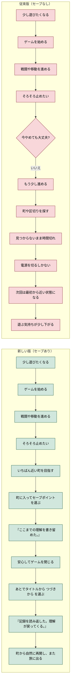
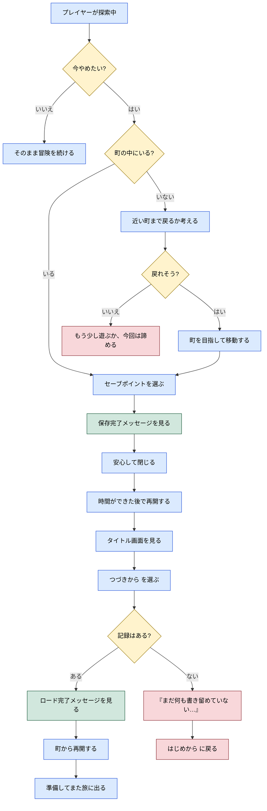
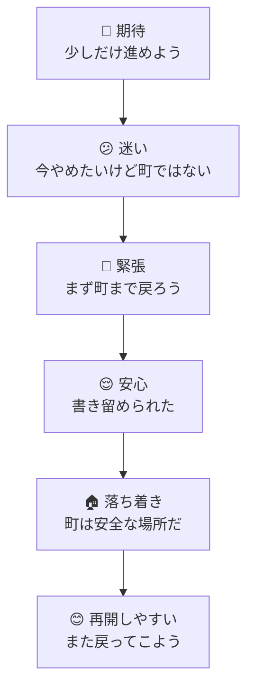
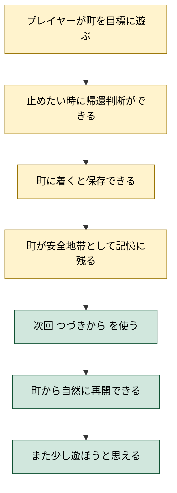

# ユーザージャーニー：ブロッククエストのセーブ機能

- 作成日: 2026-04-07
- 対象プロジェクト: Pyxel版 Block Quest
- 主役（プレイヤー）: 短い時間で遊ぶプレイヤー
- 目的: プレイヤーが「今はここで止めたい」と思ったときに、町まで戻って進行を書き留め、あとで自然に戻ってこられる体験を定義する
- スコープ: プレイヤー体験のみ。保存方式や実装詳細は扱わない

---

## 概要

このゲームは短時間でも遊べる構成だが、セーブできないと「今は遊べるけど、最後まで行けないから始めにくい」という壁が生まれる。
一方で、どこでもセーブできると、町がただの通過点になりやすい。

セーブ機能は、単に進行を残すための仕組みではない。
このゲームのテーマに沿って、

- セーブ = `ここまでの理解を書き留めた。`
- ロード = `記録を読み返した。理解が戻ってくる。`

という意味を持つ、プレイヤーの安心装置である。

ただし今回は意図的に、セーブは町だけでできるものとする。
そのぶん、

- 町にたどり着くこと自体が小さな達成になる
- 町が「安全な場所」として強く印象に残る
- 帰還して記録する、というRPGらしい区切りが生まれる

という体験を狙う。

---

## 背景

プレイヤーはいつも長い時間を確保できるわけではない。

- 学校や仕事の前に5分だけ遊びたい
- スマホで少し進めて、あとで続きをやりたい
- 町にたどり着いたところで、いったん止めたい

いまセーブがないと、プレイヤーは次のように感じやすい。

- 「今から始めても、中断したら全部やり直しになりそう」
- 「町まで戻れないなら、今日は始めないでおこう」
- 「せっかく気持ちが乗ったのに、再開しづらい」

その結果、ゲームに触れる回数そのものが減る。

---

## ユーザーストーリー

| プレイヤー | 放課後に遊ぶ中学生 | 通勤や休憩で遊ぶ大人 | 家でスマホで遊ぶ人 |
| :-- | :-- | :-- | :-- |
| ジョブ | 少しずつ冒険を進めたい | すきま時間で前進したい | 生活の合間に安心して遊びたい |
| 課題 | 途中で呼ばれると進行が消える | 5分では区切りよく終われない | 家事や会話で中断が入りやすい |
| 従来のタスク | 時間がある日にまとめて遊ぶ | 遊び始めるか迷って結局閉じる | 進んでもやり直しが怖い |
| 従来のコスト | 心理負担「中」 | 心理負担「大」 | 心理負担「大」 |
| 新しいタスク | 町まで戻ってセーブして止める | 区切りのいい所で町に帰って保存する | まず町に入ってから安心して閉じる |
| 新しいコスト | 町に戻る手間あり / 心理負担「中」 | 数分の見積もりが必要 / 心理負担「中」 | すぐ止められない時がある / 心理負担「中」 |

---

## ジャーニー全体図（縦長）

---

## 期待される体験の変化

### Before

1. プレイヤーが遊びたくなる
2. 少し進める
3. 止めたくなる
4. でも進行を残せないので、無理に続けるか諦めて閉じる
5. 次に開くと、前の気持ちが途切れている

**所要**: 止める判断に迷いが出る。短時間プレイと相性が悪い。

### After

1. プレイヤーが遊びたくなる
2. 少し進める
3. 止めたくなったら、まず町まで戻る
4. 町でセーブしてから安心して閉じる
5. 次回は `つづきから` で町から再開し、また旅に出られる

**所要**: 町まで戻る時間が加わる。短時間プレイでも、区切りを意識して遊ぶ形になる。

---

## セーブ体験の詳細フロー（縦長）

---

## 感情の流れ（縦長）

---

## 重要タッチポイント

| 場面 | プレイヤーの気持ち | 必要な導線 | 返すべきメッセージ |
| --- | --- | --- | --- |
| タイトル画面 | すぐ始めたい / 続きたい | `はじめから` と `つづきから` が並ぶ | 続きがあることが一目で分かる |
| フィールド | 今やめたいが町ではない | 近い町を目指す理由が必要 | 町に帰る価値が伝わる |
| 町 | 安全地帯で落ち着きたい | `セーブポイント` が意味を持つ | 安全な場所として印象づく |
| セーブ成功時 | 本当に残ったか不安 | すぐ反応が返る | `ここまでの理解を書き留めた。` |
| ロード成功時 | ちゃんと戻れるか不安 | `つづきから` が自然に使える | `記録を読み返した。理解が戻ってくる。` |
| セーブなしでロード時 | 続きがない | 失敗理由がすぐ分かる | `まだ何も書き留めていない…` |

---

## 成功の手触り

- プレイヤーが「町まで戻れる分だけ遊ぼう」と見積もれる
- 町に着いたとき、休む場所としての意味が強くなる
- `つづきから` を押した瞬間に、前回の気持ちがちゃんと戻る
- セーブ文言が世界観を壊さず、むしろテーマを支える
- 少し意地悪でも、帰還の達成感が残る

---

## 成功指標（縦長）

### 定性

- 「今は町まで戻ろう」と区切りを自分で考えられる
- 「また開くのが面倒」ではなく「次は町から出よう」と感じられる
- セーブが作業ではなく、帰還を含む旅の一部として受け取られる

### 定量

- 町に着いてからのセーブ操作がプレイヤー視点で数秒で完了すると感じられる
- `つづきから` の意味が説明なしで理解される
- 町帰還を前提にしても再開率が下がりすぎない設計になっている

---

## スコープ外

- 保存先がファイルかブラウザかの実装選定
- セーブデータの内部構造
- セーブスロットの複数化
- クラウド同期
- 開発者向けデバッグ保存

---

## 参照ドキュメント

- `docs/00-pyxel-design.md`
- `docs/35-story-design.md`
- `docs/39-playthrough-text.md`
- `docs/97-acceptance.md`
