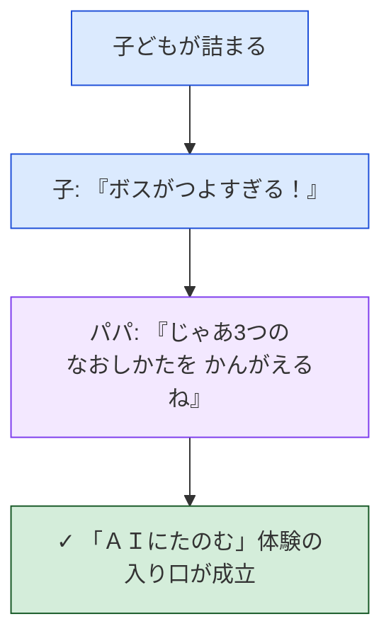
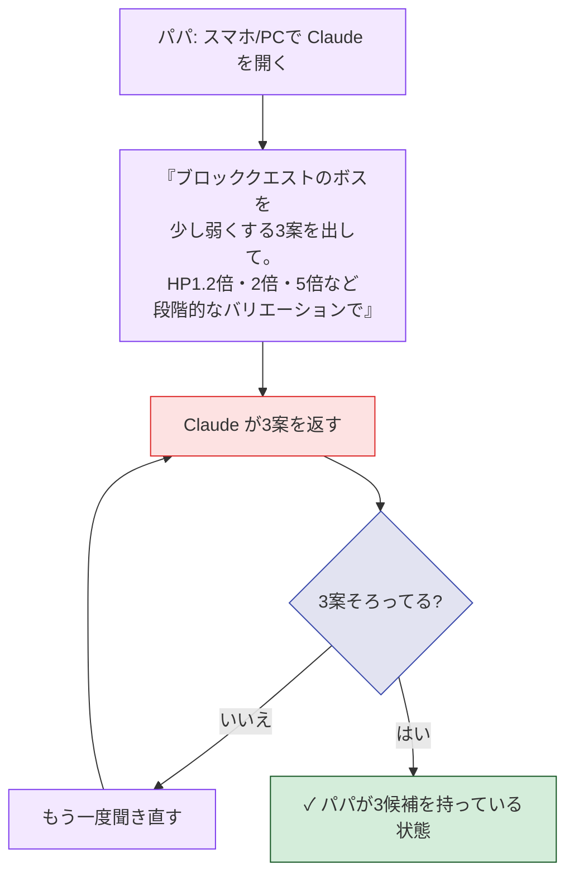
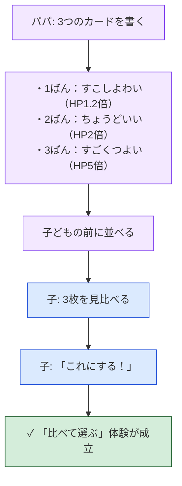
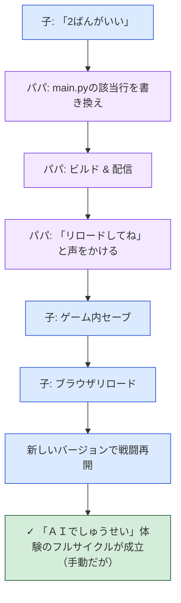
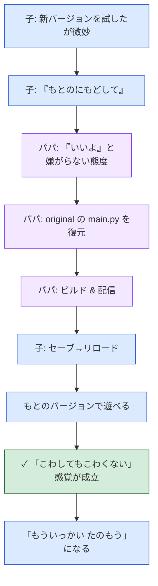
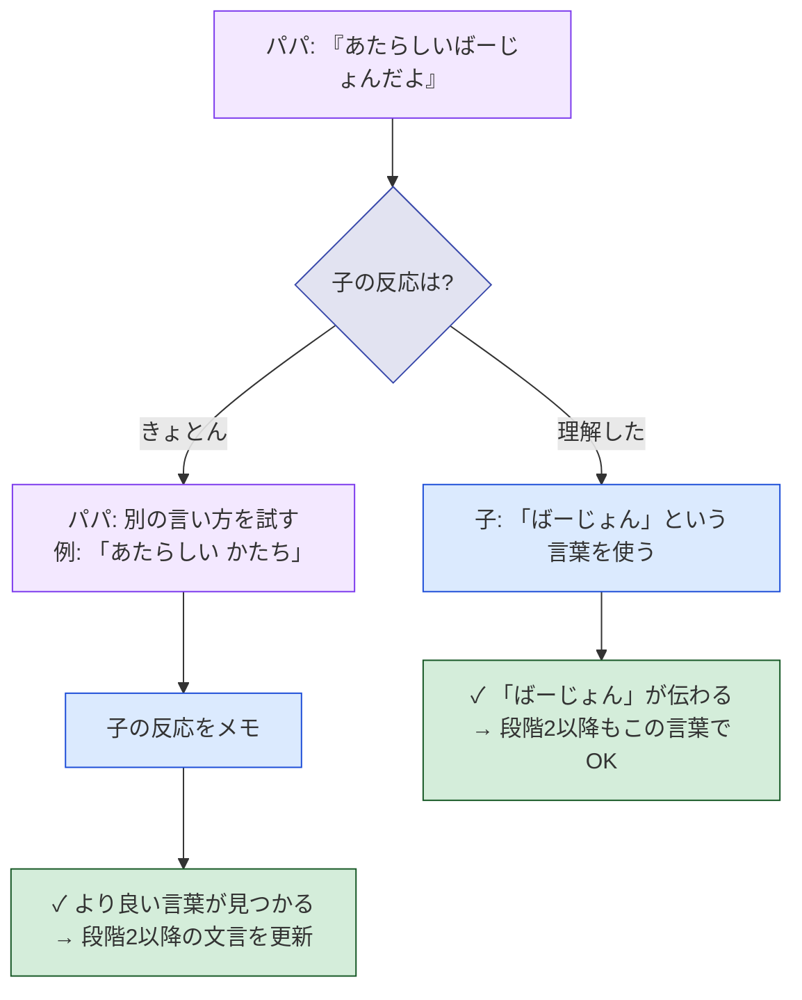
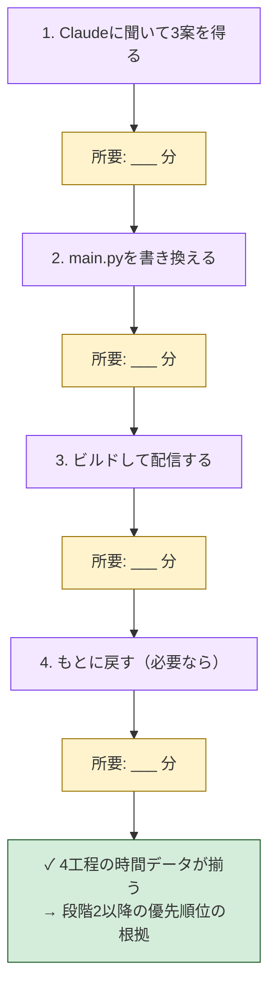
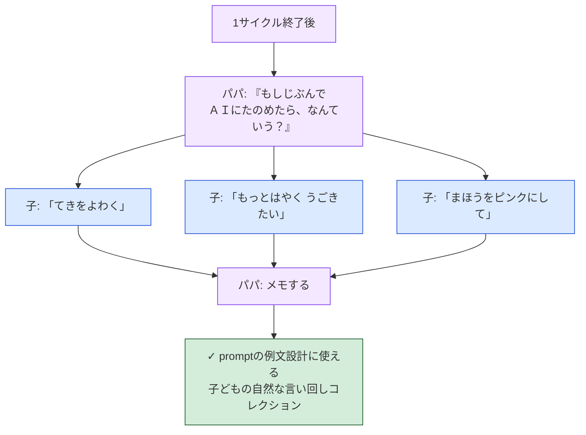

# 受け入れ条件: 段階1 — papa-manual（紙プロトタイプ）

> この段階は **実装ゼロ**。受け入れ条件は「子ども・パパ・既存ゲーム」の3者の振る舞いとして書く。各シナリオは `flowchart TD` 1枚 + 1行サマリー Gherkin。詳細は [`./journey.md`](./journey.md) を参照。

## プロダクト判断の合意事項

| # | 論点 | 決定 | 理由 |
|---|---|---|---|
| M1 | 実装スコープ | **実装ゼロ**。既存ゲーム＋紙＋パパの手作業のみ | 体験の核を実装の前に紙で検証する |
| M2 | パパが ＡＩ役 | パパが Claude（または他のAI）に手動で「3つの案を出して」と聞く | 自動化の前にプロンプトの感触をパパが掴む |
| M3 | 候補数 | 必ず **3つ**。1つや2つでは出さない | 「比べて選ぶ」体験を成立させるため |
| M4 | 候補の見せ方 | 紙・ノート・口頭・画面メモ など。**仮名・カタカナ主体**で書く | A5（必須UIに漢字を使わない）の練習も兼ねる |
| M5 | 候補に必ず数値を含める | 「HP1.2倍」「2倍」「5倍」など、効果量を一目で分かるように書く | 段階2以降の Q5（候補の表示）の根拠を作る |
| M6 | 「バージョン」という言葉 | 「あたらしいばーじょんだよ」「もとのばーじょんにもどそう」と意識的に使う | 子どもにこの言葉が伝わるか検証する |
| M7 | 子どもが選ぶ | 必ず子どもが選ぶ。パパが代わりに選ばない | 「子どもが主役」の体験を確認 |
| M8 | もとに戻すは無料 | 何度戻してもパパは嫌がらない／「もう一回やってみよう」と促す | 「こわしてもこわくない」の検証 |
| M9 | 観察記録 | パパは作業時間と子どもの反応を **メモする** | 段階2以降の設計の根拠データ |
| M10 | 失敗してOK | 候補のコードが動かなくても、子どもを責めない／「ＡＩがちょっとまちがえたね」で済ませる | 失敗の心理コストを低く保つ |

---

## シナリオ1：詰まった子どもがパパに頼む

> **シナリオ1**：戦闘で詰まった子ども が パパに「ボスがつよすぎる」と伝える と パパが「3つの直し方を考えて見せてあげるね」と応じる

---

## シナリオ2：パパが Claude に手動で頼む

> **シナリオ2**：依頼を受けたパパ が 別のデバイスで Claude に「ボスを少し弱くする3案」を聞く と 数分以内に3つの実装案を受け取れる

---

## シナリオ3：パパが3候補を紙に書いて子どもに見せる

> **シナリオ3**：3案を持ったパパ が 仮名・カタカナ主体で **3つのカード** を書いて子どもに並べて見せる と 子どもが効果量を比べて自分で選べる

---

## シナリオ4：パパが手動でゲームを書き換えて見せる

> **シナリオ4**：選択を受けたパパ が `main.py` を書き換えてビルド・配信する と 子どもは「ばーじょんがかわった」体験を得られる

---

## シナリオ5：気に入らなければ「もとにもどして」と頼める

> **シナリオ5**：新バージョンが気に入らなかった子ども が 「もとにもどして」と頼む と パパが嫌がらずに元のmain.pyに戻して再ビルドし、子どもは「こわれていない」と分かる

---

## シナリオ6：「ばーじょん」という言葉が伝わるか検証

> **シナリオ6**：パパが意識して **「ばーじょん」** という言葉を使う と 子どもがその言葉を理解して使い始める／または「もっとわかりやすい言い方」を子どもの口から聞ける

---

## シナリオ7：パパが作業時間を計測する

> **シナリオ7**：パパが 「Claudeに聞く」「main.py書き換え」「ビルド配信」「もとに戻す」 の4工程の所要時間をメモする と 段階2以降のシステム化優先順位を決めるデータが揃う

---

## シナリオ8：子どもの「言いたかった一言」を集める

> **シナリオ8**：1サイクル終わったあとパパが 「もしじぶんでＡＩにたのめたら、なんていう？」と聞く と 子どもの自然な言い回しが集まり、段階2の `window.prompt` の例文設計の根拠になる

---

## この段階の完了条件

以下のすべてを満たしたら段階2へ進む：

- [ ] 少なくとも **3回** のフルサイクル（依頼→3候補→選択→反映→遊ぶ）を実施
- [ ] うち **1回以上** は「もとに戻す」を経験
- [ ] 「3つから選ぶ」が苦痛ではないことを確認
- [ ] 子どもが「**もういっかい！**」と言ったか観察
- [ ] パパが4工程の所要時間データを取った
- [ ] 子どもの自然な「一言」を **5個以上** 集めた
- [ ] 「ばーじょん」（または代替語）が伝わるか結論を出した

満たされなかった場合は **親 journey.md / gherkin.md を見直す**。段階2の実装に進む前に体験設計の問題を解決する。

---

## 関連ドキュメント

- [`./journey.md`](./journey.md) — この段階のジャーニー詳細
- [親 journey.md](../20260408-ai-fix-from-browser/journey.md) — 全体ビジョン
- [親 gherkin.md](../20260408-ai-fix-from-browser/gherkin.md) — 5段階マップ
- 後続: [`../20260408-ai-fix-2-system-suggests/`](../20260408-ai-fix-2-system-suggests/) — 段階2（後日作成）
