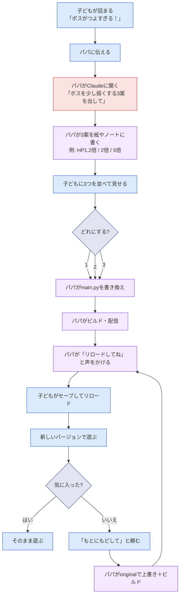

# ユーザージャーニー: 段階1 — パパが3候補を紙で見せる（紙プロトタイプ）

- 作成日: 2026-04-08
- 親ジャーニー: [`../20260408-ai-fix-from-browser/journey.md`](../20260408-ai-fix-from-browser/journey.md)
- この段階の位置づけ: 5段階のうちの **段階1**。実装ゼロで体験の核を検証する。

---

## この段階の目的

実装に入る前に、**「3つから比べて選ぶ → ゲームが変わる → もとに戻せる」** という体験の核が、本当に子どもに刺さるかを **紙ベースで検証する**。

このフェーズで集めたい知見：

- 「3つから比べて選ぶ」体験が子どもに刺さるか
- 「もとに戻せる」安心感が機能するか（こわしても泣かないか／もう一度やってみたくなるか）
- 子どもが **どんな一言を言いたがるか**（後の `window.prompt` の例文設計に活きる）
- 「**バージョン**」という言葉が子どもに伝わるか
- パパがどの作業に最も時間を取られるか（システム化の優先順位の根拠）

---

## 役割分担

| 役割 | 担当 |
|---|---|
| ＡＩに頼む（ＡＩ役） | パパ（手動でClaudeに聞くなど） |
| 3候補を考える | パパ |
| 3候補を子どもに見せる | パパ（紙、ノート、口頭、画面メモなど） |
| 子どもが選ぶ | 子ども（口頭で「これがいい！」） |
| `main.py` を書き換える | パパ（手動） |
| ビルドして配信 | パパ（手動） |
| 子どもにリロードさせる | パパが声をかける |
| もとに戻す | パパが手動で戻す |

**システム実装**：なし。既存ゲームのみで進める。

---

## 体験の流れ（紙プロトタイプ）



---

## 紙の見せ方の例

### 候補カードのフォーマット

```
┌─────────────────────────────┐
│ 1ばん：ちょっとよわい          │
│   ボスのHPが いまの 1.2ばい  │
│   → すこし楽になる            │
└─────────────────────────────┘

┌─────────────────────────────┐
│ 2ばん：ちょうどいい            │
│   ボスのHPが いまの 2ばい    │
│   → がんばればたおせる        │
└─────────────────────────────┘

┌─────────────────────────────┐
│ 3ばん：すごくつよい            │
│   ボスのHPが いまの 5ばい    │
│   → むずかしい！              │
└─────────────────────────────┘
```

- **必ず3つ並べる**（1つだけ見せて「どう？」と聞かない）
- **数値**を出して差が一目で分かるようにする
- **仮名・カタカナ**を主にし、漢字は最小限
- 「**ばーじょん**」という言葉を意識的に使ってみる（伝わるか観察）

---

## 観察したいポイント

| 観察項目 | 何を見るか |
|---|---|
| 子どもの選び方 | いつも同じ番号を選ぶ？ 数値を比べてる？ 説明文を読んでる？ |
| 「3つもある」反応 | 嬉しそう？ 迷う？ 1つで十分そう？ |
| 待ち時間の許容度 | パパが書き換えてる間、何分待てる？ 別のことをして待てる？ |
| 「もとに戻す」の頻度 | 子どもは何回戻したがる？ 戻したあと何をする？ |
| 子どもの一言 | 「ＡＩに頼むなら何て言う？」と聞いたら何と答える？ |
| パパの作業時間 | どの作業（Claudeに聞く／書き換え／ビルド）が一番時間がかかる？ |

これらは段階2以降の **設計の根拠** になる。

---

## この段階の成功条件

- 子どもが **「もう一回やって！」** と何度も頼んでくる
- 「3つから選ぶ」が **苦痛ではない**（迷いすぎない・楽しめる）
- 「もとに戻す」を1回以上使っても **がっかりしない**（むしろ「次は別のを試そう」になる）
- パパが **自分の作業のどこが一番大変か** を体感し、システム化の優先順位を把握する

これが満たされたら段階2へ進む。満たされなければ、journey.md / gherkin.md（親）の体験設計を見直してから段階2を考える。

---

## この段階で意図的に避けること

- **完璧な紙の作り込み**：手書きの走り書きで十分。プロトタイプは速さが命
- **同じ題材ばかり試す**：戦闘・移動速度・グラフィック・セリフなど、いろんな種類の改造を試す
- **大人が代わりに選ぶ**：子どもに必ず選ばせる
- **失敗した候補を「これは違うね」と否定する**：選ばれた候補を必ず実際に動かしてみる

---

## 関連ドキュメント

- [`./gherkin.md`](./gherkin.md) — この段階の受け入れ条件
- [親 journey.md](../20260408-ai-fix-from-browser/journey.md) — 全体ビジョン
- [親 gherkin.md](../20260408-ai-fix-from-browser/gherkin.md) — 5段階マップ
