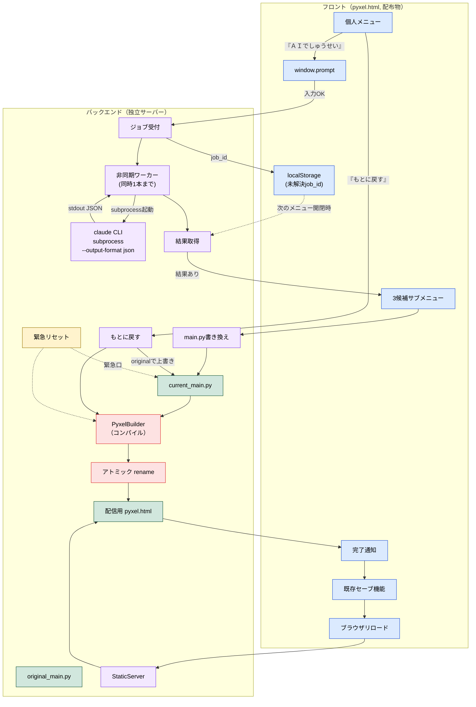
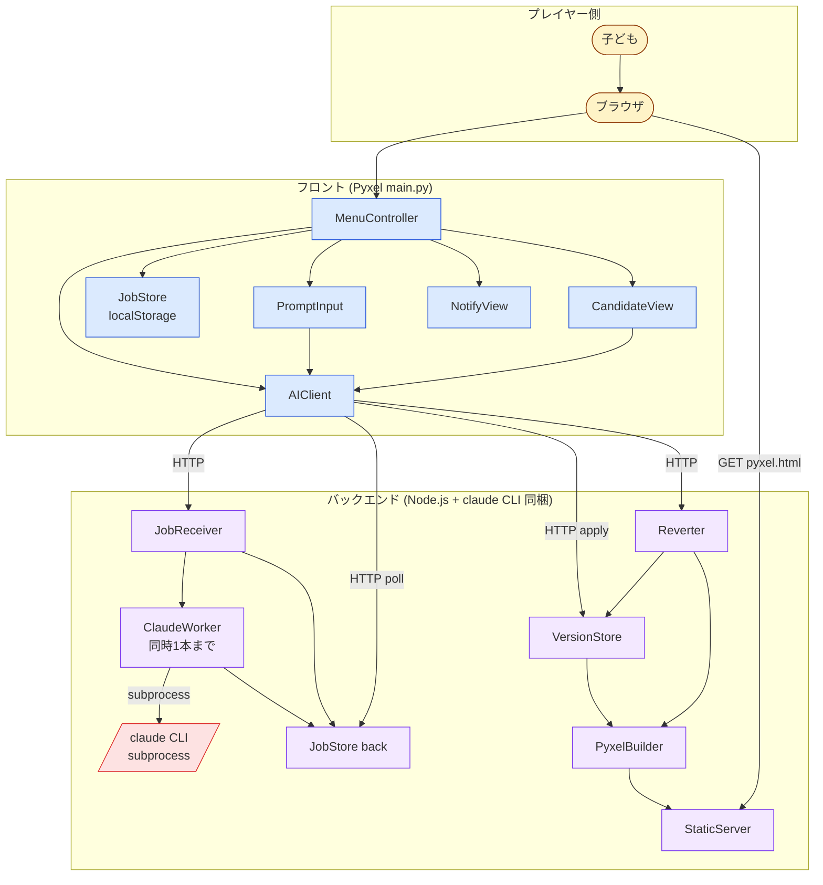
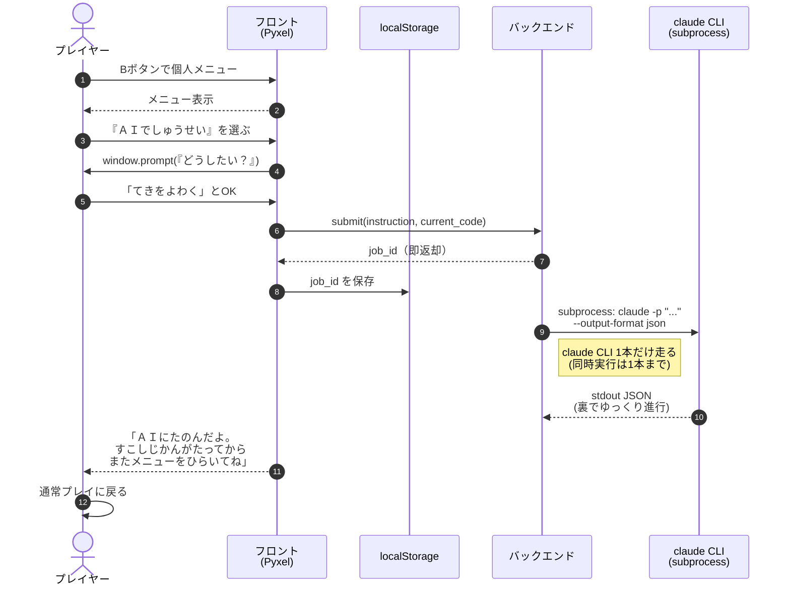
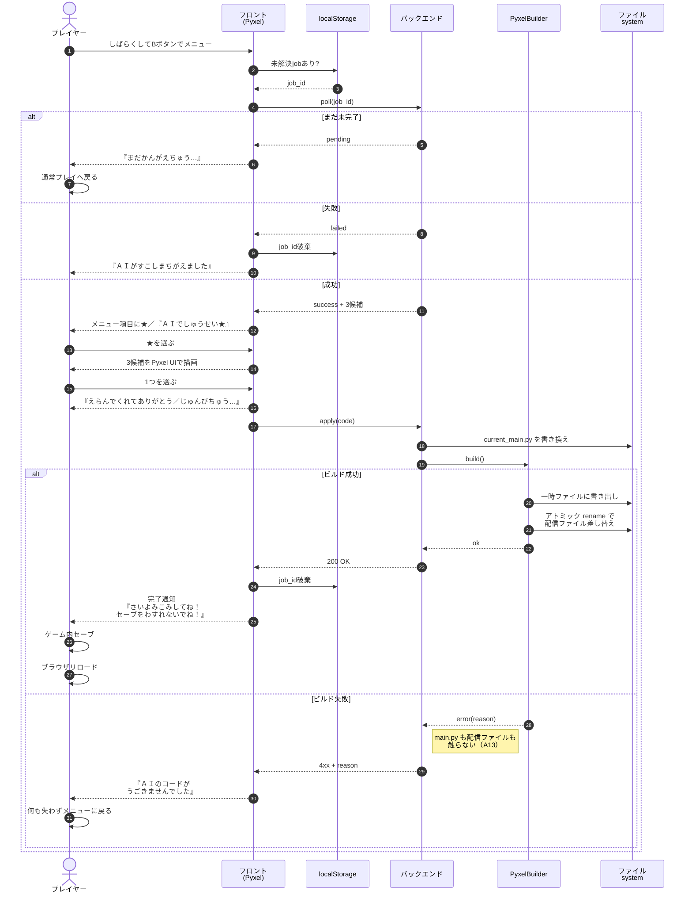
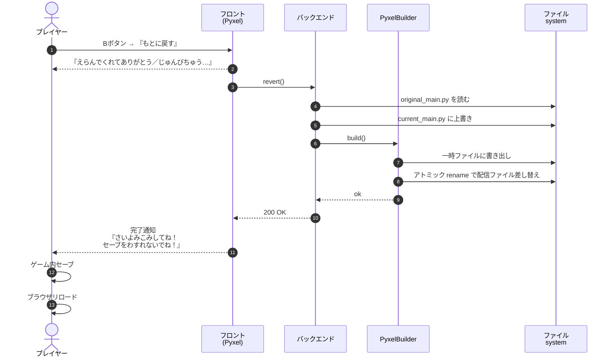
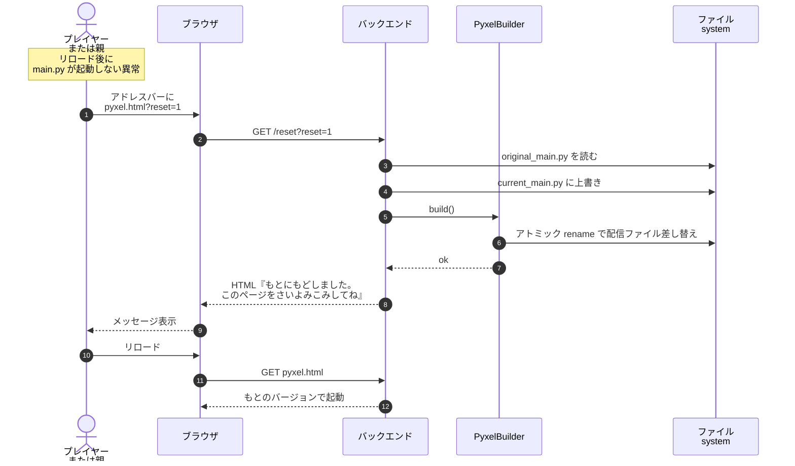
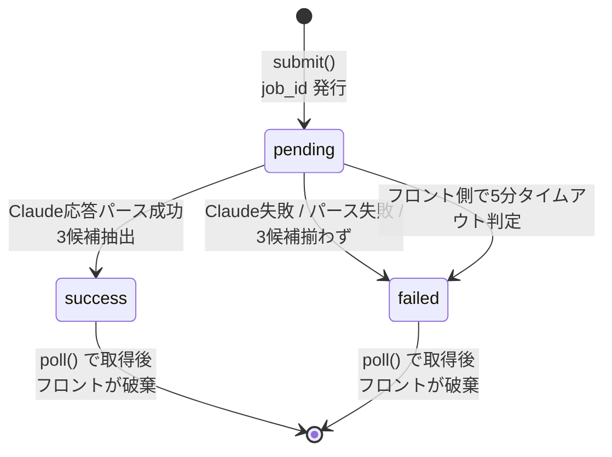
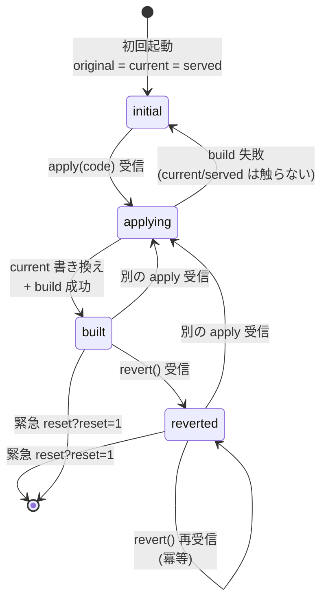
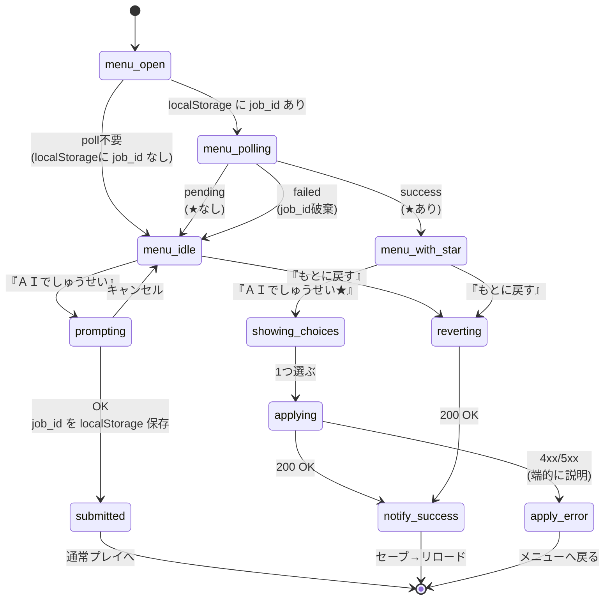

# アーキテクチャ設計書: ブラウザで「ＡＩでしゅうせい」を頼む（段階非依存の全体像）

`journey.md` で合意した体験（プレイヤーが一言で頼んで、ながら待ちで結果を受け取り、リロードで新バージョンに切り替わる）を、どんな部品でどう組み立てるかを定める。

> **本書のスコープ**: 本ジャーニーは `gherkin.md` の通り **5段階のサブステアリング** に分けて段階的に作る。本書は **どの段階でも変わらない** 構成と判断だけを扱う。段階固有の判断（コンパイル戦略 A12〜A14、apply エンドポイント、PyxelBuilder の詳細など）は **各サブステアリング** の `architecture-design.md` で扱う。
>
> API のリクエスト/レスポンス形式・データクラスのシグネチャ・タイムアウト秒数・localStorage キー名などの**実装詳細は本書では決めない**。それは各サブステアリングの `detailed-design.md` の役割。

---

## アーキテクチャ判断の論点

| # | 論点 | 決定 | 理由 |
|---|---|---|---|
| A1 | 対象環境 | **フロント**：web版（pyxel.html）のみ。デスクトップ版は本ジャーニーのスコープ外／**バックエンド**：Node.js と Claude Code CLI（事前ログイン済み）が動くサーバー環境 | journey.md冒頭「ブラウザで遊んでいる子ども」の前提と一致／`window.prompt` がデスクトップPyxelで動かない／既存セーブ機能の web 永続化と歩調を揃える／バックエンドは外部APIではなくCLIで Claude を呼ぶ（A15） |
| A2 | 全体構成 | **フロント（Pyxel main.py）＋ バックエンド（独立サーバー）** の2層分離 | C1（配布物2ファイル）／A3（pip install 禁止）を満たすために、Claude SDK 等の依存はバックエンドに閉じ込める必要がある |
| A3 | バックエンドの責務 | (1) ヘッドレスで `claude` CLI コマンドを subprocess 起動して Claude を呼ぶ（A15）／(2) Claude応答をパースして3候補を取り出す／(3) `original_main.py` と `current_main.py` の2ファイルを保持・書き換える／(4) 書き換えた main.py から **配信用 pyxel.html を再ビルド（コンパイル）** する／(5) 配信用 pyxel.html を **静的配信** する／(6) 緊急リセットを受け付ける | フロントを「コードを触らない・通信するだけの薄い層」に保つことで、安全網（C5）と単純さを両立／main.py を書き換えただけではブラウザは何も変わらないため、ビルド〜配信までバックエンドで完結させる必要がある |
| A4 | フロントの責務 | (1) メニューUI／(2) `window.prompt` で一言を受け取る／(3) バックエンドにジョブを投げて `job_id` を保持／(4) メニューを開いた瞬間に結果をポーリング／(5) 3候補をPyxel UIで描画／(6) 完了通知を出す。**コードの中身は一切扱わない** | フロントが受け取る `code` は「不透明なバイトの塊」として扱い、文字列としてしかいじらない。検証層を持たない代わりに「触らない」 |
| A5 | 入力UI | ブラウザの **`window.prompt()`** を `js` モジュール経由で呼ぶ。例文はpromptのメッセージ文に同居 | 実装が一行で済む／OS標準IMEが使える／ゲームのピクセルアート世界を一切壊さない（OSレイヤーの介在は質感的に許容）／Pyxel本体には日本語入力機構がない |
| A6 | 待機方式 | **ながら待ち（ポーリング方式）**。フロントは送信したら即ゲームに戻る。次にメニューを開いた瞬間にバックエンドの結果を取りに行く | Pyxelには通知機構がない／同期待機UIはゲームをブロックしてしまう／応答時間がプレイヤー体験を支配しなくなる |
| A7 | バージョン切替の手段 | **ブラウザリロード**。フロント側でホットリロードや `os.execv` をしない | web基軸の自然な操作／既存セーブ機能と必然のステップで結びつく／フロントはコード差し替えの責務を一切持たない |
| A8 | 「もとに戻す」の経路 | バックエンドが `original_main.py` を `current_main.py` に上書き → 採用と同じ完了通知 → プレイヤーがセーブしてリロード | 採用と revert を同じ経路に乗せることで、子どもにとって「2種類のフロー」ではなく「1種類のフロー」になる |
| A9 | 安全網の方針 | (1) `original_main.py` の初回スナップショット保持／(2) 緊急リセット URL `?reset=1`（段階5で実装）／(3) コードの中身を `ast.parse` のような独立検証層では持たない（段階4で導入されるコンパイルが事実上の検証層として機能する） | 弱い検証（`ast.parse` 程度）は「あるはずのない安心感」を生む／本当の安全網は「壊れても確実に戻せる」こと／責務を集中させる方が誠実 | 独立検証層を設ける：弱い検証で誤った安心感を与える |
| A12〜A14 | コンパイル関連 | **段階4（system-builds）の architecture-design.md に移管**。コンパイルのタイミング／失敗時の挙動／アトミック rename はそこで定義する | 段階1〜3ではコンパイルはパパが手動で行うため、本文書の段階非依存判断には含めない |
| A15 | Claude 呼び出し方式 | バックエンドは Anthropic API を直接叩かず、**ヘッドレスで `claude` CLI コマンドを subprocess 起動** する（`claude -p "プロンプト" --output-format json` 相当）。Claude Code CLI の非対話モードで JSON を受け取り、stdout をパースする | APIキー管理が不要（事前ログインで済む）／Anthropic SDK に依存しない／JSON 出力モードで応答が安定／プロセス起動コストはあるが「ながら待ち」方式なので体験に影響しない | API直叩き：APIキー管理が必要／SDK依存：依存ライブラリが増える／テキスト出力パース：Claude のフォーマット変動に弱い |
| A16 | Claude 応答の構造化 | プロンプトで「3候補を `[{label, detail, code}, ...×3]` の JSON で返せ」と指示し、`--output-format json` で受け取る | 構造化された応答が安定して得られる／パース失敗のリスクが減る | 自然言語で返させる：パースが脆弱になる |
| A17 | バックエンドの並行実行制御 | 同時に走る `claude` プロセスは **1本まで**。2本目以降はキューイングして順次処理する。プレイヤーから見ると「ＡＩがじゅんばんにこたえているよ」という体験 | subprocess 起動はCPU/メモリを食うので並行を絞る／単一ユーザー想定では1本で十分／複数ユーザー対応時に並列度を上げればよい | 無制限並列：サーバー負荷／同期1本固定：将来拡張しにくい（が、まずはこれで） |
| A10 | 状態の置き場所 | 「いま遊んでいる main.py」と「もとの main.py」は **バックエンド側のファイル**／未解決jobの `job_id` は **フロント側の localStorage** | コードのソース・オブ・トゥルースはバックエンドに一元化／「次にメニューを開いたら結果が分かる」という体験はブラウザ閉じて翌日開いても成立する必要があるため、フロント側の永続化は localStorage |
| A11 | 子ども中心の言葉 | git/branch/commit/job/poll などの言葉は子どもには出さない。「バージョン」「ＡＩにたのむ」「けっかがきた」などに翻訳する | A5（必須UIに漢字を使わない）／子どもがメンタルモデルを持てる |

---

## システム全体構成（最終形 = 段階5完成時点）

> 以下の図は **5段階すべてが完成した最終形** の俯瞰。各段階で実際に動くのは図の一部だけ。段階別のスコープ図と「この段階で何が動くか」は各サブステアリングの `architecture-design.md` を参照。

---

## レイヤーとコンポーネント

### コンポーネント責務マップ

### フロント側（pyxel.html）

| コンポーネント | 役割 |
|---|---|
| **MenuController** | 個人メニューを開いた瞬間の判定（未解決jobの有無）／メニュー項目の描画／★マークの表示 |
| **PromptInput** | `window.prompt` を呼んで一言を受け取る薄いラッパー |
| **AIClient** | バックエンドへのHTTP通信（submit / poll / apply / revert）。`pyodide.http` で実装 |
| **JobStore** | localStorage に未解決jobを保存・読み出し・破棄するラッパー |
| **CandidateView** | 3候補をPyxelの個人メニュー風UIで描画する |
| **NotifyView** | 完了通知メッセージを表示する |

**フロントの不変条件**:
- フロントは Claude SDK や Anthropic API に **直接触らない**
- フロントは `code` を **書き換えない**。受け取った `code` はバックエンドに横流しするだけ
- フロントは **同期待機UIを持たない**。送信した瞬間にゲームに戻る
- フロントは **プロセス再起動しない**。新バージョン切替はブラウザリロードに任せる

### バックエンド側（独立サーバー）

| コンポーネント | 役割 |
|---|---|
| **JobReceiver** | フロントからの依頼を受けて `job_id` を発行・即返却 |
| **ClaudeWorker** | 非同期に **`claude` CLI を subprocess 起動**（`claude -p "プロンプト" --output-format json`）し、stdout の JSON をパースして3候補を抽出する。同時実行は1本まで（A17） |
| **JobStore (back)** | `job_id` ごとに `pending` / `success` / `failed` の状態と結果を保持 |
| **VersionStore** | `original_main.py` と `current_main.py` の2ファイルを管理 |
| **PyxelBuilder** | `current_main.py` から配信用 `pyxel.html` を再ビルド（コンパイル）する。一時ファイルに書き出して **アトミック rename** で差し替える（A12 / A14） |
| **Reverter** | `/revert` と `/reset?reset=1` の両方から `original` を `current` に上書きし、PyxelBuilder を呼んで配信ファイルを再ビルドする |
| **StaticServer** | 配信用 `pyxel.html`（および関連アセット）をブラウザに配信する |

**バックエンドの不変条件**:
- `original_main.py` は **初回起動時にしか書かない**
- `current_main.py` と配信用 `pyxel.html` の書き換えは **採用が決まった瞬間** だけ（部分書き込みなし）
- 配信ファイルの差し替えは **必ずアトミック rename**（A14）
- 候補は **3つそろわなければフロントに返さない**
- コード本体の中身（`ast.parse` 等）は **独立検証層では検証しない**。コンパイルが事実上の検証層になる（A9-3 / A12）
- コンパイル失敗時は `current_main.py` も配信ファイルも触らない（A13）
- バックエンドは **Anthropic SDK にも依存しない**。Claude へのアクセスは **すべて `claude` CLI 経由**（A15）
- 同時に走る `claude` プロセスは **1本まで**（A17）。2本目以降はキューイング
- APIキーをコードや設定ファイルに置かない（ログイン情報は Claude Code CLI の管理に委ねる）

---

## 主要なデータの流れ（最終形）

> 以下のフローも **段階5完成時点の最終形**。各段階で実際に動く部分は各サブステアリングを参照。
> たとえば段階2では「3候補生成→パパに渡す」までしか動かず、apply / build / revert / reset は段階3〜5で順に追加される。

### 1. 依頼を出すフロー

### 2. 結果を受け取って採用するフロー（ながら待ち＋コンパイル）

> **コンパイル中の体感**: プレイヤーが選んでから完了通知が出るまでの数秒〜十数秒は、フロントが「えらんでくれてありがとう／じゅんびちゅう…」を表示して吸収する。

### 3. もとに戻すフロー

> **補足**: original から作るビルドは「以前一度成功したコード」なので、ここでビルド失敗は通常起きない。万一起きた場合は緊急リセット相当の異常事態であり、運用側で対処する。

### 4. 緊急リセットフロー（通常は使われない）

---

---

## 状態遷移図

### バックエンドのジョブ状態（JobStore）

> 同じ job_id に対して `success`/`failed` が確定したら、その状態は破棄まで変わらない。

### バックエンドのファイル状態（VersionStore + 配信ファイル）

> `built` と `reverted` の違いは「current が original と等しいかどうか」。reset と revert は同じ動作（冪等）。

### フロント（個人メニュー）の状態

---

## 守るべき原則との対応

| 原則（`docs/05-pyxel-code-maker-jouney.md` 由来） | このアーキテクチャでの担保 |
|---|---|
| **C1 配布物 2 ファイル** | フロントは `main.py` + `assets/*.pyxres` のみ。Claude 関連はすべてバックエンド側（A2／A15） |
| **C3 アップロード後そのまま遊べる** | バックエンドへの起動時疎通確認はしない。`?reset=1` 以外は遅延読み込みで、繋がらなくてもゲームは普通に遊べる |
| **C5 致命的に壊れない** | `original_main.py` の初回スナップショット（A9-1）と緊急リセット（A9-2）の二重の安全網。さらにコンパイルが事実上の検証（A9-3）。フロントはコードに触らない（A4） |
| **A3 pip install 禁止** | フロントは標準ライブラリと Pyxel と `pyodide.http` のみ。**Anthropic SDK はバックエンドにも要らない**（CLI経由のため／A15） |
| **A5 必須UIに漢字を使わない** | フロントの全文言は仮名・カタカナ。3候補もPyxel側で仮名のみで描画 |
| **子ども中心** | git/branch/commit/job/poll を子どもに出さない（A11）。「バージョン」「ＡＩにたのむ」「けっかがきた」で統一 |

---

## スコープ外（再掲）

- レート制限・課金・API コスト管理（CLI ログインベースのため API キー管理は不要 / A15）
- 悪意ある指示への防御（プロンプトインジェクション等）
- 候補プレビュー（実プレイ前のミニ表示）
- 親レビュー機能・友達共有
- バージョン履歴を3つ以上持つ拡張
- デスクトップ版対応（A1）

これらは「動く最小の体験」が成立してから設計する。

---

## 詳細設計に送る項目

以下は本書では決めず、`detailed-design.md` で扱う：

- API エンドポイントの URL とリクエスト/レスポンス JSON の正確なフォーマット
- `Candidate` / `PollResult` などのデータクラスのフィールド名・型
- 入力字数の上限（安全マージン）の具体値
- ポーリングのタイムアウト秒数
- localStorage キー名の正式名
- バックエンドの並行ジョブ数の上限
- バックエンドの実装言語・フレームワーク選定
- HTTP エラー時のリトライ方針
- PyxelBuilder の具体的なビルドコマンド（`pyxel package` / `pyxel app2html` 等の選定）
- ビルド失敗時の子ども向け文言の正確な表記
- 配信ファイルのパス・命名規則
- ビルドキャッシュの方針（同じ main.py のビルドを再利用するか）
- `claude` CLI の最低バージョン要件と引数の正確な組み立て方
- `claude` CLI に渡すプロンプトの組み立て方（システムプロンプトをどう書くか）
- `claude` CLI のタイムアウト秒数（subprocess timeout）
- `claude` CLI のログイン状態が切れたときの検出と運用手順
- ジョブキューの実装方法（asyncio / threading / 外部キューの選定）

---

## 参照

- `./journey.md` — ユーザージャーニー（体験設計の元）
- `./gherkin.md` — 受け入れ条件（プロダクト判断）
- `./detailed-design.md` — 実装詳細（後日追加）
- `docs/05-pyxel-code-maker-jouney.md` — 守るべき設計原則
- `docs/steering/20260407-save-player-journey/design.md` — 既存セーブ機能との対称性参考
