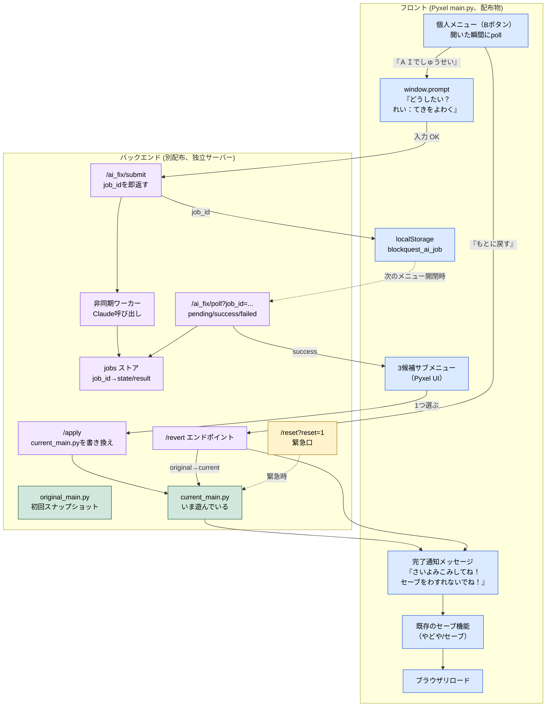
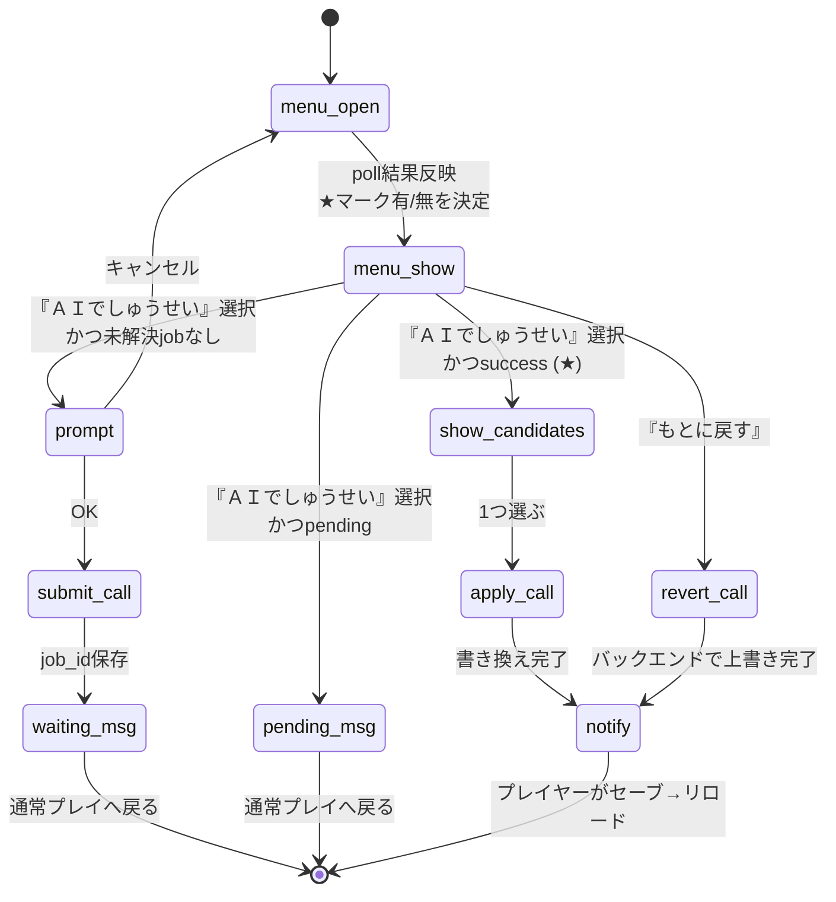

# 設計書: ブラウザで「ＡＩでしゅうせい」を頼む

`journey.md` / `gherkin.md` で合意済みのプロダクト判断（Bボタンメニューから起動／3候補必須／「もとに戻す」常設／バージョン履歴は現＋もとの2つだけ／子ども中心の文言）を、Pyxel フロントエンド + 外部AIバックエンドに落とすための設計。

プロダクト判断はここで覆さない。技術選定・実装方針のみを扱う。

---

## 設計判断の論点

| # | 論点 | 決定 | 理由 | 代替案と却下理由 |
|---|---|---|---|---|
| D1 | 全体構成 | **フロント**: Pyxel `main.py`（プレイヤー側、配布物）／**バックエンド**: 別配布のAI修正サーバー（Claude等を呼ぶ） | C1（配布物2ファイル）／A3（pip install禁止）を満たすために、Claude SDK等の依存はバックエンドに閉じ込める必要がある | フロントから直接Anthropic API：プレイヤー側にAPIキーが漏れる／pip依存が増える |
| D2 | バックエンドへの通信 | フロント → バックエンドへ **HTTPS POST 1本**（リクエスト：指示文＋現 main.py の内容／レスポンス：3候補のJSON） | デスクトップ版・web版の双方で実装可能（`urllib.request` / `fetch`）。Pyodideでも動く | WebSocket：実装複雑／SSE：単発呼び出しには重い |
| D3 | バックエンドが落ちている／未接続でもゲームは遊べる（gherkin Q13） | 起動時にバックエンドへの疎通確認はしない。「ＡＩでしゅうせい」を選んだ瞬間に呼びに行き、失敗したら「いまＡＩがつかえません」を出して**メニューに戻る**だけ | C3（アップロード後そのまま遊べる）を満たす。起動時疎通確認はオフラインで遊べなくなる | 起動時疎通：オフラインプレイ不可／無期限リトライ：プレイヤーが待たされる |
| D4 | 応答時間目標は持たない | バックエンドの応答時間に関する固定目標は設けない（gherkin Q7／シナリオ9 反映）。**ながら待ちポーリング方式** によりプレイヤー体験は応答時間に依存しない。フロントは `job_id` 発行から5分以上 `pending` のままだったらタイムアウト扱いとして job を破棄する（5分はジャーニーの「セッション体感の上限」目安） | プッシュ通知を持たないPyxel環境では、応答時間目標はプレイヤー体験を改善しない／応答時間プレッシャーから解放されたバックエンドは安価運用が可能 | 10秒固定：プレイヤーを待たせる発想／無制限：詰まったjobが永久に残る |
| D5 | 候補のレスポンス形式（gherkin Q5 から移管） | 各候補は `{ label: 短い1行説明, detail: 効果量を含む補足, code: 完成された main.py 全文 }` の3要素。effects は `(HPが1.2倍)` のような具体数値を **必ず** 含める | 子どもがプレイ前に違いを想像できる／効果量が一目で伝わる／差分ではなく全文で受け取れば適用が安全 | 差分（patch）形式：適用時のコンフリクトリスク／説明だけ：プレイヤーが選べない |
| D6 | バージョン履歴のデータ構造（gherkin Q9b から移管） | フロントは **`original_main.py`（初回起動時にスナップショット）** と **`current_main.py`（いま遊んでいる）** の2ファイルだけを保持。直近のAI応答（3候補）は採用が決まった瞬間に破棄し、保存しない | MVPの最小データ構造。「べつのバージョンを試す」機能は持たないため、未採用候補を保持する必要がない（gherkin Q10） | 全履歴保持：データ肥大／git管理：子どもに見せる必要がない／未採用候補をメモリ保持：「もとに戻す」で十分という判断と矛盾 |
| D7 | 候補の検証は持たない（**正直さの設計**） | バックエンドはClaude応答が**JSONとしてパースできれば成功**とする。`ast.parse` や import試行などの「文法チェック層」は持たない。検証層を持たないことを認め、安全網は **`original_main.py` の保持（D6）** と **緊急口 `?reset=1`（D14）** の2つに集約する | `ast.parse` だけで守れるのは「Claudeが構文崩れの文字列を返した」ケースのみで、ロジック上ゲームを壊すコードは検出できない／浅い検証層は「あるはずのない安心感」を生むので外す／本当の安全網2つに責務を集中させる方が誠実 | `ast.parse`を残す：「守れている」誤解を生む／import試行：Pyxel依存環境をバックエンドで揃えるのが非現実的で浅い／実起動チェック：重く本ジャーニーのスコープ外 |
| D8 | 採用後のフロント挙動（gherkin Q8 反映） | フロントは何も再起動しない。採用された候補を `current_main.py` に書き戻したら、**完了通知メッセージを画面に表示するだけ**。プレイヤーがゲーム内セーブ → ブラウザリロードで新バージョンに切り替わる | web基軸の自然な操作。`os.execv` や Pyxel ホットリロードが不要になり実装が単純／起動失敗時もブラウザの挙動として子どもに伝わる／既存セーブ機能と必然のステップで結びつく | `os.execv`：デスクトップ専用、web版で動かない／`importlib.reload`：状態が中途半端／フロント側ヘッドレス起動：Pyxelの画面・音声依存で困難 |
| D9 | 完了通知の文言（gherkin Q8b 反映） | 固定文言「**しゅうせいがおわったので、このページをさいよみこみするとあそべるよ！セーブをわすれないでね！**」をメニュー内に表示。`message` ステートで表示し、Aボタンで閉じる | A5（必須UIに漢字を使わない）／「セーブを忘れずに」を必然のステップとして子どもに伝える | バリエーション複数：覚えにくい／自動セーブ起動：既存セーブ機能の挙動を変えるとセーブジャーニーと衝突 |
| D14 | 緊急リセットエンドポイント | バックエンドに `?reset=1` URLパラメータ（または `/reset` エンドポイント）を実装。叩かれたら無条件で `original_main.py` を `current_main.py` に上書きする。通常のフローには現れず、緊急口としてのみ存在 | D7で起動失敗を事前排除しているが、万一リロード後に main.py が起動しない異常事態でもメニューから「もとに戻す」を呼べないため、外部からの戻し手段が必要 | リセット手段なし：詰む／フロント側でフォールバック：壊れたmain.pyではフロントが動かない |
| D15 | 入力UI | フロントは `js.window.prompt("どうしたい？\nれい：てきをよわく / ボスのHPを2ばいに")` を呼んで一行の文字列を受け取る（gherkin Q3） | 実装が一行で済む／OS標準IMEで日本語が打てる／ゲームの世界観を壊さない（OSレイヤーの介在は質感的に許容）／Pyxel本体には日本語入力機構がない | HTMLフォーム常駐：ゲーム画面の隣にDOMが居続けて世界観を壊す／別ウィンドウ：ポップアップブロッカーやタブレットUXの懸念／Pyxel自前かな入力UI：実装が重い |
| D16 | 非同期ジョブ方式（gherkin Q7 反映） | バックエンドは `/ai_fix/submit`（job_id を即返す）と `/ai_fix/poll?job_id=...`（pending／success／failed のいずれかを返す）の2エンドポイントを持つ。Claude呼び出しはバックエンド内で非同期に進行 | プレイヤーは送信した瞬間にゲームに戻れる。フロントは「ＡＩがかんがえています…」という同期待機UIを持たなくて済む（Pyxelには通知機構がないため、待機UIはゲームをブロックしてしまう） | 同期API：プレイヤーが10秒以上待たされる／WebSocket：実装複雑／SSE：単発呼び出しに重い |
| D17 | job_id の保持 | フロントは job_id を **localStorage** に保存（キー：`blockquest_ai_job`）。次にメニューを開いた時にこのキーがあれば `/ai_fix/poll` を叩く。ブラウザを閉じても残るので翌日続きを開いても結果取得できる | gherkin Q7c（古いjob上書き）／既存セーブ機能（D17 of save journey）と同じ localStorage 永続化方式で対称性を保てる | メモリ保持：リロード／ブラウザ閉じで消える／IndexedDB：オーバースペック |
| D18 | けっかありマーク（gherkin Q7b） | 個人メニューを開いた瞬間に `localStorage.blockquest_ai_job` の有無をチェック。あれば `/ai_fix/poll` を叩いて結果を確認し、`success` であれば「ＡＩでしゅうせい」項目に **★** を付けて描画する | プッシュ通知を持たない代替。プレイヤーが結果に気付く唯一の導線 | 自動ポーリング（メニュー外でも定期実行）：CPU負荷／メニュー項目のチカチカ：気が散る |
| D19 | 古いjobの上書き（gherkin Q7c） | 新しい依頼を `/ai_fix/submit` に送る瞬間、`localStorage.blockquest_ai_job` を新しい job_id で上書きする。古いjobの結果は捨てる（バックエンド側は古いjobのジョブを止めなくてよい） | 履歴を持たない方針（D6）と整合／実装が単純 | 古いjobをマージ表示：候補が増えてプレイヤーが混乱 |
| D20 | 3候補の表示UI | 結果が `success` で返ってきたら、Pyxel側の **既存の個人メニュー描画ロジックを流用** してサブメニューとして描画する。各項目は `label`（仮名のみ）+ `detail`（効果量） | 仮名のみなら Pyxel 標準フォントで描画可能（A5原則）／既存メニューUIとの統一感 | HTML側で表示：ゲーム画面の世界観を壊す／別ウィンドウ：D15で却下した理由と同じ |
| D10 | バックエンド失敗時のフォールバック（gherkin Q11 から移管） | 失敗の種類ごとに **子どもを責めない文言** に置き換えて表示。`current_main.py` には触れず、メニューに戻る | C5（致命的に壊れない）。プレイヤーは「もういちど」が苦にならない | エラーコード表示：子どもに伝わらない／クラッシュ：致命的に壊れる |
| D11 | 失敗時の文言マッピング | 通信失敗・タイムアウト → 「いまＡＩがつかえません」／バックエンド検証で3候補揃わず → 「ＡＩがすこしまちがえました」／緊急リセット後 → 通常起動（特別な文言は出さない） | journey.md「失敗時の体験」表をそのまま実装する／D8で起動チェック自体が消えたため「うまくうごきませんでした」系の文言は不要 | 共通文言：原因が伝わらず「もういちど」の判断ができない |
| D12 | 入力字数の上限（実装上の安全マージン） | バックエンドへ送る前にフロントで **最大100字** で打ち止め（UIには字数カウンタを出さない／gherkin Q3） | プロンプトインジェクション風の長文や、誤入力で巨大な文字列を送る事故を防ぐ最低限の安全策。100字あれば「目安20〜40字」を窮屈にしない | 制限なし：意図せぬ巨大入力／ハード制限を厳しく：「もういちど」前のフラストレーション |
| D13 | 対象環境はweb版のみ（gherkin Q14） | デスクトップ版は本ジャーニーのスコープ外。`AIClient` は `pyodide.http.pyfetch` 単一実装でよい。環境検出も不要 | journey.md冒頭「ブラウザでゲームを遊んでいる子ども」の通り、AI修正体験はweb版限定の前提で議論してきた／デスクトップ版でAI修正を呼ぶ需要が立証されてから対応すればよい | デスクトップ対応：`window.prompt` がPyxelデスクトップで動かず、別経路の入力UIが必要。複雑度が増す |

---

## アーキテクチャ概要



**この図が伝えたい不変条件**:
- フロントは Claude SDK に依存しない（C1 / A3）
- フロントは **ホットリロード／プロセス再起動を一切しない**。新バージョンへの切替は **ブラウザリロード** のみで起こる（D8）
- フロントには **「ＡＩがかんがえています…」のような同期待機UIが存在しない**（D16）。送信した瞬間にゲームに戻る
- 結果取得は **メニューを開いた瞬間** にだけ起きる（D17/D18）。ポーリングはメニュー操作起点
- `original_main.py` は **初回起動時にしか書かない**。「もとに戻す」が確実に動く前提（gherkin シナリオ3）
- 候補レスポンスは常に **3つそろう**。揃わなければフロントには渡らない（D7）。**コードの中身は検証しない**（誤解を招く弱い検証は持たない）
- `current_main.py` の書き換えは **バックエンド側で完結** する。書き換え後にフロントは「完了通知」を出すだけ
- 緊急リセット（`?reset=1`）は通常のフローに現れない（D14）

---

## コンポーネント設計

### 1. AIClient（通信レイヤー / web 専用）

```python
class AIClient:
    def submit(self, instruction: str, current_code: str) -> str:
        """job_id を返す（即時）"""
        ...

    def poll(self, job_id: str) -> PollResult:
        """state: pending | success | failed を返す"""
        ...

    def apply(self, code: str) -> None: ...
    def revert(self) -> None: ...

class MockAIClient:  # テスト用
    ...
```

- web 専用（gherkin Q14）。`js.fetch` または `pyodide.http.pyfetch` で実装
- `Candidate` は `dataclass(label: str, detail: str, code: str)`
- `PollResult` は `dataclass(state: Literal["pending", "success", "failed"], candidates: list[Candidate] | None, reason: str | None)`

### 2. VersionStore（バージョン保持レイヤー、バックエンド側）

- `original_main.py` / `current_main.py` の2ファイルをバックエンドが管理（フロントは触らない）
- メソッド：`snapshot_original()`／`save_current(code)`／`revert_to_original()`
- 直近のAI応答（3候補）は採用が決まった瞬間に破棄。再表示する手段は持たない

### 2b. JobStore（フロント側／localStorage）

- キー：`blockquest_ai_job`（save機能 D19 の命名規則と揃える）
- 値：`{ job_id: string, submitted_at: number }` の JSON 文字列
- メニューを開いた瞬間にこのキーを参照し、あれば `/ai_fix/poll` を叩く（D17/D18）
- 新しい依頼を送るときは古い値を破棄して上書き（D19）
- `submitted_at` から5分以上経って `pending` のままなら `failed` 扱いにして破棄（D4）

### 3. AI状態機械（個人メニューに追加するステート群）



> **注**: `notify` ステートは「完了通知メッセージを表示するだけ」。ゲームの再起動や状態切替は行わない。プレイヤーがリロードして初めて新バージョンが動く。
>
> **★マーク判定**: メニューを開く瞬間 (`menu_open`) に `localStorage.blockquest_ai_job` を確認し、あれば `/ai_fix/poll` を叩く。`success` なら `menu_show` で「ＡＩでしゅうせい★」と描画。`pending` ならマークなし、`failed` なら job_id を破棄して通常表示。

### 4. バックエンドエンドポイント仕様（最小）

#### `/ai_fix/submit` (POST)
- Request: `{ instruction: string (<=100字), current_code: string }`
- Response: `{ job_id: string }`（即時返却）
- 動作: 内部で非同期ワーカーが Claude を呼び、結果を `jobs[job_id]` に保存する

#### `/ai_fix/poll?job_id=...` (GET)
- Response (pending): `{ state: "pending" }`
- Response (success): `{ state: "success", candidates: [{ label, detail, code }, ...×3] }`
- Response (failed): `{ state: "failed", reason: "parse_failed" | "claude_failed" | "internal" }`
- バックエンドはClaude応答をJSONとしてパースし、候補3つを抽出できなければ `failed: parse_failed` を返す。コード本体の構文・実行可能性は検証しない（D7）

#### `/apply` (POST)
- Request: `{ code: string }`（プレイヤーが選んだ候補の `code`）
- 動作: `current_main.py` を書き換える
- Response: `{ ok: true }` または HTTP エラー

#### `/revert` (POST)
- 動作: `original_main.py` を `current_main.py` に上書き
- Response: `{ ok: true }`

#### `/reset?reset=1` (GET、緊急口)
- 動作: `/revert` と同じだが、ブラウザのアドレスバーから直接叩ける形（フロントが起動できない異常事態用）
- Response: HTML で「もとにもどしました。このページをさいよみこみしてね」と表示

---

## 守るべき原則（`docs/05-pyxel-code-maker-jouney.md` との関係）

| 原則 | この設計での担保 |
|---|---|
| C1 配布物 2 ファイル | フロントは `main.py` + `assets/*.pyxres` のみ。Claude SDK 等はバックエンド側 |
| C3 アップロード後そのまま遊べる | バックエンドへの疎通確認は起動時にしない（D3）。失敗してもゲームは遊べる |
| C5 致命的に壊れない | 安全網は2つだけ：`original_main.py` の初回スナップショット保持（D6）と、緊急口 `?reset=1`（D14）。コード本体の事前検証は持たない（D7：弱い検証で誤った安心感を生むより、戻し手段に責務を集中させる） |
| A3 pip install 禁止 | フロントは標準ライブラリ（`urllib` / `ast`）と Pyxel のみ。Anthropic SDK はバックエンド側 |
| A5 必須UIに漢字を使わない | フロントの全文言は仮名・カタカナ（gherkin シナリオ9で担保） |
| 子ども中心 | git/branch/commit などの言葉を出さない。`original_main.py` / `current_main.py` という内部名はコード上のみ |

---

## スコープ外（再掲）

- バックエンドの認証・APIキー管理
- レート制限・課金管理
- 悪意ある指示への防御（プロンプトインジェクション等）
- 候補プレビュー（実プレイ前のミニ表示）
- 親レビュー機能・友達共有
- バージョン履歴を3つ以上持つ拡張

これらは「動く最小の体験」が成立してから設計する。

---

## 参照

- `./journey.md` — ユーザージャーニー（体験設計の元）
- `./gherkin.md` — 受け入れ条件（プロダクト判断）
- `docs/05-pyxel-code-maker-jouney.md` — 守るべき設計原則
- `docs/steering/20260407-save-player-journey/design.md` — `SaveStore` Protocol構造の参考（D13は同じ方式）
- 後続: `./tasklist.md`（実装計画）はこのフォルダに後日追加
