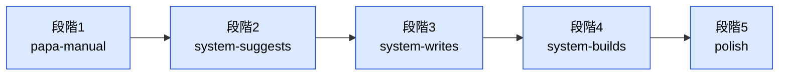
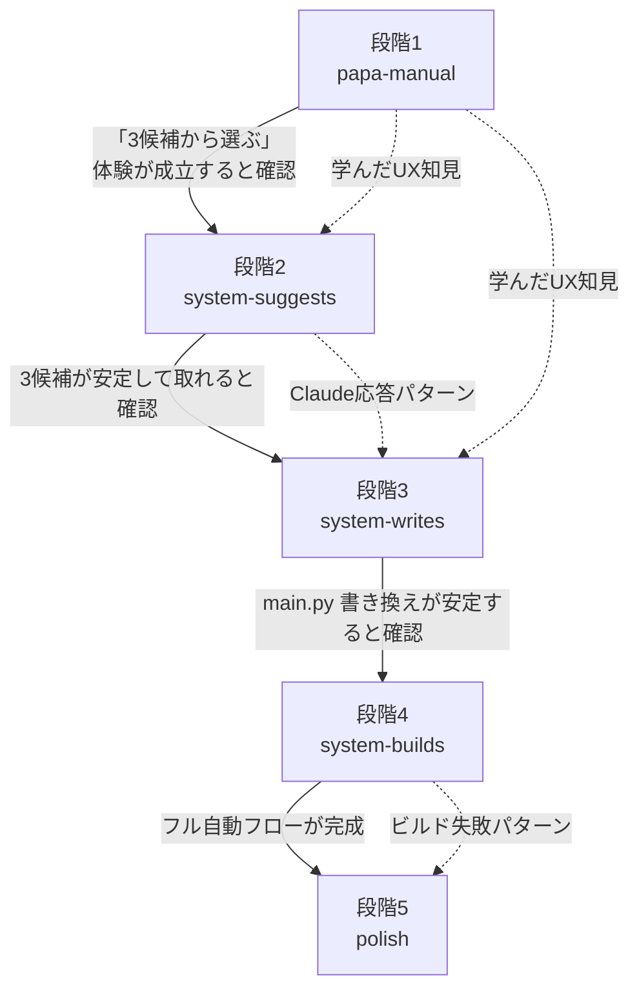

# 5段階マップ: ブラウザで「ＡＩでしゅうせい」を頼む

> **この文書の役割**：本ジャーニーは規模が大きいため、5つのサブステアリングに分割して段階的に作る。本書は **段階の全体マップ** と **段階間の依存関係** だけを定義する。各段階の体験設計（journey）／受け入れ条件（gherkin）／設計（design）は各サブステアリングに委ねる。

## 段階分けの軸

「**自動化のレベル**」を軸に5段階に分ける。最初はパパが手動で全てやり、段階を追うごとにシステムが少しずつ責務を引き取る。

---

## 5段階の責務マップ

| 役割 | 段階1 papa-manual | 段階2 system-suggests | 段階3 system-writes | 段階4 system-builds | 段階5 polish |
|---|---|---|---|---|---|
| ＡＩに頼む（一言入力） | パパ | **システム** | システム | システム | システム |
| Claude を呼ぶ | パパ | **システム** | システム | システム | システム |
| 3候補を子どもに見せる | パパ（紙/口頭） | **システム**（Pyxel UI） | システム | システム | システム |
| 子どもが選ぶ | 子ども（口頭） | 子ども（Pyxel UI） | 子ども | 子ども | 子ども |
| 選ばれた候補をパパに渡す | （不要） | **システム** | （不要） | （不要） | （不要） |
| `current_main.py` を書き換え | パパ | パパ | **システム** | システム | システム |
| パパが結果を確認 | （不要） | （不要） | **パパ** | （不要） | （不要） |
| ビルド（コンパイル） | パパ | パパ | パパ | **システム** | システム |
| 配信ファイル差し替え | パパ | パパ | パパ | **システム** | システム |
| 子どもに完了通知 | パパ（口頭） | パパ（口頭） | パパ（口頭） | **システム** | システム |
| 子どもがセーブ→リロード | 子ども | 子ども | 子ども | 子ども | 子ども |
| もとに戻す | パパ | パパ | パパ | パパ | **システム** |
| 緊急口 `?reset=1` | （不要） | （不要） | （不要） | （不要） | **システム** |

**太字** = その段階で **新しくシステム化される責務**。

---

## 段階1：papa-manual（紙プロトタイプ）

**ディレクトリ**：`docs/steering/20260408-ai-fix-1-papa-manual/`

**実装**：なし。既存ゲームのみ。
**目的**：体験の核（「子どもが選ぶ→ゲームが変わる」）が成立するか、紙ベースで検証する。

**子どもの体験**：
- パパが「3つのバージョンがあるよ」と紙やノートで見せる
- 子どもが選ぶ
- パパが手動で main.py を書き換えてビルドし、子どもにリロードさせる

**この段階で確認したいこと**：
- 「3つから比べて選ぶ」体験が子どもに刺さるか
- 「もとに戻せる」安心感が機能するか
- 子どもがどんな一言を言いたがるか（後の prompt 設計に活きる）

**含むファイル**：`journey.md` / `gherkin.md` のみ（design.md なし）

---

## 段階2：system-suggests（システムが3候補を生成・表示する）

**ディレクトリ**：`docs/steering/20260408-ai-fix-2-system-suggests/`

**新しくシステム化される責務**：
- フロント：個人メニュー＋PromptInput＋AIClient (submit/poll)＋JobStore (front)＋CandidateView＋★マーク
- バックエンド：JobReceiver＋ClaudeWorker (`claude` CLI subprocess)＋JobStore (back)＋A17 キューイング
- **「パパに渡す」UI**：選んだ候補のコードをファイル/HTML で書き出すだけの最小実装

**まだ手動の責務**：
- パパが選ばれた候補を main.py に貼って、ビルドして、配信する

**子どもの体験**：「自分でＡＩにたのめる」「3つから比べて選べる」「えらんだあとはパパにみせる」

---

## 段階3：system-writes（システムが main.py を書き換える）

**ディレクトリ**：`docs/steering/20260408-ai-fix-3-system-writes/`

**新しくシステム化される責務**：
- バックエンド：`/apply` エンドポイント＋VersionStore＋`original_main.py` の初回スナップショット
- フロント：選択後の「パパにみせてね」メッセージ
- **パパ向け通知の置き場**（最小：ファイル更新通知、または管理画面、または `current_main.py` のタイムスタンプ）

**まだ手動の責務**：
- パパが `current_main.py` を確認して、ビルド → 配信ファイル差し替え

**子どもの体験**：「えらぶとシステムがじゅんびしてくれる」（ただし反映はパパ待ち）

---

## 段階4：system-builds（コンパイル→配信→完了通知をフル自動化）

**ディレクトリ**：`docs/steering/20260408-ai-fix-4-system-builds/`

**新しくシステム化される責務**：
- バックエンド：PyxelBuilder＋アトミック rename＋StaticServer（強化）
- ビルド失敗時の端的な失敗説明
- フロント：完了通知メッセージUI

**もう手動でなくなる責務**：
- パパがビルドする必要がない
- パパが配信ファイルを差し替える必要がない
- パパが子どもに完了を伝える必要がない（システムが通知）

**子どもの体験**：パパに頼まずに自分で完結する「ＡＩでしゅうせい」

---

## 段階5：polish（残った課題）

**ディレクトリ**：`docs/steering/20260408-ai-fix-5-polish/`

**含む課題**：
- **「もとに戻す」フロー**（revert エンドポイント＋メニュー項目＋同じ完了通知）
- **緊急リセット `?reset=1`**
- 失敗時の文言整備（「ＡＩがすこしまちがえました」「ＡＩのコードがうごきませんでした」「いまＡＩがつかえません」）
- 5分タイムアウトの実装
- `claude` CLI のログイン切れ検出と運用手順
- その他、ジャーニーで触れた小ネタ

**子どもの体験**：「こわしてもこわくない」が完成する。これで体験全体が閉じる

---

## 段階間の依存関係

各段階の **完了条件** は次の段階を始める前提。原則として段階を飛ばさない。

---

## 体験の核（全段階で守ること）

サブステアリングがどれだけ詳細化しても、以下は **絶対に守る** 体験原則：

| 原則 | 守り方 |
|---|---|
| 子どもがいつでも **3つから比べて選べる**（受け身にならない） | 1候補だけは絶対に出さない |
| 子どもが **こわしても確実にもとに戻れる** | 段階1〜4ではパパが、段階5以降はシステムが保証する |
| 子どもが見るUIは **すべて仮名・カタカナ**（A5） | git/job/poll/build などの言葉は出さない |
| 「**バージョン**」という言葉だけで履歴管理を伝える | git/branch/commit は出さない |
| 待ち時間が **遊びを止めない**（段階2以降） | ながら待ち・★マーク・ポーリング方式 |

---

## 段階非依存の設計判断

以下の判断は **どの段階でも変わらない**。詳細は `./architecture-design.md` を参照：

- **A1** 対象環境：web版（pyxel.html）のみ／バックエンドは Node.js + `claude` CLI
- **A2** 全体構成：フロント／バックエンドの2層分離
- **A5** 入力UI：`window.prompt()`（段階2以降）
- **A6** 待機方式：ながら待ち（ポーリング）（段階2以降）
- **A7** バージョン切替：ブラウザリロード（段階4以降）
- **A10** 状態の置き場所：main.py 系はバックエンド、job_id は localStorage
- **A11** 子ども中心の言葉
- **A15** Claude 呼び出し方式：`claude` CLI subprocess（段階2以降）
- **A17** 並行実行：1本まで（段階2以降）

---

## 関連ドキュメント

- `./journey.md` — 全体の体験ビジョン（変更なし）
- `./architecture-design.md` — 段階非依存の設計判断と全体構成
- 各サブステアリング — 段階固有の journey / gherkin / design / tasklist
- `docs/05-pyxel-code-maker-jouney.md` — 守るべき設計原則
