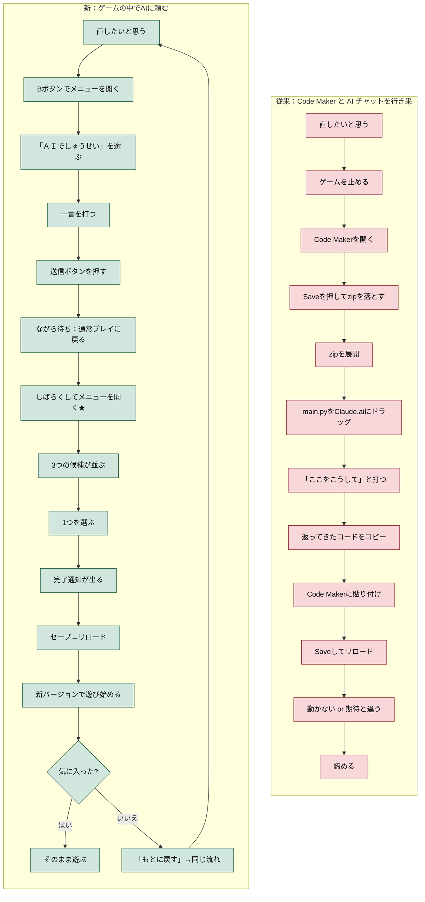
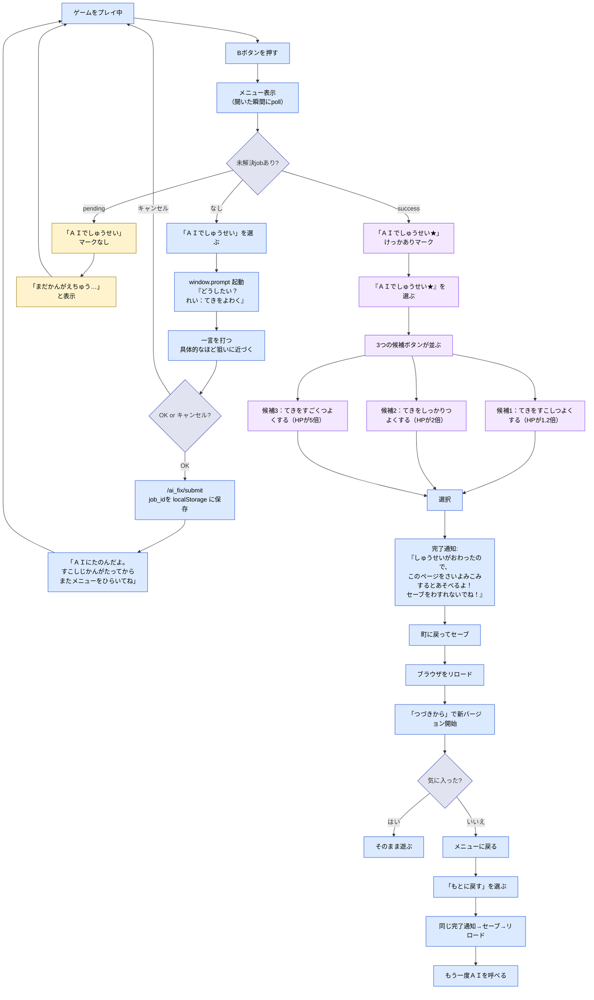
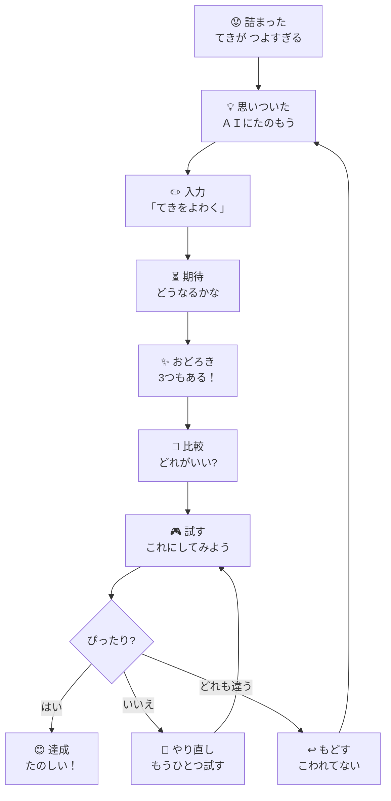
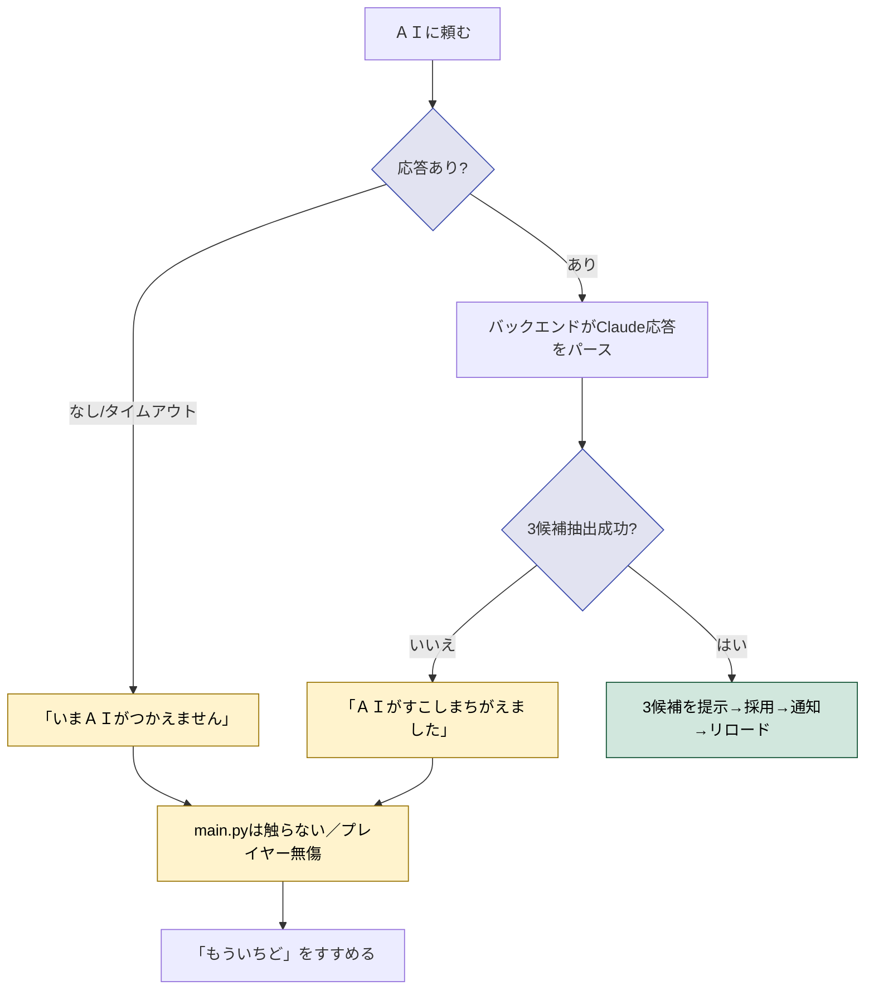
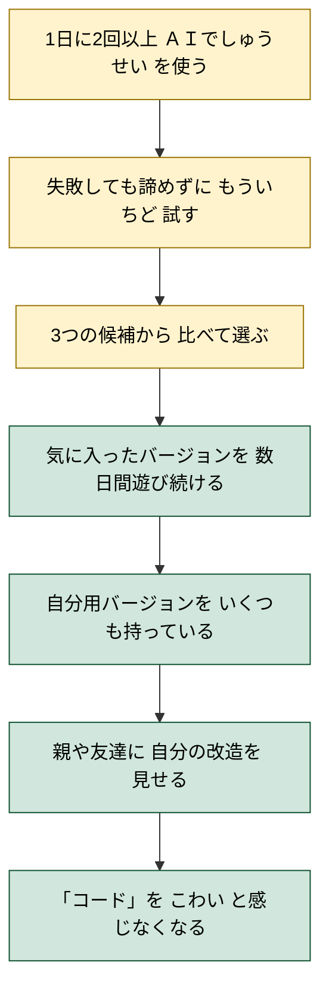

# ユーザージャーニー：ブラウザで「ＡＩでしゅうせい」を頼む

- 作成日: 2026-04-08
- 対象プロジェクト: Pyxel版 Block Quest
- 主役（プレイヤー）: ブラウザでゲームを遊んでいる子ども
- 目的: 子どもが**短い日本語の一言**でゲームを直してもらい、その結果を**即座にプレイ画面で確認**できる体験を定義する
- スコープ: プレイヤー体験のみ。バックエンドの実装方法、ブランチ管理の仕組み、VM 構成は別ドキュメントで扱う
- 関連: `docs/05-pyxel-code-maker-jouney.md`（守るべき設計原則）

## このステアリングの構成

このジャーニーは規模が大きいため、**5つのサブステアリング** に分割して段階的に作る。本文書（親）は **全体ビジョン** と **段階非依存の判断** だけを保持する。

| 段階 | サブステアリング | この段階で動くこと | システム化される責務 |
|---|---|---|---|
| 1 | [`20260408-ai-fix-1-papa-manual/`](../20260408-ai-fix-1-papa-manual/) | 紙プロトタイプ。パパが3候補を直接見せる | （実装ゼロ） |
| 2 | [`20260408-ai-fix-2-system-suggests/`](../20260408-ai-fix-2-system-suggests/) | システムが3候補を生成・表示する／パパに渡す | フロントUI＋Claude CLI ワーカー |
| 3 | [`20260408-ai-fix-3-system-writes/`](../20260408-ai-fix-3-system-writes/) | システムが `current_main.py` を書き換える | apply エンドポイント＋VersionStore |
| 4 | [`20260408-ai-fix-4-system-builds/`](../20260408-ai-fix-4-system-builds/) | コンパイル→配信→完了通知をフル自動化 | PyxelBuilder＋アトミック rename＋StaticServer |
| 5 | [`20260408-ai-fix-5-polish/`](../20260408-ai-fix-5-polish/) | もとに戻す／緊急口／文言整備／その他磨き込み | revert／`?reset=1`／タイムアウト等 |

段階分けのマップ・依存関係・各段階のスコープは [`./gherkin.md`](./gherkin.md) を参照。

---

## 概要

このゲームは「子どもが自分で改造して育てる」ことを核に置いている（`05-pyxel-code-maker-jouney.md`）。
そのときに最大の壁になるのが「**コードを書き換える**」という行為そのものだ。

8歳の子どもが「敵をもっと強くしたい」と思っても：
- どこを書き換えればいいか分からない
- Python 構文を間違えるとゲームが起動しない
- エラーが出ても読めない
- そもそも Code Maker を開いて行ったり来たりするのが面倒

ここで AI がいると話が変わる。**「もっとつよく」と一言書く**だけで、AI がコードを読んで安全に書き換えて、結果を見せてくれる。

このジャーニーが目指す体験はひとつ：

> プレイヤーが遊んでいる**画面の中**で「もっとつよく」と打ち込むと、
> 数秒後に「強くなったバージョン」と「もっと強くなったバージョン」と「ずるい強さバージョン」が並んで出てくる。
> 一つ選ぶと、ゲームは**そのバージョンに切り替わる**。
> 元に戻したくなったら、いつでも他のバージョンを選び直せる。

「コードを編集する」という行為が、「**選ぶ**」という行為に置き換わる。

---

## 背景

子どもは「直したい」と思った瞬間がいちばん集中している。
そこで「Code Maker を開いて、Save を押して、main.py をダウンロードして、Claude に貼って、戻ってきたコードを Code Maker に貼って、Save して、リロードして…」という 7 ステップを要求すると、その瞬間の熱は冷める。

いま AI を使うときに体験する心理：

- 「やってみたい」→「めんどくさそう」→ 諦める
- 「やってみる」→「Code Maker と Claude を行き来する」→ どちらが本物か分からなくなる
- 「コードが返ってきた」→「貼り付けたら動かない」→ もとに戻せなくて泣く

**摩擦のすべてが「ゲームの外」で起きている**。
ゲームの中で完結すれば、この心理コストは消える。

---

## ユーザーストーリー

| プレイヤー像 | 戦闘がむずかしすぎる | もっと面白くしたい | 自分のキャラを作りたい |
| :-- | :-- | :-- | :-- |
| 動機 | 詰まった | 飽きた | 自分を出したい |
| 旧タスク | あきらめる / 攻略を読む | 別のゲームに移る | Code Maker を開いて挫折 |
| 旧コスト | 心理負担「中」 | プロジェクト離脱 | 心理負担「大」 |
| 新タスク | 「敵をよわく」と打つ | 「もっとはやく」と打つ | 「ピンクのまほうをついか」と打つ |
| 新コスト | ながら待ち（普通に遊んでいてOK） | ながら待ち | ながら待ち |
| 期待される結果 | 戦闘がちょうど良くなる | テンポが上がる | 自分の魔法ができる |

---

## ジャーニー全体図（縦長）



---

## 期待される体験の変化

### Before（コードを直接編集）

1. プレイヤーが「ここを変えたい」と思う
2. ゲームを止めて Code Maker を開く
3. main.py の中から該当箇所を**自分で探す**
4. Python 構文を**自分で書く**
5. Save→ リロードして確認
6. 動かなかったら最初からやり直し

**所要**: 30 分〜数時間。多くの子どもは 2 分で諦める。

### After（一言で頼む）

1. プレイヤーが「ここを変えたい」と思う
2. メニュー → ＡＩでしゅうせい を選ぶ
3. promptが開く → **一言** を打って送信
4. ゲームに戻って **ながら待ち**（戦闘・探索・町散策などを続ける）
5. しばらくしてメニューを開くと「ＡＩでしゅうせい★」マーク → 3候補が並ぶ
6. 選ぶ → 完了通知 → セーブ → ブラウザリロード → 新バージョンで遊ぶ
7. 気に入らなければ「もとに戻す」で同じフローを通って取り消せる

**核**: 「待たせない」のではなく、「待たせるが、遊びを止めない」。

---

## 操作フローの詳細（縦長）



---

## 「3つの候補」が大事な理由

1 つの結果だけ返すと「これしかない」と感じて柔軟性がなくなる。
**3 つ並ぶと「比べる」体験になる**。

| 1つだけ返す世界 | 3つ並ぶ世界 |
|---|---|
| 「これがＡＩの答え」 | 「どれがいい？」 |
| 受け身 | 選択する立場 |
| 失敗したら全部やり直し | 失敗しても他の選択肢がある |
| 次に進めない | 次に進める |

---

## 「もとに戻せる」が安心の核

子どもが新機能を試すときの最大の不安は「**こわしてしまうこと**」。
このジャーニーでは「もとに戻す」が常に左下に表示され続ける。

```mermaid
flowchart TB
    M0[いまのバージョン] --> M1[ＡＩに頼む]
    M1 --> M2[新しい候補に切り替わる]
    M2 --> M3{気に入った?}
    M3 -->|はい| M4[そのまま続ける]
    M3 -->|いいえ| M5[他の候補を試す]
    M5 --> M3
    M3 -->|全部だめ| M6["もとに戻す]
    M6 --> M0
```

「もとに戻す」が確実に動くことが、**子どもが大胆になる条件**。

---

## 感情の流れ（縦長）



「詰まった → 試す → 選ぶ → 達成」のサイクルは **ながら待ち** で回ること。
プレイヤーがＡＩの応答を待っている間も遊びが止まらないことが核。

---

## ねらい

AIには具体的な指示を与えた方が良いことを経験的に学ばせる。

---

## 重要タッチポイント

| 場面 | プレイヤーの気持ち | 必要な導線 | 返すべき体験 |
| --- | --- | --- | --- |
| ゲーム中に詰まる | くやしい | メニューにすぐアクセス | 「ＡＩでしゅうせい」が常に B ボタンの先にある |
| 「ＡＩでしゅうせい」を選ぶ | わくわく | 入力UIがすぐ出る | `window.prompt` が即起動／メッセージに例文が同居 |
| 送信した直後 | やった | すぐに遊びに戻りたい | 「たのんだよ」とだけ伝えて即ゲームに戻す（待機UIなし） |
| 待っている間 | 期待＋遊びたい | 遊びを止めない | 戦闘・探索・町の用事を普通にこなせる |
| 結果に気付く | わくわく | 一目でわかる | メニュー項目に **★** マーク |
| 候補が並ぶ | 興奮 | 3 つが対等に並ぶ | Pyxel UIで各候補に短い説明＋具体数値 |
| 1 つ選ぶ | 期待 | 即座に書き換え | 完了通知「セーブをわすれないでね！」 |
| セーブしてリロード | 一区切り | 既存セーブと自然に結ぶ | 既存のやどや/セーブで保存し、ブラウザリロード |
| 試してみる | 評価 | プレイで確かめる | 直接プレイヤーが体感する |
| 気に入らない | 不満 | すぐ戻れる | 「もとに戻す」も同じ完了通知→セーブ→リロード |
| 気に入った | 達成感 | 続きが遊べる | そのまま遊び続けられる |

---

## 「ブランチ」という概念のプレイヤー側翻訳

裏側では git ブランチで管理するが、子どもには「**バージョン**」と呼ぶ。
git の言葉は出さない：

| 内部用語 | 子どもへの言い方 |
|---|---|
| ブランチ | バージョン |
| commit | 「保存された状態」 |
| diff | 「ちがい」 |
| merge | 「合体」 |
| revert | 「もとに戻す」 |
| HEAD | 「いま遊んでいるバージョン」 |

「**もとのバージョン**」と「**いま遊んでいるバージョン**」の2つだけが常に存在する、と伝わればよい。

```
いま遊んでいるのは：「てきよわめ」
ほかにあるバージョン：
  ・もとのバージョン
```

ＡＩを呼ぶと「いま遊んでいるバージョン」が新しい候補に置き換わるが、「もとのバージョン」は常に残る。
気に入らなければ「もとに戻す」を選んで、もう一度ＡＩを呼べばよい。

---

## 失敗時の体験

AI が応答しない / 解釈できない / コードを壊す、のいずれが起きても **ゲームは止まらない**。



> コードの中身（実際に起動するかどうか）はバックエンドでは検証しない。万一リロード後に起動しなければ緊急口 `?reset=1`（design.md D14 / gherkin シナリオ6）で必ず戻せる。

「AI が壊した」ときに「自分が壊した」と感じさせない。
失敗時の文言は**子どもを責めない**：

| 良い | 悪い |
|---|---|
| 「ＡＩがすこしまちがえました。もういちど ためしてみよう」 | 「文法エラー: line 42, unexpected token」 |
| 「いまＡＩがおやすみ中です」 | 「HTTP 503 Service Unavailable」 |

---

## 成功の手触り

- メニューから「ＡＩでしゅうせい」を押すまでが **3 秒以内**
- promptが開いたら、子どもは自分のペースで一言を打てる
- 送信した瞬間にゲームに戻れる（待機UIが無い）
- 結果を待っている間も **戦闘・探索・町散策が普通にできる**
- 結果が来たことに気付くのは「メニューを開いた瞬間」の **★マーク**
- セーブ → ブラウザリロード → 新バージョンで遊び始める一連の流れが**自然に体に入る**
- 「セーブをわすれないでね」がきっかけで、既存のセーブ機能を使う習慣が身につく
- 失敗しても元に戻れる安心感がある（「もとに戻す」も同じリロードフロー）
- 「もう一回頼む」が苦にならない（連発しても疲れない設計）

---

## 成功指標（縦長）



### 定性

- 「コードを書く」より「お願いする」が先になる
- 「壊したらどうしよう」より「とりあえず試す」が出る
- 親が見ていなくても安心して進められる
- 失敗が「楽しい実験」になる
- 自分のバージョンに**名前をつけたくなる**

### 定量

- 1 セッション平均 **3 回以上** AI 修正を呼ぶ
- AI 候補 3 つのうち **平均 2 つ以上** を試す
- AI 修正の **70% 以上** がプレイヤーに採用される
- 「もとに戻す」を使ったあとも、同じセッション内に再度 AI を呼ぶことが多い
- 新規ユーザーの **80%** が初回セッションで AI 修正を 1 回は試す

---

## スコープ外

このジャーニーで扱わないこと：

- VM 内で Claude をどう起動するか（subprocess？ Claude SDK？）
- どのブランチ命名規約を使うか
- ブランチ数が増えすぎたときの古い候補の自動削除
- 候補プレビュー（実際にプレイする前のミニ表示）
- 友達と候補を共有する機能
- 親がレビューする機能
- 課金（API 呼び出しのコスト管理）
- レート制限（連発防止）
- セキュリティ（悪意ある指示でコードを書き換えないか）

これらは「**まずプレイヤー体験が成立すること**」が確認できてから設計する。
今は「動く最小の体験」を目指す。

---

## 守るべき原則（`05-pyxel-code-maker-jouney.md` との関係）

| 原則 | この機能における担保 |
|---|---|
| C1 配布物 2 ファイル | プレイヤー側コードは main.py 内で完結。バックエンドは別配布物 |
| C3 アップロード後そのまま遊べる | バックエンドが落ちていてもゲームは普通に遊べる |
| C5 致命的に壊れない | 「もとに戻す」が必ず動く。AI 失敗時も停止しない |
| A3 pip install 禁止 | プレイヤー側は pip install 不要。バックエンドは独立 |
| A5 必須UIに漢字を使わない | 入力欄・候補・ボタンはすべて仮名・カタカナ |
| 子ども中心 | git/branch/commit などの言葉を出さない。「バージョン」で統一 |

---

## 関連ドキュメント

- `docs/05-pyxel-code-maker-jouney.md` — 守るべき設計原則（§4 必須条件 / §6 AI 体験の組み込み方針）
- `docs/steering/20260407-save-player-journey/journey.md` — ジャーニードキュメントのフォーマット参考
- 後続: `design.md`（実装設計）／ `gherkin.md`（受け入れ条件）／ `tasklist.md`（実装計画）はこのフォルダに後日追加
