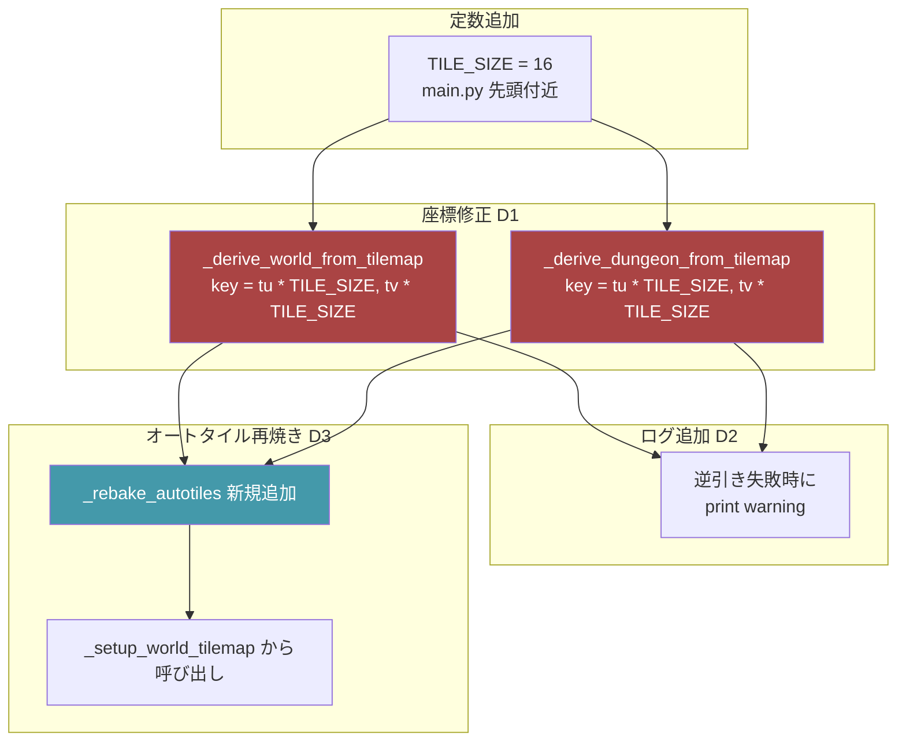
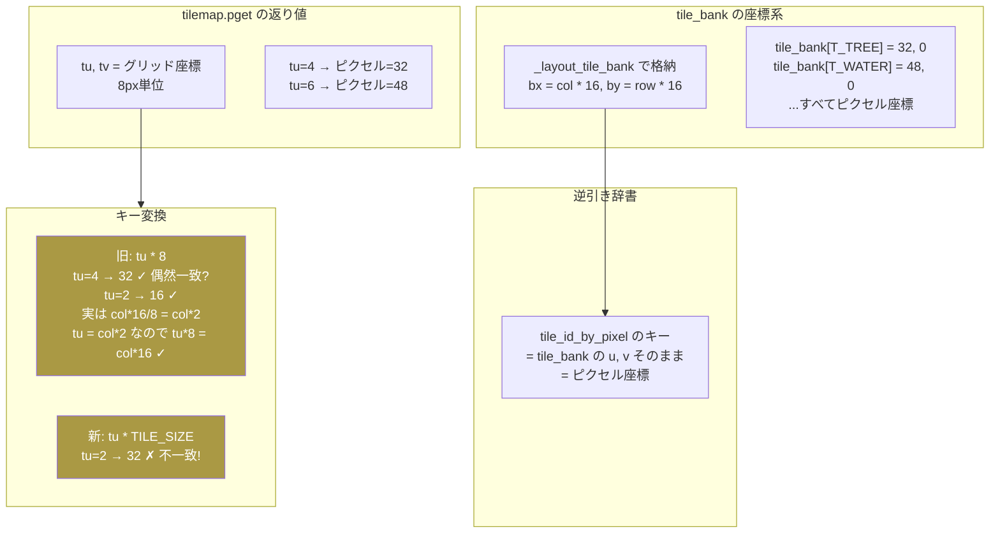
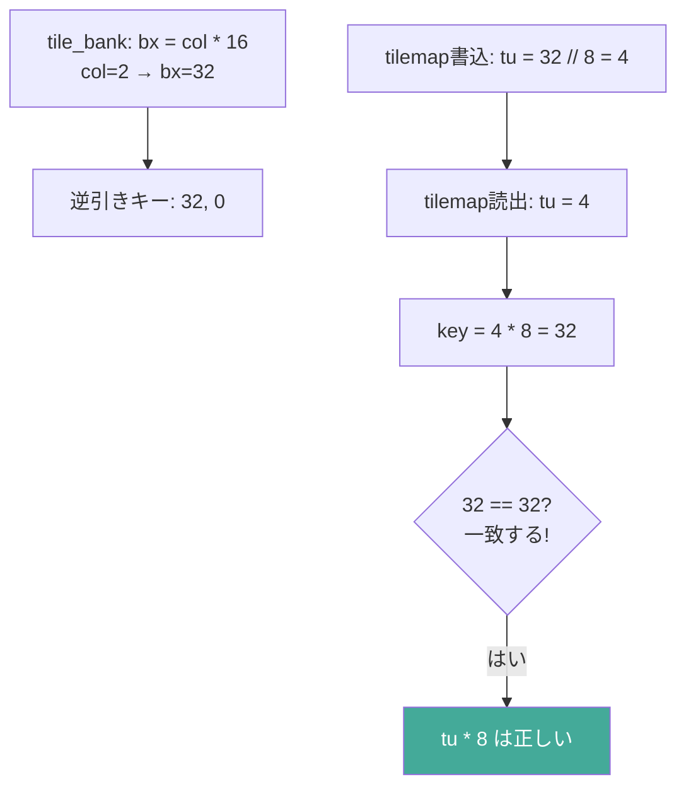
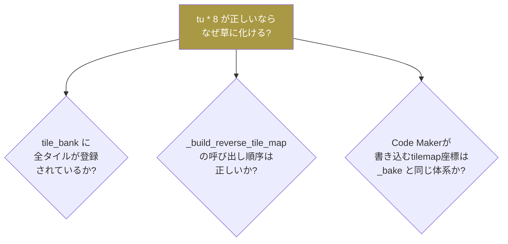
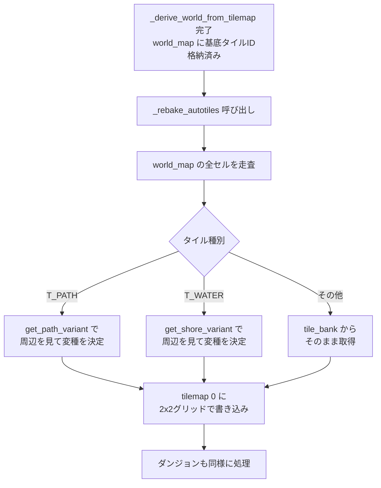
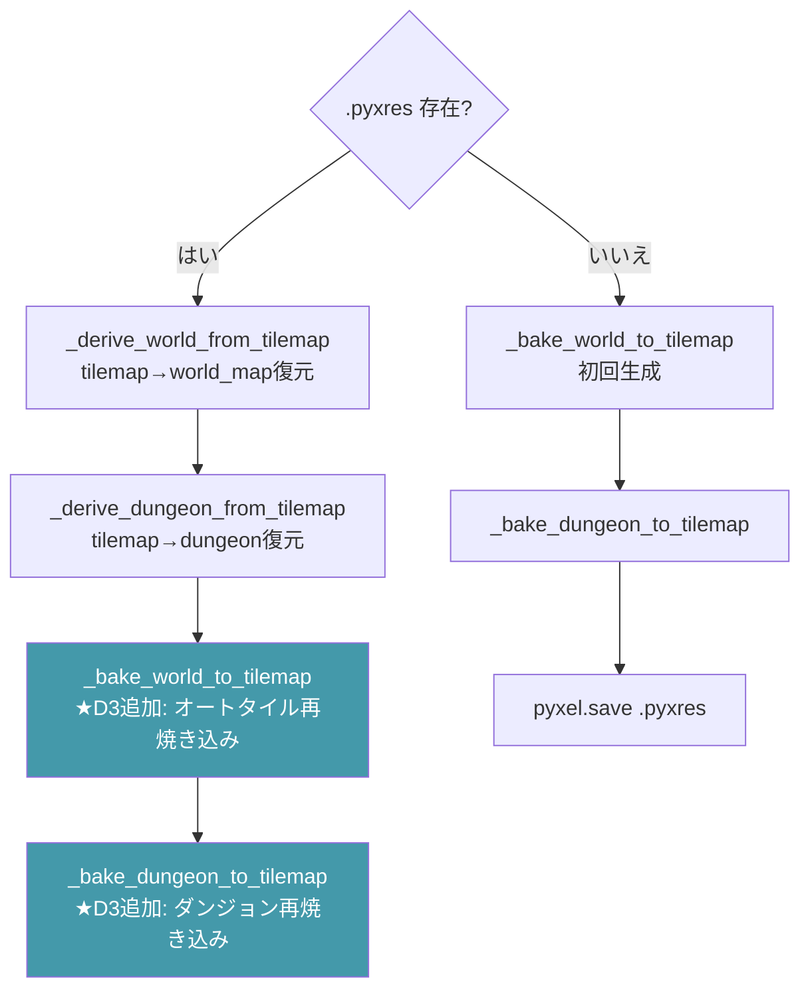
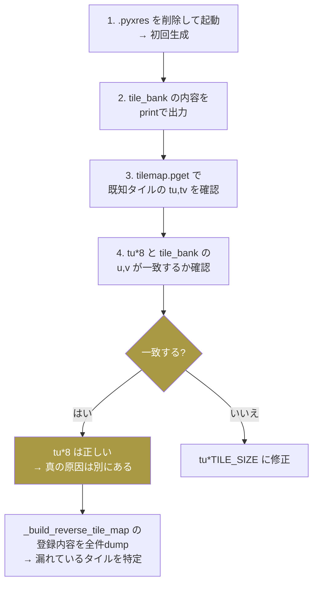
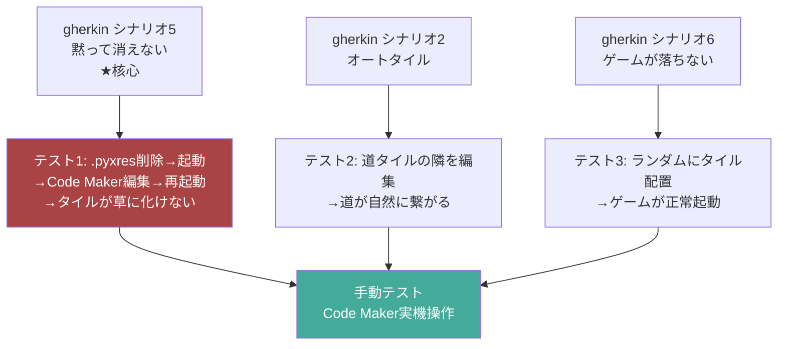

# 詳細設計書: タイルマップ編集の反映バグ修正

`structure-design.md` で決定した方針（D1: ピクセル座標統一 / D3: _rebake_autotiles / D4: TILE_SIZE定数化）を実装レベルに落とし込む。

---

## 1. 修正箇所の全体マップ



---

## 2. TILE_SIZE 定数（D4）

### 現状

`* 8` がハードコードされている。Pyxel の tilemap.pget/pset はグリッド座標（8px単位）を返すが、ゲームの論理タイルは 16x16px（2x2グリッド）。

### 修正

```python
# main.py 先頭の定数定義エリア（MAP_W, MAP_H 付近）
TILE_SIZE = 16  # 論理タイル1マス = 16x16px = 2x2 Pyxelグリッド
```

---

## 3. _derive_world_from_tilemap 修正（D1 核心）

### 現状のコード（main.py 1455-1467行）

```python
def _derive_world_from_tilemap(self):
    tilemap = pyxel.tilemaps[0]
    derived = []
    for y in range(MAP_H):
        row = []
        for x in range(MAP_W):
            tu, tv = tilemap.pget(2 * x, 2 * y)
            key = (tu * 8, tv * 8)                          # ★バグ
            tid = self.tile_id_by_pixel.get(key, T_GRASS)
            row.append(tid)
        derived.append(row)
    self.world_map = derived
```

### 修正後

```python
def _derive_world_from_tilemap(self):
    tilemap = pyxel.tilemaps[0]
    derived = []
    for y in range(MAP_H):
        row = []
        for x in range(MAP_W):
            tu, tv = tilemap.pget(2 * x, 2 * y)
            key = (tu * TILE_SIZE, tv * TILE_SIZE)           # ★修正: D1
            tid = self.tile_id_by_pixel.get(key, T_GRASS)
            if tid == T_GRASS and key not in self.tile_id_by_pixel:  # D2
                print(f"[tilemap] unknown tile at world ({x},{y}): pixel={key}")
            row.append(tid)
        derived.append(row)
    self.world_map = derived
```

### なぜ tu * TILE_SIZE なのか



**重要な再検証**: 実は `tu * 8` が正しい可能性がある。

---

## 3.1 座標系の精密な検証

### _layout_tile_bank のレイアウト

```python
col = 0; row = 0
for kind, key, _data in self._tile_iter():
    bx = col * 16; by = row * 16     # ← ピクセル座標
    self.tile_bank[key] = (bx, by)
    col += 1
    if col >= 16: col = 0; row += 1
```

例: col=2, row=0 → `bx=32, by=0`

### _bake_world_to_tilemap の書き込み

```python
u, v = self._pixel_pos_for_tile(wm, x, y, tile)  # ← ピクセル座標 (32, 0)
tu, tv = u // 8, v // 8                            # ← グリッド座標 (4, 0)
tilemap.pset(2*x, 2*y, (tu, tv))                   # ← (4, 0) を格納
```

### _derive_world_from_tilemap の読み出し

```python
tu, tv = tilemap.pget(2*x, 2*y)    # ← グリッド座標 (4, 0)
key = (tu * 8, tv * 8)              # ← (32, 0)
```

### 逆引き辞書のキー

```python
self.tile_id_by_pixel[(u, v)] = tid  # ← (32, 0)
```

### 検証結果



**`tu * 8` は実は正しい。** tile_bank が 16px単位、Pyxelグリッドが 8px単位なので:
- 書込: `bx(=col*16) // 8 = tu`
- 読出: `tu * 8 = col*16 // 8 * 8 = col*16` → 一致

### では真の原因は何か



**D1の判断を保留し、実装フェーズで実機検証が必要。**

---

## 4. _derive_dungeon_from_tilemap 修正

`_derive_world_from_tilemap` と同じ修正を適用。

### 現状（main.py 1407-1421行）

```python
def _derive_dungeon_from_tilemap(self):
    tilemap = pyxel.tilemaps[0]
    dg = self.dungeon_template
    oy = self.DUNGEON_TM_OFFSET_Y
    derived = []
    for y in range(len(dg)):
        row = []
        for x in range(len(dg[0])):
            tu, tv = tilemap.pget(2 * x, oy + 2 * y)
            key = (tu * 8, tv * 8)                     # D1と同じ修正
            tid = self.tile_id_by_pixel.get(key, T_FLOOR)
            row.append(tid)
        derived.append(row)
    self.dungeon_template = derived
```

### 修正方針

- D1修正を適用する場合は `tu * TILE_SIZE` に変更
- D2: 逆引き失敗時に `print(f"[tilemap] unknown tile at dungeon ...")` 追加
- D1保留の場合も D2 のログは追加する（デバッグ用）

---

## 5. _rebake_autotiles 新規追加（D3）

### 処理フロー



### 概念コード

```python
def _rebake_autotiles(self):
    """world_map / dungeon_template から tilemap[0] を再焼き込みする。

    _derive_*_from_tilemap() で基底タイルIDを復元した後に呼ぶ。
    オートタイル変種を周辺タイルから再計算してtilemap[0]に書き戻す。
    """
    self._bake_world_to_tilemap()
    self._bake_dungeon_to_tilemap()
```

**注意**: `_rebake_autotiles` の実体は既存の `_bake_world_to_tilemap` + `_bake_dungeon_to_tilemap` と同じ。新メソッドとして分離するか、直接呼ぶかは実装時に判断。

### _bake_world_to_tilemap が既にオートタイル解決をしている

```python
def _bake_world_to_tilemap(self):
    for y in range(MAP_H):
        for x in range(MAP_W):
            tile = wm[y][x]
            u, v = self._pixel_pos_for_tile(wm, x, y, tile)  # ← オートタイル解決
            tu, tv = u // 8, v // 8
            tilemap.pset(...)
```

つまり `_rebake_autotiles` は既存メソッドの再利用で実現できる。

---

## 6. _setup_world_tilemap の修正

### 現状（main.py 1355-1390行）

```python
if self._pyxres_loaded:
    self._derive_world_from_tilemap()
    self._derive_dungeon_from_tilemap()
else:
    self._bake_world_to_tilemap()
    self._bake_dungeon_to_tilemap()
```

### 修正後

```python
if self._pyxres_loaded:
    self._derive_world_from_tilemap()
    self._derive_dungeon_from_tilemap()
    # D3: オートタイル変種を再計算してtilemap[0]に書き戻す
    self._bake_world_to_tilemap()
    self._bake_dungeon_to_tilemap()
else:
    self._bake_world_to_tilemap()
    self._bake_dungeon_to_tilemap()
```



---

## 7. 実装前に実機検証すべきこと

structure-design.md の D1 で「`tu*8` → `tu*TILE_SIZE`」と決定したが、座標系を精密に検証した結果、`tu*8` が正しい可能性がある。

### 検証手順



### 検証用デバッグコード

```python
# _build_reverse_tile_map の末尾に追加
print(f"[debug] tile_id_by_pixel keys: {sorted(self.tile_id_by_pixel.keys())}")
print(f"[debug] tile_bank values: {sorted(self.tile_bank.values())}")

# _derive_world_from_tilemap のループ内に追加（最初の5件のみ）
if y == 0 and x < 5:
    print(f"[debug] ({x},{y}): tu={tu}, tv={tv}, key={key}, "
          f"found={key in self.tile_id_by_pixel}")
```

---

## 8. テスト方針

### テストシナリオとgherkinの対応



### テスト手順

| # | テスト | 手順 | 期待結果 |
|---|---|---|---|
| 1 | 基本反映 | .pyxres削除→起動→Code Makerで城タイルを配置→保存→再起動 | 城タイルが正しく表示される |
| 2 | 草に化けない | テスト1と同じ手順で、リロード後にworld_mapを確認 | T_GRASSでなく配置したタイルIDが入っている |
| 3 | オートタイル | 道タイルの隣に木を配置→再起動 | 道が自然に繋がり直す |
| 4 | ダンジョン | ダンジョン領域のタイルを編集→再起動 | 編集が反映される |
| 5 | 安全性 | 全マスを同じタイルで埋める→再起動 | ゲームが正常に起動する |

---

## 参照

- [`./structure-design.md`](./structure-design.md) — 構造設計（D1-D4の判断）
- [`./gherkin.md`](./gherkin.md) — 受け入れ条件（シナリオ5が核心）
- [`./journey.md`](./journey.md) — 体験設計
