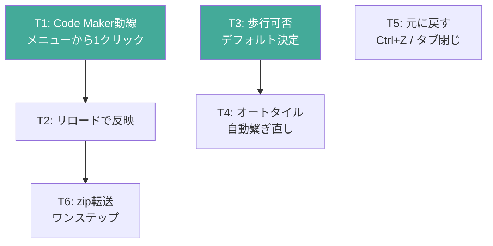
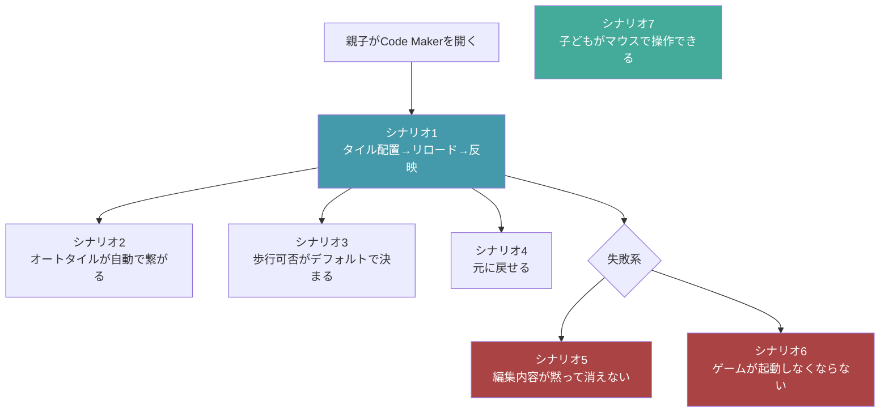
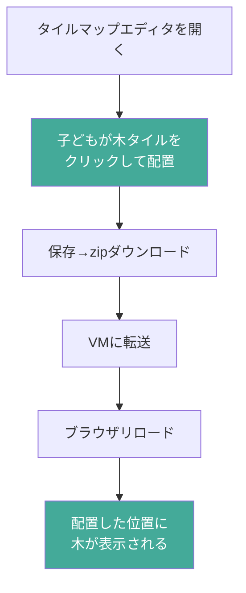
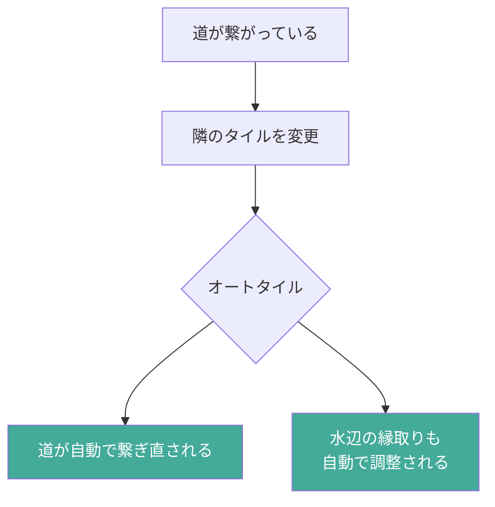
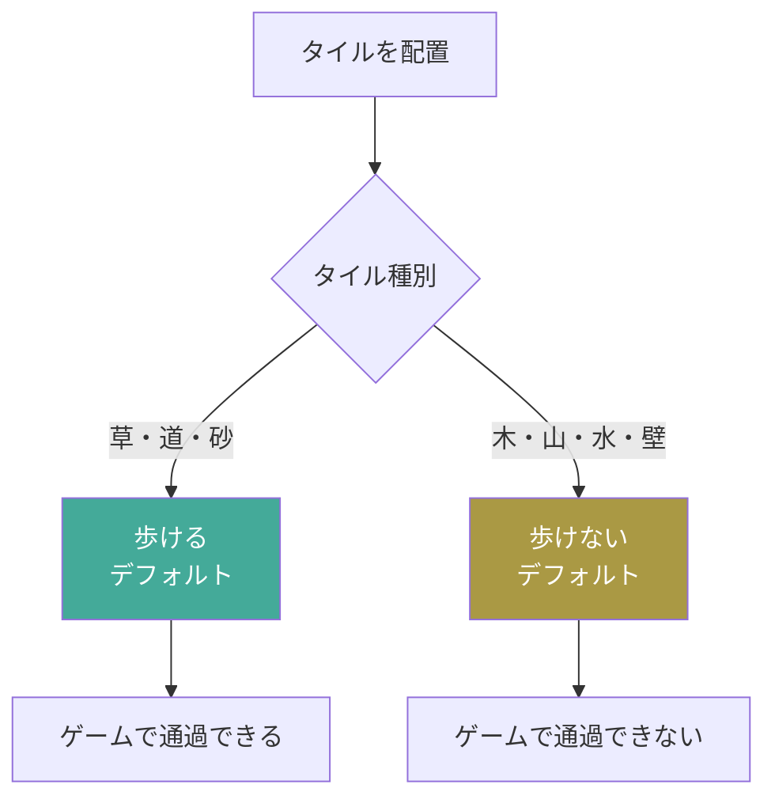
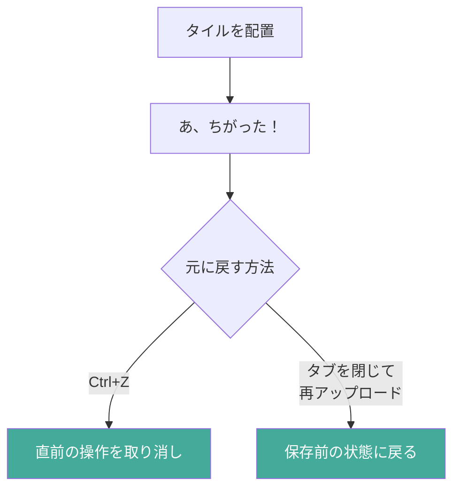
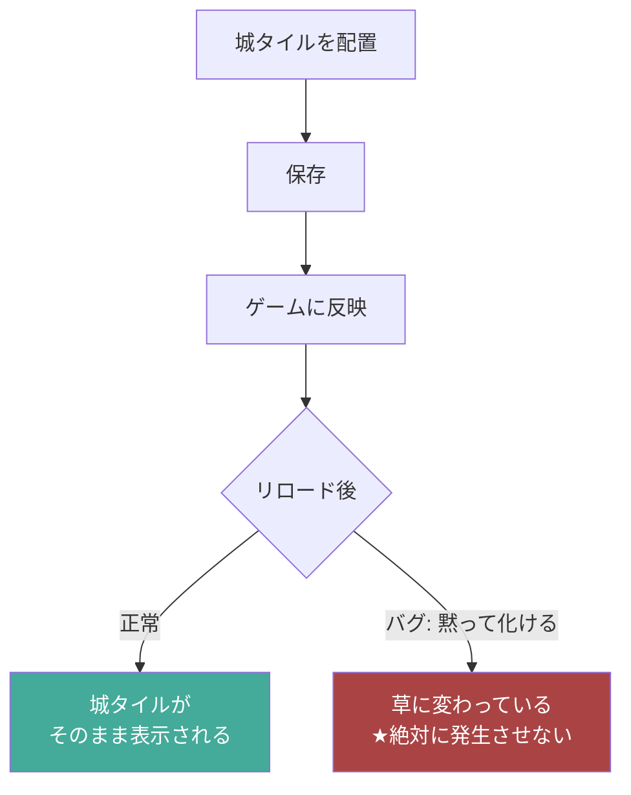
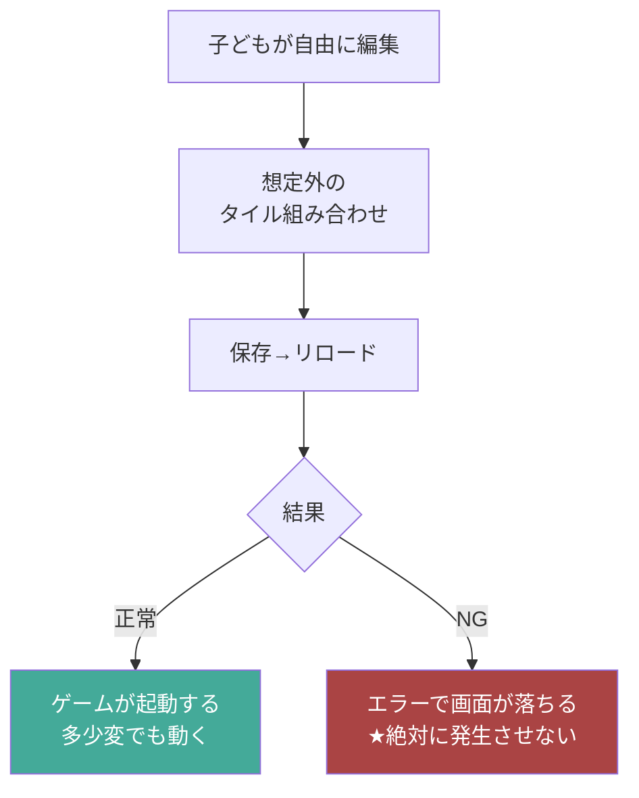
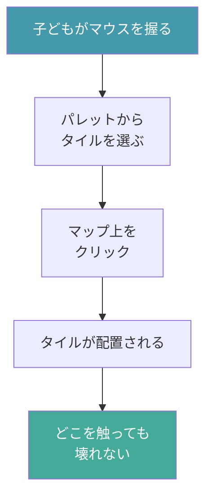
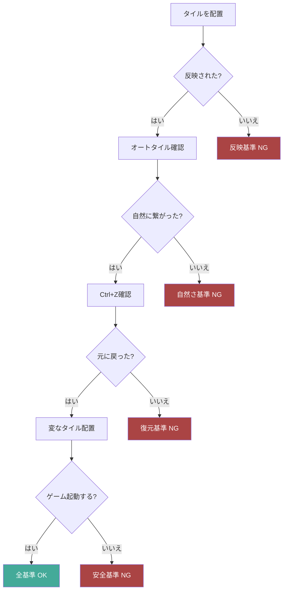

# 受け入れ条件: 子どもといっしょにタイルマップを編集する

## プロダクト判断の合意事項

| # | 論点 | 決定 | 理由 |
|---|---|---|---|
| T1 | Code Maker への動線 | ゲーム内メニューに**「Code Makerをひらく」**を追加 | 親が「ブックマークどこだっけ」と探す時間を消す |
| T2 | 編集結果の反映方法 | **ブラウザリロードで完結**する | 子どもが待てる限界は30秒 |
| T3 | 歩行可否のデフォルト | タイルごとに**デフォルトの歩行可否が決まっている** | 「歩けると思ったら歩けない」混乱を防ぐ |
| T4 | オートタイルの振る舞い | 編集後も**自動で繋ぎ直す** | 道が切れる・水辺が崩れると親が「やめておこう」となる |
| T5 | 元に戻す手段 | **Ctrl+Z** または **タブを閉じれば元の状態** | 子どもが「ちがった」と言える環境が試行回数を増やす |
| T6 | zip 転送手順 | **手動ドラッグ&ドロップ**で完結する（ダウンロード→VMにD&D） | 段取りに気を取られると子どもが置き去りになる。自動同期は将来検討 |

### 判断の依存関係



---

## シナリオ全体マップ



---

## シナリオ

### シナリオ1: タイルを配置してリロードで反映される（K1, K2）

```gherkin
Given 親が Code Maker のタイルマップエディタを開いている
And 子どもが横で画面を見ている
When 子どもが木のタイルをクリックしてマップに配置する
And 保存してzipをダウンロードする
And zipをVMに転送してブラウザをリロードする
Then ゲーム内で配置した位置に木が表示される
And 編集前と異なるタイルが反映されている
```



### シナリオ2: オートタイルが編集後も自然に見える（K4）

```gherkin
Given マップ上に道が繋がっている状態がある
When 道の隣のタイルを別の地形に変更する
Then 道のオートタイルが自動で繋ぎ直される
And 道が不自然に途切れない
```



### シナリオ3: 歩行可否がデフォルトで決まる（K5）

```gherkin
Given 子どもがタイルマップエディタで編集している
When 木のタイルを配置する
Then そのタイルは「歩けない」がデフォルトで設定される
And ゲーム内でキャラクターがそのタイルに進入できない
```



### シナリオ4: 編集を元に戻せる（T5, KR3）

```gherkin
Given 子どもがタイルを配置した直後
When Ctrl+Z を押す
Then 直前の配置が取り消される
And マップが配置前の状態に戻る
```



### シナリオ5: 編集内容が黙って消えない（K1, KA4）★このステアリングの核心

> **このステアリングはこのバグを修正するために存在する。ステアリング完了時にこの現象は抑制されていなければならない。**

```gherkin
Given タイルマップエディタで城タイルを配置した
And 保存してゲームに反映した
When ゲームをリロードする
Then 城タイルが草や別のタイルに勝手に変わっていない
And 保存した内容がそのまま表示される
```



### シナリオ6: 編集でゲームが起動しなくならない（K3, KA2）

```gherkin
Given 子どもがタイルマップを自由に編集した
And 想定外の組み合わせでタイルを配置した
When 保存してゲームをリロードする
Then ゲームが正常に起動する
And エラー画面が表示されない
```



### シナリオ7: 子どもがマウスで操作できる（KR2, KA5）

```gherkin
Given 子どもがタイルマップエディタの前に座っている
When タイルパレットからタイルを選ぶ
And マップ上の好きな場所をクリックする
Then タイルが配置される
And 「触ってはいけない場所」が存在しない
```



---

## 成功基準

| 基準 | 内容 |
|---|---|
| 反映 | 編集した内容が必ずゲームに反映される（K1） |
| 速度 | 1サイクル（編集→確認）が2分以内（K2） |
| 安全 | 子どもが自由に触ってもゲームが壊れない（K3, KA2） |
| 自然さ | オートタイルが自動で繋がる（K4） |
| 操作性 | 子どもがマウスだけで完結できる（KR2） |
| 復元 | Ctrl+Zで元に戻せる（T5） |

### 成功基準の検証フロー



---

## 参照

- [`./journey.md`](./journey.md) — このジャーニーの体験設計
- [`./problem.md`](./problem.md) — 課題定義
