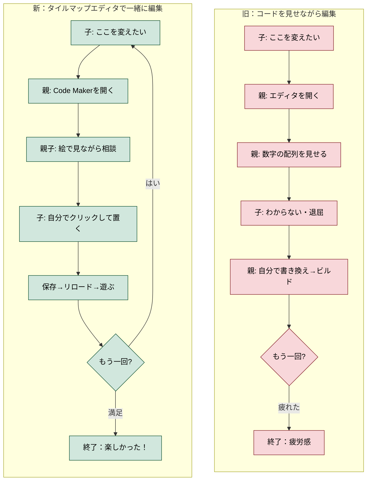

# ユーザージャーニー：子どもといっしょにタイルマップを編集する

- 作成日: 2026-04-08
- 対象プロジェクト: Pyxel版 Block Quest
- 主役: **親**（プログラミングが出来る、子どもを持つ大人）
- 目的: Code Maker のタイルマップエディタで親子が一緒にマップを編集する体験を定義する
- スコープ: 親の体験。子ども側は `20260408-ai-fix-from-browser` に委ねる
- 関連: [`./problem.md`](./problem.md)（課題定義・競合分析）

---

## 1. 概要

> **親と子どもが同じ画面を見ながら、「ここに森を増やそう」「お城のとなりに湖を作ろう」と相談しながら編集する。保存してリロードしたら、新しいマップで遊べる。**

「コードを書く」ではなく「**地図に絵を描く**」体験。

---

## 2. ジャーニー全体図

---

## 3. Before / After

| | Before: コードを見せながら | After: タイルマップエディタ |
|---|---|---|
| 子どもの役割 | 見ているだけ | **マウスを握ってクリック** |
| 1サイクル | 5-10分 | **1-2分** |
| 試行回数 | 2-3回で疲れる | **10回以上** |
| ボトルネック | 子どもが受け身になる時間 | **なし** |
| 残るもの | 疲労感・諦め | **「楽しかった」** |

---

## 4. 条件

### 必須

| # | 条件 | 違反すると |
|---|---|---|
| K1 | 編集内容が**必ずゲームに反映される** | 「黙って草に化ける」= 絶対NG |
| K2 | 確認は**ブラウザリロードで完結** | 子どもが待てない |
| K3 | 編集中に**「壊した」と感じない** | 子どもが手を引っ込める |
| K4 | オートタイルが**編集後も自然に見える** | 親が「やめておこう」となる |
| K5 | 「歩ける/歩けない」が**デフォルトで決まる** | 混乱する |
| K6 | **親子が同じ画面を見られる** | 一緒に作っている感じが出ない |

### 強い推奨

| # | 条件 |
|---|---|
| KR1 | zip を VM に届ける作業が**ワンステップ** |
| KR2 | 子どもが**マウスを握って自分でクリック**できる |
| KR3 | **1クリックで元に戻せる** |
| KR4 | 「次に何をするか」の**例示がある** |
| KR5 | 編集成果を**友達に見せられる** |

### アンチパターン

| # | やらないこと |
|---|---|
| KA1 | マップ編集のために**コードを開かせる** |
| KA2 | **エラーで起動しなくなる** |
| KA3 | 手順が**4ステップを超える** |
| KA4 | **「黙って違うものに化ける」** |
| KA5 | **子どもが触ると壊れる場所を作る** |
| KA6 | **「親がやる方が早い」と思わせる** |

---

## 5. タッチポイント

| 場面 | 親の気持ち | 返すべき体験 |
|---|---|---|
| 「変えたい！」 | 嬉しい | ブックマーク1クリックで開く |
| タイルマップタブ | わかりやすいかな | 絵で表示される |
| マウスを渡す | 壊さないかな | Ctrl+Zで戻せる |
| 保存 | 反映されるかな | ★ K1: 必ず反映 |
| リロード | 期待 | 子どもが新地形に走り出す |

---

## 6. 育てる順序

1. **3分**: 地形が1マス変わる（成功体験）
2. **5分**: 3〜5マス変わる（連続試行）
3. **15分**: 子どもが「こうしたい」と言い出す（主体性）
4. **30分**: 「自分たちの地域」が完成（達成）
5. **翌日**: 「またやろう」（継続）
6. **1週間**: 子どもが親なしで開く（卒業）
7. **数週間**: 新しいマップを一人で作る（§4.4 第6段階）

---

## 7. 成功の手触りと指標

### 親の体感
- Code Maker が**10秒以内**に画面に出る
- 子どもが**自分でクリックして置く**ことが最低1回ある
- 1セッションで**5回以上**リロードして遊んでいる
- **エディタを一度も開いていない**
- 「**教えてない、一緒に作っただけだ**」と気づく

### 子どもの体感
- 「**ぼくが作った！**」と叫ぶ
- 「コード」という言葉を一切聞かない
- 親に「教わった」感覚がない

### 定量指標
- 編集→リロード: **5回以上/セッション**
- 親がエディタを開く回数: **0**
- 子どもがマウスを握る時間: **セッションの半分以上**
- 週**3セッション以上**親子で開く

---

## 8. スコープ外

- イメージバンク・音楽・効果音の編集 → 別ジャーニー
- 子ども一人での体験 → `20260408-ai-fix-from-browser`
- 親が一人で改造 → `tools/build_codemaker.py`
- スマホ・タブレット → 当面PC前提
- 複数親子で共同編集 → 将来検討

---

## 参照

- [`./problem.md`](./problem.md) — 課題定義（構造的問題・競合分析）
- `docs/05-pyxel-code-maker-jouney.md` — 守るべき設計原則
- `docs/steering/20260408-ai-fix-from-browser/journey.md` — 子ども側ジャーニー
