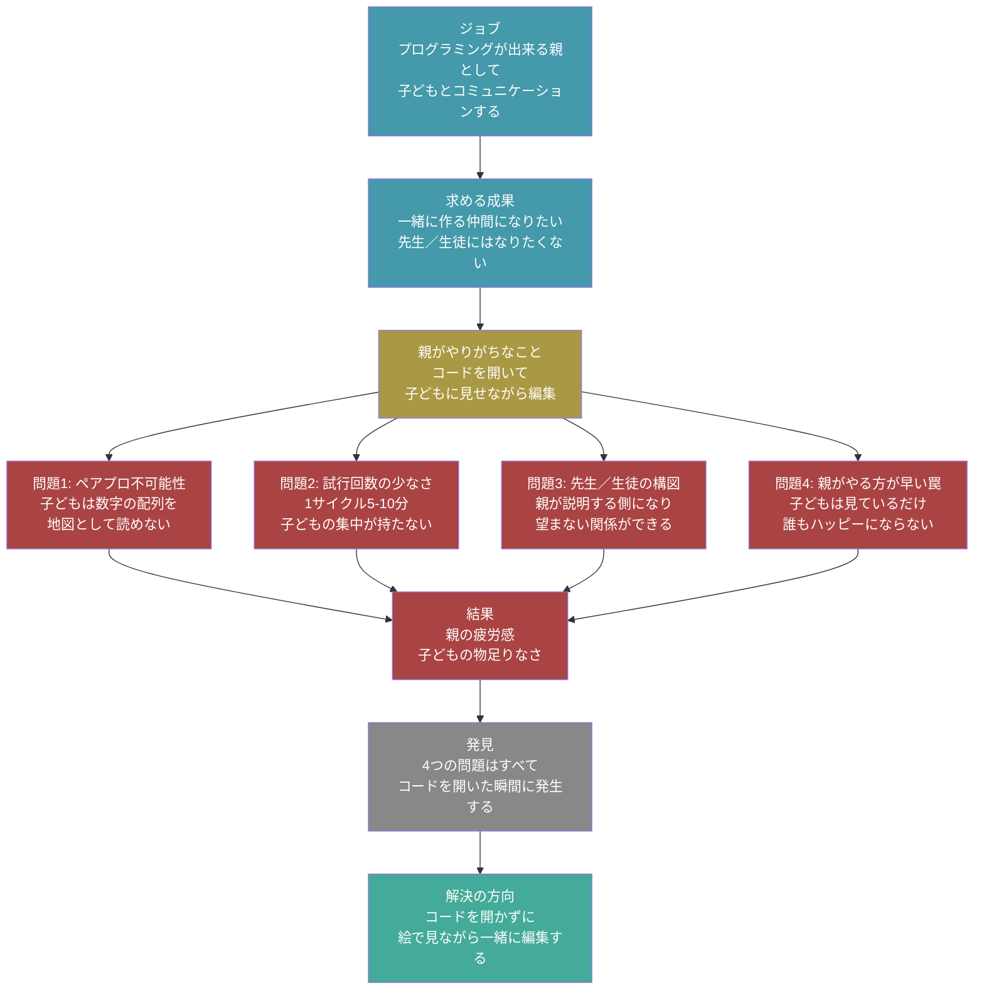

# 課題定義：子どもといっしょにタイルマップを編集する

- 作成日: 2026-04-08
- 対象プロジェクト: Pyxel版 Block Quest
- 主役: **親**（プログラミングが出来る、子どもを持つ大人）
- 目的: コードを開くと親子関係が壊れる構造的問題を分析する

---

## ジョブと課題の全体像



---

## 1. ジョブと前提

> **プログラミングが出来る親として、子どもと「一緒に作る仲間」になる**

- 親: エディタ・git・ビルドを日常的に使う。コード直読みもできる
- 子ども: プログラミングに興味があるが、コードの構文はまだ読めない
- 核心: 技術的に出来る／出来ないの問題ではなく、**親子の関係性をどう設計するか** の問題

---

## 2. 構造的問題（コードを開くと発生する4つ）

| # | 問題 | 要点 |
|---|---|---|
| 1 | **ペアプロ不可能性** | 数字の配列を地図として読めない子どもは受け身になる |
| 2 | **試行回数の少なさ** | 1サイクル5-10分。子どもの集中(5分)が持たず2-3回で疲れる |
| 3 | **先生／生徒の構図** | 親が説明する側になり、望まない上下関係ができる |
| 4 | **親がやる方が早い罠** | 子どもは見ているだけ → 親も虚しくなる |

**共通の根本原因**: 4つすべてが「コードを開いた瞬間」に発生する。親の技術力では解決できない。

---

## 3. 旧 vs 新の比較

| | 旧: コードを見せながら編集 | 新: タイルマップエディタで編集 |
|---|---|---|
| 表現 | 数字の2次元配列 | **絵で見える地図** |
| 子どもの役割 | 見ているだけ | **マウスを握ってクリック** |
| 親の役割 | 説明する先生 | **横で一緒に相談する仲間** |
| 1サイクル | 5-10分 | **1-2分** |
| 試行回数/セッション | 2-3回 | **10回以上** |
| 残るもの | 親の疲労感 | **「楽しかった」の記憶** |

---

## 4. 競合分析

| 選択肢 | 子どもの主体性 | 親子の関係 | 自分たちのゲーム? |
|---|---|---|---|
| A. 親がコードを見せる | 低（受け身） | 先生／生徒 | Yes |
| B. Scratch | 高 | 一緒に作る | No |
| C. RPG ツクール | 中 | 親が先に習得→教える | No |
| D. マインクラフト Edu | 高 | 一緒に作る | No |
| E. 遊ぶだけ | 低 | 一緒に遊ぶ | - |
| **F. 本案（タイルマップ編集）** | **高** | **一緒に作る** | **Yes** |

本案だけが4条件の AND を満たす:
1. セットアップ秒（ブラウザだけ）
2. 自分たちのRPGをそのまま編集できる
3. 子どもがGUIのみで完結できる
4. 親が「先生」にならずに済む

```
   高 Impact                          ┃
        ▲                             ┃
        │                             ┃   ● D. マインクラフト Edu
        │   ★ F. 本案                 ┃
        │                             ┃   ● C. RPG ツクール
        │   ● B. Scratch              ┃
   ━━━━━╋━━━━━━━━━━━━━━━━━━━━━━━━━━━╋━━━━━━━━━━━━━━━━━▶
        │                             ┃   ● A. コードを見せる
        │   ● E. 遊ぶだけ             ┃
        ▼                             ┃
   低 Impact                          ┃
        低 Effort                高 Effort
```

---

## 参照

- [`./journey.md`](./journey.md) — この課題に対するジャーニー設計
- `docs/05-pyxel-code-maker-jouney.md` — 守るべき設計原則
