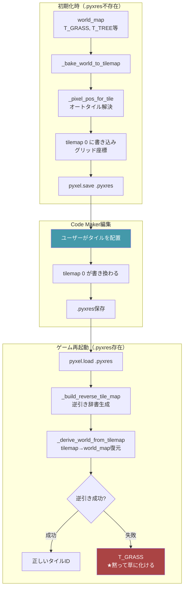
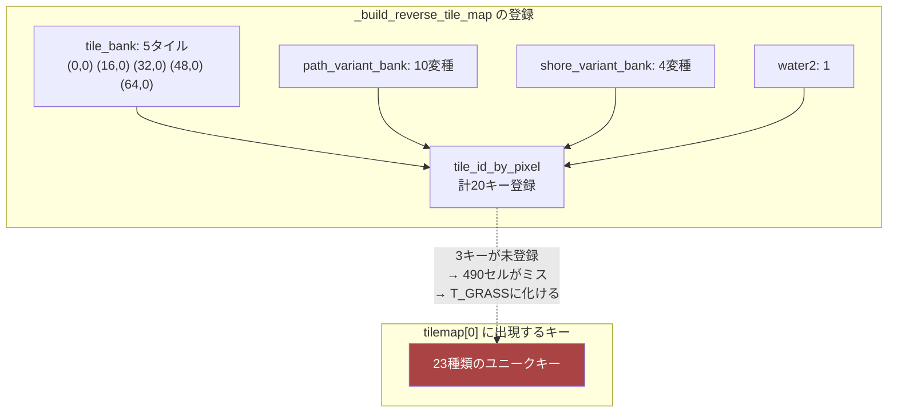
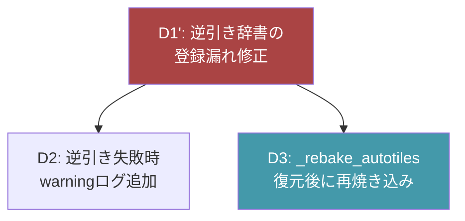
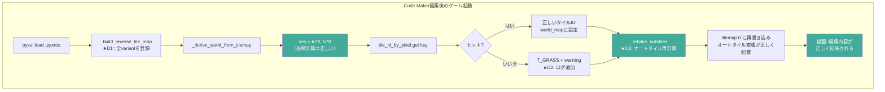
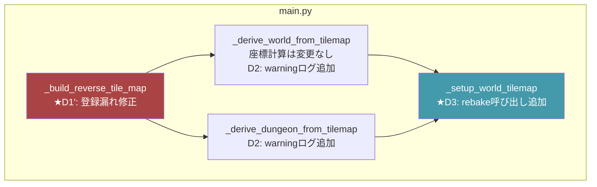
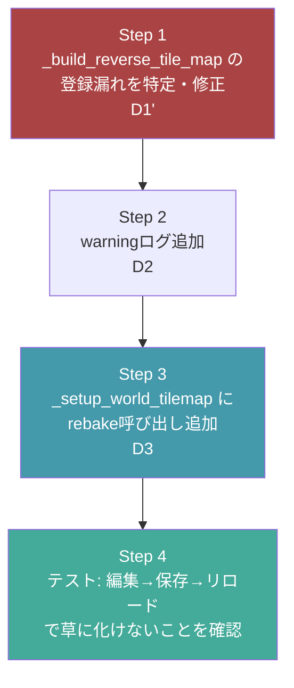

# 構造設計書: タイルマップ編集の反映バグ修正

`gherkin.md` シナリオ5（★核心）を解決する。Code Makerで編集したタイルが「黙って草に化ける」バグを修正する。

---

## バグの全体像



---

## 根本原因（実機検証済み）

> **`tu * 8` の座標計算は正しい**ことを実機検証で確認済み（2026-04-09）。tile_bank のピクセル座標(col*16)と tilemap のグリッド座標(tu=col*2) から `tu*8 = col*16` で一致する。

| # | 原因 | 箇所 | 影響 |
|---|---|---|---|
| ~~①スケーリング不一致~~ | ~~実機検証で否定。`tu*8` は正しい~~ | - | - |
| ②デフォルト値上書き | `.get(key, T_GRASS)` で逆引き失敗時に全てT_GRASSになる | main.py 1464行 | 「草に化ける」の直接原因 |
| ③オートタイル非復元 | 初期化時は `_pixel_pos_for_tile` で変種選択するが、復元時は基底タイルしか返さない | main.py 1436行 vs 1464行 | 道・水辺が単色になる |
| ④逆引き辞書の登録漏れ★ | **tile_bankに5タイルしかないが、tilemapには23種のキーが出現**。path/shore variantの逆引き登録が不十分で490/2500セル(20%)がミスする | main.py 1332-1346行 | 全ミスがT_GRASSに化ける |

### 実機検証データ（2026-04-09）

```
tilemap unique keys: 23
tile_bank (basic tiles only): 5
Hit: 2010 / 2500 (80%)
Miss: 490 / 2500 (20%) ← これが草に化けるセル
```

### 逆引き辞書の登録漏れの詳細



**次回セッションの実装で確認すべきこと**: `_build_reverse_tile_map` 実行時点で `tile_id_by_pixel` に何キー登録されているか、tilemapの23キーのうちどれが漏れているかを特定する。

---

## 設計判断

| # | 論点 | 決定 | 理由 | 代替案と却下理由 |
|---|---|---|---|---|
| ~~D1~~ | ~~逆引きキーの座標系~~ | ~~実機検証で `tu*8` が正しいことを確認。修正不要~~ | 2026-04-09 検証済み | - |
| D1' | 逆引き辞書の登録漏れ修正 | **`_build_reverse_tile_map` で全variantキーが正しく登録されるよう修正**。実行時のキー数とtilemapのキー数が一致することを検証 | 490/2500セル(20%)がミスする根本原因 | - |
| D2 | 逆引き失敗時の挙動 | **`T_GRASS` のまま**だが、①の修正で逆引き失敗が発生しなくなる。デバッグ用にwarningログを追加 | デフォルト値自体は安全側に倒す設計として正しい。問題は逆引きが壊れていたこと | 例外を投げる: ゲームが落ちる（KA2違反） |
| D3 | オートタイル復元 | `_derive_world_from_tilemap` 実行後に **`_rebake_autotiles`** を呼び、world_mapからtilemap[0]を再焼き込み | Code Makerで基底タイルを配置→ゲーム側でオートタイル変種を再計算、が最も確実 | 逆引きで変種→基底の変換: 変種パターンが多く漏れが出る |
| D4 | タイルサイズの前提 | **16x16px** をTILE_SIZE定数として明示 | 現在 `*8` がハードコードされておりタイルサイズが曖昧。16px前提を明示する | 8pxのまま: Pyxelのpget/psetがタイルグリッド(8px)単位だが、ゲームの論理タイルは16px |

### 判断の依存関係



---

## 修正後のデータフロー



---

## 修正対象ファイル



---

## 実装ステップ



---

## 参照

- [`./gherkin.md`](./gherkin.md) — 受け入れ条件（シナリオ5が核心）
- [`./journey.md`](./journey.md) — 体験設計
- [`./problem.md`](./problem.md) — 課題定義
