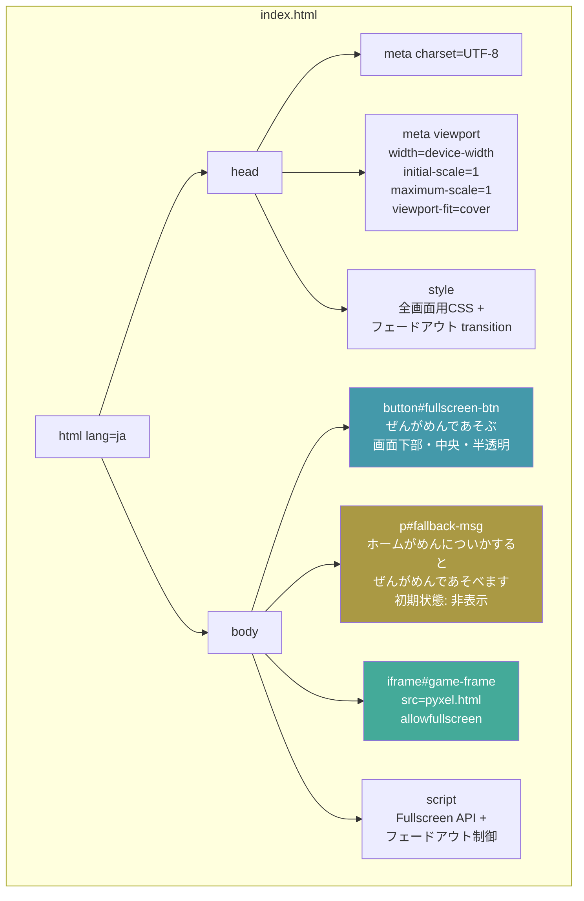
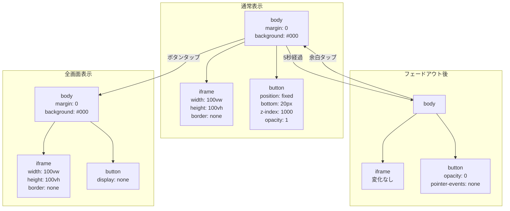
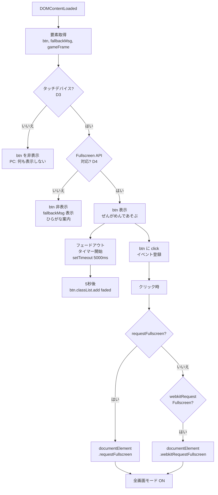
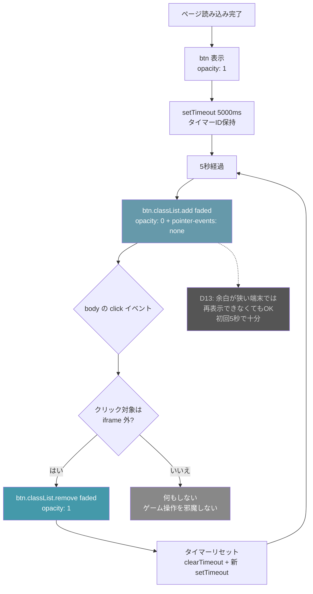
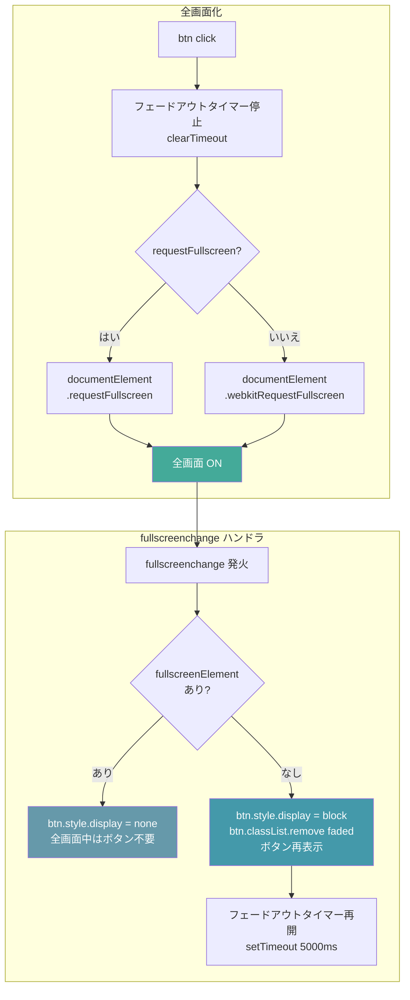
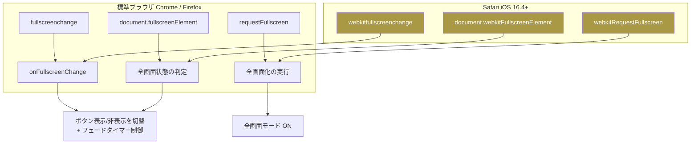
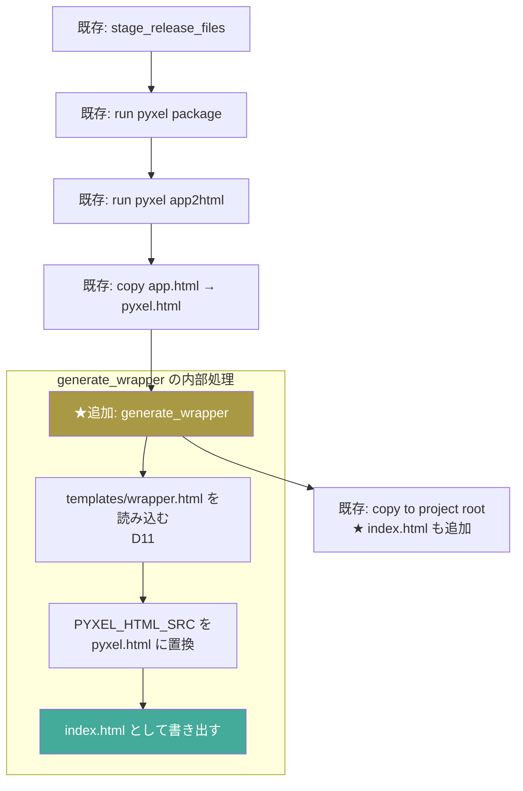
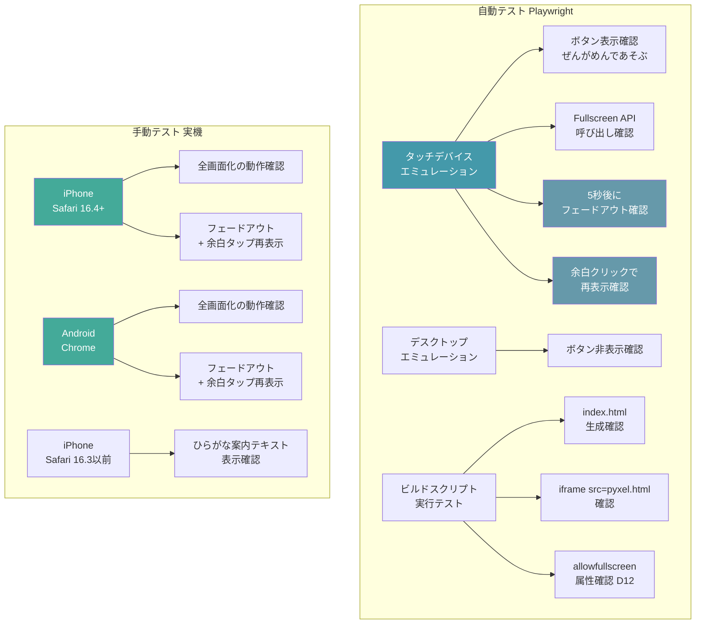

# 詳細設計書: スマホ全画面対応カスタムHTMLラッパー

`structure-design.md` で決定した構造を、実装可能なレベルに落とし込む。

反映済みの構造判断:
- D1: iframe 方式 / D2: document.documentElement 対象 / D3: ontouchstart 判定
- D4: webkitRequestFullscreen フォールバック / D5: ひらがな案内テキスト
- D6: object-fit: contain / D7: build_web_release.py に後処理追加
- D8: CSS transition + setTimeout(5000), iframe外余白タップで再表示
- D9: 画面下部中央・半透明 / D10: index.html + pyxel.html 2ファイル体制
- D11: templates/wrapper.html / D12: iframe に allowfullscreen 付与
- D13: 余白が狭い端末では再表示不可でもOK（初回5秒で十分）
- D14: ボタンフォントは sans-serif（追加フォント読み込み不要）

---

## 1. wrapper.html テンプレート構成

配置先: `templates/wrapper.html`（D11）

### HTML の論理構造



### テンプレート変数

| 変数 | 置換内容 | 例 |
|---|---|---|
| `{{PYXEL_HTML_SRC}}` | iframe の src に設定するファイル名 | `pyxel.html` |

---

## 2. CSS 詳細

### レイアウト構造



### 概念コード

```css
/* ベースレイアウト */
html, body {
  margin: 0;
  padding: 0;
  overflow: hidden;
  background: #000;
  width: 100%;
  height: 100%;
}

/* ゲーム iframe */
#game-frame {
  width: 100vw;
  height: 100vh;
  border: none;
  display: block;
}

/* 全画面ボタン — D9: 画面下部中央・半透明 */
#fullscreen-btn {
  position: fixed;
  bottom: 20px;
  left: 50%;
  transform: translateX(-50%);
  z-index: 1000;
  padding: 12px 24px;
  font-size: 16px;
  background: rgba(255, 255, 255, 0.85);
  border: none;
  border-radius: 8px;
  cursor: pointer;
  font-family: sans-serif;
  /* D8: フェードアウト用 transition */
  transition: opacity 0.5s ease;
  opacity: 1;
}

/* フェードアウト状態 */
#fullscreen-btn.faded {
  opacity: 0;
  pointer-events: none;
}

/* フォールバック案内 — D5: ひらがな */
#fallback-msg {
  display: none;
  position: fixed;
  bottom: 20px;
  left: 50%;
  transform: translateX(-50%);
  color: #aaa;
  font-size: 14px;
  font-family: sans-serif;
  text-align: center;
}
```

---

## 3. JavaScript 詳細

### 処理フロー



### フェードアウト・再表示の処理フロー



### 全画面切り替え・解除の処理フロー



### 概念コード

```javascript
document.addEventListener('DOMContentLoaded', () => {
  const btn = document.getElementById('fullscreen-btn');
  const fallbackMsg = document.getElementById('fallback-msg');
  const gameFrame = document.getElementById('game-frame');
  const target = document.documentElement;
  let fadeTimer = null;

  // --- D3: タッチデバイス判定 ---
  const isTouchDevice =
    'ontouchstart' in window || navigator.maxTouchPoints > 0;

  if (!isTouchDevice) {
    btn.style.display = 'none';
    return;
  }

  // --- D4: Fullscreen API 対応判定 ---
  const canFullscreen =
    target.requestFullscreen || target.webkitRequestFullscreen;

  if (!canFullscreen) {
    btn.style.display = 'none';
    fallbackMsg.style.display = 'block';
    return;
  }

  // --- D8: フェードアウトタイマー ---
  function startFadeTimer() {
    clearTimeout(fadeTimer);
    fadeTimer = setTimeout(() => {
      btn.classList.add('faded');
    }, 5000);
  }

  function showButton() {
    btn.classList.remove('faded');
    btn.style.display = 'block';
    startFadeTimer();
  }

  // 初回表示 → 5秒後フェードアウト
  startFadeTimer();

  // --- D8: iframe外の余白タップで再表示 ---
  document.body.addEventListener('click', (e) => {
    // iframe 内のクリックはここに来ない（別ドキュメント）
    // btn 自体のクリックは全画面化で処理するので除外
    if (e.target === btn) return;
    if (btn.classList.contains('faded')) {
      showButton();
    }
  });

  // --- 全画面ボタンのクリックハンドラ ---
  btn.addEventListener('click', () => {
    clearTimeout(fadeTimer);
    if (target.requestFullscreen) {
      target.requestFullscreen();
    } else if (target.webkitRequestFullscreen) {
      target.webkitRequestFullscreen();
    }
  });

  // --- 全画面状態の変更を監視 ---
  const onFullscreenChange = () => {
    const isFullscreen =
      document.fullscreenElement || document.webkitFullscreenElement;
    if (isFullscreen) {
      btn.style.display = 'none';
      clearTimeout(fadeTimer);
    } else {
      showButton();
    }
  };

  document.addEventListener('fullscreenchange', onFullscreenChange);
  document.addEventListener('webkitfullscreenchange', onFullscreenChange);
});
```

### イベントリスナー対応表



---

## 4. build_web_release.py への追加処理

### 追加する関数



### copy to project root の変更

```mermaid
graph TD
    subgraph 既存のコピー対象
        A1[pyxel.html]
        A2[pyxel.pyxapp]
    end

    subgraph ★追加のコピー対象
        B1[index.html<br/>カスタムHTMLラッパー]
    end

    A1 --> C[プロジェクトルート]
    A2 --> C
    B1 --> C

    style B1 fill:#49a,color:#fff
```

### 概念コード

```python
def generate_wrapper(build_dir: Path, project_root: Path):
    """カスタムHTMLラッパーを生成する（D7, D11）"""
    template_path = project_root / "templates" / "wrapper.html"
    template = template_path.read_text(encoding="utf-8")

    # iframe の src を設定
    wrapper_html = template.replace("{{PYXEL_HTML_SRC}}", "pyxel.html")

    # index.html として出力
    output_path = build_dir / "index.html"
    output_path.write_text(wrapper_html, encoding="utf-8")
```

---

## 5. テスト方針

### テスト対象と手段



### テストシナリオと検証項目の対応

```mermaid
graph TD
    G1[gherkin シナリオ1<br/>全画面化] --> T1A[Playwright: ボタン表示]
    G1 --> T1B[Playwright: API呼び出し]
    G1 --> M1A[実機: 全画面動作]

    G2[gherkin シナリオ2<br/>全画面解除] --> M1A
    G2 --> M2A[実機: Android 全画面動作]

    G3[gherkin シナリオ3<br/>PC] --> T2A[Playwright: ボタン非表示]

    G4[gherkin シナリオ4<br/>iOS旧版] --> M3A[実機: 案内テキスト]

    G5[gherkin シナリオ5<br/>ビルド] --> T3A[ビルド: index.html生成]
    G5 --> T3B[ビルド: iframe src]
    G5 --> T3C[ビルド: allowfullscreen]

    G6[gherkin シナリオ6<br/>フェードアウト] --> T1C[Playwright: フェードアウト]
    G6 --> T1D[Playwright: 余白タップ再表示]
    G6 --> M1B[実機: フェードアウト]
    G6 --> M2B[実機: フェードアウト]

    style G1 fill:#49a,color:#fff
    style G6 fill:#69a,color:#fff
```



---

## 参照

- [`./structure-design.md`](./structure-design.md) — 構造設計（判断論点・アーキテクチャ）
- [`./journey.md`](./journey.md) — このジャーニーの体験設計
- [`./gherkin.md`](./gherkin.md) — 受け入れ条件
