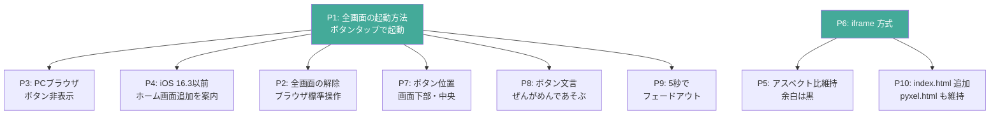
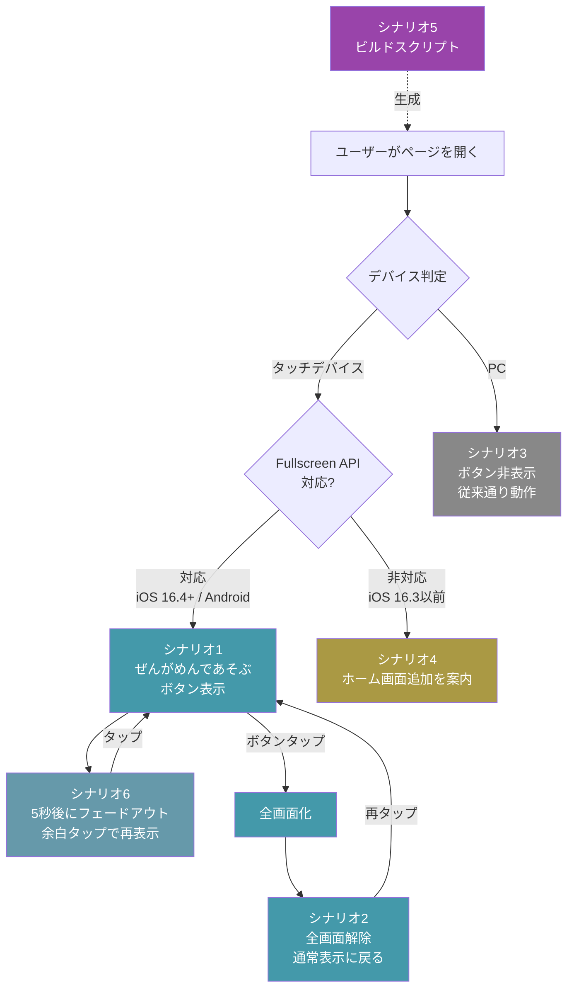
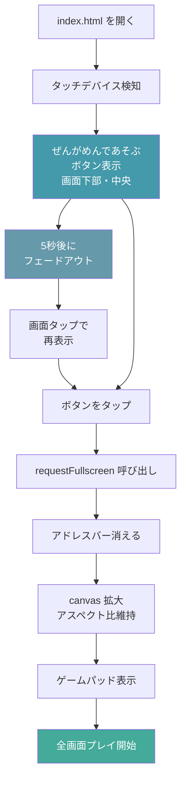
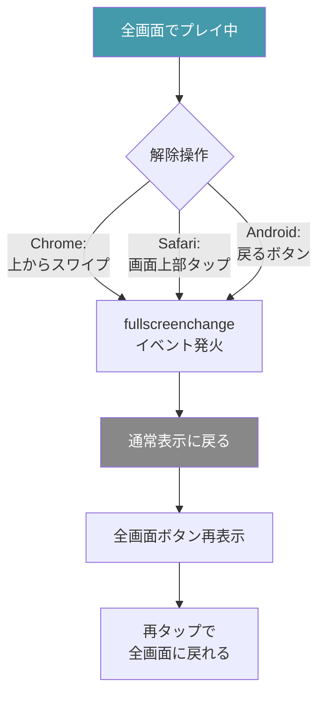
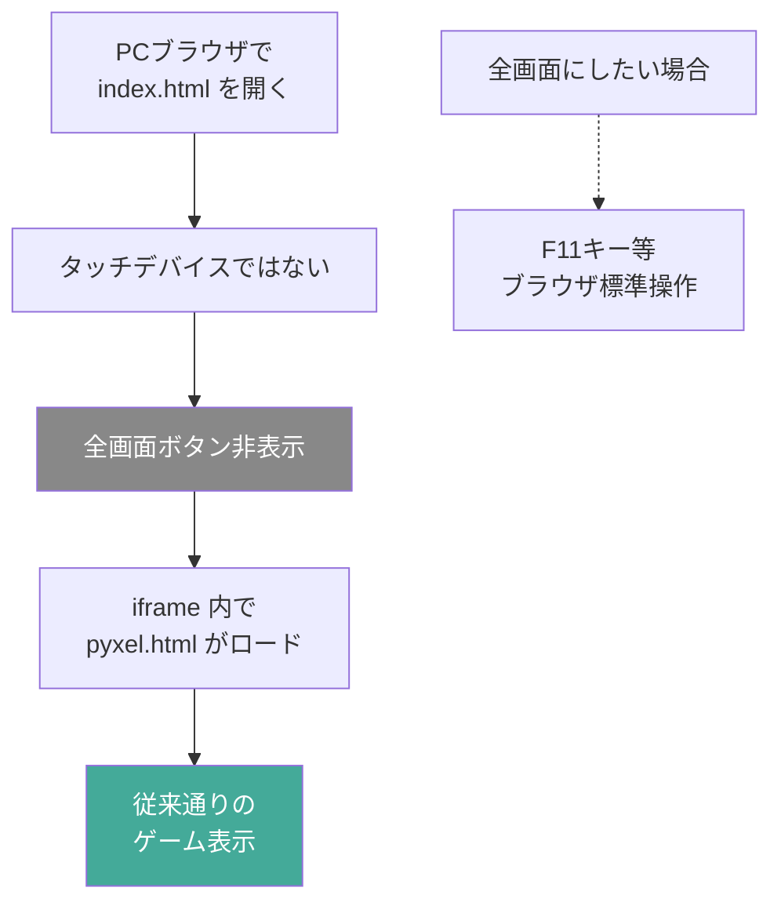
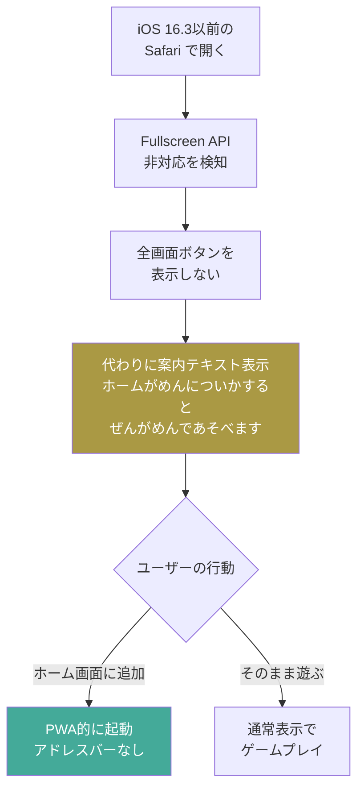
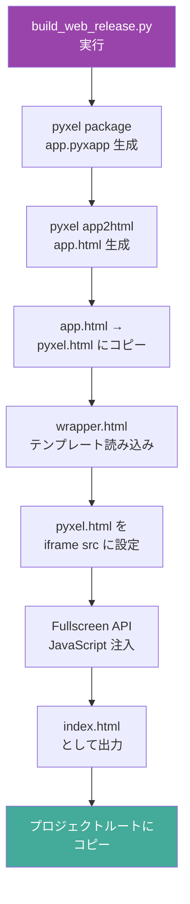
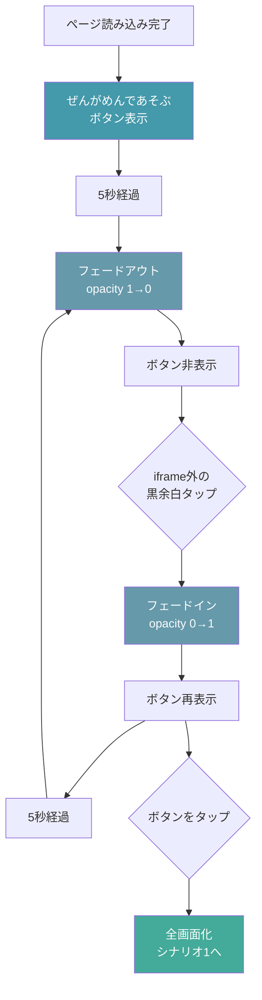
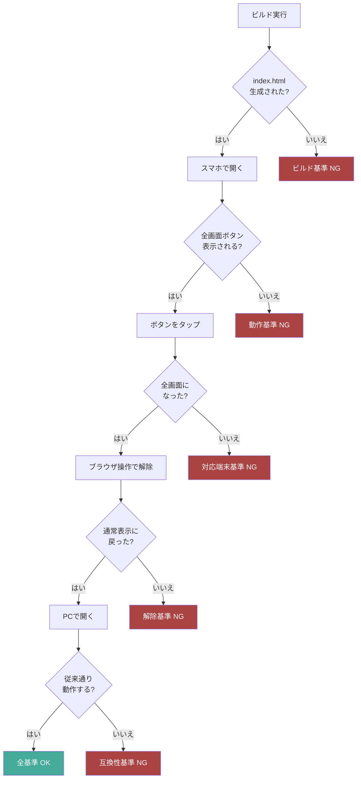

# 受け入れ条件: スマホで全画面にして遊ぶ

## プロダクト判断の合意事項

| # | 論点 | 決定 | 理由 |
|---|---|---|---|
| P1 | 全画面の起動方法 | ユーザーが**全画面ボタンをタップ**する（自動全画面化はしない） | iOS Safari がユーザー操作起点を必須としており、自動化はブロックされる |
| P2 | 全画面の解除方法 | **ブラウザ標準の操作**に委ねる（専用の解除ボタンは置かない） | Chrome はスワイプ、Safari は画面上部タップ等。独自UIを被せると混乱する |
| P3 | PCブラウザでの扱い | 全画面ボタンは**非表示**（タッチデバイスのみ表示） | PCではF11等で全画面にできる。余計なボタンを出さない |
| P4 | iOS 16.3以前の対応 | Fullscreen API は使えないので、**「ホーム画面に追加」を案内する文言**を表示する | PWA化は別ステアリング。最低限の案内だけ行う |
| P5 | アスペクト比 | **維持する**（引き伸ばさない）。余白は黒で埋める | ドット絵が歪むと見た目が崩れる |
| P6 | ラッパー方式 | **iframe 方式**をまず採用する | app.html をそのまま埋め込めるため、ビルドパイプラインの変更が最小 |
| P7 | ボタン位置 | **画面下部・中央**に半透明ボタンを配置 | ゲームパッドの上あたり。目につきやすく、誤タップしにくい |
| P8 | ボタン文言 | **「ぜんがめんであそぶ」**（ひらがな） | 子どもが読めるようにひらがな表記 |
| P9 | ボタン自動非表示 | ページ読み込み後**5秒でフェードアウト**。画面タップで再表示 | 邪魔にならずスッキリ。いつでも再呼び出し可能 |
| P10 | 配信URL | **index.html を新規追加**。pyxel.html も引き続きアクセス可能 | ルートURL（/）でラッパーが開く。既存URLも壊さない |

### プロダクト判断の依存関係



---

## シナリオ全体マップ



---

## シナリオ

### シナリオ1: スマホで全画面にして遊ぶ（正常系）

```gherkin
Given スマホのブラウザで index.html を開いている
And タッチデバイスである
Then 画面下部・中央に「ぜんがめんであそぶ」ボタンが半透明で表示される
And ボタンは5秒後にフェードアウトする
When 「ぜんがめんであそぶ」ボタンをタップする
Then ブラウザのアドレスバーとナビゲーションバーが消える
And ゲーム画面が端末の画面いっぱいに拡大される
And アスペクト比は維持され、余白は黒で埋まる
And バーチャルゲームパッドが表示される
```



### シナリオ2: 全画面を解除する

```gherkin
Given 全画面モードでゲームをプレイしている
When ブラウザ標準の全画面解除操作を行う
Then 通常表示に戻る
And 「ぜんがめんであそぶ」ボタンが再表示される
```



### シナリオ3: PCブラウザからアクセスする

```gherkin
Given PCのブラウザで index.html を開いている
And タッチデバイスではない
Then 「ぜんがめんであそぶ」ボタンは表示されない
And ゲームは従来通り動作する
```



### シナリオ4: iOS 16.3以前でアクセスする

```gherkin
Given iOS 16.3以前の Safari で index.html を開いている
And Fullscreen API が利用できない
Then 「ぜんがめんであそぶ」ボタンの代わりに「ホームがめんについかすると ぜんがめんであそべます」という案内が表示される
```



### シナリオ5: ビルドスクリプトで全画面対応HTMLが生成される

```gherkin
Given tools/build_web_release.py を実行する
When ビルドが完了する
Then プロジェクトルートに index.html（カスタムHTMLラッパー）が生成される
And index.html 内に pyxel.html が iframe で埋め込まれている
And Fullscreen API の JavaScript が含まれている
```



### シナリオ6: ボタンのフェードアウトと再表示

```gherkin
Given スマホのブラウザで index.html を開いている
And タッチデバイスである
And Fullscreen API が利用できる
When ページ読み込みから5秒が経過する
Then 「ぜんがめんであそぶ」ボタンがフェードアウトして消える
When iframe外の黒余白をタップする
Then 「ぜんがめんであそぶ」ボタンがフェードインして再表示される
And 再び5秒後にフェードアウトする
```



---

## 成功基準

| 基準 | 内容 |
|---|---|
| 動作 | ボタンをタップすると全画面に切り替わる |
| 対応端末 | iOS Safari (16.4+) / Android Chrome |
| 解除 | ブラウザ標準の操作で全画面を解除できる |
| ビルド | `tools/build_web_release.py` の実行だけで全画面対応HTMLが生成される |
| 互換性 | PC ブラウザでも従来通り動作する |
| 保守性 | Pyxel バージョンアップ時にラッパーが壊れにくい構造 |

### 成功基準の検証フロー



---

## 参照

- [`./journey.md`](./journey.md) — このジャーニーの体験設計
- [`./structure-design.md`](./structure-design.md) — 構造設計
- [`./detailed-design.md`](./detailed-design.md) — 詳細設計
