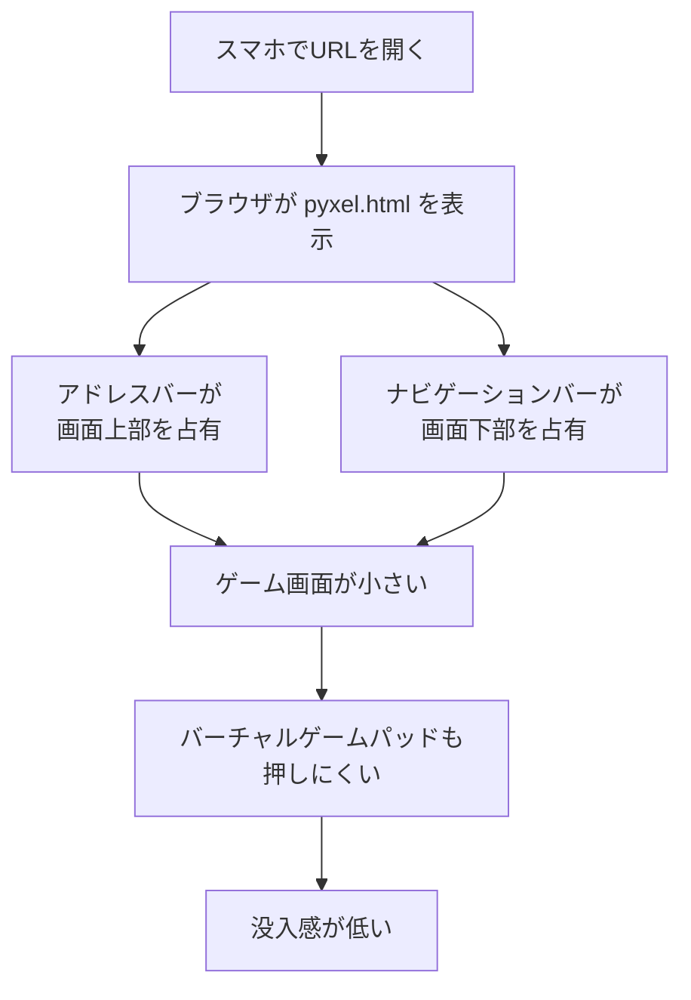
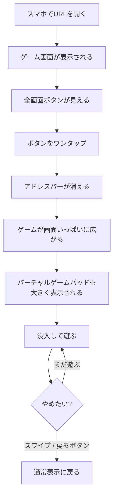
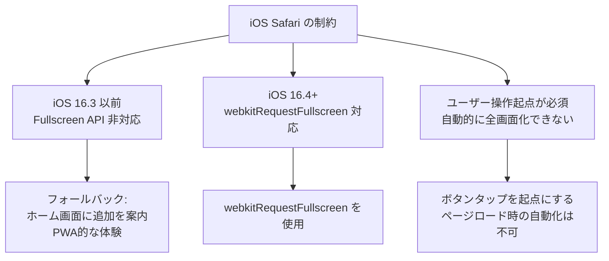

# ユーザージャーニー：スマホで全画面にして遊ぶ

- 作成日: 2026-04-09
- 対象プロジェクト: Pyxel版 Block Quest
- 主役（プレイヤー）: スマホのブラウザでゲームを開いた人
- 目的: スマホでアクセスしたとき、アドレスバーやブラウザUIを消して**画面いっぱいにゲームを表示**する体験を定義する
- スコープ: カスタムHTMLラッパーによる Fullscreen API 方式。PWA化は別ステアリングに委ねる
- 関連: `docs/05-pyxel-code-maker-jouney.md`（守るべき設計原則）

---

## 1. このジャーニーのジョブ

> **スマホでゲームを開いたとき、画面いっぱいに表示して没入感のあるプレイ体験を得る**

### 状況

- スマホでゲームのURLを開くと、アドレスバーやブラウザの操作ボタンが画面の上下を占有する
- ゲーム画面（256x256px）が小さく表示され、余白が大きい
- 「もっと大きく表示したい」と感じるが、ピンチ操作ではブラウザ全体が拡大されてしまう
- バーチャルゲームパッドも含めた領域を全画面で使いたい

### 動機

- **没入感**：ブラウザのUI要素が視界に入ると「ゲームをしている」感覚が薄れる
- **操作性**：画面が小さいとバーチャルゲームパッドのボタンが押しにくい
- **見栄え**：人に見せるときにブラウザのアドレスバーが出ていると「アプリっぽくない」

### 求める成果

- ワンタップで全画面に切り替わる
- ゲーム画面が端末の画面いっぱいに拡大される
- 全画面を解除する方法が直感的にわかる
- iOS Safari / Android Chrome の両方で動く

---

## 2. 現状の体験とペイン

現在のWeb配信は `pyxel app2html` が生成する単一HTMLファイル（`pyxel.html`）をそのまま使っている。

### なぜ今の仕組みでは解決できないか

- `pyxel app2html` が生成するHTMLには **Fullscreen API の呼び出しがない**
- `launchPyxel()` の設定項目に `fullscreen` オプションが**存在しない**
- 生成HTMLは1行の巨大ファイルで、直接編集は困難

---

## 3. 理想の体験

### 体験のポイント

| 場面 | 期待する体験 |
|---|---|
| ページを開いた直後 | 全画面ボタンがすぐ見つかる |
| ボタンをタップ | 一瞬でブラウザUIが消え、画面いっぱいになる |
| 全画面プレイ中 | 通常プレイと変わらない操作感 |
| 全画面を解除 | ブラウザ標準の操作（スワイプ等）で自然に戻れる |
| PCからアクセス | 全画面ボタンは非表示 or 控えめ。従来通り動作 |

---

## 4. iOS Safari の制約

---

## 参照

- [`./gherkin.md`](./gherkin.md) — 受け入れ条件
- [`./structure-design.md`](./structure-design.md) — 構造設計
- [`./detailed-design.md`](./detailed-design.md) — 詳細設計
