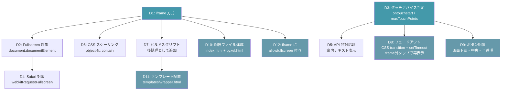
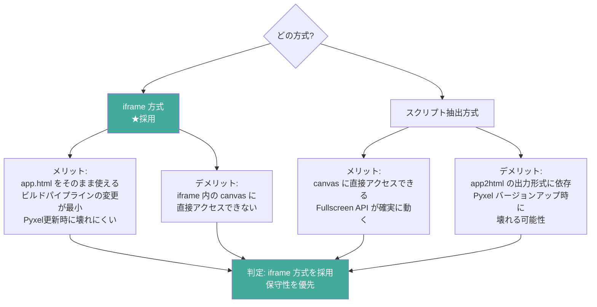
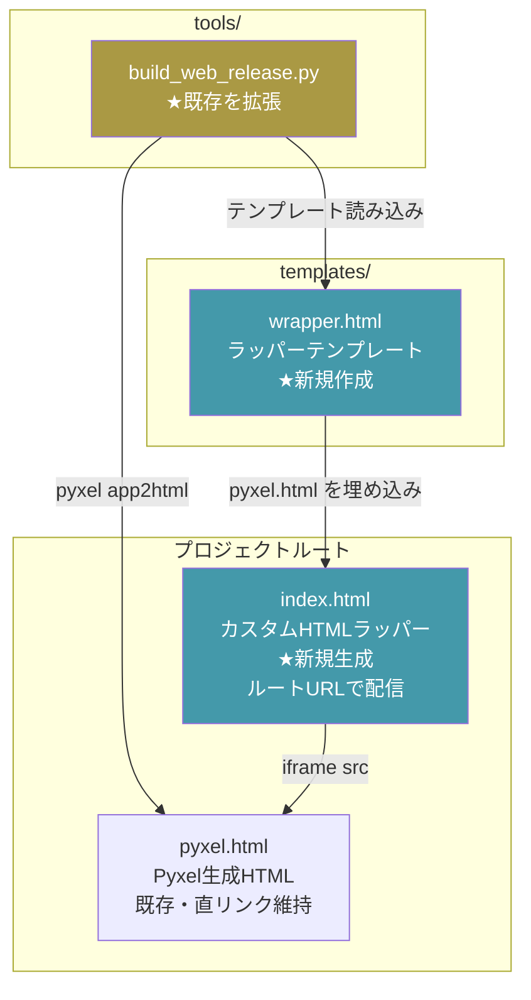
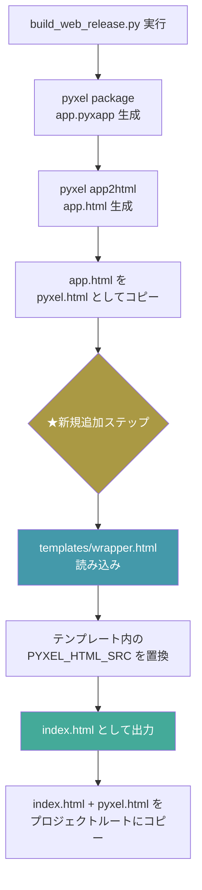
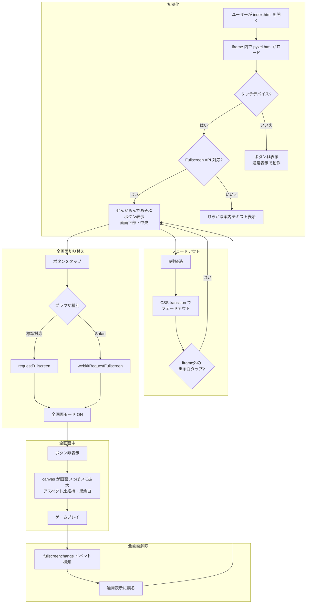
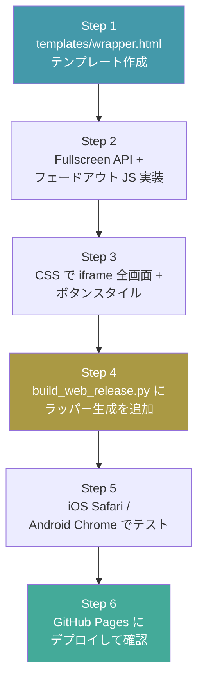

# 構造設計書: スマホ全画面対応カスタムHTMLラッパー

`journey.md` / `gherkin.md` で合意済みのプロダクト判断（iframe方式／ひらがなボタン／5秒フェードアウト／index.html追加）を、アーキテクチャとして定義する。

プロダクト判断はここで覆さない。技術選定・構造方針のみを扱う。

---

## 設計判断の論点

| # | 論点 | 決定 | 理由 | 代替案と却下理由 |
|---|---|---|---|---|
| D1 | ラッパー方式 | **iframe 方式**。`pyxel.html` を iframe で埋め込む `index.html` を新規作成 | app.html をそのまま使えるため、ビルドパイプラインの変更が最小。Pyxel バージョンアップ時にも壊れにくい | スクリプト抽出方式：canvas に直接アクセスできるが、app2html の出力形式に依存し Pyxel バージョンアップ時に壊れる可能性 |
| D2 | Fullscreen API の呼び出し対象 | **`document.documentElement`**（ページ全体） | iframe ごと全画面にするため、親ページの `<html>` 要素を対象にする | iframe 内の canvas：クロスオリジン制約で操作できない場合がある |
| D3 | タッチデバイス判定 | **`'ontouchstart' in window` または `navigator.maxTouchPoints > 0`** | 広く対応されている判定方法。CSS の `@media (hover: none)` よりJSで制御しやすい | User-Agent 判定：不正確で保守性が低い |
| D4 | Safari 対応 | **`webkitRequestFullscreen` をフォールバック**として呼ぶ | iOS Safari 16.4+ は `webkitRequestFullscreen` を使う。標準 `requestFullscreen` → `webkitRequestFullscreen` の順で試行 | webkit のみ：Chrome/Firefox で動かない |
| D5 | Fullscreen API 非対応時 | **ボタンの代わりに案内テキスト（ひらがな）を表示** | iOS 16.3以前やFullscreen API未対応ブラウザへのフォールバック | 何も表示しない：ユーザーが全画面にする手段を知れない |
| D6 | CSS スケーリング | **`object-fit: contain` でアスペクト比維持**、余白は `background: #000` | ドット絵の歪みを防ぐ。黒余白はゲームの雰囲気に合う | `object-fit: cover`：ゲーム画面の端が切れる |
| D7 | ビルドスクリプトへの組み込み | **`tools/build_web_release.py` に後処理を追加**。`pyxel app2html` 出力後に HTMLテンプレートと結合 | 既存のビルドフローに自然に追加できる | 別スクリプト：実行を忘れるリスク |
| D8 | ボタンのフェードアウト | **CSS transition + JS setTimeout(5000)**。**iframe外の黒余白タップ**で再表示し、再び5秒後にフェードアウト | P9 に基づく。CSS transition でスムーズに消えるのが自然。iframe外タップならゲームパッド操作と競合しない | JS アニメーション：CSS だけで十分／画面全体タップ：ゲームパッドと競合する／ダブルタップ：子どもには難しい |
| D9 | ボタンの配置とスタイル | **`position: fixed; bottom: 20px; left: 50%; transform: translateX(-50%)`**。半透明白背景 | P7 に基づく。画面下部中央でゲームパッドの上あたり | absolute：スクロールに追従しない |
| D10 | 配信ファイル構成 | **index.html（ラッパー）+ pyxel.html（Pyxel生成）**の2ファイル体制 | P10 に基づく。ルートURL で index.html が開く。既存 pyxel.html への直リンクも維持 | pyxel.html を置き換え：ラッパーなしでアクセスする手段がなくなる |
| D11 | テンプレート配置 | **`templates/wrapper.html`**（プロジェクトルート直下に templates/ を新設） | ビルド用テンプレート置き場として今後も拡張できる | tools/ 内：ビルドスクリプトとテンプレートの責務が混在／steering 内：実装素材と設計ドキュメントが混在 |
| D12 | iframe の allowfullscreen | **付ける** | 将来 Pyxel 側が Fullscreen API に対応した場合にも問題なく動く。害はない | 付けない：現時点では不要だが、将来の互換性リスク |
| D13 | 余白が狭い端末での再表示 | **再表示できなくてもOK**。初回5秒表示で十分 | スマホ縦画面では黒余白がほぼない場合がある。フォールバックの複雑さに見合わない | iframe下に薄いタップ領域：見た目に影響／ダブルタップ併用：子どもには難しい |
| D14 | ボタンフォント | **sans-serif**（システムデフォルト） | 追加フォントの読み込みが不要で軽量。ボタンはゲーム世界の外なので統一感は不要 | misaki_gothic.ttf：レトロ感は出るがWebフォント読み込みが必要でファイルサイズ増／monospace：レトロ感はあるが日本語の見た目がイマイチ |

### 判断の依存関係

---

## iframe 方式の比較検討

---

## アーキテクチャ

### ファイル構成

### ビルドフロー

### ランタイム動作

---

## 実装ステップ

---

## 参照

- [`./journey.md`](./journey.md) — このジャーニーの体験設計
- [`./gherkin.md`](./gherkin.md) — 受け入れ条件
- [`./detailed-design.md`](./detailed-design.md) — 詳細設計（概念コード・API仕様）
