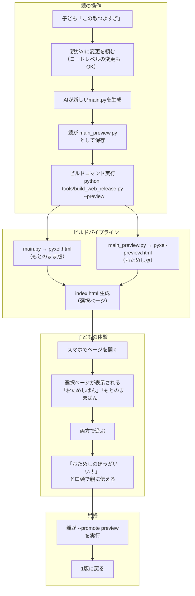
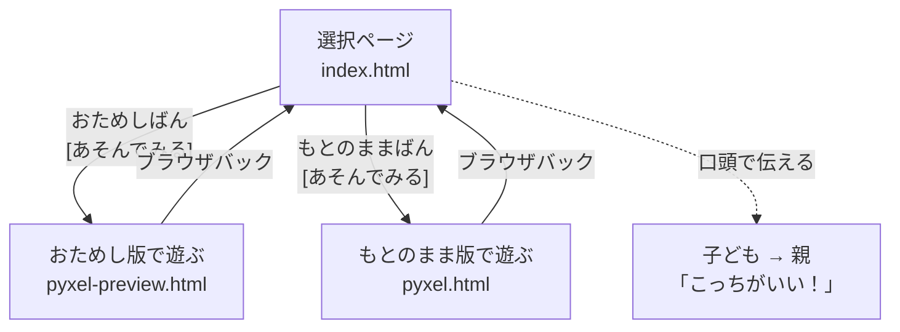
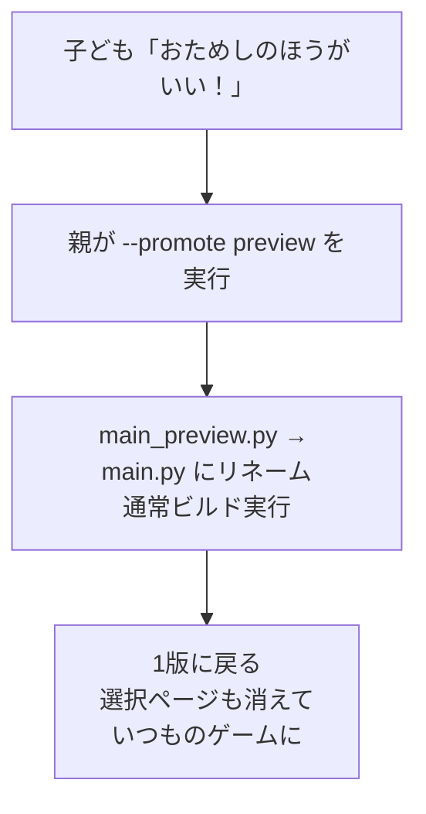
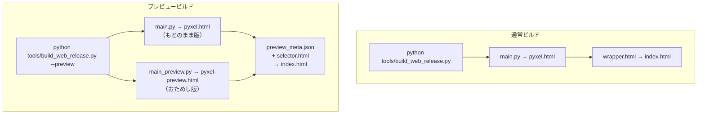
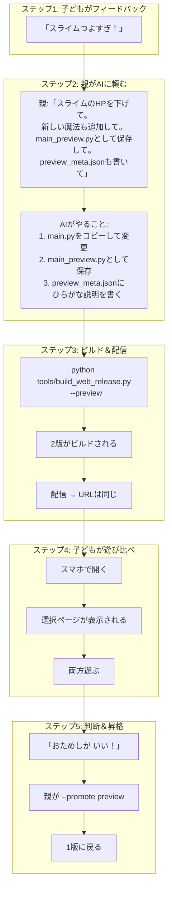
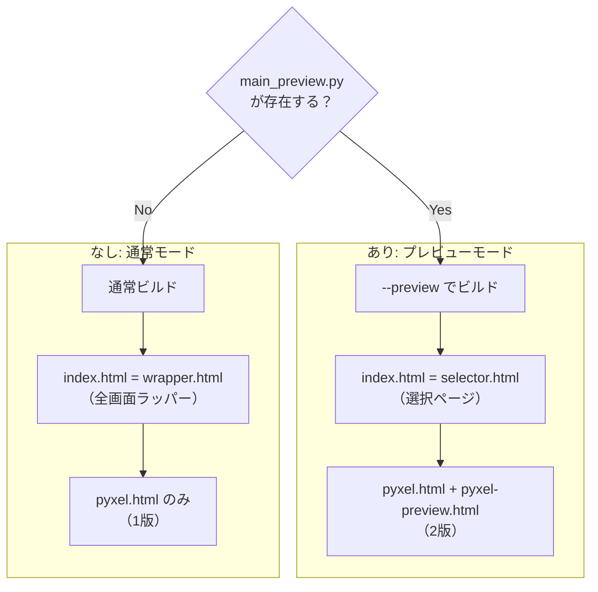

# Structure Design: Approval Queue（承認キュー）

- 対象ジャーニー: J31, J32, J33, J34
- 対象gherkin: [`gherkin-platform.md`](../gherkins/gherkin-platform.md) の J31-J34 セクション
- 作成日: 2026-04-11

---

## 1. 現状

親がAIに頼んだ変更は、Code Makerのコードタブに直接書き込まれ、Runで即反映される。

- 親が「スライムのHP 50→30にして」とAIに頼む → コードが書き換わる → Run → 反映
- 子どもは**変更が起きたことに気づかない**
- 何が変わったか聞かれても、親が口頭で説明するしかない
- 子どもに拒否権がない → 親が正しいと押し通す構造になる

結果として「親のゲーム」になり、子どもの所有感が薄れる。好循環のハンドルが親に移ってしまう。

### なぜゲーム内UIでは解決できないか

最初に検討した案は、main.py内に承認キューのUIと`resolve_value`（値の切り替え関数）を持つ方式だった。しかし、現実の変更のほとんどは**コードレベル**で起きる:

- 新しい魔法を追加 → SPELLSリスト + 戦闘ロジック + レベル習得テーブル
- ボスの特殊攻撃を追加 → 戦闘ロジックにif分岐
- ダンジョン構造を変更 → 生成関数の書き換え
- NPCのセリフを変更 → dialogue_data全体の差し替え

これらは「値を50→30に変える」のような単純な差し替えではなく、**コード構造自体が変わる**。ゲーム内の仕組みで切り替えるには、あらゆる変更をif/elseで囲む必要があり、現実的でない。

---

## 2. 設計方針: 2版ビルド＋選択ページ

### 核心アイデア

**ゲームを丸ごと2つビルドして、ホームページで選ばせる。**

```
index.html          ← 選択ページ（どっちであそぶ？）
pyxel.html          ← もとのまま版（変更前のmain.py）
pyxel-preview.html  ← おためし版（変更後のmain.py）
```

コードレベルで何が変わっていようが**丸ごと別ビルド**なので、あらゆる変更に対応できる。ゲーム本体のコードには一切手を加えない。

### 原則

- **配信側で解決する**: ゲームコード（main.py）に承認の仕組みを入れない
- **子どもが体感で判断する**: 両方遊んでから「こっち！」と決める
- **ひらがなで読める**: 選択ページの説明はひらがなで書く
- **既存の配信パイプラインを拡張する**: `build_web_release.py`にプレビュービルドを追加するだけ

### やること / やらないこと

| やること | やらないこと |
|---|---|
| ビルドパイプラインで2版生成 | main.py内にフィーチャーフラグ |
| index.htmlを選択ページに拡張 | ゲーム内承認UI |
| ひらがなで変更説明を表示 | コードdiffの表示 |
| 子どもの「こっち！」ボタン | 自動マージ・コンフリクト解決 |

---

## 3. 全体フロー



---

## 4. ジャーニー

承認（J31）・却下（J32）・複数選択（J33）・「やっぱり」（J34）の具体的なBefore/Afterは [`customer-journeys.md`](../gherkins/customer-journeys.md) のJ31-J34セクションを参照。遊び比べの gherkin は [`gherkin-platform.md`](../gherkins/gherkin-platform.md) のJ31-J34セクションを参照。

ジャーニーの要点:

- **J31 承認**: 「おためし」と「もとのまま」の両方で遊ぶことで、数字が体感に変わる。「30じゃなくて40がいいかも」という自分だけのフィードバックが生まれ、好循環の次のループを回す
- **J32 却下**: 親の理屈に言い返せなくても、遊んだ体感が根拠になる。「こっちのほうが楽しい」は遊んだ事実に基づく判断
- **J33 複数選択**: おためし版に複数の変更が含まれている場合、選択ページに変更リストを表示する。個別のON/OFFはできないが、「この組み合わせでいいか」を丸ごと判断する
- **J34 やっぱり**: 承認後に「やっぱり前がよかった」→ 親がAIに「元に戻して」と頼む → 新しいpreviewビルドとして同じフローが回る

---

## 5. 選択ページ（index.html）の設計

### 5-1. 画面レイアウト

```
┌──────────────────────────────┐
│  ブロッククエスト              │
│                              │
│  ┌────────────────────────┐  │
│  │ おためしばん            │  │
│  │                        │  │
│  │ 「スライムの HP を      │  │
│  │   へらしたよ」          │  │
│  │ 「あたらしい まほう を  │  │
│  │   ついか したよ」       │  │
│  │                        │  │
│  │ [あそんでみる]          │  │
│  └────────────────────────┘  │
│                              │
│  ┌────────────────────────┐  │
│  │ もとのままばん          │  │
│  │                        │  │
│  │ 「いままでと おなじ」    │  │
│  │                        │  │
│  │ [あそんでみる]          │  │
│  └────────────────────────┘  │
│                              │
│  りょうほう あそんだら       │
│  おとうさんに おしえてね！   │
│  「こっちが いい！」って     │
└──────────────────────────────┘
```

選択ページの役割は**2つのゲームへの入口**と**変更説明の表示**だけ。判断は子どもが口頭で親に伝える。親子が隣にいる前提なので、システムで投票を仲介する必要はない。

### 5-2. 状態遷移



### 5-3. 昇格（親がやる）

子どもが「こっち！」と言ったら、親がコマンドで昇格させる。



---

## 6. ビルドパイプラインの拡張

### 6-1. ファイル構成

```
code-quest-pyxel/
├── main.py               ← もとのまま版（現行）
├── main_preview.py       ← おためし版（AIが生成）
├── preview_meta.json     ← 変更説明（ひらがな）
├── templates/
│   ├── wrapper.html      ← 既存（1版モード用）
│   └── selector.html     ← 新規（2版選択ページ）
└── tools/
    └── build_web_release.py  ← --preview フラグ追加
```

### 6-2. preview_meta.json

親がAIに変更を頼むときに一緒に生成させる。

```json
{
  "changes": [
    "スライムの HP を へらしたよ",
    "あたらしい まほう を ついか したよ"
  ]
}
```

### 6-3. ビルドコマンド



- `--preview` なし → 従来通り1版ビルド（wrapper.html使用）
- `--preview` あり → 2版ビルド（selector.html使用）
- `main_preview.py` が存在しないときに `--preview` すると → エラー

### 6-4. 昇格コマンド

投票後、親が選ばれたほうを昇格させる。

```bash
# おためし版が選ばれた場合
python tools/build_web_release.py --promote preview
# → main_preview.py を main.py にリネーム
# → preview_meta.json を削除
# → 通常ビルド実行

# もとのまま版が選ばれた場合
python tools/build_web_release.py --promote current
# → main_preview.py を削除
# → preview_meta.json を削除
# → 通常ビルド実行
```

---

## 7. 選択ページ（selector.html）の実装

### 7-1. テンプレート

```html
<!-- templates/selector.html -->
<h1>ブロッククエスト</h1>

<div class="version-card">
  <h2>おためしばん</h2>
  <ul>
    {{CHANGE_LIST}}  <!-- ビルド時に preview_meta.json から注入 -->
  </ul>
  <a href="pyxel-preview.html">あそんでみる</a>
</div>

<div class="version-card">
  <h2>もとのままばん</h2>
  <p>いままでと おなじ</p>
  <a href="pyxel.html">あそんでみる</a>
</div>

<p class="hint">
  りょうほう あそんだら<br>
  おとうさんに おしえてね！<br>
  「こっちが いい！」って
</p>
```

JavaScriptは不要。リンク2つとテキストだけの静的HTML。

---

## 8. 親がAIに頼むときの運用フロー



---

## 9. プレビューなしモードとの互換性



- プレビュー中でないときは、既存の配信と**完全に同じ**動作
- `main_preview.py` を置くだけでプレビューモードになる
- `--promote` で昇格すると通常モードに戻る

---

## 10. 影響範囲

| ファイル | 変更内容 | 行数目安 |
|---|---|---|
| `tools/build_web_release.py` | `--preview` / `--promote` フラグ対応 | +60行 |
| `templates/selector.html` | 新規: 選択ページテンプレート | +80行 |
| `preview_meta.json` | 新規: 変更説明（AIが生成） | 数行 |
| **合計** | | **約140行** |

### 触らないもの

- **main.py**: ゲームコードに一切変更なし
- 戦闘ロジック、セーブ/ロード、SFX/BGM/VFX
- 既存のwrapper.html（通常モードで引き続き使用）
- Code Makerでの開発体験

---

## 11. Gherkin との対応

| Gherkin シナリオ | 本設計での担保 |
|---|---|
| 親の修正が承認されるまで反映されない（J31） | 変更は `pyxel-preview.html` にのみ反映。`pyxel.html` は変わらない |
| 「おためし」で変更後の値を体験できる（J31） | `pyxel-preview.html` で遊ぶ = おためし |
| 「もとのまま」で変更前の値を体験できる（J31） | `pyxel.html` で遊ぶ = もとのまま |
| 遊び比べた後に承認すると変更が反映される（J31） | 投票 → `--promote preview` → main_preview.py が main.py に昇格 |
| 遊び比べは任意である（J31） | 投票ボタンはいつでも押せる。遊ばなくても選択可能 |
| 承認キューの表示が子どもに理解できる（J31） | `preview_meta.json` の説明がひらがなで選択ページに表示される |
| 遊び比べた後に却下すると元のまま維持される（J32） | 投票 → `--promote current` → main_preview.py を削除 |
| 却下後に別の案を試せる（J32） | 親がAIに別の案を頼む → 新しい main_preview.py → 再ビルド |
| 複数の変更案から子どもが選んで適用できる（J33） | `preview_meta.json` に変更リストを列挙。丸ごと承認/却下 |
| 承認済みの変更を巻き戻せる（J34） | 親がAIに「元に戻して」→ 新しい main_preview.py → 同じフロー |

---

## 12. 制約と前提

| 制約 | 対応 |
|---|---|
| C1: 単一main.py | main.py自体は変更しない。プレビュー中のみmain_preview.pyが一時的に存在 |
| C2: 外部ファイル不使用 | preview_meta.jsonはビルド時のみ使用。ゲーム実行時には参照しない |
| C3: アップロード即動作 | main_preview.pyがなければ通常ビルド。既存の体験を壊さない |
| C5: エラー耐性 | 2版は完全に独立。おためし版がエラーでも、もとのまま版は正常動作 |

---

## 13. 拡張余地

| 拡張 | 方法 |
|---|---|
| 3版以上の比較 | `main_preview_a.py` / `main_preview_b.py` → 選択ページに3枚のカード |
| 友達にも遊び比べてもらう | 選択ページのURLを友達に共有 → 友達も両方遊んで感想をくれる |
