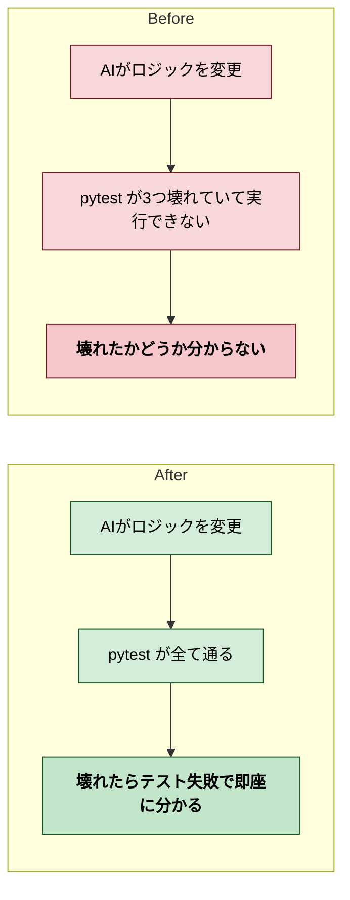

# 2026年4月12日 G15 テストコードによる挙動固定

> 状態：(1) Journey
> 次のゲート：（ユーザー）Journey承認

---

## 1) Journey（どこへ行くか）

- **深層的目的**：AIの改変で壊れたらテストが即座に教えてくれる状態にする
- **やらないこと**：新機能のテスト追加、E2Eテスト（Playwright等は既にG11で対応済み）

### 現状

- 既存テスト: 15ファイル、90テスト
- 壊れているテスト: 3ファイル（test_game_data, test_shop_logic, test_spell_logic）— src.simple_yaml が削除されたため
- 通るテスト: 残り87テストは未確認

### やること

1. 壊れた3テストを修復して全テスト通過させる
2. G15 Gherkinの4シナリオのうち、既存テストでカバーされていない部分を補う

---

## 2) Gherkin（完了条件）

_(Journey承認後に記入)_

---

## 3) Design（どうやるか）

_(Gherkin承認後に記入)_

注: /superpowers:writing-plans で計画立案、/superpowers:test-driven-development でTDDサイクルを回す

---

## 4) Tasklist

_(Design承認後に記入)_

---

## 5) Discussion（記録・反省）

### 2026年4月12日 23:00（起票）

**Observe**：既存90テスト中3つがimportエラーで壊れている。残り87も通るか未確認。G15のGherkinは4シナリオ定義済み。
**Think**：まず壊れたテストを直して全通過。次に足りないテストを補う。TDDで進める。
**Act**：タスクノート起票。
