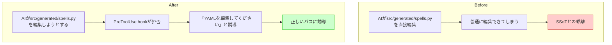

# ガードレール(2) Hooks設計・実装

## 深層的目的

AIが壊せるパスを物理的に封じる。

## やらないこと

- SSoT基盤の構築（タスク1で完了済み）
- ビルドパイプライン（タスク3）

## 対象ガードレール

G1, G2, G3, G5, G7, G14

## 依存

タスク1（完了済み）の後

## 方針

- hook スコープは `.claude/settings.json`（共有）
- デバッグ用バイパス `CLAUDE_GUARD_BYPASS=1`

---

## 1. Journey

## 2. Gherkin

_(Journey承認後に記入)_

## 3. Design

_(Journey承認後に記入)_

## 4. Tasklist

_(Journey承認後に記入)_

## 5. Discussion

- 2026-04-12 起票
