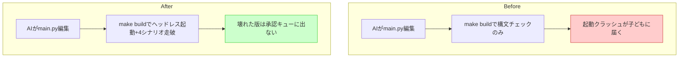

# ガードレール(3) ヘッドレステスト基盤

## 深層的目的

壊れた版を子どもに届けない最後の防壁。

## 対象ガードレール

G8, G9

---

## 1. Journey

## 2. Gherkin

_(Journey承認後に記入)_

## 3. Design

_(Journey承認後に記入)_

## 4. Tasklist

_(Journey承認後に記入)_

## 5. Discussion

- 2026-04-12 起票
