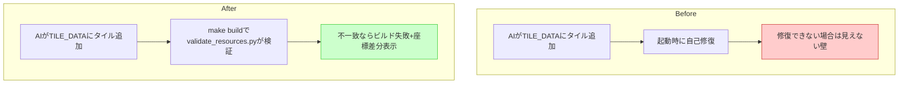

# ガードレール(4) pyxres整合チェック

## 深層的目的

pyxresとコード定数の乖離を自動検出する。

## 対象ガードレール

G4, G6

---

## 1. Journey

## 2. Gherkin

_(Journey承認後に記入)_

## 3. Design

_(Journey承認後に記入)_

## 4. Tasklist

_(Journey承認後に記入)_

## 5. Discussion

- 2026-04-12 起票
